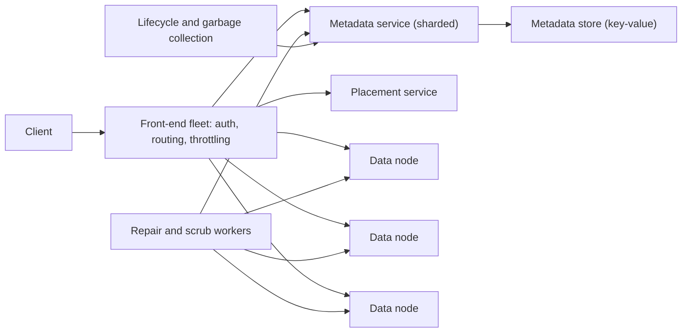

# HLD Case Study 20: Object Store (Amazon S3 / Google Cloud Storage)

> **Key Focus Areas:** Separating metadata from data, placement with consistent hashing, replication versus erasure coding, durability arithmetic, listing at scale, multipart upload, and consistency.

---

## 1. Requirements and Scope

**Functional:** create buckets; `PUT`, `GET`, `DELETE` and `LIST` objects by key; large objects through multipart upload; optional versioning; access control.
**Non-functional:** extreme **durability** (the usual target is 11 nines per year), high availability for reads, scale to trillions of objects and exabytes, strong read-after-write consistency for new objects, low cost per byte.
**Out of scope for this answer:** the full IAM policy language, cross-region replication details, lifecycle billing.

---

## 2. Back-of-the-Envelope Estimates

```python
objects = 1e12                                          # one trillion objects
avg_object_kb = 512
logical_pb = objects * avg_object_kb * 1e3 / 1e15       # ~512 PB logical
replicated_pb = logical_pb * 3                          # three full copies
k, m = 10, 4                                            # erasure coding: 10 data + 4 parity chunks
ec_overhead = (k + m) / k                               # 1.4x
ec_pb = logical_pb * ec_overhead
metadata_bytes_per_object = 300
metadata_tb = objects * metadata_bytes_per_object / 1e12   # ~300 TB: the metadata layer is a big database
peak_get_qps = 5e6
disk_tb, per_disk_mb_s = 20, 150
disks_for_throughput = peak_get_qps * avg_object_kb / 1e3 / per_disk_mb_s   # naive streaming bound
print(round(logical_pb), round(replicated_pb), round(ec_pb), metadata_tb, round(disks_for_throughput))
assert ec_overhead == 1.4 and 500 < logical_pb < 530 and ec_pb < replicated_pb / 2
```

Erasure coding stores about 1.4 times the data instead of 3 times, saving hundreds of petabytes at this scale. The price is CPU and read amplification during repair.

---

## 3. API Design

```
PUT    /{bucket}/{key}                     body -> 200 ETag
GET    /{bucket}/{key}  (Range: bytes=...) -> 200/206
DELETE /{bucket}/{key}                     -> 204
GET    /{bucket}?prefix=logs/&delimiter=/&continuation-token=T   -> 200 keys, common prefixes, next token
POST   /{bucket}/{key}?uploads             -> upload_id           // multipart: initiate
PUT    /{bucket}/{key}?partNumber=N&uploadId=U                   // upload one part
POST   /{bucket}/{key}?uploadId=U          {parts, etags}         // complete: assemble
```

`LIST` returns keys in lexicographic order; "folders" are only a **prefix and delimiter convention**, not a real directory tree.

---

## 4. Data Model

| Layer | Holds | Scale |
| :--- | :--- | :--- |
| Metadata (bucket/key to object record) | key, size, ETag, version, placement (which nodes hold which chunks), ACL | ~300 TB, sharded by hash of `(bucket, key)` or by key range |
| Placement map | chunk to storage-node assignments | derived from consistent hashing plus failure-domain rules |
| Data nodes | immutable chunks or erasure-coded fragments on disk | exabytes |

Objects are **immutable**: an overwrite writes a new object and atomically repoints the metadata, so readers never see a half-written value.

---

## 5. Architecture



---

## 6. Deep Dive: Durability, Erasure Coding and Repair

**Replication versus erasure coding.** Three replicas tolerate two losses at 3x cost. An erasure code with `k` data and `m` parity chunks tolerates **any `m` losses** at `(k+m)/k` cost. The simplest code is a single XOR parity chunk (`m = 1`), which shows the idea:

```python
from math import comb

def xor_bytes(a: bytes, b: bytes) -> bytes:
    return bytes(x ^ y for x, y in zip(a, b))

def encode(data_chunks):
    parity = bytes(len(data_chunks[0]))
    for c in data_chunks:
        parity = xor_bytes(parity, c)
    return data_chunks + [parity]

def recover(chunks, lost_index):
    survivors = [c for i, c in enumerate(chunks) if i != lost_index and c is not None]
    out = bytes(len(survivors[0]))
    for c in survivors:
        out = xor_bytes(out, c)
    return out

data = [b"AAAA", b"BBBB", b"CCCC"]
stored = encode(data)                                  # 3 data + 1 parity = 1.33x storage
for lost in range(4):
    damaged = list(stored)
    damaged[lost] = None
    assert recover(damaged, lost) == stored[lost]      # any single lost chunk is rebuilt from the other three

def loss_probability(n: int, tolerated: int, p_fail: float) -> float:
    """Probability that MORE than `tolerated` of n chunks fail in one repair window, each independently with p_fail."""
    return sum(comb(n, f) * p_fail ** f * (1 - p_fail) ** (n - f) for f in range(tolerated + 1, n + 1))

p = 0.001                                              # chance that one disk dies before it is repaired
three_replicas = loss_probability(3, 2, p)             # data lost only if all 3 copies die
rs_10_4 = loss_probability(14, 4, p)                   # lost only if 5 of 14 chunks die
assert three_replicas < 1.1e-9 and rs_10_4 < 2.2e-12   # the 1.4x code is safer than 3 copies at this failure rate
assert (10 + 4) / 10 < 3
```

The comparison is the interview point: with these assumptions the 14-chunk code both costs less (1.4x versus 3x) and loses data less often, because it needs five simultaneous failures rather than three. Real durability also depends on **repair speed** (the window shrinks the probability), on **independent failure domains** (never put chunks of one object in the same rack or power zone), and on **scrubbing** (reading data in the background to find silent corruption before a second failure arrives).

**Placement.** Hash the object to a position on a consistent-hash ring (or use a placement map), then choose chunk locations across distinct racks and zones. Adding nodes moves only a small fraction of data, and a failed node's chunks are rebuilt on others by the repair workers.

**Metadata is the hard part.** A trillion keys need a sharded, strongly consistent store. Partition by hash of `(bucket, key)` for even load; `LIST` is the awkward operation because it wants key order, so large buckets keep a separate ordered index (range-partitioned) or accept that listing is slower than point reads. Since modern object stores offer strong read-after-write consistency, the metadata commit is the single point where an object becomes visible.

**Multipart upload.** Each part is uploaded and stored independently (retry per part, parallel across connections); `complete` writes one metadata record that lists the parts in order. Abandoned uploads leave orphan parts, so a lifecycle job garbage-collects incomplete uploads after a retention period.

---

## 7. Scaling and Bottlenecks

1. **Front-end fleet:** stateless; scale horizontally; throttle per account and per prefix to protect shards.
2. **Hot prefixes:** sequential key names (timestamps) concentrate load on one metadata shard; hash-prefix keys or let the service split ranges automatically.
3. **Small objects:** metadata dominates (300 bytes of metadata for a 1 KB object); pack many small objects into larger blobs.
4. **Repair traffic:** rebuilding a failed 20 TB disk reads from many peers; rate-limit repair so it does not starve foreground reads, while keeping the window short.
5. **Cold data:** move old objects to cheaper erasure-coded or tape-like tiers with a lifecycle policy; retrieval time becomes minutes or hours.

---

## 8. Failure Modes and Mitigations

| Failure | Effect | Mitigation |
| :--- | :--- | :--- |
| Disk or node failure | Chunks missing | Erasure coding or replicas, automatic repair, alerts when redundancy drops |
| Rack or zone failure | Many chunks missing at once | Spread an object's chunks across racks and zones so no single domain exceeds `m` chunks |
| Silent corruption (bit rot) | Wrong bytes returned | Checksums per chunk verified on read, background scrubbing |
| Metadata shard failure | Objects unreachable | Replicate shards with consensus (Raft or Paxos); fail over |
| Overwrite race | Two writers, one winner | Last-writer-wins by commit time, or conditional writes with `If-Match` on the ETag |
| Accidental delete | Data loss | Versioning, delete markers, lifecycle retention, optional object lock |

---

## 9. Trade-offs and Alternatives

- **Replication versus erasure coding:** replication reads and repairs faster and costs more space; erasure coding is cheaper per byte and slower to repair. Many systems replicate small or hot objects and erasure-code large or cold ones.
- **Strong versus eventual consistency:** eventual consistency was easier to build and caused real application bugs (read your own write); strong consistency costs extra metadata coordination and is now the norm.
- **Flat namespace versus hierarchical:** flat keys scale and shard simply; real directories need rename and listing semantics that flat stores do not offer atomically.
- **Object size:** large objects favour throughput and erasure coding; billions of tiny objects need packing.

---

## 10. Interview Timeline (45 minutes) and Follow-ups

| Minutes | Do |
| :--- | :--- |
| 0 to 5 | Scope, durability and consistency targets, object size distribution |
| 5 to 10 | Estimates: capacity, metadata size, replication versus EC overhead |
| 10 to 20 | API and the split between metadata and data paths |
| 20 to 32 | **Durability**: erasure coding, placement across failure domains, repair |
| 32 to 40 | Metadata sharding, listing, multipart upload |
| 40 to 45 | Failures, hot prefixes, lifecycle, security |

**Follow-ups to prepare:** How do you reach 11 nines? How do you list a bucket with a billion keys? What happens during a rack failure? How would you cut cost by 30%? How do you guarantee a reader never sees a partial object?
