# 🎓 The Definitive Database Specialist Master Syllabus
### From Absolute Zero to Polyglot Data Architect & DBRE (0 to 100 Mastery)

Welcome to the master syllabus for the **Database Specialist Course**. This curriculum maps all **24 specialized modules** organized across **8 progressive phases**.

Every module adheres to our standardized **8-step pedagogical formula**: theory with physical mental models, interactive notebooks, standalone executable demos, common edge-case troubleshooting guides, 10-question self-assessment quizzes, hands-on 3-tier project guides, debug labs, and production-tested solutions backed by automated `pytest` test suites.

Both **Track A (mechanistic pure-Python simulations)** and **Track B (real production engines with Docker, connection pooling, and reconciliation tests)** are fully integrated across the entire curriculum.

---

## 🧭 Master Quicklinks & Orientation

- ⚡ **Spin up the environment:** Follow the [Beginner's Zero-to-One Guide](START_HERE_BEGINNER_GUIDE.md) to launch `make up` and run queries.
- 🌟 **Need complete architectural clarity?** Read the [When to Use What Database Guide](WHEN_TO_USE_WHAT_DATABASE_GUIDE.md).
- ⏱️ **Need a study schedule?** Check out the [Study Plans & Pacing Guide](STUDY_PLANS_AND_PACING_GUIDE.md) (10-Day Sprint, 4-Week, 10-Week, and 20-Week tracks).
- 🐛 **Stuck on a database error?** Consult the [Global Database Debugging Playbook](GLOBAL_DEBUGGING_PLAYBOOK.md).

---

## 🗺️ Visual Curriculum Progression

```mermaid
flowchart TD
    subgraph Phase1["Phase 1: Foundations of Storage & SQL (Mod 01 - 03)"]
        M01["Mod 01: Storage Theory & ACID"] --> M02["Mod 02: Advanced Modern SQL & Windows"]
        M02 --> M03["Mod 03: Embedded Engines & SQLite"]
        M03 --> G1["🔒 Phase 1 Gate: Storage & SQL Checkpoint"]
    end

    subgraph Phase2["Phase 2: Open-Source Relational Titans (Mod 04 - 06)"]
        G1 --> M04["Mod 04: PostgreSQL Core & Advanced Types"]
        M04 --> M05["Mod 05: PostgreSQL MVCC & Index Internals"]
        M05 --> M06["Mod 06: MySQL / MariaDB & InnoDB Storage"]
        M06 --> G2["🔒 Phase 2 Gate: Relational Titans Checkpoint"]
    end

    subgraph Phase3["Phase 3: Enterprise Relational Heavyweight (Mod 07 - 09)"]
        G2 --> M07["Mod 07: Oracle Database Architecture & SGA/PGA"]
        M07 --> M08["Mod 08: Oracle PL/SQL & Packages"]
        M08 --> M09["Mod 09: Oracle RAC, Data Guard & GoldenGate"]
        M09 --> G3["🔒 Phase 3 Gate: Enterprise Oracle Checkpoint"]
    end

    subgraph Phase4["Phase 4: NoSQL, Document & In-Memory (Mod 10 - 13)"]
        G3 --> M10["Mod 10: MongoDB Document Modeling & BSON"]
        M10 --> M11["Mod 11: MongoDB Aggregations, Sharding & Replicas"]
        M11 --> M12["Mod 12: Redis Data Structures & In-Memory Internals"]
        M12 --> M13["Mod 13: Redis Sentinel, Clustering & Lua"]
        M13 --> G4["🔒 Phase 4 Gate: Mongo & Redis Checkpoint"]
    end

    subgraph Phase5["Phase 5: Distributed NoSQL & Graph Systems (Mod 14 - 16)"]
        G4 --> M14["Mod 14: Apache Cassandra Masterless Architecture"]
        M14 --> M15["Mod 15: LSM-Trees, Compaction & AWS DynamoDB"]
        M15 --> M16["Mod 16: Neo4j Graph Databases & Cypher"]
        M16 --> G5["🔒 Phase 5 Gate: Cassandra & Graphs Checkpoint"]
    end

    subgraph Phase6["Phase 6: Analytical Columnar & AI Vector DBs (Mod 17 - 19)"]
        G5 --> M17["Mod 17: Columnar OLAP: DuckDB & ClickHouse"]
        M17 --> M18["Mod 18: Inverted Indexes & Elasticsearch"]
        M18 --> M19["Mod 19: AI Vector DBs: pgvector & Qdrant"]
        M19 --> G6["🔒 Phase 6 Gate: Analytics & Vectors Checkpoint"]
    end

    subgraph Phase7["Phase 7: DBRE, Storage Internals & Administration (Mod 20 - 23)"]
        G6 --> M20["Mod 20: Storage Engine Internals: B+ Trees vs LSM"]
        M20 --> M21["Mod 21: Query Optimization, CBO & EXPLAIN Plans"]
        M21 --> M22["Mod 22: Isolation Levels, Deadlocks & Raft/Paxos"]
        M22 --> M23["Mod 23: Production DBRE: Backups, Migrations & HA"]
        M23 --> G7["🔒 Phase 7 Gate: DBRE & Internals Checkpoint"]
    end

    subgraph Phase8["Phase 8: Grand Master Capstone (Mod 24)"]
        G7 --> M24["Mod 24: Global Polyglot Persistence Enterprise Platform"]
        M24 --> G8["🏆 Phase 8 Gate: Grand Capstone Certification"]
    end
```



---

## 📚 Complete Module Directory & Navigation Index

### Phase 1: Storage Theory & Relational Core
| Module | Subject & Paradigm | Level | Est. Time | Key Deliverables & Direct Links | Project Scope |
| :--- | :--- | :---: | :---: | :--- | :--- |
| **[Module 01](Module_01_Storage_Theory_ACID_Relational_Model)** | Storage Theory, ACID & Relational Model | ★☆☆☆☆ | 6 hrs | [Guide](Module_01_Storage_Theory_ACID_Relational_Model/01_README.md) · [Notebook](Module_01_Storage_Theory_ACID_Relational_Model/02_interactive_storage_theory.ipynb) · [Quiz](Module_01_Storage_Theory_ACID_Relational_Model/07_SELF_ASSESSMENT_AND_CHALLENGES.md) · [Troubleshoot](Module_01_Storage_Theory_ACID_Relational_Model/08_TROUBLESHOOTING_AND_EDGE_CASES.md) · [Project](Module_01_Storage_Theory_ACID_Relational_Model/06_PROJECT_GUIDE.md) · [Debug Lab](Module_01_Storage_Theory_ACID_Relational_Model/debug_lab/SYMPTOMS.md) | Custom Transactional WAL Storage Engine with Fsync |
| **[Module 02](Module_02_Modern_SQL_Mastery_Advanced_Queries)** | Modern SQL Mastery & Window Functions | ★★☆☆☆ | 8 hrs | [Guide](Module_02_Modern_SQL_Mastery_Advanced_Queries/01_README.md) · [Notebook](Module_02_Modern_SQL_Mastery_Advanced_Queries/02_interactive_sql_mastery.ipynb) · [Quiz](Module_02_Modern_SQL_Mastery_Advanced_Queries/06_SELF_ASSESSMENT_AND_CHALLENGES.md) · [Troubleshoot](Module_02_Modern_SQL_Mastery_Advanced_Queries/07_TROUBLESHOOTING_AND_EDGE_CASES.md) · [Project](Module_02_Modern_SQL_Mastery_Advanced_Queries/05_PROJECT_GUIDE.md) · [Debug Lab](Module_02_Modern_SQL_Mastery_Advanced_Queries/debug_lab/SYMPTOMS.md) | Financial Analytics Suite with Recursive CTEs & Windows |
| **[Module 03](Module_03_Embedded_Databases_SQLite_WAL)** | Embedded Databases – SQLite & WAL | ★★☆☆☆ | 6 hrs | [Guide](Module_03_Embedded_Databases_SQLite_WAL/01_README.md) · [Notebook](Module_03_Embedded_Databases_SQLite_WAL/02_interactive_sqlite_wal.ipynb) · [Quiz](Module_03_Embedded_Databases_SQLite_WAL/06_SELF_ASSESSMENT_AND_CHALLENGES.md) · [Troubleshoot](Module_03_Embedded_Databases_SQLite_WAL/07_TROUBLESHOOTING_AND_EDGE_CASES.md) · [Project](Module_03_Embedded_Databases_SQLite_WAL/05_PROJECT_GUIDE.md) · [Debug Lab](Module_03_Embedded_Databases_SQLite_WAL/debug_lab/SYMPTOMS.md) | High-Concurrency SQLite WAL Engine with Custom Functions |

👉 **Phase 1 Validation Gate:** **[Phase 01 Checkpoint: Storage & SQL Core](Phase_Checkpoints/PHASE_01_CHECKPOINT.md)**

---

### Phase 2: Open-Source Relational Titans
| Module | Subject & Paradigm | Level | Est. Time | Key Deliverables & Direct Links | Project Scope |
| :--- | :--- | :---: | :---: | :--- | :--- |
| **[Module 04](Module_04_PostgreSQL_Core_Advanced_Types)** | PostgreSQL Core, JSONB, Arrays & Ranges | ★★★☆☆ | 8 hrs | [Guide](Module_04_PostgreSQL_Core_Advanced_Types/01_README.md) · [Notebook](Module_04_PostgreSQL_Core_Advanced_Types/02_interactive_postgres_core.ipynb) · [Quiz](Module_04_PostgreSQL_Core_Advanced_Types/05_SELF_ASSESSMENT_AND_CHALLENGES.md) · [Troubleshoot](Module_04_PostgreSQL_Core_Advanced_Types/06_TROUBLESHOOTING_AND_EDGE_CASES.md) · [Project](Module_04_PostgreSQL_Core_Advanced_Types/04_PROJECT_GUIDE.md) · [Debug Lab](Module_04_PostgreSQL_Core_Advanced_Types/debug_lab/SYMPTOMS.md) | Polymorphic E-Commerce Catalog with JSONB & Psycopg |
| **[Module 05](Module_05_PostgreSQL_MVCC_Indexing_EXPLAIN)** | PostgreSQL MVCC, Autovacuum & Indexes | ★★★★☆ | 10 hrs | [Guide](Module_05_PostgreSQL_MVCC_Indexing_EXPLAIN/01_README.md) · [Notebook](Module_05_PostgreSQL_MVCC_Indexing_EXPLAIN/02_interactive_postgres_mvcc.ipynb) · [Quiz](Module_05_PostgreSQL_MVCC_Indexing_EXPLAIN/05_SELF_ASSESSMENT_AND_CHALLENGES.md) · [Troubleshoot](Module_05_PostgreSQL_MVCC_Indexing_EXPLAIN/06_TROUBLESHOOTING_AND_EDGE_CASES.md) · [Project](Module_05_PostgreSQL_MVCC_Indexing_EXPLAIN/04_PROJECT_GUIDE.md) · [Debug Lab](Module_05_PostgreSQL_MVCC_Indexing_EXPLAIN/debug_lab/SYMPTOMS.md) | Table Bloat & Query Flamegraph Profiler with EXPLAIN |
| **[Module 06](Module_06_MySQL_MariaDB_InnoDB_Replication)** | MySQL / MariaDB, InnoDB & Binlog CDC | ★★★☆☆ | 8 hrs | [Guide](Module_06_MySQL_MariaDB_InnoDB_Replication/01_README.md) · [Notebook](Module_06_MySQL_MariaDB_InnoDB_Replication/02_interactive_mysql_innodb.ipynb) · [Quiz](Module_06_MySQL_MariaDB_InnoDB_Replication/05_SELF_ASSESSMENT_AND_CHALLENGES.md) · [Troubleshoot](Module_06_MySQL_MariaDB_InnoDB_Replication/06_TROUBLESHOOTING_AND_EDGE_CASES.md) · [Project](Module_06_MySQL_MariaDB_InnoDB_Replication/04_PROJECT_GUIDE.md) · [Debug Lab](Module_06_MySQL_MariaDB_InnoDB_Replication/debug_lab/SYMPTOMS.md) | Real-Time MySQL Binlog CDC Streamer & Replica Monitor |

👉 **Phase 2 Validation Gate:** **[Phase 02 Checkpoint: Relational Titans](Phase_Checkpoints/PHASE_02_CHECKPOINT.md)**

---

### Phase 3: Enterprise Relational Heavyweight
| Module | Subject & Paradigm | Level | Est. Time | Key Deliverables & Direct Links | Project Scope |
| :--- | :--- | :---: | :---: | :--- | :--- |
| **[Module 07](Module_07_Oracle_Database_Architecture_SGA_PGA)** | Oracle Architecture, SGA & PGA | ★★★★☆ | 8 hrs | [Guide](Module_07_Oracle_Database_Architecture_SGA_PGA/01_README.md) · [Notebook](Module_07_Oracle_Database_Architecture_SGA_PGA/02_interactive_oracle_architecture.ipynb) · [Quiz](Module_07_Oracle_Database_Architecture_SGA_PGA/05_SELF_ASSESSMENT_AND_CHALLENGES.md) · [Troubleshoot](Module_07_Oracle_Database_Architecture_SGA_PGA/06_TROUBLESHOOTING_AND_EDGE_CASES.md) · [Project](Module_07_Oracle_Database_Architecture_SGA_PGA/04_PROJECT_GUIDE.md) · [Debug Lab](Module_07_Oracle_Database_Architecture_SGA_PGA/debug_lab/SYMPTOMS.md) | Automated Oracle Tablespace & SGA Monitor |
| **[Module 08](Module_08_Oracle_PLSQL_Packages_Triggers)** | Oracle PL/SQL, Packages, Triggers & LOBs | ★★★★☆ | 10 hrs | [Guide](Module_08_Oracle_PLSQL_Packages_Triggers/01_README.md) · [Notebook](Module_08_Oracle_PLSQL_Packages_Triggers/02_interactive_oracle_plsql.ipynb) · [Quiz](Module_08_Oracle_PLSQL_Packages_Triggers/05_SELF_ASSESSMENT_AND_CHALLENGES.md) · [Troubleshoot](Module_08_Oracle_PLSQL_Packages_Triggers/06_TROUBLESHOOTING_AND_EDGE_CASES.md) · [Project](Module_08_Oracle_PLSQL_Packages_Triggers/04_PROJECT_GUIDE.md) · [Debug Lab](Module_08_Oracle_PLSQL_Packages_Triggers/debug_lab/SYMPTOMS.md) | Enterprise Payroll Pipeline with Bulk Collect |
| **[Module 09](Module_09_Oracle_RAC_DataGuard_GoldenGate)** | Oracle RAC, Data Guard & GoldenGate HA | ★★★★★ | 10 hrs | [Guide](Module_09_Oracle_RAC_DataGuard_GoldenGate/01_README.md) · [Notebook](Module_09_Oracle_RAC_DataGuard_GoldenGate/02_interactive_oracle_ha.ipynb) · [Quiz](Module_09_Oracle_RAC_DataGuard_GoldenGate/05_SELF_ASSESSMENT_AND_CHALLENGES.md) · [Troubleshoot](Module_09_Oracle_RAC_DataGuard_GoldenGate/06_TROUBLESHOOTING_AND_EDGE_CASES.md) · [Project](Module_09_Oracle_RAC_DataGuard_GoldenGate/04_PROJECT_GUIDE.md) · [Debug Lab](Module_09_Oracle_RAC_DataGuard_GoldenGate/debug_lab/SYMPTOMS.md) | High-Availability RAC Failover Client & TAF |

👉 **Phase 3 Validation Gate:** **[Phase 03 Checkpoint: Enterprise Oracle](Phase_Checkpoints/PHASE_03_CHECKPOINT.md)**

---

### Phase 4: NoSQL, Document & In-Memory Systems
| Module | Subject & Paradigm | Level | Est. Time | Key Deliverables & Direct Links | Project Scope |
| :--- | :--- | :---: | :---: | :--- | :--- |
| **[Module 10](Module_10_MongoDB_Document_Modeling_BSON)** | MongoDB Document Modeling & BSON | ★★☆☆☆ | 6 hrs | [Guide](Module_10_MongoDB_Document_Modeling_BSON/01_README.md) · [Notebook](Module_10_MongoDB_Document_Modeling_BSON/02_interactive_mongo_document.ipynb) · [Quiz](Module_10_MongoDB_Document_Modeling_BSON/05_SELF_ASSESSMENT_AND_CHALLENGES.md) · [Troubleshoot](Module_10_MongoDB_Document_Modeling_BSON/06_TROUBLESHOOTING_AND_EDGE_CASES.md) · [Project](Module_10_MongoDB_Document_Modeling_BSON/04_PROJECT_GUIDE.md) · [Debug Lab](Module_10_MongoDB_Document_Modeling_BSON/debug_lab/SYMPTOMS.md) | IoT Sensor Ingestion with TTL Indexes & PyMongo |
| **[Module 11](Module_11_MongoDB_Aggregations_Replicas_Sharding)** | MongoDB Aggregations, Replicas & Shards | ★★★★☆ | 10 hrs | [Guide](Module_11_MongoDB_Aggregations_Replicas_Sharding/01_README.md) · [Notebook](Module_11_MongoDB_Aggregations_Replicas_Sharding/02_interactive_mongo_aggregation.ipynb) · [Quiz](Module_11_MongoDB_Aggregations_Replicas_Sharding/05_SELF_ASSESSMENT_AND_CHALLENGES.md) · [Troubleshoot](Module_11_MongoDB_Aggregations_Replicas_Sharding/06_TROUBLESHOOTING_AND_EDGE_CASES.md) · [Project](Module_11_MongoDB_Aggregations_Replicas_Sharding/04_PROJECT_GUIDE.md) · [Debug Lab](Module_11_MongoDB_Aggregations_Replicas_Sharding/debug_lab/SYMPTOMS.md) | Financial Aggregation & Change Stream Listener |
| **[Module 12](Module_12_Redis_Data_Structures_Persistence)** | Redis Data Structures & Persistence | ★★★☆☆ | 6 hrs | [Guide](Module_12_Redis_Data_Structures_Persistence/01_README.md) · [Notebook](Module_12_Redis_Data_Structures_Persistence/02_interactive_redis_structures.ipynb) · [Quiz](Module_12_Redis_Data_Structures_Persistence/05_SELF_ASSESSMENT_AND_CHALLENGES.md) · [Troubleshoot](Module_12_Redis_Data_Structures_Persistence/06_TROUBLESHOOTING_AND_EDGE_CASES.md) · [Project](Module_12_Redis_Data_Structures_Persistence/04_PROJECT_GUIDE.md) · [Debug Lab](Module_12_Redis_Data_Structures_Persistence/debug_lab/SYMPTOMS.md) | Distributed Rate Limiter & Real-Time Leaderboard |
| **[Module 13](Module_13_Redis_Sentinel_Clustering_Lua)** | Redis Sentinel, Clustering & Lua Scripts | ★★★★☆ | 8 hrs | [Guide](Module_13_Redis_Sentinel_Clustering_Lua/01_README.md) · [Notebook](Module_13_Redis_Sentinel_Clustering_Lua/02_interactive_redis_cluster.ipynb) · [Quiz](Module_13_Redis_Sentinel_Clustering_Lua/05_SELF_ASSESSMENT_AND_CHALLENGES.md) · [Troubleshoot](Module_13_Redis_Sentinel_Clustering_Lua/06_TROUBLESHOOTING_AND_EDGE_CASES.md) · [Project](Module_13_Redis_Sentinel_Clustering_Lua/04_PROJECT_GUIDE.md) · [Debug Lab](Module_13_Redis_Sentinel_Clustering_Lua/debug_lab/SYMPTOMS.md) | Atomic Distributed Lock & Inventory Engine |

👉 **Phase 4 Validation Gate:** **[Phase 04 Checkpoint: Mongo & Redis](Phase_Checkpoints/PHASE_04_CHECKPOINT.md)**

---

### Phase 5: Distributed Wide-Column & Graph Systems
| Module | Subject & Paradigm | Level | Est. Time | Key Deliverables & Direct Links | Project Scope |
| :--- | :--- | :---: | :---: | :--- | :--- |
| **[Module 14](Module_14_Apache_Cassandra_Masterless_Ring)** | Apache Cassandra Peer-to-Peer Ring | ★★★★☆ | 10 hrs | [Guide](Module_14_Apache_Cassandra_Masterless_Ring/01_README.md) · [Notebook](Module_14_Apache_Cassandra_Masterless_Ring/02_interactive_cassandra_ring.ipynb) · [Quiz](Module_14_Apache_Cassandra_Masterless_Ring/05_SELF_ASSESSMENT_AND_CHALLENGES.md) · [Troubleshoot](Module_14_Apache_Cassandra_Masterless_Ring/06_TROUBLESHOOTING_AND_EDGE_CASES.md) · [Project](Module_14_Apache_Cassandra_Masterless_Ring/04_PROJECT_GUIDE.md) · [Debug Lab](Module_14_Apache_Cassandra_Masterless_Ring/debug_lab/SYMPTOMS.md) | 50k QPS Distributed Audit Event Logger |
| **[Module 15](Module_15_LSM_Trees_Compaction_DynamoDB)** | LSM-Tree Storage & AWS DynamoDB | ★★★★☆ | 8 hrs | [Guide](Module_15_LSM_Trees_Compaction_DynamoDB/01_README.md) · [Notebook](Module_15_LSM_Trees_Compaction_DynamoDB/02_interactive_dynamodb_lsm.ipynb) · [Quiz](Module_15_LSM_Trees_Compaction_DynamoDB/05_SELF_ASSESSMENT_AND_CHALLENGES.md) · [Troubleshoot](Module_15_LSM_Trees_Compaction_DynamoDB/06_TROUBLESHOOTING_AND_EDGE_CASES.md) · [Project](Module_15_LSM_Trees_Compaction_DynamoDB/04_PROJECT_GUIDE.md) · [Debug Lab](Module_15_LSM_Trees_Compaction_DynamoDB/debug_lab/SYMPTOMS.md) | Global User Session Store with DynamoDB GSIs |
| **[Module 16](Module_16_Neo4j_Graph_Databases_Cypher)** | Neo4j Graph Database & Cypher Mastery | ★★★☆☆ | 8 hrs | [Guide](Module_16_Neo4j_Graph_Databases_Cypher/01_README.md) · [Notebook](Module_16_Neo4j_Graph_Databases_Cypher/02_interactive_neo4j_cypher.ipynb) · [Quiz](Module_16_Neo4j_Graph_Databases_Cypher/05_SELF_ASSESSMENT_AND_CHALLENGES.md) · [Troubleshoot](Module_16_Neo4j_Graph_Databases_Cypher/06_TROUBLESHOOTING_AND_EDGE_CASES.md) · [Project](Module_16_Neo4j_Graph_Databases_Cypher/04_PROJECT_GUIDE.md) · [Debug Lab](Module_16_Neo4j_Graph_Databases_Cypher/debug_lab/SYMPTOMS.md) | Financial Fraud Rings & Recommendation Engine |

👉 **Phase 5 Validation Gate:** **[Phase 05 Checkpoint: Cassandra & Graphs](Phase_Checkpoints/PHASE_05_CHECKPOINT.md)**

---

### Phase 6: Analytical Columnar & AI Vector Databases
| Module | Subject & Paradigm | Level | Est. Time | Key Deliverables & Direct Links | Project Scope |
| :--- | :--- | :---: | :---: | :--- | :--- |
| **[Module 17](Module_17_Columnar_OLAP_DuckDB_ClickHouse)** | Columnar OLAP: DuckDB & ClickHouse | ★★★★☆ | 8 hrs | [Guide](Module_17_Columnar_OLAP_DuckDB_ClickHouse/01_README.md) · [Notebook](Module_17_Columnar_OLAP_DuckDB_ClickHouse/02_interactive_columnar_duckdb.ipynb) · [Quiz](Module_17_Columnar_OLAP_DuckDB_ClickHouse/05_SELF_ASSESSMENT_AND_CHALLENGES.md) · [Troubleshoot](Module_17_Columnar_OLAP_DuckDB_ClickHouse/06_TROUBLESHOOTING_AND_EDGE_CASES.md) · [Project](Module_17_Columnar_OLAP_DuckDB_ClickHouse/04_PROJECT_GUIDE.md) · [Debug Lab](Module_17_Columnar_OLAP_DuckDB_ClickHouse/debug_lab/SYMPTOMS.md) | 10M Row Parquet Telemetry Engine |
| **[Module 18](Module_18_Analytics_Engineering_Dimensional_Modeling_Pipelines)** | Analytics Engineering: Dimensional Modelling & Pipelines | ★★★★☆ | 9 hrs | [Guide](Module_18_Analytics_Engineering_Dimensional_Modeling_Pipelines/01_README.md) · [Notebook](Module_18_Analytics_Engineering_Dimensional_Modeling_Pipelines/02_interactive_dimensional_modeling.ipynb) · [Quiz](Module_18_Analytics_Engineering_Dimensional_Modeling_Pipelines/05_SELF_ASSESSMENT_AND_CHALLENGES.md) · [Troubleshoot](Module_18_Analytics_Engineering_Dimensional_Modeling_Pipelines/06_TROUBLESHOOTING_AND_EDGE_CASES.md) · [Project](Module_18_Analytics_Engineering_Dimensional_Modeling_Pipelines/04_PROJECT_GUIDE.md) · [Debug Lab](Module_18_Analytics_Engineering_Dimensional_Modeling_Pipelines/debug_lab/SYMPTOMS.md) | SCD2 Warehouse With Idempotent Nightly Load |
| **[Module 19](Module_19_Search_Engines_Elasticsearch_Lucene)** | Search Engines: Elasticsearch & Inverted Index | ★★★☆☆ | 8 hrs | [Guide](Module_19_Search_Engines_Elasticsearch_Lucene/01_README.md) · [Notebook](Module_19_Search_Engines_Elasticsearch_Lucene/02_interactive_search_elasticsearch.ipynb) · [Quiz](Module_19_Search_Engines_Elasticsearch_Lucene/05_SELF_ASSESSMENT_AND_CHALLENGES.md) · [Troubleshoot](Module_19_Search_Engines_Elasticsearch_Lucene/06_TROUBLESHOOTING_AND_EDGE_CASES.md) · [Project](Module_19_Search_Engines_Elasticsearch_Lucene/04_PROJECT_GUIDE.md) · [Debug Lab](Module_19_Search_Engines_Elasticsearch_Lucene/debug_lab/SYMPTOMS.md) | E-Commerce Autocomplete & Fuzzy Search |
| **[Module 20](Module_20_AI_Vector_Databases_pgvector_Qdrant)** | AI Vector DBs: pgvector, Qdrant & HNSW | ★★★★☆ | 10 hrs | [Guide](Module_20_AI_Vector_Databases_pgvector_Qdrant/01_README.md) · [Notebook](Module_20_AI_Vector_Databases_pgvector_Qdrant/02_interactive_vector_qdrant.ipynb) · [Quiz](Module_20_AI_Vector_Databases_pgvector_Qdrant/05_SELF_ASSESSMENT_AND_CHALLENGES.md) · [Troubleshoot](Module_20_AI_Vector_Databases_pgvector_Qdrant/06_TROUBLESHOOTING_AND_EDGE_CASES.md) · [Project](Module_20_AI_Vector_Databases_pgvector_Qdrant/04_PROJECT_GUIDE.md) · [Debug Lab](Module_20_AI_Vector_Databases_pgvector_Qdrant/debug_lab/SYMPTOMS.md) | Semantic Document Search & RAG Pipeline |

👉 **Phase 6 Validation Gate:** **[Phase 06 Checkpoint: Analytics & Vectors](Phase_Checkpoints/PHASE_06_CHECKPOINT.md)**

---

### Phase 7: DBRE, Storage Internals & Administration
| Module | Subject & Paradigm | Level | Est. Time | Key Deliverables & Direct Links | Project Scope |
| :--- | :--- | :---: | :---: | :--- | :--- |
| **[Module 21](Module_21_Storage_Engine_Internals_BPlus_Trees)** | Storage Engine Internals: B+ Trees & Pages | ★★★★★ | 12 hrs | [Guide](Module_21_Storage_Engine_Internals_BPlus_Trees/01_README.md) · [Notebook](Module_21_Storage_Engine_Internals_BPlus_Trees/02_interactive_bplus_trees.ipynb) · [Quiz](Module_21_Storage_Engine_Internals_BPlus_Trees/05_SELF_ASSESSMENT_AND_CHALLENGES.md) · [Troubleshoot](Module_21_Storage_Engine_Internals_BPlus_Trees/06_TROUBLESHOOTING_AND_EDGE_CASES.md) · [Project](Module_21_Storage_Engine_Internals_BPlus_Trees/04_PROJECT_GUIDE.md) · [Debug Lab](Module_21_Storage_Engine_Internals_BPlus_Trees/debug_lab/SYMPTOMS.md) | Pure Python B+ Tree Slotted-Page Engine |
| **[Module 22](Module_22_Query_Optimization_CBO_Index_Tuning)** | Query Optimization, CBO & Index Tuning | ★★★★★ | 10 hrs | [Guide](Module_22_Query_Optimization_CBO_Index_Tuning/01_README.md) · [Notebook](Module_22_Query_Optimization_CBO_Index_Tuning/02_interactive_query_optimization.ipynb) · [Quiz](Module_22_Query_Optimization_CBO_Index_Tuning/05_SELF_ASSESSMENT_AND_CHALLENGES.md) · [Troubleshoot](Module_22_Query_Optimization_CBO_Index_Tuning/06_TROUBLESHOOTING_AND_EDGE_CASES.md) · [Project](Module_22_Query_Optimization_CBO_Index_Tuning/04_PROJECT_GUIDE.md) · [Debug Lab](Module_22_Query_Optimization_CBO_Index_Tuning/debug_lab/SYMPTOMS.md) | Slow Query Log Analyzer & Index Advisor |
| **[Module 23](Module_23_Transactions_Isolation_Consensus_Raft)** | Transactions, Isolation, 2PL & Consensus | ★★★★★ | 10 hrs | [Guide](Module_23_Transactions_Isolation_Consensus_Raft/01_README.md) · [Notebook](Module_23_Transactions_Isolation_Consensus_Raft/02_interactive_transactions_consensus.ipynb) · [Quiz](Module_23_Transactions_Isolation_Consensus_Raft/05_SELF_ASSESSMENT_AND_CHALLENGES.md) · [Troubleshoot](Module_23_Transactions_Isolation_Consensus_Raft/06_TROUBLESHOOTING_AND_EDGE_CASES.md) · [Project](Module_23_Transactions_Isolation_Consensus_Raft/04_PROJECT_GUIDE.md) · [Debug Lab](Module_23_Transactions_Isolation_Consensus_Raft/debug_lab/SYMPTOMS.md) | Concurrency Anomaly & Deadlock Stress Suite |
| **[Module 24](Module_24_Production_DBRE_Backups_Migrations_HA)** | Production DBRE: Backups, Migrations & HA | ★★★★★ | 12 hrs | [Guide](Module_24_Production_DBRE_Backups_Migrations_HA/01_README.md) · [Notebook](Module_24_Production_DBRE_Backups_Migrations_HA/02_interactive_production_dbre.ipynb) · [Quiz](Module_24_Production_DBRE_Backups_Migrations_HA/05_SELF_ASSESSMENT_AND_CHALLENGES.md) · [Troubleshoot](Module_24_Production_DBRE_Backups_Migrations_HA/06_TROUBLESHOOTING_AND_EDGE_CASES.md) · [Project](Module_24_Production_DBRE_Backups_Migrations_HA/04_PROJECT_GUIDE.md) · [Debug Lab](Module_24_Production_DBRE_Backups_Migrations_HA/debug_lab/SYMPTOMS.md) | Zero-Downtime Migration & PITR Backup Runner |

👉 **Phase 7 Validation Gate:** **[Phase 07 Checkpoint: DBRE & Internals](Phase_Checkpoints/PHASE_07_CHECKPOINT.md)**

---

### Phase 8: Grand Master Capstone
| Module | Subject & Paradigm | Level | Est. Time | Key Deliverables & Direct Links | Project Scope |
| :--- | :--- | :---: | :---: | :--- | :--- |
| **[Module 25](Module_25_Final_Capstone_Polyglot_Enterprise)** | Global Polyglot Persistence Platform | ★★★★★ | 25 hrs | [Guide](Module_25_Final_Capstone_Polyglot_Enterprise/01_README.md) · [Notebook](Module_25_Final_Capstone_Polyglot_Enterprise/02_interactive_polyglot_platform.ipynb) · [Quiz](Module_25_Final_Capstone_Polyglot_Enterprise/05_SELF_ASSESSMENT_AND_CHALLENGES.md) · [Troubleshoot](Module_25_Final_Capstone_Polyglot_Enterprise/06_TROUBLESHOOTING_AND_EDGE_CASES.md) · [Project](Module_25_Final_Capstone_Polyglot_Enterprise/04_PROJECT_GUIDE.md) · [Debug Lab](Module_25_Final_Capstone_Polyglot_Enterprise/debug_lab/SYMPTOMS.md) | Enterprise Polyglot Persistence Platform with Saga, Outbox CDC, Fenced Locks & Reconciliation |

👉 **Phase 8 Validation Gate:** **[Phase 08 Checkpoint: Grand Capstone](Phase_Checkpoints/PHASE_08_CHECKPOINT.md)**

---

## 🔍 Pedagogical Anatomy: The 8-Step Formula

Every single module strictly follows this learning progression:

```
[1. README.md] ──────> [2. Interactive Notebook] ──────> [3. Executable Demos]
      │
      ▼
[4. Troubleshooting Guide] ──> [5. 10-Question Quiz] ──> [6. Project Guide]
                                                               │
                                                               ▼
                                                  [7. Project Solution & Tests]
                                                               │
                                                               ▼
                                                  [8. Debug Lab Hands-on]
```

1. **`README.md`**: Physical mental models, architecture flowcharts, syntax, failure modes, and when NOT to use.
2. **`00_interactive_*.ipynb`**: Interactive Jupyter Notebook ($\ge$12 cells) for zero-friction experimentation in VS Code.
3. **`01_..._demo.py` & `02_..._demo.py`**: Isolated, executable Python scripts demonstrating database concepts.
4. **`TROUBLESHOOTING_AND_EDGE_CASES.md`**: Common production traps, error messages, root-cause analyses, and verified fixes.
5. **`SELF_ASSESSMENT_AND_CHALLENGES.md`**: 10-question self-check quiz with expandable answers plus 2 coding challenges.
6. **`PROJECT_GUIDE.md`**: Comprehensive design specs featuring **3 progressive difficulty tiers** (Tier 1: Novice Walkthrough, Tier 2: Core Project, Tier 3: Architect Stretch).
7. **`project_solution/`**: Dual-track implementation: Track A (pure Python internal mechanics) and Track B (real production engines with reconciliation tests).
8. **`debug_lab/`**: Intentionally broken code, symptom descriptions, and root-cause fix guides.

---

## 🛠️ Global Testing & Quality Verification

Run the entire test suite across all 24 modules:

```bash
pytest -q
```
