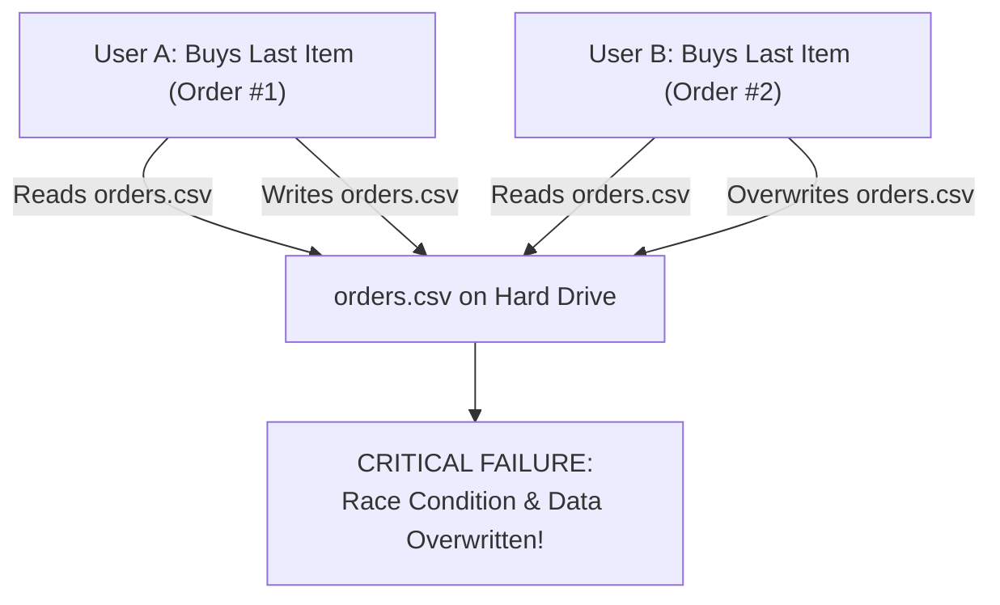
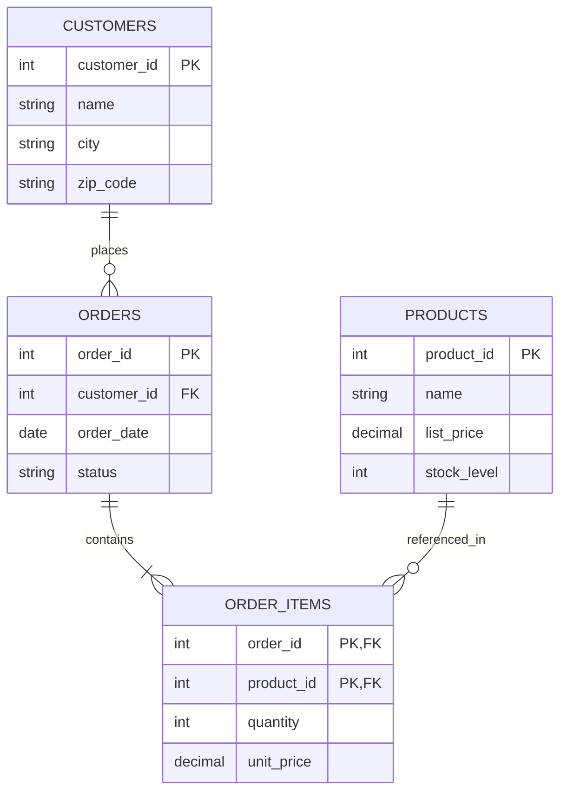

# Module 01: Storage Theory, ACID Properties & The Relational Model

> **Brand new to this topic?** Start with [`00_FOUNDATIONS_PLAYGROUND.md`](00_FOUNDATIONS_PLAYGROUND.md) - the same ideas in
> plain language, with runnable standard-library code you can execute right now.
> No Docker, no server, no `pip install`.

Welcome to **Module 01** of the Database Specialist Course! In this foundational module, we explore the origins of databases from first principles: why flat files break down under concurrency, how Edgar F. Codd created the **Relational Model**, what the **ACID guarantees** actually mean in physical hardware, and how **Normalization** prevents data corruption.

---

## 1. The Historical Crisis: Why Not Just Use CSV Files?

Imagine an e-commerce website that saves orders in a simple CSV file: `orders.csv`.



### The 4 Fatal Flaws of Flat-File Storage:
1. **Concurrent Modification Race Conditions:** If two processes read and write `orders.csv` at the same instant, one process silently overwrites the other's changes.
2. **Partial Writes & Power Outages:** If your server loses power halfway through writing line 500, the file becomes corrupted and unreadable.
3. **No Indexing ($O(N)$ Disk Scans):** To find order `#948271`, the operating system must read every byte of the file from beginning to end.
4. **No Invariant Enforcement:** Nothing stops a bug from saving a string `"free"` into an integer `price` column.

This crisis led to the creation of **Database Management Systems (DBMS)**.

---

## 2. The ACID Guarantees Explained Simply

ACID represents the 4 core contracts a relational database guarantees to your application:

| Principle | Meaning | Real-World Bank Analogy |
| :--- | :--- | :--- |
| **A - Atomicity** | "All-or-Nothing". A transaction with 5 steps either succeeds 100% or rolls back completely to step 0. | Transferring $100 from Alice to Bob: If Bob's account can't receive it, Alice's account is never debited. Money never vanishes. |
| **C - Consistency** | Preserving rules and domain constraints. The database never transitions into an invalid state. | You cannot insert an order for a `user_id` that doesn't exist (Foreign Key invariant). |
| **I - Isolation** | Multiple transactions executing simultaneously do not interfere with each other. | Alice and Bob can both check their balance at the exact same millisecond without seeing partially updated data. |
| **D - Durability** | Once a transaction `COMMIT` is confirmed, the data is guaranteed to survive power cuts, crashes, and OS reboots. | The database flushes the transaction to non-volatile disk logs before telling your code "Success". |

---

## 3. The Relational Model & Relational Algebra

In 1970, IBM researcher **Edgar F. Codd** published a landmark paper that changed computing forever: *"A Relational Model of Data for Large Shared Data Banks"*.

Instead of navigating physical disk pointers (like early hierarchical network databases), Codd proved that data can be modeled as **Mathematical Relations**:

```
Relation (Table) ──> Set of Tuples (Rows) ──> Each Tuple has Attributes (Columns)
```

### The 5 Core Operations of Relational Algebra:
1. **Selection ($\sigma$):** Filters rows matching a condition (`SELECT * WHERE age > 25`).
2. **Projection ($\pi$):** Selects specific columns (`SELECT name, email`).
3. **Cartesian Product ($\times$):** Combines every row of Table A with every row of Table B (`CROSS JOIN`).
4. **Union ($\cup$):** Combines rows from two compatible relations (`UNION`).
5. **Set Difference ($-$)** Rows in Table A that do not exist in Table B (`EXCEPT`).

All modern SQL engines are simply compilers that convert your declarative English-like SQL text into an optimized tree of these mathematical relational operators!

---

## 4. Normalization: Eliminating Data Anomaly Nightmares

Normalization is the process of organizing relational tables to eliminate redundancy and update anomalies.

### The 3 Classic Anomalies:
- **Insertion Anomaly:** You cannot add a new course because no student has enrolled in it yet.
- **Deletion Anomaly:** Deleting the last student enrolled in a course accidentally deletes the course information from the database!
- **Update Anomaly:** A customer changes their address, but it's duplicated across 50 order rows; updating 49 of them leaves 1 row out-of-sync!

### The 3 Normal Forms (1NF $\rightarrow$ 2NF $\rightarrow$ 3NF):
1. **First Normal Form (1NF):**
   - Each column contains only atomic (indivisible) values.
   - No repeating groups or comma-separated lists in a single cell.
2. **Second Normal Form (2NF):**
   - Must be in 1NF.
   - All non-key attributes must depend on the **entire primary key** (no partial key dependencies on composite keys).
3. **Third Normal Form (3NF):**
   - Must be in 2NF.
   - No **transitive dependencies** (Column A determines Column B, which determines Column C). Non-key columns must depend *only* on the primary key.

> [!TIP]
> **The Golden Memory Rhyme:**
> *"Every non-key attribute must depend on the key, the whole key, and nothing but the key, so help me Codd!"*

### 4.1 From Chaotic Spreadsheet to 3NF: A Step-by-Step Walkthrough

Consider how an untrained developer stores an e-commerce order in an unnormalized spreadsheet:

#### Step 0: The Unnormalized "God Table" (Zero Normal Form)
```text
Order_ID | Cust_Name  | Cust_City | Cust_Zip | Items_Purchased                  | Total_Cost
---------+------------+-----------+----------+----------------------------------+-----------
101      | Alice Smith| Austin    | 78701    | Laptop (1x, $1200), Mouse (2x, $25) | $1250
102      | Bob Jones  | Seattle   | 98101    | Keyboard (1x, $80)               | $80
```
- **Why this fails:** `Items_Purchased` contains multiple products and quantities in one cell. You cannot index by product, calculate stock per SKU, or query without string searching!

#### Step 1: First Normal Form (1NF) — Atomicity & Primary Keys
- Rule: Every cell must contain a single atomic value. No multi-valued lists.
- We flatten the repeating items into separate rows and establish a composite primary key: `(Order_ID, Product_Name)`.

```text
Order_ID (PK) | Product_Name (PK) | Quantity | Unit_Price | Cust_Name   | Cust_City | Cust_Zip
--------------+-------------------+----------+------------+-------------+-----------+---------
101           | Laptop            | 1        | $1200      | Alice Smith | Austin    | 78701
101           | Mouse             | 2        | $25        | Alice Smith | Austin    | 78701
102           | Keyboard          | 1        | $80        | Bob Jones   | Seattle   | 98101
```
- **The Remaining Flaw (Partial Dependency):** `Cust_Name`, `Cust_City`, and `Cust_Zip` depend **only** on `Order_ID`, NOT on `Product_Name`! If Alice orders 50 items, her name and address are duplicated 50 times.

#### Step 2: Second Normal Form (2NF) — Eliminate Partial Dependencies
- Rule: Must be in 1NF. Every non-key column must depend on the **entire** composite primary key.
- We split into two relations:
  1. `Orders`: Keys dependent only on `Order_ID`.
  2. `Order_Items`: Items keyed on `(Order_ID, Product_ID)`.

```text
Table: Orders
Order_ID (PK) | Cust_Name   | Cust_City | Cust_Zip | Order_Date
--------------+-------------+-----------+----------+-----------
101           | Alice Smith | Austin    | 78701    | 2026-09-08
102           | Bob Jones   | Seattle   | 98101    | 2026-09-08

Table: Order_Items
Order_ID (PK, FK) | Product_ID (PK, FK) | Quantity | Unit_Price
------------------+---------------------+----------+-----------
101               | P_01 (Laptop)       | 1        | $1200
101               | P_02 (Mouse)        | 2        | $25
102               | P_03 (Keyboard)     | 1        | $80
```
- **The Remaining Flaw (Transitive Dependency):** In `Orders`, `Cust_City` and `Cust_Zip` depend on `Cust_Name` (or `Customer_ID`), which in turn depends on `Order_ID` ($Order \to Customer \to City$).

#### Step 3: Third Normal Form (3NF) — Eliminate Transitive Dependencies
- Rule: Must be in 2NF. Non-key columns must depend *only* on the primary key, with zero transitive chains ($A \to B \to C$).
- We extract `Customers` and `Products` into independent, dedicated entity tables:



This 3NF schema eliminates all 3 anomalies:
1. **No Insertion Anomaly:** You can add a new product into `PRODUCTS` without waiting for an order to be placed.
2. **No Deletion Anomaly:** Deleting an order does not purge the customer's account or product pricing from the database.
3. **No Update Anomaly:** Alice updates her address in 1 single row in `CUSTOMERS`; all historical and future orders immediately reflect the valid customer record without data drift.

---

## 5. Dual-Track Curriculum: Track A (Simulation) vs Track B (Real Operations)

This module implements a rigorous **dual-track architecture** guaranteeing both first-principles mechanistic understanding and battle-tested production operational skills:

| Dimension | Track A: Mechanistic Model | Track B: Live Engine Operations |
| :--- | :--- | :--- |
| **Location** | `project_solution/csv_storage_engine.py` | `project_solution/*_live.py` |
| **Focus** | Internal algorithms & data structures | Real drivers, pooling, and production operations |
| **Technology** | csv_storage_engine.py (Pure-Python storage model) | sqlite3 (Embedded stdlib reference comparison) |
| **Verification** | `project_solution/test_csv_storage_engine.py` | `project_solution/test_*_live.py` |
| **Offline Support** | 100% in-process with 0 external dependencies | Safe skips via `@pytest.mark.skipif` when offline |

### Reconciliation Contract
A dedicated reconciliation suite guarantees that the internal algorithmic model and the real live production driver strictly agree on core operational semantics, invariants, and expected outcomes.

---

## 6. Production Failure Modes & Operational Pitfalls

Every production engineer must understand how this database layer fails under extreme stress:

1. Write Amplification: Modifying a 10-byte column in a 500MB CSV rewrites the entire 500MB file to disk.
2. Torn Writes: Power cut midway through a multi-sector disk write leaves half-written, unparseable lines.
3. Reader-Writer Lock Starvation: Long-running analytical table scans block write pipelines indefinitely.

For complete diagnosis runbooks, error codes, and step-by-step resolution strategies, consult:
👉 **[TROUBLESHOOTING_AND_EDGE_CASES.md](08_TROUBLESHOOTING_AND_EDGE_CASES.md)**

---

## 7. When NOT to Use (Trade-offs & Anti-Patterns)

> [!WARNING]
> Architecture is the art of trade-offs. No database technology is universally optimal.

Do NOT use flat-file storage for concurrent multi-user transactional workloads, multi-node clustering, or tables exceeding 10,000 rows requiring sub-millisecond indexed point lookups.

---

## 8. Essential Production CLI & Query Playbook

Key operational diagnostic commands to verify health and diagnose performance:

```bash
# Verify environment and execute automated test suite
pytest Module_01_Storage_Theory_ACID_Relational_Model -v

# Operational Diagnostics & Health Verification
python -m project_solution.test_csv_engine -v
python -c "import sqlite3; conn = sqlite3.connect(':memory:'); print('SQLite Ready')"
```

---

## 9. Next Steps & Pedagogical Resources

Accelerate your mastery using the structured pedagogical artifacts in this module:
1. 📓 **[Interactive Jupyter Lab](02_interactive_storage_theory.ipynb)**: Hands-on sandbox for interactive exploration.
2. 🎯 **[3-Tier Guided Project](06_PROJECT_GUIDE.md)**: Novice, Core, and Architect implementation tracks.
3. 🛠️ **[Troubleshooting Guide](08_TROUBLESHOOTING_AND_EDGE_CASES.md)**: Real production error signatures & fixes.
4. 🧠 **[Self-Assessment Quiz](07_SELF_ASSESSMENT_AND_CHALLENGES.md)**: 10 diagnostic questions + coding challenges.
5. 🔬 **[Debug Lab](debug_lab/)**: Forensic debugging exercise diagnosing real production bugs.

