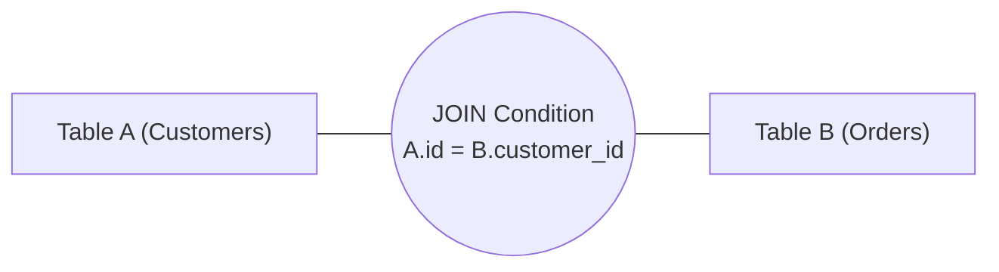

# Module 02: Modern SQL Mastery – Complex Joins, CTEs & Window Functions

> **Brand new to this topic?** Start with [`00_W3_BEGINNER_PLAYGROUND.md`](00_W3_BEGINNER_PLAYGROUND.md) - the same ideas in
> plain language, with runnable standard-library code you can execute right now.
> No Docker, no server, no `pip install`.

Welcome to **Module 02**! In this module, you will transform from writing basic `SELECT * FROM table WHERE ...` queries into writing sophisticated, high-performance analytical SQL. We explore **Complex Multi-Table Joins**, **Recursive Common Table Expressions (CTEs)**, and the superpower of modern data engineering: **Window Functions** (`ROW_NUMBER`, `RANK`, `LEAD`, `LAG`, and sliding aggregation frames).

---

## 🗺️ Recommended Step-by-Step Learning Path

| Step | File to Open | What You Will Do |
| :---: | :--- | :--- |
| **1** | **[README.md](01_README.md)** *(Current File)* | Read the theory, Join Venn diagrams, CTE tree models, and Window Function frames. |
| **2** | **[01_joins_and_subqueries_demo.py](03_joins_and_subqueries_demo.py)** | Run in terminal (`python 01_joins_and_subqueries_demo.py`) to see Inner, Left, and Self Joins on real datasets. |
| **3** | **[02_window_functions_and_ctes_demo.py](04_window_functions_and_ctes_demo.py)** | Run in terminal to compute rolling 7-day moving averages and hierarchical org charts with recursive CTEs. |
| **4** | **[TROUBLESHOOTING_AND_EDGE_CASES.md](07_TROUBLESHOOTING_AND_EDGE_CASES.md)** | Review common traps: Cartesian product explosion, NULL comparisons (`NULL = NULL`), and Window partitioning traps. |
| **5** | **[SELF_ASSESSMENT_AND_CHALLENGES.md](06_SELF_ASSESSMENT_AND_CHALLENGES.md)** | Test yourself with the 10-question quiz and solve the 2 hands-on coding challenges. |
| **6** | **[PROJECT_GUIDE.md](05_PROJECT_GUIDE.md)** | Build the **Financial Analytics Engine with CTEs & Windows** in **[project_solution/](project_solution)**! |

---

---

## 0. The True Physical Lifecycle of a SQL Query

To write advanced SQL without confusing yourself, you must unlearn the order in which SQL is *written* and understand the exact order in which the database query engine physically *executes* it:

### The Written Order vs The Internal Execution Order

```text
 Written (Lexical) Order:                     Internal Engine Execution Order:
 1. SELECT                                    1. FROM & JOIN  (Identifies & combines source data tables)
 2. FROM                                      2. WHERE        (Filters individual raw rows BEFORE grouping)
 3. JOIN ... ON                               3. GROUP BY     (Aggregates rows into bucketed groups)
 4. WHERE                                     4. HAVING       (Filters aggregated buckets AFTER grouping)
 5. GROUP BY                                  5. SELECT       (Calculates expressions & column projections)
 6. HAVING                                    6. DISTINCT     (Eliminates duplicate rows)
 7. ORDER BY                                  7. ORDER BY     (Sorts the final resulting rows)
 8. LIMIT / OFFSET                            8. LIMIT / OFFSET (Truncates the output page)
```

### The Two Most Common Beginner Pitfalls Explained:

1. **Why can't you use a `SELECT` column alias in `WHERE`?**
   ```sql
   -- FAILS WITH: "column total_cents does not exist"
   SELECT price * quantity AS total_cents 
   FROM order_items 
   WHERE total_cents > 10000;
   ```
   **Why:** `WHERE` (Step 2) executes *long before* `SELECT` (Step 5)! The alias `total_cents` does not exist in memory yet when `WHERE` is evaluating rows.
   **Solution:** Either repeat the expression `WHERE price * quantity > 10000` or wrap it in a CTE.

2. **`WHERE` vs `HAVING`: When to use which?**
   - **`WHERE`:** Filters individual source rows *before* they enter aggregate calculations. Use for raw columns (`WHERE status = 'DELIVERED'`).
   - **`HAVING`:** Filters grouped summary buckets *after* mathematical aggregation. Use for aggregate functions (`HAVING COUNT(*) > 5` or `HAVING SUM(amount) > 1000`).

---

## 1. Relational Joins Demystified with Row-Level Truth Tables

A **JOIN** combines columns from two tables based on a matching predicate between them.



### Row-Level Walkthrough Dataset:
```text
Table: Customers (3 rows)          Table: Orders (3 rows)
id | name                          order_id | customer_id | amount
---+------                         ---------+-------------+-------
1  | Alice                         101      | 1           | $50
2  | Bob                           102      | 1           | $120
3  | Charlie (No orders)           103      | 99 (Ghost)  | $40
```

### The 5 Join Types & Their Result Sets:

| Join Type | Engine Mechanics | Resulting Rows for Sample Dataset |
| :--- | :--- | :--- |
| **`INNER JOIN`** | Returns rows only when the join predicate matches in **both** tables. Unmatched rows on either side are discarded. | `(1, Alice, 101, $50)`<br>`(1, Alice, 102, $120)` *(Charlie and Order 103 discarded)* |
| **`LEFT JOIN`** *(Left Outer)* | Preserves **all** rows from the Left table (`Customers`). If no match exists in the Right table, fills Right columns with `NULL`. | `(1, Alice, 101, $50)`<br>`(1, Alice, 102, $120)`<br>`(3, Charlie, NULL, NULL)` *(Charlie preserved!)* |
| **`RIGHT JOIN`** *(Right Outer)* | Preserves **all** rows from the Right table (`Orders`). If no customer matches, fills Left columns with `NULL`. | `(1, Alice, 101, $50)`<br>`(1, Alice, 102, $120)`<br>`(NULL, NULL, 103, $40)` *(Order 103 preserved!)* |
| **`FULL OUTER JOIN`** | Preserves all rows from **both** sides. Missing matches on either side become `NULL`. | `(1, Alice, 101, $50)`<br>`(1, Alice, 102, $120)`<br>`(3, Charlie, NULL, NULL)`<br>`(NULL, NULL, 103, $40)` |
| **`CROSS JOIN`** | Mathematical Cartesian product. Combines every row of A with every row of B ($3 \times 3 = 9$ rows). | Produces all 9 pairwise combinations. Dangerous on large tables! |

> [!WARNING]
> **The 1-to-N Row Multiplication Trap:**
> Notice that Alice had 2 orders. Joining `Customers` to `Orders` produced **2 rows for Alice**. If you `SUM(customer_balance)` after joining to `Orders`, you will accidentally double-count Alice's balance! Always aggregate child tables *before* joining to parents.

---

## 2. Common Table Expressions (CTEs) & Recursive Trees

Instead of nesting 5 unreadable subqueries inside parentheses, **Common Table Expressions (CTEs)** let you write clean, modular temporary tables using the `WITH` clause:

```sql
WITH regional_sales AS (
    SELECT region, SUM(amount) AS total_sales
    FROM orders
    GROUP BY region
)
SELECT region, total_sales
FROM regional_sales
WHERE total_sales > 100000;
```

### Recursive CTEs: Navigating Trees & Graphs
Recursive CTEs repeatedly execute an initial anchor query followed by a recursive step until no more rows are returned. Ideal for parent-child hierarchies (e.g., employee manager chains, folder directories):

```sql
WITH RECURSIVE org_chart AS (
    -- 1. Anchor member: Top CEO
    SELECT id, name, manager_id, 1 as level
    FROM employees
    WHERE manager_id IS NULL

    UNION ALL

    -- 2. Recursive member: All reports
    SELECT e.id, e.name, e.manager_id, o.level + 1
    FROM employees e
    JOIN org_chart o ON e.manager_id = o.id
)
SELECT * FROM org_chart ORDER BY level;
```

---

## 3. Window Functions: The Superpower of Analytical SQL

Traditional `GROUP BY` collapses your rows into a single summary row. **Window Functions** compute aggregate values across a set of rows **while still retaining every original row**!

```sql
SELECT 
    employee_id, 
    department, 
    salary,
    -- Calculates average salary of that specific department for each row:
    AVG(salary) OVER(PARTITION BY department) AS dept_avg_salary,
    -- Ranks employees within their department by salary:
    RANK() OVER(PARTITION BY department ORDER BY salary DESC) as rank_in_dept
FROM employees;
```

### Key Window Functions:
- **`ROW_NUMBER()`:** Unique sequential integer starting at 1.
- **`RANK()` vs `DENSE_RANK()`:** `RANK()` skips ranks on ties ($1, 2, 2, 4$), while `DENSE_RANK()` never leaves gaps ($1, 2, 2, 3$).
- **`LEAD(col, offset)` & `LAG(col, offset)`:** Looks forward or backward $N$ rows without self-joins (ideal for calculating day-over-day growth!).
- **Sliding Frame Aggregations:**
  ```sql
  -- Running 7-day rolling total:
  SUM(amount) OVER (
      ORDER BY transaction_date 
      ROWS BETWEEN 6 PRECEDING AND CURRENT ROW
  )
  ```

---

## 5. Dual-Track Curriculum: Track A (Simulation) vs Track B (Real Operations)

This module implements a rigorous **dual-track architecture** guaranteeing both first-principles mechanistic understanding and battle-tested production operational skills:

| Dimension | Track A: Mechanistic Model | Track B: Live Engine Operations |
| :--- | :--- | :--- |
| **Location** | `project_solution/sql_engine.py` | `project_solution/*_live.py` |
| **Focus** | Internal algorithms & data structures | Real drivers, pooling, and production operations |
| **Technology** | sql_engine.py (In-memory SQL evaluator) | sqlite3 (Built-in engine executing analytical queries) |
| **Verification** | `project_solution/test_sql_engine.py` | `project_solution/test_*_live.py` |
| **Offline Support** | 100% in-process with 0 external dependencies | Safe skips via `@pytest.mark.skipif` when offline |

### Reconciliation Contract
A dedicated reconciliation suite guarantees that the internal algorithmic model and the real live production driver strictly agree on core operational semantics, invariants, and expected outcomes.

---

## 6. Production Failure Modes & Operational Pitfalls

Every production engineer must understand how this database layer fails under extreme stress:

1. NULL Propagation in NOT IN: A single NULL returned by a subquery causes the entire NOT IN clause to evaluate to empty.
2. RANGE Frame Duping: Default window framing computes running sums across duplicate timestamp peers simultaneously.
3. Cartesian Explosion: Joining a parent table with two independent 1:N child tables multiplies row counts exponentially.

For complete diagnosis runbooks, error codes, and step-by-step resolution strategies, consult:
👉 **[TROUBLESHOOTING_AND_EDGE_CASES.md](07_TROUBLESHOOTING_AND_EDGE_CASES.md)**

---

## 7. When NOT to Use (Trade-offs & Anti-Patterns)

> [!WARNING]
> Architecture is the art of trade-offs. No database technology is universally optimal.

Do NOT use complex recursive CTEs for real-time sub-millisecond graph traversals over millions of edges; use a dedicated graph database (Neo4j) instead.

---

## 8. Essential Production CLI & Query Playbook

Key operational diagnostic commands to verify health and diagnose performance:

```bash
# Verify environment and execute automated test suite
pytest Module_02_Modern_SQL_Mastery_Advanced_Queries -v

# Operational Diagnostics & Health Verification
sqlite3 app.db "EXPLAIN QUERY PLAN SELECT ..."
sqlite3 app.db ".timer on" "SELECT ..."
```

---

## 9. Next Steps & Pedagogical Resources

Accelerate your mastery using the structured pedagogical artifacts in this module:
1. 📓 **[Interactive Jupyter Lab](02_interactive_sql_mastery.ipynb)**: Hands-on sandbox for interactive exploration.
2. 🎯 **[3-Tier Guided Project](05_PROJECT_GUIDE.md)**: Novice, Core, and Architect implementation tracks.
3. 🛠️ **[Troubleshooting Guide](07_TROUBLESHOOTING_AND_EDGE_CASES.md)**: Real production error signatures & fixes.
4. 🧠 **[Self-Assessment Quiz](06_SELF_ASSESSMENT_AND_CHALLENGES.md)**: 10 diagnostic questions + coding challenges.
5. 🔬 **[Debug Lab](debug_lab/)**: Forensic debugging exercise diagnosing real production bugs.

