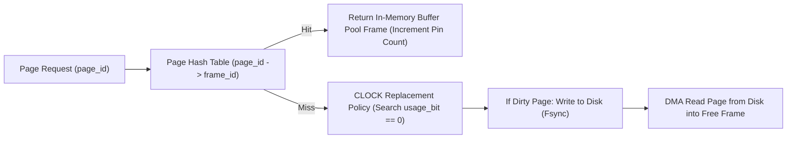

# Beginner Playground - SQLite and the Write-Ahead Log

> *"A WAL is an accountant's ledger. You never scrub out an old entry - you append a correction underneath, and the balance is whatever the entries add up to."*


> 💡 **Try It in the Live Runner:** You can run and modify any snippet in this playground directly in your browser! Click the **`▶ Run`** button in the header of any code block to test it instantly on the side, or toggle **`Live Runner`** in the top navigation bar to experiment with Python, PowerShell, and CLI commands while reading.

**Brand new to this topic? Start here, not with the README.**

Everything on this page is plain Python from the standard library. No Docker, no
server, no `pip install`, no account to sign up for. You can read it in ten
minutes and run it in one:

```bash
python 00_try_it_yourself.py
```

That script is this page, in order, with the assertions left in. If it prints
`All checks passed`, every claim below just proved itself on your machine.

---


## Buffer Pool Manager & CLOCK Replacement Algorithm



## 0. Everything this page needs

Nothing here is installed. These all ship with Python.

```python
import pathlib
import sqlite3
import tempfile
```

---

## 1. Why an accountant never uses an eraser

A bookkeeper does not scrub out last Tuesday's entry to fix it. They write a new
line at the bottom: *"correction, -40"*. Two good things follow.

1. **The original page is never half-edited.** Anyone reading over their shoulder
   always sees a consistent set of books.
2. **If the pen runs out mid-line**, you discard the incomplete last line and
   everything before it is still perfect.

That is the write-ahead log. Changes are *appended* to a separate `-wal` file.
The main database file is not touched until a **checkpoint** folds the log back
in - the end-of-month tidy-up.

The older mode, the **rollback journal**, works the opposite way round: photocopy
the old page first, then edit the real file in place. Readers must be kept out
while that happens, because the real file is briefly mid-edit.

```python
folder = pathlib.Path(tempfile.mkdtemp(prefix="wal_playground_"))
ledger = folder / "ledger.db"

setup = sqlite3.connect(ledger)
mode = setup.execute("PRAGMA journal_mode=WAL").fetchone()[0]
print("journal mode:", mode)
assert mode == "wal", "this database now appends corrections instead of erasing"

setup.execute("CREATE TABLE entry (id INTEGER PRIMARY KEY, note TEXT)")
setup.execute("INSERT INTO entry (note) VALUES ('opening balance')")
setup.commit()
```

---

## 2. Readers never wait for the writer

Two connections: one writing, one reading. The writer opens a transaction and
inserts a row but does **not** commit.

The reader is looking at the main database file, which the writer has not
touched. So it sees the books as they stood before the pen went down - straight
away, with no waiting.

```python
writer = sqlite3.connect(ledger, isolation_level=None)
reader = sqlite3.connect(ledger, isolation_level=None)

writer.execute("BEGIN")
writer.execute("INSERT INTO entry (note) VALUES ('sale - pen still on the page')")

seen_now = reader.execute("SELECT COUNT(*) FROM entry").fetchone()[0]
print("rows the reader sees while the writer is mid-transaction:", seen_now)
assert seen_now == 1, "the uncommitted row must be invisible"

writer.execute("COMMIT")
seen_after = reader.execute("SELECT COUNT(*) FROM entry").fetchone()[0]
print("rows the reader sees after the writer commits:", seen_after)
assert seen_after == 2, "once committed, the correction is part of the books"
```

---

## 3. Look at the sidecar file

That committed row is not in `ledger.db` yet. It is sitting in `ledger.db-wal`,
the ledger's overflow page. Both files together are the database - which is why
copying only the `.db` file out of a live WAL database gives you a stale backup.

```python
wal_file = ledger.with_name(ledger.name + "-wal")
print("sidecar file:", wal_file.name, "- exists:", wal_file.exists())
assert wal_file.exists(), "committed changes live here until a checkpoint"

size_before = wal_file.stat().st_size
print("WAL size before checkpoint:", size_before, "bytes")
assert size_before > 0
```

---

## 4. Checkpoint - the end-of-month tidy-up

A checkpoint copies logged changes into the main file and resets the log. SQLite
does this automatically (by default once the WAL passes about 1,000 pages), so
you rarely call it by hand. We call it here so you can watch the file shrink.

```python
writer.close()
reader.close()
setup.execute("PRAGMA wal_checkpoint(TRUNCATE)")

size_after = wal_file.stat().st_size
print("WAL size after checkpoint:", size_after, "bytes")
assert size_after == 0, "TRUNCATE folds the log back in and empties it"

notes = [r[0] for r in setup.execute("SELECT note FROM entry ORDER BY id")]
print("final books:", notes)
assert len(notes) == 2, "nothing was lost in the tidy-up"
setup.close()
```

---

## 5. The one thing WAL does not give you

WAL lets *many readers* run alongside *one writer*. It does not give you many
writers. A second writer gets `database is locked`.

That is the most common SQLite complaint on the internet, and it is not a bug -
it is the design. One pen, one ledger. When you genuinely need many pens you need
a database with a server process, which is where PostgreSQL comes in later.

```python
pen_a = sqlite3.connect(ledger, isolation_level=None, timeout=0.1)
pen_b = sqlite3.connect(ledger, isolation_level=None, timeout=0.1)
pen_a.execute("BEGIN IMMEDIATE")
pen_a.execute("INSERT INTO entry (note) VALUES ('writer A')")

refused = False
try:
    pen_b.execute("BEGIN IMMEDIATE")
except sqlite3.OperationalError as exc:
    refused = True
    print("second writer refused, exactly as designed:", exc)

assert refused, "two concurrent writers must not both get the pen"
pen_a.execute("COMMIT")
pen_a.close()
pen_b.close()
```

---

## 6. Predict before you run

While the writer is holding an open transaction with one uncommitted row, how
many rows will the *reader* connection count - one, two, or will it hang
waiting for the writer to finish?

Write your answer down first. Being wrong here is the point - a prediction you
had to correct is remembered; a paragraph you agreed with is not.

---

## Where this shows up for real

Your phone is running dozens of SQLite databases in WAL mode right now - your
messages, your browser history, your photo library. WAL is why the photo app
keeps scrolling smoothly while a background job writes thumbnails, and why
pulling the battery does not corrupt the file.

**Next:** [`01_README.md`](01_README.md) covers the same ideas with production
detail. When you want to practise diagnosing rather than building, the planted
bugs are in [`debug_lab/SYMPTOMS.md`](debug_lab/SYMPTOMS.md).