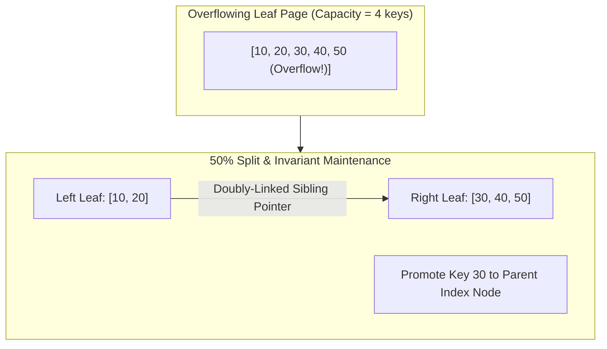

# Module 04: PostgreSQL Core Architecture & Advanced Data Types

> **Brand new to this topic?** Start with [`00_FOUNDATIONS_PLAYGROUND.md`](00_FOUNDATIONS_PLAYGROUND.md) - the same ideas in
> plain language, with runnable standard-library code you can execute right now.
> No Docker, no server, no `pip install`.

Welcome to **Module 04** of the Database Systems Specialist Curriculum. In this module, you will master the internal process model, memory layout, and advanced polymorphic data types of **PostgreSQL** — the world's most advanced open-source relational database.

---


## B+ Tree Leaf Page Split & Parent Key Promotion



## 🏛️ 1. PostgreSQL Process & Memory Architecture

Unlike multi-threaded database engines like MySQL or modern NoSQL stores, PostgreSQL is built upon a robust, unix-native **process-based architecture**.

```
                           [Client Connections]
                                    │
                                    ▼ (Fork on connect)
                             [Postmaster Daemon]
                                    │
       ┌────────────────────────────┼────────────────────────────┐
       ▼                            ▼                            ▼
[Backend Worker 1]          [Backend Worker 2]          [Backend Worker N]
(Private: work_mem,         (Private: work_mem,         (Private: work_mem,
 maintenance_work_mem)       maintenance_work_mem)       maintenance_work_mem)
       │                            │                            │
       └────────────────────────────┼────────────────────────────┘
                                    │
                                    ▼ (Shared Memory IPC)
                 ┌──────────────────────────────────────┐
                 │     POSTGRESQL SHARED MEMORY         │
                 │ ├── shared_buffers (Cache Pages, 25%)│
                 │ ├── wal_buffers (Pre-disk WAL buffer)│
                 │ └── Lock Manager & IPC Semaphores    │
                 └──────────────────┬───────────────────┘
                                    │
            ┌───────────────────────┼───────────────────────┐
            ▼                       ▼                       ▼
    [Checkpointer]           [Background Writer]     [WAL Writer]
 (Fsyncs dirty pages)     (Proactively cleans pool) (Writes WAL to disk)
            │                       │                       │
            ▼                       ▼                       ▼
    [Data Files (.pg)]      [Data Files (.pg)]     [WAL Segments (16MB)]
```

### Key Memory Areas
1. **`shared_buffers`**: The central buffer pool shared by all backend worker processes. Typically sized to **25% of total system RAM** in production. PostgreSQL relies on the operating system's page cache for the remaining memory.
2. **`work_mem`**: Private memory allocated per sorting or hashing operation (*not* per connection!). If a complex query has 4 sort nodes and 2 hash joins, it can allocate $6 \times \text{work\_mem}$. If set recklessly high (e.g., 256MB) with 500 connections, an Out-Of-Memory (OOM) killer will terminate PostgreSQL.
3. **`maintenance_work_mem`**: Memory allocated for administrative operations (`VACUUM`, `CREATE INDEX`, `ALTER TABLE ADD FOREIGN KEY`). Typically set much higher (e.g., 1GB–2GB) to accelerate index builds.

---

## 🍞 2. The TOAST Engine (The Oversized-Attribute Storage Technique)

PostgreSQL stores table data in fixed **8 KB disk pages**. A single row cannot span across multiple standard pages. If a row contains large text, JSON, or bytea payloads that exceed approximately **2 KB (1/4 of a page)**, PostgreSQL activates **TOAST**:

```
[Main Table Page: 8 KB]
┌──────────────────────────────────────────────────────────────┐
│ Tuple Header | id=42 | name="Alice" | [TOAST Pointer 24B] ───┼──┐
└──────────────────────────────────────────────────────────────┘  │
                                                                  │
                                                                  ▼
[TOAST Auxiliary Table: pg_toast_<oid>]
┌──────────────────────────────────────────────────────────────┐
│ Chunk 1 (2KB): Compressed bytes [0..2047]                    │
├──────────────────────────────────────────────────────────────┤
│ Chunk 2 (2KB): Compressed bytes [2048..4095]                 │
├──────────────────────────────────────────────────────────────┤
│ Chunk 3 (1.2KB): Compressed bytes [4096..5300]               │
└──────────────────────────────────────────────────────────────┘
```

### TOAST Storage Strategies
- **`PLAIN`**: Disallows compression and out-of-line storage (used for integers, dates).
- **`EXTENDED`** (Default for JSONB/TEXT): Compresses using LZ4 or pglz; if still $> 2\text{KB}$, moves chunks out-of-line to the TOAST table.
- **`EXTERNAL`**: Moves out-of-line *without* compression (ideal for pre-compressed images/zips to save CPU).
- **`MAIN`**: Compresses inline first; only moves out-of-line if page is completely full.

---

## ⚡ 3. Advanced Polymorphic Data Types

### JSON vs. JSONB: The Great Divide

| Feature | `JSON` | `JSONB` |
| :--- | :--- | :--- |
| **Storage Format** | Raw verbatim text string | Decomposed binary format with sorted keys |
| **Ingestion Cost** | Instantaneous (no parsing) | Slower (syntax validation, key deduplication, sorting) |
| **Query Cost** | Slow (must re-parse text on every query) | Fast (direct binary offset jumps without scanning) |
| **Indexing** | Only functional expression indexes | Full Generalized Inverted Indexing (**GIN**) |
| **Whitespace/Keys** | Preserves duplicate keys & exact whitespace | Eliminates whitespace; keeps only last duplicate key |

### Core JSONB Operators
- `data -> 'key'`: Extract value as JSON.
- `data ->> 'key'`: Extract value as primitive `text`.
- `data @> '{"role": "admin"}'`: Containment test (matches if left operand contains right JSON structure). Uses GIN index!
- `data ? 'feature'`: Checks if string exists as top-level key.

### Range Types & Exclusion Constraints
PostgreSQL supports native ranges: `int4range`, `numrange`, `tsrange`, `tstzrange` (timestamps with timezone).
Instead of writing error-prone checks like:
```sql
WHERE start_time < existing_end AND end_time > existing_start
```
PostgreSQL provides the overlap operator `&&`:
```sql
SELECT * FROM hotel_reservations 
WHERE room_id = 101 AND duration && tstzrange('2026-06-01', '2026-06-05');
```
With **GiST exclusion constraints**, the database guarantees zero overlapping bookings at the hardware storage engine level!

---

## 🛠️ 4. 3-Tier Progressive Mastery Challenges

### Tier 1: Guided First-Principles Walkthrough
- Inspect `03_postgres_jsonb_toast_demo.py` and run it to observe how JSON text compares against binary JSONB indexing and TOAST compression.
- Practice basic JSONB containment and path extraction queries.

### Tier 2: Core Engineering Build
- Open `starter/jsonb_document_store.py`.
- Implement `JSONBDocumentStore`:
  1. `insert(doc_id, document)`: Binary serialization and key sorting.
  2. `build_gin_index()`: Extract all `(path, value)` tuples into an inverted index.
  3. `contains(sub_document)`: Evaluate JSON containment using the inverted GIN index.
  4. `toast_compress_and_chunk(payload, threshold=2048)`: Simulate TOAST chunking for documents exceeding the 2KB page budget.

### Tier 3: Production Hardening (Architect Stretch)
- Implement `TimeRangeExclusionIndex`:
  - Model `DateTimeRange(start, end)`.
  - Enforce atomic exclusion constraints preventing any overlapping intervals for the same tenant/room.
  - Run `pytest project_solution/test_jsonb_document_store.py` to achieve 100% test pass verification.

---

---

## 🗺️ Recommended Step-by-Step Learning Path

Follow this exact sequence to achieve complete mastery of this module:

| Step | File to Open | What You Will Do |
| :---: | :--- | :--- |
| **1** | **[01_README.md](01_README.md)** | Read conceptual overview, architectural foundations, and mental models. |
| **2** | **[00_FOUNDATIONS_PLAYGROUND.md](00_FOUNDATIONS_PLAYGROUND.md)** | Practice beginner spoonfed micro-drills and line-by-line syntax breakdowns. |
| **3** | **[00_try_it_yourself.py](00_try_it_yourself.py)** | Run in terminal (`python 00_try_it_yourself.py`) for an interactive zero-dependency sandbox. |
| **4** | **[02_interactive_postgres_core.ipynb](02_interactive_postgres_core.ipynb)** | Open in Jupyter/VS Code to run interactive visual experiments and benchmarks. |
| **5** | **[03_postgres_jsonb_toast_demo.py](03_postgres_jsonb_toast_demo.py)** | Run in terminal (`python 03_postgres_jsonb_toast_demo.py`) to explore 03 Postgres Jsonb Toast Demo code patterns. |
| **6** | **[06_TROUBLESHOOTING_AND_EDGE_CASES.md](06_TROUBLESHOOTING_AND_EDGE_CASES.md)** | Study forensic runbooks, edge cases, and real-world failure post-mortems. |
| **7** | **[05_SELF_ASSESSMENT_AND_CHALLENGES.md](05_SELF_ASSESSMENT_AND_CHALLENGES.md)** | Test your knowledge with self-assessment quizzes, challenges, and diagnostic scenarios. |
| **8** | **[04_PROJECT_GUIDE.md](04_PROJECT_GUIDE.md)** | Follow guided project implementation for `starter/` and `project_solution/`. |
| **9** | **[problems/](problems/)** | Solve hands-on problem bank challenges and verify with `pytest problems/tests`. |
| **10** | **[debug_lab/](debug_lab/)** | Diagnose and fix silent production bugs in the Bug Hunter Drill. |

---

## 5. Dual-Track Curriculum: Track A (Simulation) vs Track B (Real Operations)

This module implements a rigorous **dual-track architecture** guaranteeing both first-principles mechanistic understanding and battle-tested production operational skills:

| Dimension | Track A: Mechanistic Model | Track B: Live Engine Operations |
| :--- | :--- | :--- |
| **Location** | `project_solution/jsonb_document_store.py` | `project_solution/*_live.py` |
| **Focus** | Internal algorithms & data structures | Real drivers, pooling, and production operations |
| **Technology** | jsonb_document_store.py (JSONB binary encoder & GIN index) | postgres_live.py (psycopg2 connection pool, JSONB queries) |
| **Verification** | `project_solution/test_jsonb_document_store.py` | `project_solution/test_*_live.py` |
| **Offline Support** | 100% in-process with 0 external dependencies | Safe skips via `@pytest.mark.skipif` when offline |

### Reconciliation Contract
A dedicated reconciliation suite guarantees that the internal algorithmic model and the real live production driver strictly agree on core operational semantics, invariants, and expected outcomes.

---

## 6. Production Failure Modes & Operational Pitfalls

Every production engineer must understand how this database layer fails under extreme stress:

1. Connection Slot Exhaustion: Exceeding max_connections crashes incoming traffic due to per-process RAM consumption.
2. GIN Index Bypass: Using text extraction (->>) rather than containment (@>) forces full sequential heap scans.
3. Integer ID Wraparound: Using standard 32-bit SERIAL triggers integer overflow on high-volume tables.

For complete diagnosis runbooks, error codes, and step-by-step resolution strategies, consult:
👉 **[TROUBLESHOOTING_AND_EDGE_CASES.md](06_TROUBLESHOOTING_AND_EDGE_CASES.md)**

---

## 7. When NOT to Use (Trade-offs & Anti-Patterns)

> [!WARNING]
> Architecture is the art of trade-offs. No database technology is universally optimal.

Do NOT use PostgreSQL as a high-velocity write-ahead message broker (Kafka use case) or for petabyte-scale unpartitioned analytical queries without columnar extensions (ClickHouse / DuckDB use case).

---

## 8. Essential Production CLI & Query Playbook

Key operational diagnostic commands to verify health and diagnose performance:

```bash
# Verify environment and execute automated test suite
pytest Module_04_PostgreSQL_Core_Advanced_Types -v

# Operational Diagnostics & Health Verification
psql -h localhost -U postgres -c "SELECT count(*) FROM pg_stat_activity;"
psql -h localhost -U postgres -c "SELECT pg_size_pretty(pg_database_size('coursedb'));"
```

---

## 9. Next Steps & Pedagogical Resources

Accelerate your mastery using the structured pedagogical artifacts in this module:
1. 📓 **[Interactive Jupyter Lab](02_interactive_postgres_core.ipynb)**: Hands-on sandbox for interactive exploration.
2. 🎯 **[3-Tier Guided Project](04_PROJECT_GUIDE.md)**: Novice, Core, and Architect implementation tracks.
3. 🛠️ **[Troubleshooting Guide](06_TROUBLESHOOTING_AND_EDGE_CASES.md)**: Real production error signatures & fixes.
4. 🧠 **[Self-Assessment Quiz](05_SELF_ASSESSMENT_AND_CHALLENGES.md)**: 10 diagnostic questions + coding challenges.
5. 🔬 **[Debug Lab](debug_lab/)**: Forensic debugging exercise diagnosing real production bugs.
