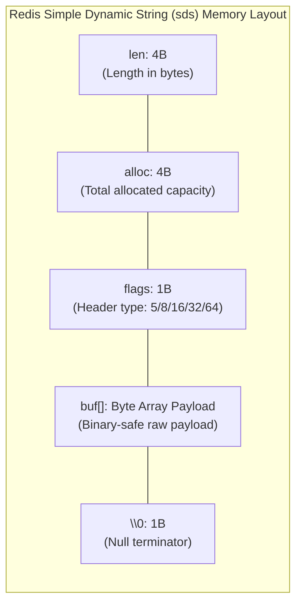
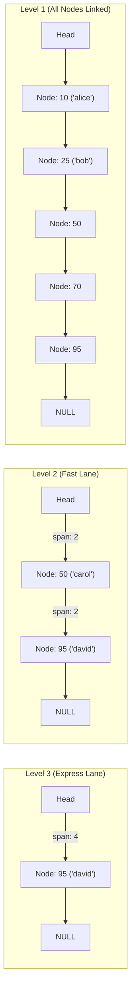

# Module 12: Redis Data Structures, Memory Optimization & Persistence

> **Brand new to this topic?** Start with [`00_FOUNDATIONS_PLAYGROUND.md`](00_FOUNDATIONS_PLAYGROUND.md) - the same ideas in
> plain language, with runnable standard-library code you can execute right now.
> No Docker, no server, no `pip install`.

Welcome to **Module 12**. In this module, you will master **Redis (Remote Dictionary Server)** — the world's standard in-memory key-value data structure store that powers ultra-low latency caching, global leaderboards, session stores, real-time analytics, and distributed coordination.

---

## ⚡ 1. The Single-Threaded Architecture Myth & Reality

A pervasive misconception among developers is that Redis is slow or unable to leverage modern multicore processors because its core execution engine runs on a single thread. In reality, Redis delivers **100,000+ operations per second per CPU core** with sub-millisecond latencies *because* of its single-threaded event loop design:

### Why Single-Threaded is Fast
1. **Zero Mutex / Lock Contention**: In multi-threaded in-memory stores, thread synchronization locks (mutexes, spinlocks, rwlocks) introduce heavy CPU cache line invalidation and bus contention. In Redis, every command executes sequentially to completion without locks.
2. **Zero Thread Context Switching Overhead**: OS kernel thread context switches consume thousands of CPU cycles in register saves and cache misses. Redis bypasses this entirely.
3. **Non-Blocking I/O Multiplexing**: Redis uses the operating system's kernel event notification primitives (`epoll` on Linux, `kqueue` on BSD/macOS, `IOCP` on Windows) to monitor tens of thousands of active socket file descriptors simultaneously on a single reactor loop.
4. **Hardware Reality**: In-memory DRAM read/write operations execute in ~50–100 nanoseconds. CPU instructions are rarely the bottleneck; network bandwidth, packet processing overhead, and memory capacity govern performance.

> [!NOTE]
> Since Redis 6.0, Redis uses multi-threaded I/O *only* for parsing incoming client network buffers and serializing socket write responses. The core command execution engine remains strictly single-threaded, preserving full ACID-like isolation per command.

---

## 🔬 2. Data Structure Internals & Memory Encodings

Redis does not use generic programming language runtime objects. Every data structure is hand-crafted in C with extreme byte-level packing to minimize pointer overhead and memory fragmentation.

### 1. Simple Dynamic Strings (SDS)
Standard C strings are null-terminated (`\0`), which imposes severe limitations:
- Computing length (`strlen`) is $O(N)$ because it must scan until `\0`.
- Strings cannot contain arbitrary binary data (e.g., JPEG bytes, serialized Protobufs) because embedded `0x00` bytes are misinterpreted as terminators.
- Frequent string concatenations cause repeated `realloc()` overhead and memory buffer reallocations.

Redis SDS solves this with a dedicated header layout (`sdshdr8`, `sdshdr16`, `sdshdr32`):

- `len`: Length of the string in bytes ($O(1)$ length queries).
- `alloc`: Total memory allocated, excluding the header and null terminator.
- `flags`: 3-bit flag identifying the header type (`sdshdr5`, `8`, `16`, `32`, `64`), minimizing header overhead down to 1 byte for short strings.
- **Binary-safe**: Redis reads string content using `len`, allowing arbitrary binary payloads with embedded null bytes.
- **Pre-allocation & Lazy Freeing**: SDS doubles capacity when expanding (up to 1MB) to amortize reallocation cost, and retains allocated memory upon truncation.

### 2. Progressive Rehashing in Redis Dict
Redis hashes and the top-level keyspace use a hash table implementation called `dict`.
- A `dict` maintains two internal hash tables: `ht[0]` (active) and `ht[1]` (rehash target).
- When the load factor exceeds 1.0 (or 5.0 during background saves), Redis doubles the table size.
- **Progressive Rehashing**: Instead of migrating millions of keys in a single blocking spike, Redis increments `rehashidx` with each incoming command and during idle cron ticks (`databasesCron`), migrating one bucket at a time from `ht[0]` to `ht[1]`. Point lookups search `ht[0]`, then `ht[1]`.

### 3. Memory Compression: Ziplists & Listpacks
Standard linked lists and hash tables incur massive pointer overhead (each node has 16–24 bytes of prev/next pointers plus memory allocator headers). If you store 1,000 hashes with 5 small fields each, pointer metadata can consume 85% of your RAM.
- **Listpack / Ziplist**: Serializes elements contiguously into a single linear block of memory without pointers:
  ```
  [<total_bytes> <num_elements> | <entry_1> | <entry_2> ... | <end_byte>]
  ```
- Each entry stores its length, encoding, and raw payload.
- As long as collections stay small (`hash-max-listpack-entries 512`, `hash-max-listpack-value 64`), Redis stores them as listpacks, slashing RAM usage by up to **80%**. Once a threshold is breached, Redis automatically converts the structure to a standard hash table or quicklist.

### 4. Sorted Sets (ZSET): Hash Table + SkipList
A Sorted Set (`ZSET`) provides both $O(1)$ member score lookups (`ZSCORE`) and $O(\log N + M)$ range retrieval and rank calculations (`ZRANGEBYSCORE`, `ZRANK`).
It accomplishes this dual capability by keeping two data structures synchronized:
1. **Hash Table (`dict`)**: Maps `member -> score` for instantaneous $O(1)$ score lookups.
2. **SkipList (`zskiplist`)**: A probabilistic multi-level forward linked list that maintains elements sorted by score.


- **Why not a Red-Black Tree or B-Tree?** B-Trees and balanced trees require complex tree rotations upon insertion/deletion that lock multiple branches and are complicated to implement concurrently. SkipLists generate node heights probabilistically using a random coin toss ($p = 0.25$), making insertions simple and range scans trivial (simply walk forward along Level 1).
- **Span Metadata**: Each forward pointer stores the number of skipped nodes (`span`), allowing Redis to calculate the exact rank of any member in $O(\log N)$ time by summing spans along the search path.

---

## 💾 3. Persistence Mechanics: RDB vs. AOF

Redis is an in-memory database, but it provides two durable persistence strategies to survive process crashes, server restarts, and hardware failures:

| Metric / Dimension | RDB (Redis Database Snapshot) | AOF (Append-Only File) |
| :--- | :--- | :--- |
| **Mechanism** | Point-in-time binary memory dump (`dump.rdb`) | Continuous sequential append log of write commands |
| **Recovery Speed** | Extremely fast (direct binary deserialization) | Slower (must replay commands sequentially) |
| **Data Loss Risk (RPO)** | High (loses data written since last snapshot, e.g. 5–15 min) | Minimal (typically at most 1 second of writes) |
| **Disk Overhead** | Minimal (highly compressed LZF binary) | Higher (grows monotonically with every update) |
| **System Impact** | CPU/Memory spike during `fork()` Copy-on-Write | Steady sequential disk I/O fsync load |

### AOF Fsync Policies (`appendfsync`)
Redis writes commands to an in-memory AOF buffer. The OS flushes dirty file pages to physical disk according to `appendfsync`:
1. `appendfsync always`: Calls `fsync()` after every single write command. Guarantees zero data loss, but drops throughput to disk IOPS limits (few thousand ops/sec).
2. `appendfsync everysec` (**Default & Recommended**): A dedicated background thread calls `fsync()` once every second. Provides high performance (~100k ops/sec) with at most 1 second of write loss under catastrophic power failure.
3. `appendfsync no`: Delegates disk flushing entirely to the OS kernel (typically every 30 seconds). Highest throughput, highest data loss risk.

### AOF Rewrite (`BGREWRITEAOF`)
If an application executes `INCR page_views` 10,000,000 times, the raw AOF log contains 10 million `INCR` lines.
During `BGREWRITEAOF`:
1. Redis forks a background child process.
2. The child scans the current in-memory dataset and produces the **minimal canonical set of commands** needed to recreate that state (`SET page_views 10000000`).
3. Meanwhile, the parent process buffers new incoming writes into an AOF rewrite buffer.
4. When the child finishes writing the new compact AOF file, the parent appends the incremental buffer and atomically renames the new file over the old one. The log shrinks from hundreds of megabytes to a few bytes!

### Linux Copy-on-Write (COW) Memory Considerations
When Redis forks for RDB or AOF rewrites, Linux does not duplicate physical memory immediately. The parent and child share the same physical pages via page-table Copy-on-Write.
- If the Redis dataset is 20 GB and the write rate is high during the rewrite, modified pages are duplicated, potentially causing memory consumption to balloon up to 40 GB.
- **Production Requirement**: Always set `sysctl vm.overcommit_memory=1` and disable **Transparent Huge Pages (THP)** (`echo never > /sys/kernel/mm/transparent_hugepage/enabled`), as THP causes 2MB page copies instead of 4KB copies under COW, triggering severe latency spikes.

---

## 🧹 4. Eviction Policies & Memory Management

When `maxmemory` is reached, Redis acts as a cache and applies an eviction policy:

| Policy | Target Keys | Eviction Criteria |
| :--- | :--- | :--- |
| `noeviction` | None | Returns an out-of-memory error on write operations (default) |
| `allkeys-lru` | All keys | Evicts least recently used keys |
| `volatile-lru`| Keys with TTL set | Evicts least recently used keys among expires |
| `allkeys-lfu` | All keys | Evicts least frequently used keys (frequency counter + decay) |
| `volatile-lfu`| Keys with TTL set | Evicts least frequently used keys among expires |
| `volatile-ttl`| Keys with TTL set | Evicts keys with shortest remaining Time-To-Live |
| `allkeys-random` / `volatile-random` | All / Expires | Evicts random keys |

### Approximate LRU Algorithm
True LRU requires maintaining a globally linked list of every key, moving nodes to the head on every access. In Redis, this would consume 16 bytes of pointer overhead per key and serialize multi-client concurrent access.
Instead, Redis uses an **Approximate LRU**:
- Each object header stores a 24-bit timestamp (`lru` clock).
- On eviction, Redis samples $N$ random keys (configured by `maxmemory-samples`, default 5), evaluates their idle times, and evicts the oldest key among the sample.
- At $N=10$, approximate LRU behavior is statistically indistinguishable from true LRU while consuming zero pointer overhead.

---

## 🛠️ 5. Hands-On Lab: Building an In-Memory Redis Engine

In this lab, you will implement:
1. **Simple Dynamic String (SDS)**: A binary-safe, length-tracked string abstraction with pre-allocation.
2. **SkipList & ZSET Engine**: Multi-level forward skip pointers supporting $O(1)$ member lookups and $O(\log N)$ score-ordered range traversals with rank tracking.
3. **AOF Log & Compaction Engine**: Sequential write-ahead logging with `BGREWRITEAOF` state-compaction reducing repetitive counter mutations into canonical states.
4. **Approximate LRU Eviction**: An eviction mechanism tracking access clocks and enforcing strict memory bounds.

---

## 📂 Project Structure
```
Module_12_Redis_Data_Structures_Persistence/
├── README.md
├── 01_redis_data_structures_and_aof_demo.py
├── starter/
│   └── redis_engine.py
└── project_solution/
    ├── redis_engine.py
    └── test_redis_engine.py
```
