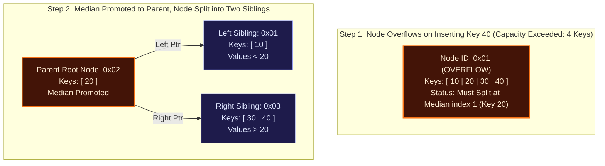

# Module 21: Storage Engine Internals — Slotted Pages, Buffer Pool & B+ Tree from Scratch

> **Brand new to this topic?** Start with [`00_FOUNDATIONS_PLAYGROUND.md`](00_FOUNDATIONS_PLAYGROUND.md) - the same ideas in
> plain language, with runnable standard-library code you can execute right now.
> No Docker, no server, no `pip install`.

Welcome to **Module 21**. In this module, you will master the physical hardware and low-level C-style internals that underpin every relational database on earth: **Fixed-Size Pages, Binary Slotted Page Packing, The Buffer Pool Manager with Pin Counts, and a production-grade $B^+$ Tree implemented from first principles**.

---

## 📄 1. The Slotted Page Physical Architecture

Storage devices (NVMe SSDs, HDDs) do not support byte-level random writes; they operate on fixed block sectors. Database engines standardize on a fixed **Page Size** (PostgreSQL: 8KB, MySQL InnoDB: 16KB, SQLite: 4KB).

### The Variable-Length Tuple Problem
If rows contain variable-length text (`VARCHAR`, `TEXT`, `BLOB`), appending rows sequentially creates fragmentation when rows are updated or deleted. Furthermore, external indexes need a permanent physical address to point to a row.

### The Solution: The Slotted Page Layout
A slotted page splits the 8,192-byte array into two oppositely growing regions:

```
+--------------------------------------------------------------------------------+
| Page Header (Fixed 24 bytes)                                                   |
| - LSN (Log Sequence Number, 8 bytes)                                           |
| - lower_offset (2 bytes, points to end of slot array)                          |
| - upper_offset (2 bytes, points to start of lowest tuple payload)               |
| - tuple_count   (2 bytes)                                                      |
+--------------------------------------------------------------------------------+
| Slot Array (Grows Downward ──► )                                               |
| Slot 0: [Offset: 8120, Length: 72]                                             |
| Slot 1: [Offset: 8040, Length: 80]                                             |
| Slot 2: [Offset: 7950, Length: 90]                                             |
|                                                                                |
| ═════════════════════════ Free Space Window ══════════════════════════════════ |
|                                                                                |
| Tuple 2 Payload (Offset 7950 to 8039)                                          |
| Tuple 1 Payload (Offset 8040 to 8119)                                          |
| Tuple 0 Payload (Offset 8120 to 8191)                                          |
| ( ◄── Grows Upward)                                                            |
+--------------------------------------------------------------------------------+
```

### The Record Identifier (RID) Invariant
A row is permanently identified by its **RID (Record ID) / TID (Tuple ID)**:
$$\text{RID} = (\text{Page ID}, \text{Slot Index})$$
- Even if tuples are compacted, reordered, or defragmented within the page, their byte offsets inside the slot array change, but their **Slot Index never changes**!
- Secondary indexes store `(Key -> RID)` and never need to be updated when pages are defragmented.

---

## 🏊 2. The Buffer Pool Manager & Frame Table

Databases cannot afford to read from disk on every query. The **Buffer Pool** is a contiguous block of RAM divided into an array of fixed-size **Frames**:

```
                       ┌───────────────────────────────┐
                       │   Query / B-Tree Search       │
                       └──────────────┬────────────────┘
                                      │ Requests Page 42
                                      ▼
                        ┌─────────────────────────────┐
                        │   Page Table (Hash Map)     │
                        │   Page 42 ──► Frame Index 3 │
                        └─────────────┬───────────────┘
                                      │
              ┌───────────────────────┴───────────────────────┐
              ▼ Found in RAM                                  ▼ Not in RAM (Page Fault)
     ┌───────────────────┐                         ┌───────────────────┐
     │ Frame 3           │                         │ Evict Unpinned    │
     │ - Pin Count: ++1  │                         │ Frame (CLOCK/LRU) │
     │ - Is Dirty: False │                         │ Load from Disk    │
     └───────────────────┘                         └───────────────────┘
```

### Critical Concurrency Controls
1. **Pin Count (Reference Count)**:
   - When a worker thread reads or modifies a page, it increments `pin_count`.
   - **Rule of Storage Engines**: A page with `pin_count > 0` **CAN NEVER BE EVICTED**. Evicting a pinned page causes immediate memory corruption.
   - When the worker finishes with the page, it unpins it (`pin_count--`).
2. **Dirty Flag**:
   - Set to `True` whenever a page is mutated.
   - If a dirty page is chosen for eviction, the Buffer Pool Manager must synchronously flush its 8KB buffer to disk (`fsync`) before recycling the memory frame.

---

## 🌳 3. The $B^+$ Tree Storage Architecture

<!-- GENERATED_ALGORITHM_DIAGRAM: BTREE_SPLIT START -->



<!-- GENERATED_ALGORITHM_DIAGRAM: BTREE_SPLIT END -->

While B-Trees store data keys and values in all nodes, modern databases exclusively use **$B^+$ Trees**:

```
                              [ Internal Node: (50) ]
                             /                       \
             [ Internal Node: (25) ]           [ Internal Node: (75) ]
            /                       \         /                       \
   [ Leaf: (10, 20) ] ════► [ Leaf: (30, 40) ] ════► [ Leaf: (60, 70) ] ════► [ Leaf: (80, 90) ]
        (RIDs)                   (RIDs)                   (RIDs)                   (RIDs)
```

### Why $B^+$ Trees Outperform Standard B-Trees
1. **Higher Fanout in Internal Nodes**: Internal nodes store *only* search keys and child page pointers (no payload rows). This allows a single 8KB internal page to hold 500+ keys ($M \approx 500$).
   - Height 1: 500 records
   - Height 2: 250,000 records
   - Height 3: 125,000,000 records!
   - Any record in a 100-million row table is reached in **at most 3 I/O hops**!
2. **Doubly-Linked Leaf Chain for Range Scans**:
   - In standard B-Trees, range queries (`WHERE age BETWEEN 20 AND 40`) require expensive in-order tree traversals traversing up and down parents.
   - In a $B^+$ Tree, all leaf pages form a contiguous linked list. The engine finds the lower bound in $O(\log N)$, then simply scans forward along the leaf pointers (`next_leaf`) at raw memory speed!

### Node Splitting & Merging Rules
- **Order $M$**: Maximum children for internal nodes; maximum keys for leaf nodes.
- **Split Condition**: When a node accumulates $M$ keys, it splits into two nodes of size $\lceil M/2 \rceil$.
  - In a leaf split, the middle key is copied up to the parent and preserved in the right child.
  - In an internal split, the middle key is moved up to the parent (not duplicated).
- **Height Growth**: The tree grows in height **only at the root**, maintaining strict balanced depth across all leaves ($O(\log N)$ guarantee).

---

## 🛠️ 4. Hands-On Lab: Building a Complete Storage Engine

In this lab, you will implement:
1. **SlottedPage (8KB Binary)**: Pack and unpack variable-length string payloads into simulated 8,192-byte arrays with slot headers and `RID(page_id, slot_id)`.
2. **DiskManager**: Emulate on-disk page allocation, raw page reads, and page writes.
3. **BufferPoolManager**: Implement frame tables, pin/unpin tracking, dirty page flushing, and the CLOCK replacement eviction policy.
4. **B+ Tree Engine**: Implement a fully functional $B^+$ Tree with node splitting, multi-key lookups, and leaf-chained range scans.

---

## 📂 Project Structure
```
Module_21_Storage_Engine_Internals_BPlus_Trees/
├── README.md
├── 01_slotted_page_and_bplus_tree_demo.py
├── starter/
│   └── storage_engine.py
└── project_solution/
    ├── storage_engine.py
    └── test_storage_engine.py
```

---
## 5. Dual-Track Curriculum: Track A (Simulation) vs Track B (Real Operations)

This module implements a rigorous **dual-track architecture** guaranteeing both first-principles mechanistic understanding and battle-tested production operational skills:

| Dimension | Track A: Mechanistic Model | Track B: Live Engine Operations |
| :--- | :--- | :--- |
| **Location** | `project_solution/storage_engine.py` | `project_solution/*_live.py` |
| **Focus** | Internal algorithms & data structures | Real drivers, pooling, and production operations |
| **Technology** | storage_engine.py (Slotted pages, B+ Tree node splitting) | storage_engine.py (Pure storage engine internals reference) |
| **Verification** | `project_solution/test_storage_engine.py` | `project_solution/test_*_live.py` |
| **Offline Support** | 100% in-process with 0 external dependencies | Safe skips via `@pytest.mark.skipif` when offline |

### Reconciliation Contract
A dedicated reconciliation suite guarantees that the internal algorithmic model and the real live production driver strictly agree on core operational semantics, invariants, and expected outcomes.

---

## 6. Production Failure Modes & Operational Pitfalls

Every production engineer must understand how this database layer fails under extreme stress:

1. Deadlocks in Node Splits: Releasing parent latches before acquiring child latches causing concurrent split corruption.
2. Slotted Page Fragmentation: Deletions creating dead space gaps that exhaust page capacity without defragmentation.
3. Dirty Page Flush Invariant Breach: Writing dirty pages to disk before flushing corresponding WAL log records.

For complete diagnosis runbooks, error codes, and step-by-step resolution strategies, consult:
👉 **[TROUBLESHOOTING_AND_EDGE_CASES.md](06_TROUBLESHOOTING_AND_EDGE_CASES.md)**

---

## 7. When NOT to Use (Trade-offs & Anti-Patterns)

> [!WARNING]
> Architecture is the art of trade-offs. No database technology is universally optimal.

Do NOT implement custom storage engines for general-purpose applications; rely on battle-tested production engines (RocksDB, InnoDB, PostgreSQL).

---

## 8. Essential Production CLI & Query Playbook

Key operational diagnostic commands to verify health and diagnose performance:

```bash
# Verify environment and execute automated test suite
pytest Module_21_Storage_Engine_Internals_BPlus_Trees -v

# Operational Diagnostics & Health Verification
pytest Module_21_Storage_Engine_Internals_BPlus_Trees -v
```

---

## 9. Next Steps & Pedagogical Resources

Accelerate your mastery using the structured pedagogical artifacts in this module:
1. 📓 **[Interactive Jupyter Lab](02_interactive_bplus_trees.ipynb)**: Hands-on sandbox for interactive exploration.
2. 🎯 **[3-Tier Guided Project](04_PROJECT_GUIDE.md)**: Novice, Core, and Architect implementation tracks.
3. 🛠️ **[Troubleshooting Guide](06_TROUBLESHOOTING_AND_EDGE_CASES.md)**: Real production error signatures & fixes.
4. 🧠 **[Self-Assessment Quiz](05_SELF_ASSESSMENT_AND_CHALLENGES.md)**: 10 diagnostic questions + coding challenges.
5. 🔬 **[Debug Lab](debug_lab/)**: Forensic debugging exercise diagnosing real production bugs.

