# The Definitive Database Specialist Roadmap: From Zero to Polyglot Data Architect (0 to 100 Mastery)

This roadmap is an exhaustive, first-principles curriculum designed to take you from a complete beginner to a world-class **Database Specialist, Database Administrator (DBA), and Database Reliability Engineer (DBRE)**.

It covers every major database paradigm across the industry—**Relational OLTP (PostgreSQL, Oracle, MySQL, SQLite)**, **Document (MongoDB)**, **In-Memory & Cache (Redis)**, **Distributed Wide-Column (Cassandra, DynamoDB)**, **Graph (Neo4j)**, **Columnar OLAP (DuckDB, ClickHouse)**, and **Search / Modern AI Vector Databases (Elasticsearch, pgvector, Qdrant)**.

Every database module includes concrete, production-grade **Python integrations** (drivers, async clients, connection pooling, ORMs/ODMs, and raw SQL/command patterns) alongside hands-on projects and storage engine internals.

---

## 🧭 The 8-Phase Architectural Journey

```mermaid
flowchart TD
    subgraph Phase1["Phase 1: Foundations of Storage & SQL (Mod 01 - 03)"]
        M01["Mod 01: Storage Theory & ACID"] --> M02["Mod 02: Advanced Modern SQL & Windows"]
        M02 --> M03["Mod 03: Embedded Engines & SQLite"]
    end

    subgraph Phase2["Phase 2: Open-Source Relational Titans (Mod 04 - 06)"]
        M03 --> M04["Mod 04: PostgreSQL Core & Advanced Types"]
        M04 --> M05["Mod 05: PostgreSQL MVCC & Index Internals"]
        M05 --> M06["Mod 06: MySQL / MariaDB & InnoDB Storage"]
    end

    subgraph Phase3["Phase 3: Enterprise Relational Heavyweight (Mod 07 - 09)"]
        M06 --> M07["Mod 07: Oracle Database Architecture & SGA/PGA"]
        M07 --> M08["Mod 08: Oracle PL/SQL & Packages"]
        M08 --> M09["Mod 09: Oracle RAC, Data Guard & GoldenGate"]
    end

    subgraph Phase4["Phase 4: NoSQL, Document & In-Memory (Mod 10 - 13)"]
        M09 --> M10["Mod 10: MongoDB Document Modeling & BSON"]
        M10 --> M11["Mod 11: MongoDB Aggregations, Sharding & Replicas"]
        M11 --> M12["Mod 12: Redis Data Structures & In-Memory Internals"]
        M12 --> M13["Mod 13: Redis Sentinel, Clustering & Lua"]
    end

    subgraph Phase5["Phase 5: Distributed NoSQL & Graph Systems (Mod 14 - 16)"]
        M13 --> M14["Mod 14: Apache Cassandra Masterless Architecture"]
        M14 --> M15["Mod 15: LSM-Trees, Compaction & AWS DynamoDB"]
        M15 --> M16["Mod 16: Neo4j Graph Databases & Cypher"]
    end

    subgraph Phase6["Phase 6: Analytical Columnar & AI Vector DBs (Mod 17 - 19)"]
        M16 --> M17["Mod 17: Columnar OLAP: DuckDB & ClickHouse"]
        M17 --> M18["Mod 18: Inverted Indexes & Elasticsearch"]
        M18 --> M19["Mod 19: AI Vector DBs: pgvector & Qdrant"]
    end

    subgraph Phase7["Phase 7: DBRE, Storage Internals & Administration (Mod 20 - 23)"]
        M19 --> M20["Mod 20: Storage Engine Internals: B+ Trees vs LSM"]
        M20 --> M21["Mod 21: Query Optimization, CBO & EXPLAIN Plans"]
        M21 --> M22["Mod 22: Isolation Levels, Deadlocks & Raft/Paxos"]
        M22 --> M23["Mod 23: Production DBRE: Backups, Migrations & HA"]
    end

    subgraph Phase8["Phase 8: Grand Master Capstone (Mod 24)"]
        M23 --> M24["Mod 24: Global Polyglot Persistence Enterprise Platform"]
    end
```



---

## 🗺️ Master Curriculum Overview

| Module | Subject Area | Technology | Difficulty | Est. Time | Primary Python Integration |
| :--- | :--- | :--- | :---: | :---: | :--- |
| **Module 01** | Foundations | Storage Theory & Relational Algebra | ★☆☆☆☆ | 4 hrs | Standard Library (`csv`, `json`, `pathlib`) |
| **Module 02** | SQL Mastery | Complex Joins, CTEs & Window Functions | ★★☆☆☆ | 5 hrs | `sqlite3`, SQL terminal |
| **Module 03** | Embedded RDBMS | SQLite & Write-Ahead Logging (WAL) | ★★☆☆☆ | 4 hrs | `sqlite3`, `aiosqlite` |
| **Module 04** | Open-Source RDBMS | PostgreSQL Core, JSONB & Arrays | ★★★☆☆ | 5 hrs | `psycopg3`, `asyncpg` |
| **Module 05** | PostgreSQL Internals | MVCC, Autovacuum, Indexing & EXPLAIN | ★★★★☆ | 6 hrs | `SQLAlchemy 2.0`, `psycopg3` |
| **Module 06** | Open-Source RDBMS | MySQL / MariaDB & InnoDB Storage Engine | ★★★☆☆ | 5 hrs | `mysql-connector-python`, `PyMySQL` |
| **Module 07** | Enterprise RDBMS | Oracle Database Architecture & Memory | ★★★★☆ | 6 hrs | `python-oracledb` (Thin & Thick Mode) |
| **Module 08** | Enterprise RDBMS | Oracle PL/SQL, Packages & Triggers | ★★★★☆ | 6 hrs | `python-oracledb` Procedure Calling |
| **Module 09** | Enterprise HA | Oracle RAC, Data Guard & GoldenGate | ★★★★★ | 6 hrs | `python-oracledb` Connection Pools |
| **Module 10** | Document NoSQL | MongoDB Schema Modeling & BSON | ★★☆☆☆ | 4 hrs | `pymongo`, `beanie` (Pydantic ODM) |
| **Module 11** | Distributed Document | MongoDB Aggregations, Replicas & Shards | ★★★★☆ | 6 hrs | `motor` (Async Mongo) |
| **Module 12** | In-Memory & Cache | Redis Data Structures & Persistence | ★★★☆☆ | 4 hrs | `redis-py` (`redis.asyncio`) |
| **Module 13** | Distributed Cache | Redis Sentinel, Clustering & Lua Scripts | ★★★★☆ | 5 hrs | `redis-py` Pipelines & Lua Scripts |
| **Module 14** | Wide-Column NoSQL | Apache Cassandra Masterless Ring & Gossip | ★★★★☆ | 6 hrs | `cassandra-driver` |
| **Module 15** | Cloud Wide-Column | LSM-Trees, Compaction & AWS DynamoDB | ★★★★☆ | 5 hrs | `boto3`, `aioboto3` |
| **Module 16** | Graph Database | Neo4j, Property Graphs & Cypher | ★★★☆☆ | 5 hrs | `neo4j` Python Driver |
| **Module 17** | Columnar OLAP | DuckDB & ClickHouse Real-Time Analytics | ★★★★☆ | 5 hrs | `duckdb`, `clickhouse-connect` |
| **Module 18** | Analytics Engineering | Dimensional Modelling, SCD2, Materialised Aggregates & Pipelines | ★★★★☆ | 6 hrs | `duckdb` |
| **Module 19** | Search Engines | Elasticsearch / OpenSearch & Inverted Index | ★★★☆☆ | 5 hrs | `elasticsearch-py` |
| **Module 20** | AI & Vector DBs | pgvector, Qdrant & HNSW Vector Indexing | ★★★★☆ | 6 hrs | `qdrant-client`, `pgvector-python` |
| **Module 21** | Engine Internals | B+ Trees, LSM-Trees, Page Formats & WAL | ★★★★★ | 7 hrs | Pure Python Storage Engine Demo |
| **Module 22** | Performance & Tuning | Query Optimizers (CBO), Index Tuning & Cost | ★★★★★ | 7 hrs | Profiling & EXPLAIN Plan Parsers |
| **Module 23** | Concurrency & Consensus | Isolation Levels, 2PL, MVCC & Raft/Paxos | ★★★★★ | 6 hrs | Concurrency Anomaly Simulators |
| **Module 24** | DBRE Administration | Zero-Downtime Migrations, Backups & HA | ★★★★★ | 7 hrs | `alembic`, Backup Automation Scripts |
| **Module 25** | Grand Capstone | Enterprise Polyglot Persistence Platform | ★★★★★ | 18 hrs | Unified FastAPI + Polyglot Async Drivers |

---

## 📖 Phase-by-Phase Deep Curriculum Specification

---

### Phase 1: Foundations of Storage, SQL & The Relational Model (Zero-to-One)

#### Module 01: Storage Theory, File Systems & The Birth of DBMS
* **Conceptual Theory & Mental Models:**
  - The File-System Nightmare: Why storing data in flat files, JSON, or CSVs fails at scale (concurrent write corruption, lack of atomic guarantees, scanning $O(N)$ disks).
  - The Relational Model: Edgar F. Codd’s breakthrough mathematical foundation (Relations, Tuples, Attributes, Domains).
  - The Holy Grail: **ACID Properties** explained with physical banking analogies:
    - **Atomicity:** The "All-or-Nothing" contract.
    - **Consistency:** Preserving invariants and domain constraints.
    - **Isolation:** Concurrency illusion (making concurrent users feel like the sole user).
    - **Durability:** The surviving write (WAL and non-volatile disk flushing).
  - Relational Schema Design & Normalization: 1NF, 2NF, 3NF, and Boyce-Codd Normal Form (BCNF) with real-world decomposition examples.
* **Ways to Use with Python:**
  - Python Standard Library file I/O (`io.BytesIO`, `pathlib`, `struct`).
  - Simulating race conditions and file corruption using Python multi-threading on raw CSV files to experience firsthand why DBMS was invented.
* **Mini Project:** Build a single-file transactional CSV store in Python that enforces table schemas and primary key constraints with a Write-Ahead Log to withstand sudden process termination.

---

#### Module 02: Modern SQL Mastery – From Basics to Advanced Analytical Queries
* **Conceptual Theory & Mental Models:**
  - Declarative vs Imperative programming: Why in SQL you describe *what* you want, not *how* to loop through disks.
  - Core SQL Sublanguages: DDL (Create/Alter), DML (Insert/Update/Delete), DQL (Select), DCL (Grant/Revoke), TCL (Commit/Rollback/Savepoint).
  - Join Mechanics: Inner Join, Left/Right Outer Join, Full Outer Join, Cross Join, Self Join.
  - Subqueries vs Common Table Expressions (CTEs): Recursive CTEs for hierarchical organizational trees and bill-of-materials traversal.
  - **Window Functions Deep Dive:**
    - `ROW_NUMBER()`, `RANK()`, `DENSE_RANK()`, `NTILE()`
    - Value navigation: `LEAD()`, `LAG()`, `FIRST_VALUE()`, `LAST_VALUE()`
    - Moving averages and running totals using `ROWS BETWEEN ... AND ...` frames.
* **Ways to Use with Python:**
  - Executing parameterized SQL queries using standard Python database drivers.
  - Formatting tabular query outputs using `rich` or `tabulate`.
* **Mini Project:** Write a pure SQL financial analytics suite calculating rolling 7-day revenue averages, customer churn cohorts, and ranked product percentiles across 1,000,000 synthetic transaction rows.

---

#### Module 03: Embedded Databases – SQLite & Zero-Config Architecture
* **Conceptual Theory & Mental Models:**
  - Embedded vs Client-Server Architecture: Why SQLite lives inside your application process memory space.
  - The SQLite B-Tree file format and the single-file database design.
  - Concurrency & Locking: Shared vs Reserved vs Exclusive locks.
  - The Rollback Journal vs **Write-Ahead Logging (WAL)**: Why WAL mode (`PRAGMA journal_mode=WAL;`) provides 10x write throughput and non-blocking readers.
  - In-Memory SQLite (`:memory:`) for ultra-fast automated testing suites.
* **Ways to Use with Python:**
  - Standard Library **`sqlite3`**:
    - Connection context managers and transaction control.
    - Registering custom Python functions into SQLite SQL with `conn.create_function()`.
    - Custom row factories (`sqlite3.Row` for dict-like column access).
  - Modern Async SQLite with **`aiosqlite`**: Non-blocking asynchronous query execution within `asyncio` event loops.
* **Mini Project:** Build an embedded desktop caching and audit logging engine in Python with WAL mode enabled, custom Python regex functions registered into SQLite, and automated integrity checks (`PRAGMA integrity_check`).

---

### Phase 2: The Open-Source Relational Titans (PostgreSQL & MySQL)

#### Module 04: PostgreSQL Core Architecture & Advanced Data Types
* **Conceptual Theory & Mental Models:**
  - PostgreSQL process model: Postmaster, backend worker processes, shared memory architecture.
  - Beyond standard SQL primitives:
    - **JSONB (Binary JSON):** Internal storage layout, decomposition, indexing nested fields.
    - **Arrays:** 1D and multi-dimensional array operations (`ANY`, `@>`, `&&`).
    - **UUIDs:** UUIDv4 vs UUIDv7 (time-ordered sequential UUIDs for optimal B-Tree locality).
    - **Range Types:** `daterange`, `tsrange` and overlapping exclusions with `GiST`.
    - **Full-Text Search:** `to_tsvector()`, `to_tsquery()`, GIN indexes, ranking with `ts_rank()`.
* **Ways to Use with Python:**
  - Modern **`psycopg` (v3)**:
    - Native Python type adaptation (dict $\rightarrow$ JSONB, list $\rightarrow$ array).
    - High-performance binary copy protocol using `cursor.copy()` for 100,000+ rows/sec ingestion.
    - Asynchronous connection pooling with `psycopg_pool.AsyncConnectionPool`.
  - **`asyncpg`**: Ultra-fast async driver implementing the PostgreSQL binary frontend/backend protocol directly.
* **Mini Project:** Build a multi-tenant e-commerce catalog API in Python supporting polymorphic product attributes using PostgreSQL `JSONB`, stock availability reservations using timestamp range exclusions, and instant full-text product search.

---

#### Module 05: PostgreSQL Internals – MVCC, Vacuuming & Index Engineering
* **Conceptual Theory & Mental Models:**
  - **Multi-Version Concurrency Control (MVCC) Internals:**
    - Tuple header layout: `xmin`, `xmax`, `t_ctid`, infomask flags.
    - Snapshot isolation mechanics: Determining tuple visibility without read locks.
    - Dead tuples, table bloat, and the **VACUUM** / **Autovacuum** daemon.
    - Transaction ID Wraparound and frozen transactions (`VACUUM FREEZE`).
  - **The 5 Major PostgreSQL Index Types:**
    - **B-Tree:** Default balanced tree for equality and range queries.
    - **Hash:** $O(1)$ equality lookups.
    - **GIN (Generalized Inverted Index):** Indexing composite values, JSONB, arrays, and text.
    - **GiST (Generalized Search Tree):** Geometric shapes, range types, and nearest-neighbor search.
    - **BRIN (Block Range Index):** Extremely lightweight indexing for multi-gigabyte time-series data.
  - **Reading Execution Plans:**
    - Deciphering `EXPLAIN (ANALYZE, BUFFERS, FORMAT JSON)`.
    - Sequential Scan vs Index Scan vs Index Only Scan vs Bitmap Index Scan.
    - Join algorithms: Nested Loop Join vs Hash Join vs Merge Join.
* **Ways to Use with Python:**
  - Automated query plan analyzer in Python: Parsing `EXPLAIN (FORMAT JSON)` outputs to detect table scans, high buffer hit misses, and missing indexes.
  - Modern ORM integration with **`SQLAlchemy 2.0`** (Mapped columns, eager loading strategies: `selectinload` vs `joinedload`).
* **Mini Project:** Build a PostgreSQL Performance Profiling CLI tool in Python that monitors table bloat via system catalogs (`pg_stat_user_tables`, `pg_statio_user_tables`), detects missing indexes, and visualizes slow query flamegraphs.

---

#### Module 06: MySQL / MariaDB Architecture & The InnoDB Engine
* **Conceptual Theory & Mental Models:**
  - MySQL Server Architecture: Connection pooler, SQL parser, optimizer, pluggable storage engines.
  - **The InnoDB Storage Engine Deep Dive:**
    - Tablespaces (`ibdata1`, `.ibd` per-table tablespaces).
    - The InnoDB Buffer Pool: Dirty pages, LRU eviction algorithm, flush lists.
    - Redo Log (WAL for crash recovery) vs Undo Log (MVCC and transaction rollback).
    - Clustered Index (Primary Key organizes table rows physically) vs Secondary Indexes (point to primary key).
  - MySQL Replication Architecture:
    - Binary Log (Binlog): Statement-based vs Row-based vs Mixed formats.
    - Asynchronous vs Semi-Synchronous replication topologies.
    - GTID (Global Transaction Identifiers) for seamless failovers.
* **Ways to Use with Python:**
  - **`mysql-connector-python`** & **`PyMySQL`**: Establishing robust connection pools, SSL verification, and auto-reconnection decorators.
  - **`asyncmy`**: High-concurrency async MySQL driver for FastAPI/asyncio.
  - Reading the MySQL Binlog in real-time in Python using `python-mysql-replication` (Change Data Capture - CDC).
* **Mini Project:** Build a real-time CDC (Change Data Capture) event streamer in Python that listens to the MySQL binlog and replicates row changes in sub-milliseconds to an in-memory cache.

---

### Phase 3: The Enterprise Relational Heavyweight (Oracle Database)

#### Module 07: Oracle Database Architecture, Memory & Storage Hierarchy
* **Conceptual Theory & Mental Models:**
  - Oracle's Dual Structure: The **Instance** (Memory + Background Processes) vs The **Database** (Physical Files on Disk).
  - **System Global Area (SGA) Memory Architecture:**
    - Database Buffer Cache: Caching data blocks from disk.
    - Shared Pool: Library Cache (SQL execution plans) and Data Dictionary Cache.
    - Redo Log Buffer: In-memory write buffer before disk flushing.
    - Large Pool & Java/Streams Pool.
  - **Program Global Area (PGA):** Private memory allocated per server process (Sort areas, hash join work areas).
  - **Key Background Processes:**
    - `DBWn` (Database Writer): Writes dirty buffers to datafiles.
    - `LGWR` (Log Writer): Writes redo log entries to disk during `COMMIT`.
    - `CKPT` (Checkpoint): Synchronizes headers and flushes dirty blocks.
    - `SMON` (System Monitor): Instance recovery on crash startup.
    - `PMON` (Process Monitor): Cleans up failed user sessions.
  - **Storage Hierarchy:**
    - Database $\rightarrow$ Tablespaces (SYSTEM, SYSAUX, UNDO, TEMP, USERS) $\rightarrow$ Segments $\rightarrow$ Extents $\rightarrow$ Oracle Data Blocks (typically 8KB).
  - **Oracle Multitenant Architecture:** Container Database (CDB) and Pluggable Databases (PDBs).
* **Ways to Use with Python:**
  - Modern **`python-oracledb`** (the official successor to `cx_Oracle`):
    - **Thin Mode:** 100% pure Python, zero Oracle Client libraries or Instant Client installation required! Connects directly to the Oracle TNS listener.
    - **Thick Mode:** When advanced enterprise features (like Oracle Advanced Security, TAF, or continuous query notifications) are required.
    - Basic connection and session initialization.
* **Mini Project:** Write an automated Oracle Instance Health & Tablespace Monitor in Python using `python-oracledb` that queries `V$INSTANCE`, `V$SGA`, `DBA_TABLESPACES`, and alerts when tablespaces exceed 85% utilization.

---

#### Module 08: Oracle PL/SQL Programming & Advanced Features
* **Conceptual Theory & Mental Models:**
  - PL/SQL Engine Architecture: Procedural statements executed by the PL/SQL runtime; SQL forwarded to the SQL engine.
  - Core PL/SQL Constructs: Anonymous blocks, Stored Procedures, Stored Functions, Packages (Specification vs Body), Database Triggers.
  - Bulk Processing for Enterprise Speed: `BULK COLLECT` and `FORALL` statements (eliminating context switching between PL/SQL and SQL engines).
  - Autonomous Transactions: `PRAGMA AUTONOMOUS_TRANSACTION` for audit logging that persists even if the main transaction rolls back.
  - Advanced Data Types in Oracle: CLOB, BLOB, BFILE, `SYS_REFCURSOR`, Record Types, Associative Arrays.
* **Ways to Use with Python:**
  - Executing stored procedures with `cursor.callproc()` using input and output parameters (`cursor.var()`).
  - Handling `SYS_REFCURSOR` returned from PL/SQL functions directly into Python dictionaries.
  - Streaming large LOBs (CLOB / BLOB) in Python chunks without loading gigabytes into RAM.
* **Mini Project:** Build an enterprise payroll calculation pipeline: Write an Oracle PL/SQL package with bulk-collect tax deductions, and build a Python interface that executes the package, streams employee payment slips as PDF BLOBs, and captures audit metrics.

---

#### Module 09: Oracle High Availability, RAC, Data Guard & GoldenGate
* **Conceptual Theory & Mental Models:**
  - **Oracle Real Application Clusters (RAC):**
    - Shared-everything architecture: Multiple instances accessing one shared database on SAN/NAS storage.
    - Oracle Grid Infrastructure, Automatic Storage Management (ASM), and Cache Fusion (inter-instance block transfers over high-speed interconnect).
  - **Oracle Data Guard:**
    - Primary Database vs Standby Databases (Physical Standby vs Active Data Guard for read-only reporting).
    - Redo transport services, apply services, switchover (planned maintenance) vs failover (unplanned disaster recovery).
  - **Oracle GoldenGate:** Real-time log-based Change Data Capture (CDC) and heterogeneous data replication.
  - **Oracle Flashback Technology:** Flashback Query (`AS OF TIMESTAMP`), Flashback Table, Flashback Drop (Recycle Bin).
* **Ways to Use with Python:**
  - Enterprise connection pooling in Python: Configuring `python-oracledb.create_pool()` with Fast Application Notification (FAN) and Transparent Application Failover (TAF) to survive RAC node crashes seamlessly.
  - Flashback querying in Python to audit historical changes without restoring backups.
* **Mini Project:** Implement a high-availability banking ledger client in Python that connects to an Oracle RAC cluster with automated connection drain/failover retry policies, verifying zero transaction loss during simulated node maintenance.

---

### Phase 4: NoSQL, Document Stores & High-Speed In-Memory Caching (MongoDB & Redis)

#### Module 10: MongoDB Document Modeling & BSON Internals
* **Conceptual Theory & Mental Models:**
  - The Document Model: JSON vs **BSON (Binary JSON)** (type support for Date, ObjectId, Int32/Int64, Decimal128, Binary data).
  - Schema Design Philosophy: Normalization vs Denormalization (Embedding vs Referencing).
  - The 1:1, 1:N, and N:M modeling patterns in MongoDB:
    - Embedding for atomic updates and low-latency single-document reads.
    - Referencing with manual populates or DBRefs to prevent unbounded document growth (the 16MB document limit).
  - Schema Validation: Enforcing JSON Schema rules at the database level with `$jsonSchema`.
  - MongoDB Indexing: Compound indexes (the Equality-Sort-Range / ESR rule), Partial indexes, Sparse indexes, TTL indexes (auto-expiring cache documents).
* **Ways to Use with Python:**
  - **`pymongo`**: Establishing resilient client connections, `MongoClient` connection pooling, querying with filter dictionaries.
  - **`beanie`**: Modern async ODM for MongoDB built on top of **Pydantic V2** and Motor, providing strict type-safety, automatic validations, and active-record querying.
* **Mini Project:** Build a high-volume IoT telemetry ingestion service in Python using MongoDB, utilizing TTL indexes for automated 30-day data eviction and compound ESR indexes for millisecond sensor queries.

---

#### Module 11: MongoDB Aggregation Pipeline, Replica Sets & Sharding
* **Conceptual Theory & Mental Models:**
  - **The Aggregation Pipeline:**
    - Pipeline stages: `$match`, `$project`, `$group`, `$sort`, `$limit`, `$unwind`, `$lookup` (Left Outer Join), `$facet` (multi-faceted search).
    - Memory limits in aggregations (100MB RAM limit per stage) and using `allowDiskUse`.
  - **WiredTiger Storage Engine Internals:**
    - Memory cache, checkpointing (every 60s), and compression (snappy, zlib).
  - **High Availability – Replica Sets:**
    - Primary, Secondary, and Arbiter nodes.
    - Raft-like election algorithm, heartbeat monitoring, and the Write Concern (`w: 1`, `w: "majority"`, `j: true`) and Read Concern (`local`, `majority`, `linearizable`).
    - The `oplog` (Operations Log) for replication.
  - **Horizontal Scalability – Sharding:**
    - Architecture: `mongos` query routers, Config Servers, Shard nodes.
    - Shard Keys: Ranged vs Hashed sharding. Chunk balancing, chunk splitting, and avoiding hot-spot shards.
* **Ways to Use with Python:**
  - **`motor`**: High-throughput async MongoDB driver for asyncio runtimes.
  - Running complex multi-stage aggregation pipelines in Python with type-safe schema parsing.
  - MongoDB Change Streams (`watch()` API) in Python for real-time document change listening.
* **Mini Project:** Build a real-time multi-stage financial analytics pipeline using MongoDB Aggregations, and connect an async Python listener to MongoDB Change Streams to publish live notifications on high-value orders.

---

#### Module 12: Redis Architecture, In-Memory Data Structures & Persistence
* **Conceptual Theory & Mental Models:**
  - Why In-Memory? RAM latency (~100 nanoseconds) vs NVMe SSD latency (~100 microseconds).
  - The Single-Threaded Event Loop: Why Redis is single-threaded for command execution (zero thread-context switching, zero lock overhead) and handles 100,000+ QPS.
  - **The Core Redis Data Structures:**
    - **Strings:** Binary-safe text, numbers, bit operations, string caches.
    - **Hashes:** Field-value pairs (ideal for user profiles and entity states).
    - **Lists:** Linked lists for FIFO message queues (`LPUSH`, `RPOP`, `BRPOP`).
    - **Sets:** Unordered unique collections, set intersections, union, difference.
    - **Sorted Sets (ZSET):** SkipList + Hash table implementation; sorted by score in $O(\log N)$ (ideal for leaderboards, rate limiters, priority queues).
    - **Bitmaps & HyperLogLog:** Probabilistic cardinality counting (100 million unique visitors counted with 12KB RAM!).
    - **Redis Streams:** Append-only log with consumer groups (Kafka-like mechanics in Redis).
  - **Persistence Mechanics:**
    - **RDB (Redis Database Snapshot):** Point-in-time binary snapshot using `fork()` copy-on-write.
    - **AOF (Append-Only File):** Log every write command (`appendfsync`: `always`, `everysec`, `no`).
* **Ways to Use with Python:**
  - **`redis-py`** (modern v5+ with unified sync and `redis.asyncio`):
    - Connection pooling (`ConnectionPool.from_url()`).
    - String, Hash, and Sorted Set operations.
    - Sliding Window Rate Limiter using Redis Sorted Sets in Python.
* **Mini Project:** Build a distributed API Rate Limiter and Real-Time Gaming Leaderboard in Python using Redis Sorted Sets (`ZADD`, `ZREVRANGEBYSCORE`, `ZREVRANK`) with sub-millisecond response latency.

---

#### Module 13: Redis Sentinel, Clustering & Lua Scripting
* **Conceptual Theory & Mental Models:**
  - High Availability with **Redis Sentinel:**
    - Monitoring, notification, automatic master failover, and configuration provider.
    - Quorum voting and split-brain prevention.
  - Horizontal Scalability with **Redis Cluster:**
    - Distributed hash slot architecture: 16,384 slots partitioned across master nodes.
    - CRC16 hashing of keys (`CRC16(key) % 16384`).
    - Hash Tags (`{user:100}:profile` and `{user:100}:orders`) to guarantee multi-key operations land on the same node.
  - **Atomic Transactions & Lua Scripting:**
    - Why `MULTI`/`EXEC` cannot perform conditional logic based on intermediate query results.
    - Writing atomic Lua scripts executed directly inside the Redis engine.
* **Ways to Use with Python:**
  - Registering and executing custom Lua scripts in Python with `r.register_script()`.
  - Redis Sentinel and Redis Cluster client initialization with automatic failover tracking.
  - Distributed Locking with the Redlock algorithm using Python.
* **Mini Project:** Implement a bulletproof **Distributed Lock & Atomic Inventory Deduction Engine** in Python using Redis Lua scripts, guaranteeing zero overselling under 5,000 concurrent purchase requests.

---

### Phase 5: Distributed NoSQL, Wide-Column & Graph Databases (Cassandra, DynamoDB, Neo4j)

#### Module 14: Apache Cassandra / ScyllaDB & Masterless Architecture
* **Conceptual Theory & Mental Models:**
  - The Masterless Peer-to-Peer Ring: Every node is identical; zero single point of failure (SPOF).
  - **Consistent Hashing & Partitioning:**
    - Partitioner (Murmur3Partitioner) maps row partition keys to a 64-bit integer ring.
    - Virtual Nodes (vnodes) for uniform data distribution across physical hardware.
  - **Replication & Gossip Protocol:**
    - Gossip protocol for decentralized cluster state and node discovery.
    - NetworkTopologyStrategy for multi-datacenter rack awareness.
  - **Tunable Consistency & The CAP Theorem:**
    - Write Consistency: `ANY`, `ONE`, `QUORUM`, `LOCAL_QUORUM`, `ALL`.
    - Read Consistency: `ONE`, `QUORUM`, `LOCAL_QUORUM`, `ALL`.
    - Strong Consistency Formula: $R + W > N$ (Read consistency + Write consistency > Replication Factor).
* **Ways to Use with Python:**
  - **`cassandra-driver`** (DataStax official driver):
    - Cluster connection policies, load balancing policies (RoundRobin, DCAwareRoundRobin).
    - Executing prepared statements (`session.prepare()`) for fast execution and query caching.
    - Custom row mappers and asynchronous paging.
* **Mini Project:** Build a high-throughput financial audit event logger in Python that writes 50,000 audit records/sec across a simulated multi-node Cassandra cluster with `LOCAL_QUORUM` consistency.

---

#### Module 15: LSM-Tree Storage Internals & Cloud AWS DynamoDB
* **Conceptual Theory & Mental Models:**
  - **Log-Structured Merge Tree (LSM-Tree) Internals:**
    - Write Path: Write to sequential CommitLog on disk $\rightarrow$ Write to in-memory **Memtable** $\rightarrow$ Acknowledge write (lightning-fast sequential writes!).
    - Flush Path: Memtable reaches threshold $\rightarrow$ Flushed to immutable **SSTables** (Sorted String Tables) on disk.
    - Read Path: Memtable $\rightarrow$ Key Cache $\rightarrow$ **Bloom Filter** (probabilistic check to avoid disk reads) $\rightarrow$ SSTables.
    - Compaction Strategies: Size-Tiered Compaction (STCS), Leveled Compaction (LCS), Time-Window Compaction (TWCS).
    - Tombstones: Why deleting in Cassandra is actually an insert of a tombstone marker.
  - **Cloud Managed Wide-Column: AWS DynamoDB:**
    - Partition Keys (HASH) vs Composite Keys (HASH + RANGE).
    - Global Secondary Indexes (GSI) vs Local Secondary Indexes (LSI).
    - Read/Write Capacity Units (RCU / WCU) vs On-Demand capacity.
    - DynamoDB Streams for event-driven serverless architectures.
* **Ways to Use with Python:**
  - **`boto3`** & **`aioboto3`**: Interfacing with DynamoDB in Python.
  - Python query optimization: Using key expressions vs filter expressions.
  - Handling pagination with `LastEvaluatedKey`.
* **Mini Project:** Design a global user session management service in Python utilizing AWS DynamoDB with composite partition/sort keys, TTL automated session expiration, and GSI queries.

---

#### Module 16: Graph Databases – Neo4j, Property Graphs & Cypher
* **Conceptual Theory & Mental Models:**
  - Relational Joins vs Graph Traversals: Why joining 5 tables in SQL causes combinatorial explosion ($O(N^K)$), while graph traversal is $O(1)$ per hop.
  - **Index-Free Adjacency:** Nodes maintain direct physical pointers in memory to their neighbor nodes.
  - **The Labeled Property Graph Model:**
    - Nodes (entities with labels, e.g. `:User`, `:Company`).
    - Relationships (directed, typed connections, e.g. `[:WORKS_AT]`, `[:FOLLOWS]`).
    - Properties (key-value pairs stored on both nodes and relationships).
  - **Cypher Query Language Mastery:**
    - Pattern matching syntax: `MATCH (u:User)-[:FRIENDS_WITH]->(f:User) WHERE u.id = $id RETURN f.name`
    - Aggregations, collections (`collect()`), and path navigation (`[:PARENT_OF*1..3]`).
  - Graph Algorithms: Shortest Path, PageRank, Community Detection (Louvain algorithm).
* **Ways to Use with Python:**
  - **`neo4j`** official driver:
    - Driver lifecycle, connection pools, and transactional sessions (`session.execute_read()`, `session.execute_write()`).
    - Parameterized Cypher queries (preventing Cypher injection).
* **Mini Project:** Build a **Financial Fraud Rings & Social Recommendation Engine** in Python using Neo4j that identifies circular transaction loops (money laundering patterns) and recommends friends-of-friends in under 5 milliseconds.

---

### Phase 6: Analytical Columnar OLAP, Search & Modern AI Vector Databases

#### Module 17: Columnar OLAP – DuckDB & ClickHouse for Fast Analytics
* **Conceptual Theory & Mental Models:**
  - OLTP (Online Transaction Processing) vs OLAP (Online Analytical Processing):
    - Row-Oriented Storage (PostgreSQL/MySQL): Reads entire row into memory; great for single-record CRUD; disastrous for summing 1 column across 50,000,000 rows.
    - Column-Oriented Storage: Stores each column contiguously on disk; reads only the queried columns; massive data compression (10x reduction via RLE and Dictionary encoding).
  - **DuckDB (The "SQLite of Analytics"):**
    - In-process vectorized query execution engine, zero external server dependency.
    - Direct querying of Parquet, CSV, JSON files, and memory DataFrames without ingestion.
  - **ClickHouse (Petabyte-Scale Distributed Columnar DBMS):**
    - The MergeTree engine family (`ReplacingMergeTree`, `SummingMergeTree`, `AggregatingMergeTree`).
    - Primary keys are sparse indexes (not unique!). Data partitioned and sorted physically by primary key.
* **Ways to Use with Python:**
  - **`duckdb`**: Direct zero-copy integration with Python, querying Arrow and Pandas/Polars DataFrames using standard SQL.
  - **`clickhouse-connect`**: High-speed binary protocol client for ClickHouse in Python.
* **Mini Project:** Build a high-speed log aggregation & telemetry dashboard in Python that uses DuckDB to query 10,000,000 rows of Parquet files in under 200 milliseconds, outputting instant analytical summaries.

---

#### Module 18: Analytics Engineering – Dimensional Modelling, SCD2 & Pipelines

Module 17 gives you an engine that scans a billion rows quickly. This module is
about what you put in it, and how the data arrives every night without lying
about history.

The governing requirement: **re-running any partition must produce identical
numbers.** That single property rules out the naive implementation of almost
every component here, and it is what separates a warehouse from a pile of
tables.

- **Star schemas and grain.** Why analytics deliberately denormalises what
  Module 01 taught you to normalise, and why an undeclared fact grain makes
  every `SUM` wrong with nothing to find.
- **Slowly Changing Dimensions.** Type 1 vs Type 2, tracked vs untracked
  attributes, the `9999-12-31` sentinel, and the closed-interval convention
  whose off-by-one double-counts one day per change per key.
- **The as-of join.** A fact must join to the dimension version current *when
  the event happened*. Resolving `current()` instead is the most common
  dimensional-modelling defect in production, and it stays dormant until the
  first backfill — which is exactly why it ships.
- **Materialised aggregates.** Full vs watermark-incremental refresh, and the
  additive-measure constraint that makes a merged `COUNT(DISTINCT)` wrong and
  plausible.
- **Pipeline orchestration.** Kahn ordering, cycle detection, run-key
  idempotency — and its harder half, never recording failed work as complete.
- **Watermarks and backfills.** Advancing to the max *observed* value, and why
  advancing to `now()` loses rows permanently with no error to alert on.

Built twice — by hand in memory, and in real embedded DuckDB — with a
reconciliation test asserting the two agree. DuckDB needs no Docker, so these
tests never skip.

**Tools:** `duckdb`
**Deliverable:** an SCD2 warehouse whose nightly load is idempotent, plus a
debug lab containing six defects that all exit 0.

#### Module 19: Search Engines – Elasticsearch / OpenSearch & Inverted Indexes
* **Conceptual Theory & Mental Models:**
  - Why relational B-Trees fail at fuzzy text search: `LIKE '%query%'` requires full table scans.
  - **The Inverted Index:** Mapping tokens/words to document IDs (like an index at the back of a book).
  - **The Lucene Architecture:** Segments, immutable segment files, merge policies, commit points.
  - **Text Analysis Pipeline:** Character Filters $\rightarrow$ Tokenizer $\rightarrow$ Token Filters (Lowercase, Stopwords, Stemming/Snowball).
  - Relevance Scoring: TF-IDF vs modern **BM25** (Best Matching 25) algorithm.
* **Ways to Use with Python:**
  - **`elasticsearch`** official client:
    - Index creation with custom analyzers and mappings.
    - High-volume batch ingestion with `elasticsearch.helpers.bulk()`.
    - Executing complex multi-match queries, fuzzy queries, and aggregation aggregations.
* **Mini Project:** Build an enterprise e-commerce search engine in Python featuring autocomplete, typo tolerance (fuzzy Levenshtein matching), category facet aggregations, and price filtering over 250,000 items.

---

#### Module 20: Modern AI Vector Databases – `pgvector` & Dedicated Vector DBs (Qdrant)
* **Conceptual Theory & Mental Models:**
  - What is an Embedding? Transforming text, images, or audio into high-dimensional vectors (e.g., 1536 floating-point numbers).
  - High-Dimensional Geometry & Distance Metrics:
    - Euclidean Distance ($L_2$)
    - Dot Product
    - **Cosine Similarity** ($\cos(\theta) = \frac{A \cdot B}{\|A\| \|B\|}$)
  - The Curse of Dimensionality and Approximate Nearest Neighbor (ANN) Search:
    - Flat Index: Exact search, $O(N)$ scan (too slow for millions of vectors).
    - **IVFFlat (Inverted File Index):** Clusters vectors into Voronoi cells.
    - **HNSW (Hierarchical Navigable Small World graphs):** Multi-layer graph index providing $O(\log N)$ search speed and 98%+ recall accuracy.
  - Comparing `pgvector` (PostgreSQL extension) vs Dedicated Vector Databases (Qdrant, Milvus, Chroma).
* **Ways to Use with Python:**
  - **`pgvector-python`** with SQLAlchemy and asyncpg.
  - **`qdrant-client`**: Collection management, vector upserts, hybrid search (combining dense vector embeddings with sparse keyword filters).
* **Mini Project:** Build an **Intelligent Semantic Document Search & RAG Pipeline** in Python using Qdrant and `pgvector`, comparing query latency, memory consumption, and recall accuracy across IVFFlat and HNSW vector index configurations.

---

### Phase 7: Database Reliability Engineering (DBRE), Storage Internals & Production Administration

#### Module 21: Storage Engine Internals – B+ Trees, LSM-Trees & Page Layouts
* **Conceptual Theory & Mental Models:**
  - Physical Disk Mechanics: Hard Disks (HDDs) vs Solid-State Drives (SSDs) vs NVMe. Sequential vs Random I/O.
  - **B+ Tree Storage Engine Architecture:**
    - Node structure: Internal router nodes vs Leaf nodes with sibling pointers.
    - Node splitting ($B/2$ overflow) and node merging ($B/2$ underflow).
    - Page Layout: Slotted page architecture (Header, Line Pointers, Free Space, Row Data).
  - **B+ Tree vs LSM-Tree Comparison Matrix:**
    - Read Amplification, Write Amplification, and Space Amplification.
    - Why B+ Trees excel at point and range reads (OLTP), while LSM-Trees excel at write-heavy workloads.
  - The ARIES Recovery Algorithm: Analysis, Redo, Undo passes for database crash recovery.
* **Ways to Use with Python:**
  - Building a functional, in-memory and disk-persisted B+ Tree from scratch in Python to demystify page splitting and binary pointer lookups.
* **Mini Project:** Build a mini single-file B+ Tree indexed key-value storage engine in pure Python with 4KB slotted page management, demonstrating insertion, binary search, and leaf node splitting.

---

#### Module 22: Query Optimization, Cost-Based Optimizers & Index Tuning
* **Conceptual Theory & Mental Models:**
  - Query Lifecycle: Query $\rightarrow$ Lexical Analysis / Parsing $\rightarrow$ Semantic Analysis $\rightarrow$ Query Rewriter $\rightarrow$ Cost-Based Optimizer (CBO) $\rightarrow$ Physical Execution Engine.
  - Cost Estimation Mechanics:
    - Disk I/O cost vs CPU cost.
    - Table Statistics: Cardinality, selectivity, histograms, null fractions (`ANALYZE`).
  - Index Design Strategies:
    - The Composite Index Column Order Rule (Prefix matching).
    - Covering Indexes: Eliminating table lookups completely via `INCLUDE` columns.
    - Partial / Filtered Indexes: Indexing only active records (`WHERE status = 'active'`).
    - Preventing Index Invalidation: Why `WHERE UPPER(email) = ...` or `WHERE year + 1 = ...` ignores standard B-Tree indexes, and how Functional/Expression Indexes fix it.
* **Ways to Use with Python:**
  - Automated Slow Query Log Parser in Python: Ingesting MySQL / PostgreSQL slow query logs, grouping queries by normalized fingerprint, and generating index recommendation reports.
* **Mini Project:** Given a deliberately slow, unindexed database with 5,000,000 rows, use Python benchmarking and `EXPLAIN (ANALYZE, BUFFERS)` to diagnose bottlenecks and tune queries from 4.2 seconds down to 3 milliseconds.

---

#### Module 23: Transactions, Isolation Levels, Deadlocks & Distributed Consensus
* **Conceptual Theory & Mental Models:**
  - **The 4 ANSI SQL Transaction Isolation Levels:**
    1. Read Uncommitted
    2. Read Committed
    3. Repeatable Read
    4. Serializable
  - **The Concurrency Phenomena & Anomalies:**
    - Dirty Reads, Non-Repeatable Reads, Phantom Reads, Lost Updates, **Write Skew**.
  - How Engines Enforce Isolation:
    - Pessimistic Concurrency Control: **Two-Phase Locking (2PL)**, Shared (S) locks, Exclusive (X) locks, Strict 2PL.
    - Optimistic Concurrency Control (OCC) & Serializable Snapshot Isolation (SSI).
  - Deadlocks: Wait-For Graphs, Cycle Detection algorithms, and Deadlock resolution policies.
  - Distributed Transactions: Two-Phase Commit (2PC) protocol, distributed deadlocks, and Distributed Consensus (**Raft** and **Paxos** algorithms).
* **Ways to Use with Python:**
  - Concurrency testing suite in Python: Spawning parallel worker threads to intentionally reproduce Write Skew, Dirty Reads, and Deadlocks, verifying how different isolation levels protect state.
* **Mini Project:** Build an automated transaction isolation test suite in Python that stresses an e-commerce inventory balance under 100 concurrent workers, detecting and logging every concurrency anomaly.

---

#### Module 24: Production DBRE – Backups, Migrations, Pooling & High Availability
* **Conceptual Theory & Mental Models:**
  - Disaster Recovery & Backup Engineering:
    - Physical Backups (`pg_basebackup`, Oracle RMAN) vs Logical Backups (`pg_dump`, `mysqldump`).
    - Write-Ahead Log Archiving & Point-In-Time Recovery (PITR) to restore data to a specific second before a catastrophic `DROP TABLE`.
  - Zero-Downtime Schema Migration Architecture:
    - The **Expand and Contract** (Parallel Run) migration pattern.
    - Adding non-null columns without locking tables.
    - Creating indexes concurrently (`CREATE INDEX CONCURRENTLY` in Postgres).
  - Database Connection Pooling:
    - Why connecting to a database is expensive (TCP handshake, SSL negotiation, authentication, backend process allocation).
    - Client-side pooling vs Server-side proxy poolers (**PgBouncer**, **ProxySQL**).
    - Session Pooling vs Transaction Pooling vs Statement Pooling.
* **Ways to Use with Python:**
  - Schema migration automation using **`alembic`** with async SQLAlchemy.
  - Automated disaster recovery test runner in Python that provisions a test container, restores the latest backup and WAL archives, and verifies database integrity.
* **Mini Project:** Build a zero-downtime database migration and automated backup runner in Python that verifies schema migrations under continuous high-concurrency traffic without taking table locks or dropping requests.

---

### Phase 8: The Polyglot Persistence Architecture Capstone

#### Module 25: Global Enterprise Polyglot Persistence Platform (Grand Capstone)
* **The Real-World Architectural Challenge:**
  Enterprise software rarely relies on a single database. Modern hyperscale architectures use **Polyglot Persistence**—matching each business workload with its mathematically optimal database engine.
* **The Platform Architecture:**
  You will design, implement, test, and containerize a distributed, multi-tenant financial and e-commerce platform orchestrating **8 specialized databases**:

```
                              ┌────────────────────────────────────────────────┐
                              │           FastAPI Async Application            │
                              │           (Python Service Gateway)             │
                              └───────┬──────┬──────┬──────┬──────┬──────┬──────┘
                                      │      │      │      │      │      │
       ┌──────────────────────────────┼──────┼──────┼──────┼──────┼──────┼──────────────────────────────┐
       │                              │      │      │      │      │      │                              │
┌──────▼───────┐               ┌──────▼──────▼┐  ┌──▼──────▼───┐  │  ┌───▼────────┐              ┌──────▼──────┐
│  PostgreSQL  │               │    Oracle    │  │   MongoDB   │  │  │    Redis   │              │   Neo4j     │
│  (ACID Core  │               │  Enterprise  │  │(Polymorphic │  │  │ (In-Memory │              │  (Fraud &   │
│   Ledger)    │               │ ERP / Supply)│  │ Catalog)    │  │  │  Lock/Cache│              │ Social Ring)│
└──────────────┘               └──────────────┘  └─────────────┘  │  └────────────┘              └─────────────┘
                                                                  │
                                      ┌───────────────────────────┴──────────────────────────────┐
                               ┌──────▼──────┐                                            ┌──────▼──────┐
                               │  Cassandra  │                                            │  DuckDB /   │
                               │(IoT Events &│                                            │ ClickHouse  │
                               │ Clickstream)│                                            │ (Analytics) │
                               └─────────────┘                                            └─────────────┘
```

1. **PostgreSQL (`asyncpg` / `SQLAlchemy 2.0`):** Handles core user accounts, wallets, and double-entry financial ledgers with strict ACID transactions and serialized isolation.
2. **Oracle Database (`python-oracledb`):** Integrates with enterprise ERP inventory and supplier contracts via PL/SQL package execution.
3. **MongoDB (`beanie` / `motor`):** Houses polymorphic product catalogs, arbitrary vendor schemas, and nested customer review documents.
4. **Redis (`redis.asyncio`):** Manages sub-millisecond distributed locks, active user sessions, and high-speed purchase rate limiting.
5. **Apache Cassandra / DynamoDB (`cassandra-driver` / `boto3`):** High-velocity append-only IoT telemetry and clickstream event ingestion.
6. **Neo4j (`neo4j`):** Maps transaction networks to detect fraudulent laundering rings and generate graph-based recommendations.
7. **DuckDB / ClickHouse (`duckdb` / `clickhouse-connect`):** Streams billions of historical events for real-time executive analytical dashboards.
8. **Qdrant / `pgvector` (`qdrant-client`):** Semantic AI product search with HNSW vector indexing.
* **Deliverables:**
  - A production-ready GitHub repository with multi-stage Docker Compose orchestration.
  - Python async API gateway coordinating all 8 databases.
  - Comprehensive automated integration test suite (`pytest`) verifying transactional consistency across databases, failover recovery, and latency benchmarks.
