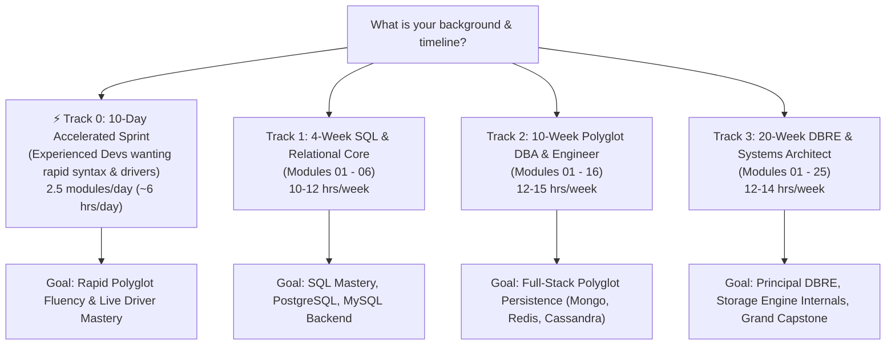

# ⏱️ Database Mastery Study Plans & Pacing Guide

Mastering modern database systems—from low-level disk page layouts and SQL query execution engines to distributed consensus (Raft/Paxos) and polyglot microservices—requires a realistic, structured roadmap.

With **Track A (mechanistic pure-Python simulations)** and **Track B (real production engines with Docker, connection pooling, and reconciliation tests)** across all 24 modules, study hours have been comprehensively recalibrated to reflect full dual-track mastery.

This guide provides **4 tailored study tracks** matching your available time, background, and career goals, with the **8 Phase Checkpoints** serving as mandatory competency gates.

---

## 🧭 Choose Your Study Track

---

## ⚡ Track 0: The 10-Day Accelerated Sprint (For Experienced Devs)

**Profile:** You already know backend development and basic SQL. You need to rapidly master Python database drivers (`psycopg2`, `oracledb`, `pymongo`, `redis`, `cassandra-driver`, `duckdb`, `qdrant-client`), storage internals (MVCC, WAL, LSM-Trees), and operational debugging.  
**Commitment:** ~6 hours per day (~60 hours total).

| Day | Focus Modules | Key Systems & Python Drivers | Mandatory Phase Gate |
| :---: | :--- | :--- | :--- |
| **Day 1** | **[Mod 01](Module_01_Storage_Theory_ACID_Relational_Model)** & **[Mod 02](Module_02_Modern_SQL_Mastery_Advanced_Queries)** | Storage theory, ACID disk fsync, recursive CTEs, and Window Functions (`ROW_NUMBER`, `LAG`). | - |
| **Day 2** | **[Mod 03](Module_03_Embedded_Databases_SQLite_WAL)** & **[Mod 04](Module_04_PostgreSQL_Core_Advanced_Types)** | SQLite WAL concurrency, PostgreSQL JSONB with GIN indexing, binary protocol with `psycopg2`. | **[Phase 1 Checkpoint](Phase_Checkpoints/PHASE_01_CHECKPOINT.md)** |
| **Day 3** | **[Mod 05](Module_05_PostgreSQL_MVCC_Indexing_EXPLAIN)** & **[Mod 06](Module_06_MySQL_MariaDB_InnoDB_Replication)** | PostgreSQL MVCC, autovacuum, index types (B-Tree, BRIN, GIN), `EXPLAIN ANALYZE`, MySQL InnoDB, binlog CDC. | **[Phase 2 Checkpoint](Phase_Checkpoints/PHASE_02_CHECKPOINT.md)** |
| **Day 4** | **[Mod 07](Module_07_Oracle_Database_Architecture_SGA_PGA)**, **[08](Module_08_Oracle_PLSQL_Packages_Triggers)**, & **[09](Module_09_Oracle_RAC_DataGuard_GoldenGate)** | Oracle SGA/PGA memory, PL/SQL packages, bulk collect, `oracledb` Thin Mode, RAC clustering, and Data Guard. | **[Phase 3 Checkpoint](Phase_Checkpoints/PHASE_03_CHECKPOINT.md)** |
| **Day 5** | **[Mod 10](Module_10_MongoDB_Document_Modeling_BSON)** & **[Mod 11](Module_11_MongoDB_Aggregations_Replicas_Sharding)** | MongoDB BSON design, PyMongo aggregation pipeline, Change Streams, and replica sets. | - |
| **Day 6** | **[Mod 12](Module_12_Redis_Data_Structures_Persistence)** & **[Mod 13](Module_13_Redis_Sentinel_Clustering_Lua)** | Redis Sorted Sets (`ZSET`), streams, RDB/AOF persistence, Sentinel failover, hash slots, atomic Lua scripts. | **[Phase 4 Checkpoint](Phase_Checkpoints/PHASE_04_CHECKPOINT.md)** |
| **Day 7** | **[Mod 14](Module_14_Apache_Cassandra_Masterless_Ring)** & **[Mod 15](Module_15_LSM_Trees_Compaction_DynamoDB)** | Apache Cassandra peer ring, Gossip protocol, tunable consistency ($R + W > N$), LSM-Trees (Memtable, SSTable), DynamoDB with `boto3`. | **[Phase 5 Checkpoint](Phase_Checkpoints/PHASE_05_CHECKPOINT.md)** |
| **Day 8** | **[Mod 16](Module_16_Neo4j_Graph_Databases_Cypher)** & **[Mod 17](Module_17_Columnar_OLAP_DuckDB_ClickHouse)** | Neo4j property graphs, Cypher queries, Columnar OLAP with DuckDB (Parquet zero-copy) and ClickHouse. | - |
| **Day 9** | **[Mod 19](Module_19_Search_Engines_Elasticsearch_Lucene)** & **[Mod 20](Module_20_AI_Vector_Databases_pgvector_Qdrant)** | Inverted index & BM25 with Elasticsearch, AI Vector Embeddings, HNSW graphs, and semantic search with `qdrant-client` and `pgvector`. | **[Phase 6 Checkpoint](Phase_Checkpoints/PHASE_06_CHECKPOINT.md)** |
| **Day 10** | **[Mod 21](Module_21_Storage_Engine_Internals_BPlus_Trees)**, **[21](Module_22_Query_Optimization_CBO_Index_Tuning)**, **[22](Module_23_Transactions_Isolation_Consensus_Raft)**, **[23](Module_24_Production_DBRE_Backups_Migrations_HA)**, & **[24](Module_25_Final_Capstone_Polyglot_Enterprise)** | B+ Tree page layouts, cost-based query optimization, Raft consensus, zero-downtime migrations, and Grand Capstone. | **[Phase 7](Phase_Checkpoints/PHASE_07_CHECKPOINT.md) & [Phase 8](Phase_Checkpoints/PHASE_08_CHECKPOINT.md)** |

---

## 🏃 Track 1: 4-Week SQL & Relational Core (Modules 01 – 06)

* **Goal:** Master SQL fundamentals, relational theory, query optimization, and production PostgreSQL and MySQL engines.
* **Commitment:** 10–12 hours per week (~45 hours total).
* **Weekly Breakdown:**
  - **Week 1 (Foundations):** Storage Theory, ACID, Disk Fsync, Relational Normalization, and Complex Joins ([Mod 01](Module_01_Storage_Theory_ACID_Relational_Model) & [Mod 02](Module_02_Modern_SQL_Mastery_Advanced_Queries)).
  - **Week 2 (Embedded Engines & Postgres Core):** SQLite WAL Mode Concurrency ([Mod 03](Module_03_Embedded_Databases_SQLite_WAL)), complete **[Phase 1 Checkpoint](Phase_Checkpoints/PHASE_01_CHECKPOINT.md)**, then dive into PostgreSQL Core, JSONB, and GIN indexes ([Mod 04](Module_04_PostgreSQL_Core_Advanced_Types)).
  - **Week 3 (Postgres Internals):** PostgreSQL MVCC, Autovacuum Tuning, Index Types, and `EXPLAIN ANALYZE` Query Plans ([Mod 05](Module_05_PostgreSQL_MVCC_Indexing_EXPLAIN)).
  - **Week 4 (MySQL & Binlogs):** MySQL / MariaDB Architecture, InnoDB Buffer Pool, Replication Lag, and Binlog CDC ([Mod 06](Module_06_MySQL_MariaDB_InnoDB_Replication)). Complete **[Phase 2 Checkpoint](Phase_Checkpoints/PHASE_02_CHECKPOINT.md)**.

---

## 🚀 Track 2: 10-Week Polyglot DBA & Backend Engineer (Modules 01 – 16)

* **Goal:** Master Relational, Enterprise (Oracle), NoSQL (MongoDB), In-Memory (Redis), Distributed Wide-Column (Cassandra), and Graph (Neo4j).
* **Commitment:** 12–15 hours per week (~130 hours total).
* **Weekly Breakdown:**
  - **Weeks 1–4:** Complete Track 1 (Relational Core, Modules 01–06) + Phase 1 & 2 Checkpoints.
  - **Week 5 (Enterprise Oracle):** Oracle Database Architecture, SGA/PGA, and Tablespace Management ([Mod 07](Module_07_Oracle_Database_Architecture_SGA_PGA)).
  - **Week 6 (PL/SQL & High Availability):** Oracle PL/SQL, Packages, Triggers, RAC, and Data Guard ([Mod 08](Module_08_Oracle_PLSQL_Packages_Triggers) & [Mod 09](Module_09_Oracle_RAC_DataGuard_GoldenGate)). Complete **[Phase 3 Checkpoint](Phase_Checkpoints/PHASE_03_CHECKPOINT.md)**.
  - **Week 7 (Document Stores):** MongoDB BSON Modeling, Aggregations, Replica Sets, and Change Streams ([Mod 10](Module_10_MongoDB_Document_Modeling_BSON) & [Mod 11](Module_11_MongoDB_Aggregations_Replicas_Sharding)).
  - **Week 8 (In-Memory Systems):** Redis Data Structures, Persistence (RDB/AOF), Sentinel Failover, Clustering, and Lua Scripting ([Mod 12](Module_12_Redis_Data_Structures_Persistence) & [Mod 13](Module_13_Redis_Sentinel_Clustering_Lua)). Complete **[Phase 4 Checkpoint](Phase_Checkpoints/PHASE_04_CHECKPOINT.md)**.
  - **Week 9 (Distributed Wide-Column):** Apache Cassandra Masterless Ring, Gossip, Tunable Consistency, and LSM Compaction ([Mod 14](Module_14_Apache_Cassandra_Masterless_Ring) & [Mod 15](Module_15_LSM_Trees_Compaction_DynamoDB)).
  - **Week 10 (Graph Databases):** Neo4j Property Graphs, Index-Free Adjacency, and Cypher Query Patterns ([Mod 16](Module_16_Neo4j_Graph_Databases_Cypher)). Complete **[Phase 5 Checkpoint](Phase_Checkpoints/PHASE_05_CHECKPOINT.md)**.

---

## 🏛️ Track 3: 20-Week DBRE & Systems Architect (Modules 01 – 25)

* **Goal:** Complete mastery from hardware page encoding and query planners to distributed consensus, zero-downtime operations, and the 5-engine Polyglot Capstone.
* **Commitment:** 12–14 hours per week (~250 hours total).
* **Milestone Progression:**
  - **Weeks 1–10:** Complete Track 2 (Modules 01–16) + Phase 1 through 5 Checkpoints.
  - **Weeks 11–12 (Analytics & Vector DBs):** Columnar OLAP with DuckDB and ClickHouse ([Mod 17](Module_17_Columnar_OLAP_DuckDB_ClickHouse)), Dimensional Modelling & Pipelines ([Mod 18](Module_18_Analytics_Engineering_Dimensional_Modeling_Pipelines)), Elasticsearch BM25 Search ([Mod 19](Module_19_Search_Engines_Elasticsearch_Lucene)), and AI Vector DBs with pgvector and Qdrant ([Mod 20](Module_20_AI_Vector_Databases_pgvector_Qdrant)). Complete **[Phase 6 Checkpoint](Phase_Checkpoints/PHASE_06_CHECKPOINT.md)**.
  - **Weeks 13–16 (Deep Internals & DBRE):**
    - B+ Tree Slotted-Page Storage Internals ([Mod 21](Module_21_Storage_Engine_Internals_BPlus_Trees))
    - Cost-Based Query Optimizer & Index Advisor ([Mod 22](Module_22_Query_Optimization_CBO_Index_Tuning))
    - Isolation Levels, 2PL, Deadlock Detection, and Raft Consensus ([Mod 23](Module_23_Transactions_Isolation_Consensus_Raft))
    - Production DBRE: PITR Backups, Zero-Downtime Schema Migrations, and Orchestrated Failover ([Mod 24](Module_24_Production_DBRE_Backups_Migrations_HA))
    - Complete **[Phase 7 Checkpoint](Phase_Checkpoints/PHASE_07_CHECKPOINT.md)**.
  - **Weeks 17–20 (Grand Master Capstone):**
    - Build and test the full **[Module 25 Polyglot Persistence Enterprise Platform](Module_25_Final_Capstone_Polyglot_Enterprise)**.
    - Implement Transactional Outbox, CDC Event Relay, Fenced Redlock Distributed Locking, Dead Letter Queue quarantine, Saga Orchestrator, and Cross-Engine Reconciliation Auditor.
    - Pass the final timed gate: **[Phase 8 Checkpoint](Phase_Checkpoints/PHASE_08_CHECKPOINT.md)**.
