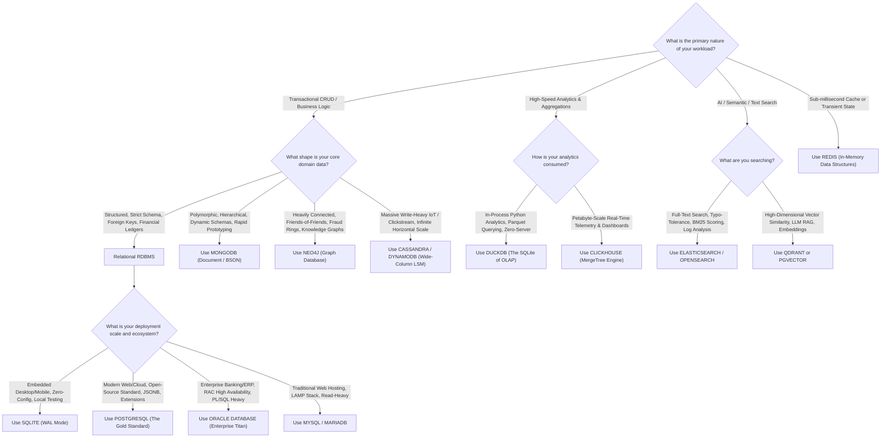

# 🌟 The Complete Enlightenment Guide: When to Use What in Databases

> *"Tell me how you query your data, and I will tell you which database engine the laws of physics demand you choose."*

Welcome to the ultimate architectural guide to databases. If you have ever felt overwhelmed by the sheer number of database options—PostgreSQL, MongoDB, Redis, Cassandra, Oracle, DuckDB, Neo4j, Qdrant—this guide provides **complete clarity**.

---

## 🏛️ The First Law of Databases: The "No-Silver-Bullet" Rule

Every database engine is simply a **specialized data structure saved to disk or RAM**, paired with an execution engine optimized for a **specific read or write pattern**.

Because computer hardware is constrained by physics:
1. **RAM** is ultra-fast (~100 nanoseconds) but volatile and expensive.
2. **NVMe SSDs** provide non-volatile storage but suffer from write wear and slower random seek times (~100 microseconds).
3. **Networks** introduce latency (1 to 100 milliseconds) and network partitions.

No single database can provide sub-millisecond global caching, infinite horizontal writes, complex multi-table relational joins, graph path traversals, and petabyte-scale analytical aggregations simultaneously. 

Instead, modern software architectures use **Polyglot Persistence**: selecting the right tool for each specialized job.

---

## 🧭 The 7 Major Database Paradigms at a Glance

| Paradigm | Exemplars | Primary Data Structure | Best Read Pattern | Best Write Pattern | Primary Python Driver |
| :--- | :--- | :--- | :--- | :--- | :--- |
| **1. Relational (RDBMS)** | **PostgreSQL**, **Oracle**, MySQL, SQLite | **B+ Tree**, Clustered Indexes | Complex joins, filtered queries, strict transactions | Atomic row updates, ACID consistency | `psycopg3`, `python-oracledb`, `asyncpg`, `sqlite3` |
| **2. Document Store** | **MongoDB** | **BSON Documents**, WiredTiger B-Trees | Fetch entire hierarchical entity in 1 lookup | Atomic updates to self-contained documents | `pymongo`, `motor`, `beanie` |
| **3. In-Memory & Key-Value** | **Redis** | **RAM Hash Table**, SkipLists | Sub-millisecond $O(1)$ key lookups, leaderboards | Millions of writes/sec, transient cache | `redis-py` (`redis.asyncio`) |
| **4. Wide-Column Distributed** | **Apache Cassandra**, ScyllaDB, AWS DynamoDB | **LSM-Tree** (Memtable + SSTables) | Querying by exact Partition Key + Sort Key | Massive append-heavy writes, linear scaling | `cassandra-driver`, `boto3` |
| **5. Graph Database** | **Neo4j** | **Index-Free Adjacency** (Direct memory pointers) | Multi-hop relationship traversals (Friends, Fraud) | Connecting entities with relationships | `neo4j` Python Driver |
| **6. Columnar OLAP** | **DuckDB**, **ClickHouse**, Snowflake | **Columnar Arrays**, Vectorized memory chunks | Aggregating billions of rows (`SUM`, `AVG`, `GROUP BY`) | Batch bulk inserts (Parquet, CSV) | `duckdb`, `clickhouse-connect` |
| **7. AI Vector & Search** | **Qdrant**, `pgvector`, Elasticsearch | **HNSW Graphs**, Inverted Index | Semantic similarity (cosine search), fuzzy text | Upserting vectors with payload metadata | `qdrant-client`, `pgvector-python`, `elasticsearch` |

---

## 🗺️ Visual Decision Tree: "Choose Your Database in 3 Questions"



---

## 🔍 Deep Dive: The 7 Paradigms Explained From First Principles

---

### 1. Relational Databases (RDBMS): PostgreSQL, Oracle, MySQL, SQLite
* **The Mental Model:** A collection of strict, interlocking spreadsheets where rows have unique IDs and columns have strict types. Foreign keys enforce relationships like digital guardrails.
* **Storage Secret:** Data is stored row-by-row on disk pages organized in **B+ Trees**. Looking up an ID takes $O(\log N)$ steps.
* **When to Use:**
  - **Financial Ledgers & Banking:** You cannot afford losing 1 cent. You need strict **ACID transactions**.
  - **Complex Relational Queries:** You need to join Customers with Orders, Payments, Shipping, and Discounts in a single consistent query.
  - **When Data Integrity > Write Velocity:** You want the database to reject invalid data before it ever corrupts your system.
* **When NOT to Use:**
  - When data has no consistent structure (polymorphic logs).
  - When you need to ingest 500,000 writes per second across 50 nodes without a central master.
* **Which One to Pick?**
  - **PostgreSQL:** Default choice for 90% of all modern projects. Robust, open-source, excellent JSONB support, rich ecosystem.
  - **Oracle:** The enterprise kingpin for Fortune 500 companies, insurance, and large banking platforms with heavy legacy PL/SQL, RAC clustering, and GoldenGate replication.
  - **SQLite:** Embedded apps, testing suites, IoT edge devices, or local desktop software.

---

### 2. Document Databases: MongoDB
* **The Mental Model:** A digital filing cabinet filled with JSON-like folders (BSON). Each document contains everything needed to represent an entity (e.g. A User document contains their addresses, preferences, and permissions embedded together).
* **Storage Secret:** BSON binary serialization backed by the **WiredTiger** storage engine.
* **When to Use:**
  - **Polymorphic Catalogs:** An e-commerce catalog where a T-Shirt has `sizes` and `colors`, but a Laptop has `ram`, `cpu`, and `screen_size`.
  - **Single-Entity Reads:** You want to fetch an entire user profile, their settings, and their cart in **1 single network request** without joining 8 tables.
  - **Rapid Prototyping:** When your schema changes every week during early-stage product evolution.
* **When NOT to Use:**
  - High-frequency multi-table financial balance transfers requiring strict serializable cross-table locking.
  - Deep recursive relational joins.

---

### 3. In-Memory & Key-Value Stores: Redis
* **The Mental Model:** A blazing-fast Swiss Army knife stored directly in your computer's RAM.
* **Storage Secret:** Single-threaded event loop operating purely on memory pointers, eliminating OS lock contention and thread switching. Persistence is handled asynchronously in the background via RDB snapshots or AOF logs.
* **When to Use:**
  - **Caching:** Relieving database load by storing frequently read queries with an expiration time (TTL).
  - **Distributed Locks:** Ensuring only 1 server processes a payment at any given moment.
  - **Live Leaderboards & Rate Limiting:** Using **Sorted Sets (ZSET)** to rank 10 million players in sub-milliseconds.
  - **Session Management:** Storing user login tokens and shopping carts.
* **When NOT to Use:**
  - Storing primary persistent data larger than your server's RAM.
  - Complex analytical queries or arbitrary table filters.

---

### 4. Distributed Wide-Column Stores: Apache Cassandra & AWS DynamoDB
* **The Mental Model:** A massive, decentralized ring of servers with **no master node**. Every machine is identical.
* **Storage Secret:** **LSM-Trees (Log-Structured Merge Trees)**. Writes never overwrite existing data on disk; they append sequentially to an in-memory Memtable and CommitLog, achieving staggering write speeds.
* **When to Use:**
  - **Massive Scale & Write-Heavy Telemetry:** Ingesting millions of GPS pings, IoT sensor signals, or clickstream events every second.
  - **Zero-Downtime Guarantee:** You need 100% uptime across multiple global datacenters. If 3 servers blow up, the cluster continues operating without dropping a request.
* **When NOT to Use:**
  - When you need ad-hoc queries (e.g., `SELECT * WHERE age > 25 AND city = 'Dallas'`). In Cassandra, you must know your exact query access patterns *before* designing the tables!
  - No relational `JOIN` operations exist.

---

### 5. Graph Databases: Neo4j
* **The Mental Model:** A whiteboard where people, places, and things are drawn as circles (**Nodes**) and connected by arrows (**Relationships**).
* **Storage Secret:** **Index-Free Adjacency**. Unlike relational databases that must compute join tables on the fly, a node in Neo4j physically stores memory pointers directly to its neighboring nodes. Traversing a relationship is an $O(1)$ memory jump!
* **When to Use:**
  - **Social Networks & Recommendations:** Finding "friends of friends who like sci-fi books".
  - **Fraud Detection:** Uncovering circular transaction rings (Person A $\rightarrow$ Person B $\rightarrow$ Person C $\rightarrow$ Person A).
  - **Identity & Access Management (IAM):** Modeling complex hierarchical permission trees.
* **When NOT to Use:**
  - Bulk aggregate math (e.g., calculating average salary across 20 million employees).
  - Simple key-value lookups.

---

### 6. Columnar OLAP: DuckDB & ClickHouse
* **The Mental Model:** Instead of storing data row-by-row (`[ID, Name, Age]`), columnar databases store data column-by-column (`[All IDs], [All Names], [All Ages]`).
* **Storage Secret:** Contiguous memory arrays and heavy compression (Run-Length Encoding, Dictionary compression). A query that asks `AVG(age)` only reads the `Age` column into memory, skipping the other 99 columns entirely!
* **When to Use:**
  - **Analytical Dashboards:** Running aggregations (`SUM`, `COUNT`, `GROUP BY`) over 100,000,000 rows in under 200 milliseconds.
  - **DuckDB:** Fast, zero-server analytical SQL inside your Python script directly querying Parquet and CSV files.
  - **ClickHouse:** Enterprise real-time log ingestion, telemetry, and business intelligence at scale.
* **When NOT to Use:**
  - Single-row transactional CRUD (`UPDATE users SET email = ... WHERE id = 123`). Modifying single rows in columnar formats causes expensive rewriting of disk segments.

---

### 7. Modern AI Vector Databases & Search Engines: pgvector, Qdrant, Elasticsearch
* **The Mental Model:**
  - **Elasticsearch:** The ultimate inverted index (like the index at the back of a book) for keyword matching, typo-tolerance, and log search.
  - **Vector DBs (Qdrant, pgvector):** Storing mathematical coordinates (embeddings) representing the *semantic meaning* of text or images in high-dimensional space.
* **Storage Secret:** **HNSW (Hierarchical Navigable Small World)** graphs that connect similar vector embeddings, allowing $O(\log N)$ approximate nearest neighbor search.
* **When to Use:**
  - **LLM RAG (Retrieval-Augmented Generation):** Finding the most relevant document paragraphs to feed into a ChatGPT/Claude prompt.
  - **Semantic & Visual Search:** Searching for "cozy red footwear" and finding red slippers even if the word "cozy" never appears in the title.
* **When NOT to Use:**
  - Financial calculations, primary relational record management, or exact string equality.

---

## ⚖️ The CAP & PACELC Theorem: Reality Demystified

When building distributed systems, you cannot beat the laws of networking. 

### The CAP Theorem:
During a **Network Partition ($P$)** (when two data centers temporarily lose communication):
- You must choose **Consistency ($C$)**: Reject writes until network heals so no one reads stale data (PostgreSQL master, MongoDB majority write, Redis Sentinel).
- OR choose **Availability ($A$)**: Allow writes on both sides so users never see an error, but data will temporarily be out-of-sync (Cassandra, DynamoDB).

```
                      Consistency (C)
                         /       \
                        /         \
                       /  RDBMS    \
                      / (Postgres)  \
                     /               \
         Availability (A) ──────── Partition Tolerance (P)
           (Cassandra)
```

### The PACELC Theorem (The Everyday Reality):
Even when there is **NO Network Partition ($P$)**, you still face a fundamental trade-off:
- Do you want lowest **Latency ($L$)**? (Acknowledge writes immediately before replicas save them: Redis, MongoDB with `w:1`).
- Or do you want strict **Consistency ($C$)**? (Wait for disk flushes and quorum acknowledgments: PostgreSQL, Oracle Data Guard Synchronous).

---

## 🐍 Python Driver & Tooling Master Cheat Sheet

| Database | Recommended Python Driver | Asynchronous Driver | Modern ORM / ODM / Abstraction |
| :--- | :--- | :--- | :--- |
| **SQLite** | `sqlite3` (Built-in) | `aiosqlite` | `SQLAlchemy 2.0`, `peewee` |
| **PostgreSQL** | `psycopg` (v3) | `asyncpg`, `psycopg` async | `SQLAlchemy 2.0`, `SQLModel` |
| **Oracle** | `python-oracledb` (Thin Mode) | `python-oracledb` pool | `SQLAlchemy 2.0` (with oracledb dialect) |
| **MySQL** | `mysql-connector-python` | `asyncmy`, `aiomysql` | `SQLAlchemy 2.0` |
| **MongoDB** | `pymongo` | `motor` | `beanie` (Pydantic V2 ODM) |
| **Redis** | `redis` (v5+) | `redis.asyncio` | `redis-om` |
| **Cassandra** | `cassandra-driver` | `cassandra-driver` async | `cqlengine` (built into driver) |
| **DynamoDB** | `boto3` | `aioboto3` | `pynamodb` |
| **Neo4j** | `neo4j` (Official) | `neo4j.AsyncGraphDatabase` | `neomodel` (Graph OGM) |
| **DuckDB** | `duckdb` (Direct) | Direct execution | PyArrow, Polars zero-copy |
| **ClickHouse** | `clickhouse-connect` | `aiochclient` | `clickhouse-sqlalchemy` |
| **Vector / Qdrant**| `qdrant-client` | `qdrant-client` async | LangChain, LlamaIndex |

---

## 🎯 The Final Enlightenment: Summary Rule

1. Start with **PostgreSQL** for your primary application data. It handles relational integrity, transactions, and even JSONB and Vector embeddings (`pgvector`) brilliantly.
2. Add **Redis** as soon as you need caching, rate limiting, or distributed task locks.
3. Add **DuckDB** whenever you need fast analytical querying on files (CSV, Parquet) without installing a server.
4. Graduate to **MongoDB** if your schema is fundamentally polymorphic and document-oriented.
5. Adopt **Cassandra / DynamoDB** when write throughput exceeds 50,000 requests/sec across globally distributed datacenters.
6. Adopt **Neo4j** when the value of your business lies in the complex relationships between entities rather than the entities themselves.
7. Use **ClickHouse** when analyzing billions of real-time event logs and metrics.
8. Use **Qdrant** when building modern AI, semantic search, and RAG pipelines.

*With this mental foundation, you are ready to master the internals of every database in this course!*
