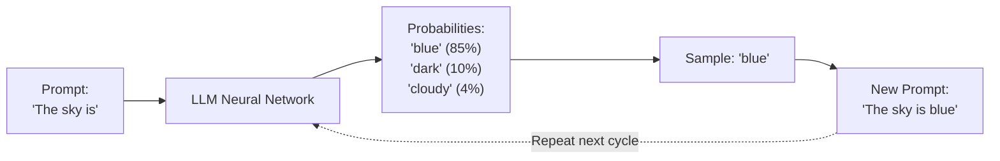
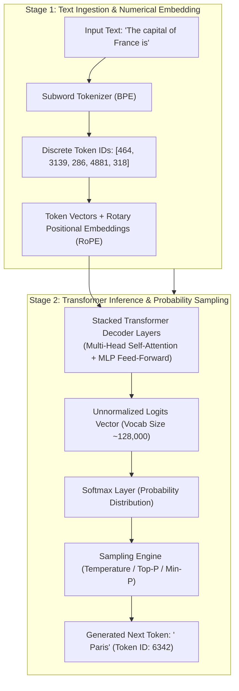
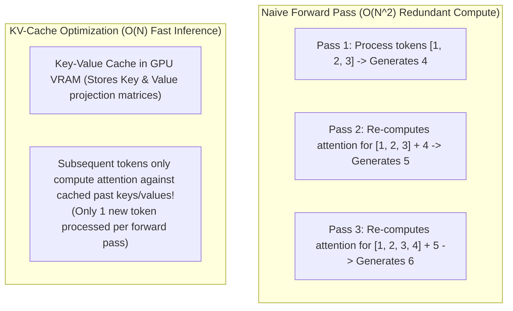
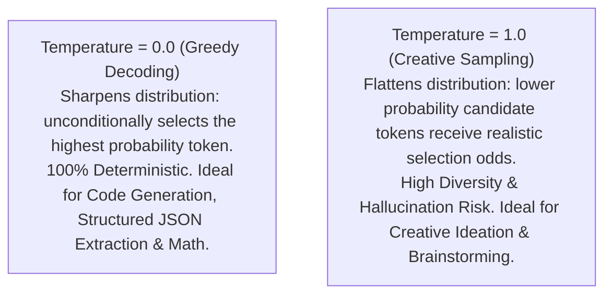

# Agentic AI Chapter 1: LLM Foundations, Tokenization & Inference Mechanics

> **Core Learning Objective:** Understand the internal mechanics of Large Language Models (LLMs) from the transformer architecture up. Learn how Byte-Pair Encoding (BPE) tokenizes text, how autoregressive generation works, why the KV-Cache is critical to inference speed, and how sampling parameters (temperature, top-p) shape model outputs.

---

## 0. Zero-Prerequisite Foundations: What is an LLM Really Doing?

> **The "Super-Autocomplete & Scrabble Tile" Metaphor**
> What is an LLM? Is it a conscious digital brain thinking complex thoughts?
> 
> Not at all. Think about typing a text message on your smartphone. When you type:
> `Merry Christmas and a happy new...`
> Your phone keyboard displays a tiny box suggesting the next word: `year`.
> 
> How did your phone know that? It didn't "think" about holidays or feel festive. It simply observed that across millions of past messages, after the words *"happy new"*, the word *"year"* appears 99% of the time.
> 
> A Large Language Model (like GPT-4o, Claude 3.5, or Llama 3) is fundamentally **that smartphone predictive keyboard scaled up to supercomputer proportions**. It was trained on trillions of words from books, GitHub codebases, scientific papers, and the internet.
> 
> ### How It Generates an Entire Response
> When you ask ChatGPT: *"Write a Python function to reverse a string"*:
> 1. It reads your prompt.
> 2. It calculates the statistical probability for every possible next fragment of text in its vocabulary.
> 3. It picks the most probable fragment: `def`.
> 4. It appends `def` to the end of the text, and feeds the entire expanded text back into itself.
> 5. It predicts the next word: ` reverse_string`.
> 6. It repeats this loop hundreds of times—like an ultra-fast typewriter hammering out one word fragment at a time! This sequential, one-word-at-a-time loop is called **Autoregressive Generation**.



### Core AI Jargon Demystified in Plain English:
* **Token:** Silicon chips cannot read English letters. They only understand numbers. A tokenizer is like a giant lookup dictionary that chops words into common letter clusters (tokens) and assigns each cluster a unique ID number. (e.g. The word `"Apple"` is Token ID `19253`).
* **Logits:** At the end of its neural calculations, the model generates raw score numbers (votes) for all 128,000 tokens in its dictionary. These raw unnormalized scores are called **Logits**.
* **Softmax:** A mathematical formula that converts those raw logit scores into clean percentages (probabilities) that add up to 100%.
* **Temperature ($T$):** The "adventurousness" or randomness slider:
  * **$T = 0.0$ (Deterministic / Greedy):** Always picks the #1 highest-probability token. 100% repeatable. Best for code generation, SQL queries, and JSON extraction.
  * **$T = 0.7 - 1.0$ (Creative):** Takes calculated risks by occasionally picking the #2 or #3 option. Great for brainstorming, storytelling, and conversational variety.

---

## 1. The Core Nature of Large Language Models

An LLM is fundamentally a **statistical next-token prediction engine** trained on vast text corpora. It computes a probability distribution over a finite vocabulary of discrete numerical tokens:

$$P(w_t \mid w_1, w_2, \dots, w_{t-1})$$



---

## 2. Tokenization: Byte-Pair Encoding (BPE)

LLMs cannot process raw text strings directly. They rely on subword tokenizers like **Byte-Pair Encoding (BPE)**:
* A fixed vocabulary of subwords (e.g. GPT-4 has $\sim 100,000$ tokens, Llama 3 has $128,256$ tokens).
* Common words ("the", "system") are a single token.
* Rare words, code, or non-English characters are broken into multiple subword pieces or raw bytes.

### Inspecting Tokens with `tiktoken` in Python:
```python
import tiktoken

# Load GPT-4o tokenizer
enc = tiktoken.get_encoding("o200k_base")

text = "Autonomous AI Agents execute tools!"
tokens = enc.encode(text)

print(f"Token IDs ({len(tokens)} tokens): {tokens}")
for token_id in tokens:
    print(f"Token ID: {token_id:<8} Byte Representation: {enc.decode_bytes([token_id])}")
```

> [!WARNING]
> **Token Arithmetic Pitfall:** LLMs struggle with basic character counts (e.g. *"How many 'r's are in strawberry?"*) because the model never sees individual letters—it only sees the token IDs representing subword chunks!

---

## 3. Autoregressive Inference & The KV-Cache

LLM text generation is **autoregressive**: to generate a 100-word response, the model must run 100 sequential forward passes through all transformer layers, predicting one single token at a time.



### Why Inference is Memory-Bandwidth Bound
During the generation phase (decoding), the GPU does not bottleneck on mathematical compute FLOPS—it bottlenecks on **GPU VRAM memory bandwidth**, because it must reload gigabytes of cached Key and Value vectors from memory for every single generated token.

---

## 4. Sampling Hyperparameters: Shaping the Probability Distribution

After the final transformer layer, the model outputs raw unnormalized scores called **Logits** ($z_i$) for every token in the vocabulary. The **Softmax function** converts logits into probabilities:

$$P(i) = \frac{e^{z_i / T}}{\sum_{j} e^{z_j / T}}$$

Where $T$ is the **Temperature**:



### Key Generation Parameters:
1. **Temperature ($T$):** Scales logit variance. $T=0$ yields greedy deterministic output.
2. **Top-P (Nucleus Sampling):** Accumulates candidate tokens in descending order of probability until their cumulative probability reaches $P$ (e.g., $P = 0.90$). Truncates the long tail of unlikely words.
3. **Top-K:** Restricts candidate selection to strictly the $K$ highest probability tokens (e.g., $K = 50$).
4. **Presence & Frequency Penalties:** Subtracts from a token's logit if it has already appeared in the output, discouraging repetitive loops.
