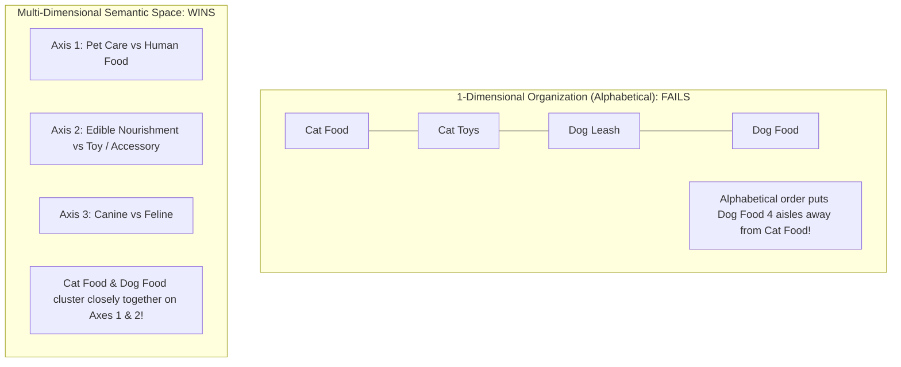
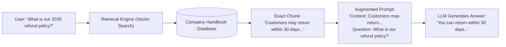
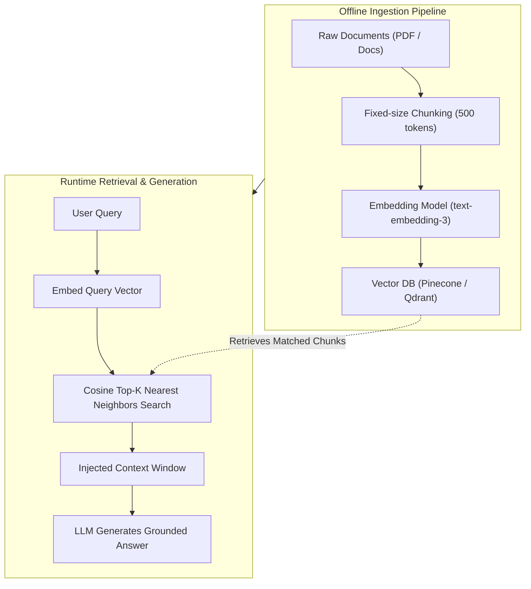
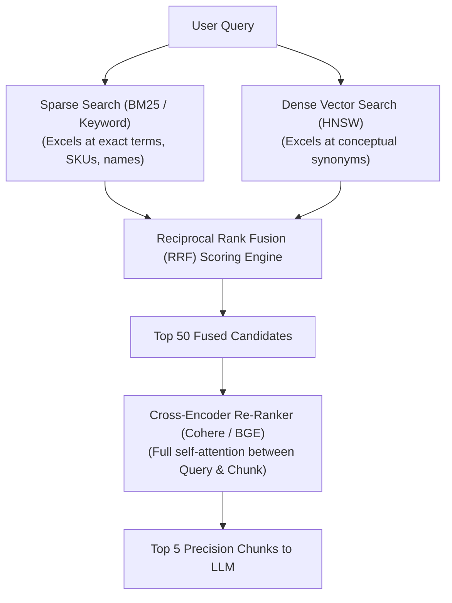

# Agentic AI Chapter 3: Advanced RAG vs Vectorless RAG Deep Dive

> **Core Learning Objective:** Master information retrieval for LLMs. Understand why naive vector search fails in production, how to implement Hybrid Search (BM25 + Dense Vectors) with Reciprocal Rank Fusion (RRF), Cross-Encoder Re-ranking, and next-generation Vectorless RAG (PageIndex & GraphRAG).

---

## 0. Zero-Prerequisite Foundations: What is RAG and Why Does It Exist?

### Plain-English Jargon Demystifier

| Technical Term | Plain English Translation | Real-World Metaphor |
| :--- | :--- | :--- |
| **RAG (Retrieval-Augmented Generation)** | Giving the LLM an open-book reference text before it writes an answer. | A student looking at an index card right before answering an exam question. |
| **Embedding** | Converting words or paragraphs into a list of numbers representing meaning. | GPS coordinates (Latitude, Longitude, Altitude) for ideas instead of cities. |
| **Vector Dimension** | The number of coordinates in the list (e.g., 1536 floats in OpenAI `text-embedding-3`). | The number of attributes used to describe an object (e.g., size, color, weight, price). |
| **Cosine Similarity** | Measuring the angle between two direction arrows in geometry. | Comparing two compass needles: if both point North, similarity is 1.0 (identical meaning). |
| **Dense Vector** | A vector where almost all numbers are non-zero floating-point values (captures overall semantic concept). | A color photograph of a person capturing overall features. |
| **Sparse Vector (BM25)** | A vector where 99.9% of slots are zero, only storing exact keyword occurrence counts. | A fingerprint or dental record matching exact unique ridges. |
| **Bi-Encoder** | Encodes query and document independently into vectors. Blazing fast ($O(1)$ lookups via index). | Two librarians independently summarizing book topics on index cards. |
| **Cross-Encoder (Re-Ranker)** | Feeds both query AND document together into a neural network with full self-attention. Slower, but pinpoint accurate. | An expert reading the question and the document side-by-side to grade relevance. |

---

### The "Grocery Store Aisles & GPS Coordinates" Mental Model

Why do we need 1,536 numbers to represent a sentence? Why not just 1 number?



* **1 Dimension (Alphabetical Order):**
  If a grocery store shelved items alphabetically, "Cat Food" and "Cat Toys" are in Aisle C, but "Dog Food" is in Aisle D, and "Cat Litter" is in Aisle C. A shopper wanting pet food has to run across the entire supermarket!
* **3 Dimensions (Aisle, Shelf Height, Refrigeration):**
  Now the store groups items by **Function** (Aisle 5 = Pet Care), **Form** (Dry Kibble on Bottom Shelf, Wet Cans on Middle Shelf), and **Temperature** (Refrigerated Fresh Rolls in the end cooler).
* **1,536 Dimensions (Modern LLM Embeddings):**
  An embedding model evaluates 1,536 conceptual attributes simultaneously:
  - Is it legal, medical, or colloquial?
  - Is it an active question or a declarative answer?
  - Does it refer to past, present, or future?
  - What is the emotional sentiment?

When sentences share the same conceptual neighborhood, their mathematical vectors point in nearly the same physical direction!

---

### The "Open-Book Exam" Metaphor

> * **The Closed-Book Exam (Pure LLM):**
>   If a student takes a difficult legal or medical exam with no books allowed, they must rely 100% on their memory. If you ask them about a law passed yesterday, or your company's private internal salary policy, they have no way of knowing it! If they try to guess, they will invent plausible-sounding nonsense (**Hallucination**).
> 
> * **The Open-Book Exam (RAG):**
>   Before answering the question, a diligent research assistant sprints into the library, pulls the exact 2 relevant pages from the textbook, paperclips them to the exam sheet, and hands them to the student.
>   The student reads those 2 specific pages and answers with **100% factual accuracy and verifiable citations**.
>   That is **RAG**: We retrieve relevant chunks from your private documents and inject them into the LLM's prompt at runtime!



### What is a "Vector Database"?
A standard SQL database looks for exact text matches (`WHERE text LIKE '%dog%'`).
A **Vector Database** (like Qdrant, Pinecone, or Milvus) is an index built to calculate geometric distances between GPS coordinates. It can scan 10,000,000 paragraphs in **5 milliseconds** to find the paragraphs whose meaning is geometrically closest to the user's question, even if they don't share a single word!

---

## 1. The Naive RAG Architecture & Its Fatal Flaws

Traditional Retrieval-Augmented Generation (RAG) chunks documents, generates dense embedding vectors, and performs cosine similarity search in a vector database:



### Why Naive Vector Search Breaks in Enterprise Systems:
1. **The Semantic Trap (Loss of Exact Keyword Precision):** Querying an exact serial code `ERR-90214-X` or product SKU fails because embedding models generalize numbers into broad semantic spaces.
2. **Context Fragmentation:** Slicing a table or paragraph across arbitrary chunk boundaries destroys tabular columns and multi-paragraph deductions.
3. **Inability to Answer Global Aggregate Queries:** Questions like *"What were the top 3 recurring themes across all 500 customer feedback transcripts this quarter?"* fail completely because every chunk is evaluated in isolation without global context!

---

## 2. Advanced Retrieval: Hybrid Search & Reciprocal Rank Fusion (RRF)

Production search combines **Sparse Keyword Search (BM25)** with **Dense Semantic Vector Search**, fusing their ranked lists using **Reciprocal Rank Fusion (RRF)**:



### The RRF Formula:
$$RRF(d) = \sum_{m \in M} \frac{1}{k + r_m(d)}$$
Where $r_m(d)$ is the rank of document $d$ in system $m$, and $k$ is a constant (typically $60$).

```python
def reciprocal_rank_fusion(dense_ranks: list[str], sparse_ranks: list[str], k: int = 60) -> list[tuple[str, float]]:
    scores = {}
    
    for rank, doc_id in enumerate(dense_ranks, start=1):
        scores[doc_id] = scores.get(doc_id, 0.0) + (1.0 / (k + rank))
        
    for rank, doc_id in enumerate(sparse_ranks, start=1):
        scores[doc_id] = scores.get(doc_id, 0.0) + (1.0 / (k + rank))
        
    return sorted(scores.items(), key=lambda item: item[1], reverse=True)

# Verification
dense_top = ["doc_A", "doc_B", "doc_C"]
sparse_top = ["doc_B", "doc_D", "doc_A"]
fused = reciprocal_rank_fusion(dense_top, sparse_top)
print("RRF Fused Rankings:", fused)
# doc_B ranks #1 because it appeared near the top of BOTH search engines!
```

---

## 3. Vectorless RAG: PageIndex & GraphRAG

### 1. PageIndex (Hierarchical Document Trees)
Instead of embedding chunks blindly, PageIndex creates an **interactive table of contents and structural tree of the document**:
* The LLM navigates the document tree like a human researcher: *Reads Executive Summary $\rightarrow$ Inspects Section 4.2 $\rightarrow$ Reads specific table row*.
* Zero embeddings required! 100% deterministic accuracy for financial audits and legal contracts.

### 2. Microsoft GraphRAG (Knowledge Graph Augmented Retrieval)
Extracts subject-predicate-object triples (`Entity A` $\rightarrow$ `RELATION` $\rightarrow$ `Entity B`) from documents and links them into an interconnected **Knowledge Graph**:


* **Why GraphRAG Wins:** Supports multi-hop traversals across multiple documents (*"How does Company A's supplier in Taiwan affect Company B's supply chain in Germany?"*), answering global thematic questions that vector databases cannot answer.

---

## 4. Junior vs Production Architecture Comparison

```
┌──────────────────────────────────────────────────────────────────────────┐
│ JUNIOR IMPLEMENTATION: Naive Similarity Search                           │
├──────────────────────────────────────────────────────────────────────────┤
│ - Blind fixed-chunking (e.g., 500 characters split by whitespace)        │
│ - Dense-only cosine distance lookup (k=4)                                │
│ - No metadata filtering, no keyword fallback                             │
│ - Fails on: Serial numbers, tabular data, multi-hop deductive queries    │
│ - Cost/Latency: Cheap initially, but high hallucination rate in prod     │
└──────────────────────────────────────────────────────────────────────────┘
                                   │
                                   ▼
┌──────────────────────────────────────────────────────────────────────────┐
│ STAFF / PRODUCTION IMPLEMENTATION: Two-Stage Hybrid Pipeline             │
├──────────────────────────────────────────────────────────────────────────┤
│ - Structure-aware chunking (Markdown headers, JSON, table preservation)   │
│ - Dual Retrieval: BM25 (sparse keyword) + HNSW (dense embedding)         │
│ - Reciprocal Rank Fusion (RRF) combines candidates to top-50 pool         │
│ - Cross-Encoder re-ranker evaluates top-50 to yield top-5 high-precision  │
│ - GraphRAG fallback for cross-document thematic/aggregate queries        │
└──────────────────────────────────────────────────────────────────────────┘
```

---

## 5. Chapter Milestone Check

Before moving to Agent Architectures, verify you can answer these questions with total confidence:

1. **Why does naive vector search fail when querying an exact SKU or error code (e.g., `ERR-502-TIMEOUT`)?**
   - *Answer:* Embedding models convert tokens into broad conceptual spaces; rare alphanumeric codes lack dense semantic neighbors and get blurred into generic error terms. Sparse BM25 keyword search is required.
2. **What is the primary difference between a Bi-Encoder and a Cross-Encoder?**
   - *Answer:* Bi-encoders encode queries and docs separately (allowing fast pre-computed index lookups); Cross-encoders feed query and doc together through transformer layers with full self-attention (slower, but drastically higher ranking accuracy).
3. **What problem does GraphRAG solve that vector chunking cannot?**
   - *Answer:* Global thematic queries across entire corpora (e.g., "What are the common risk factors across all 50 vendor contracts?") by synthesizing entity-relationship knowledge graphs.

