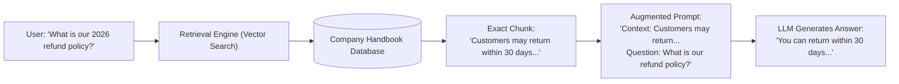
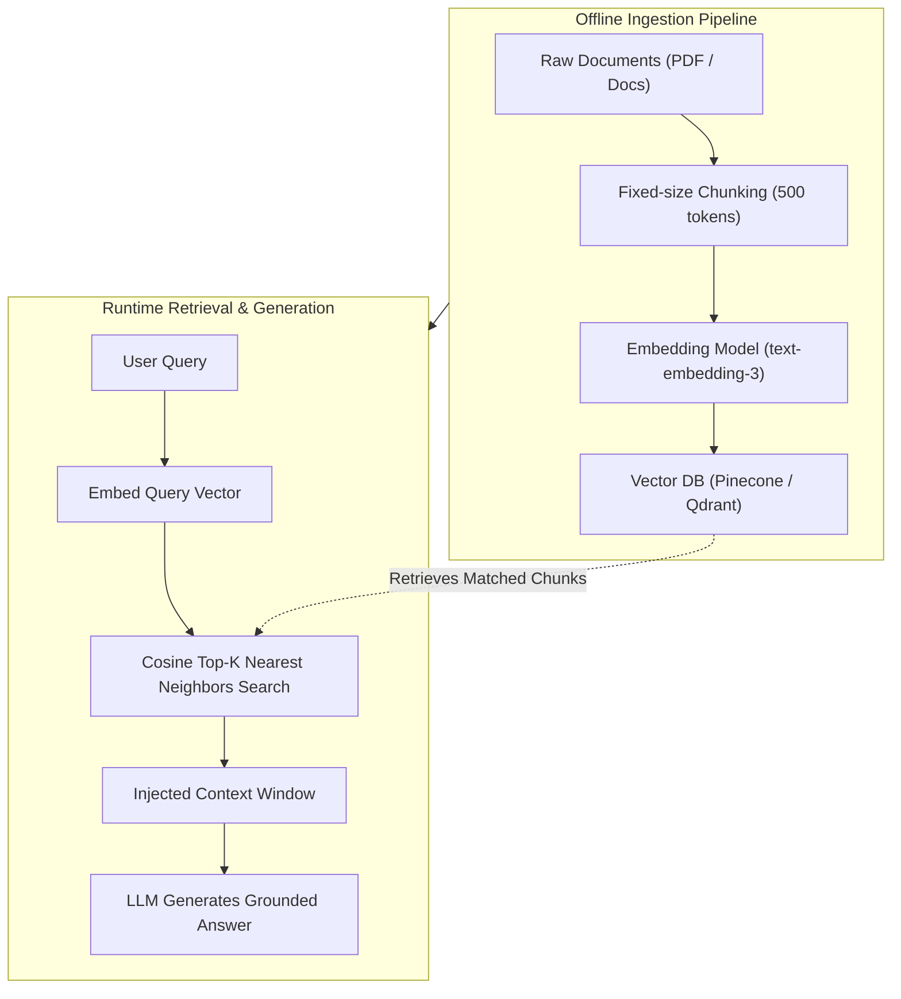
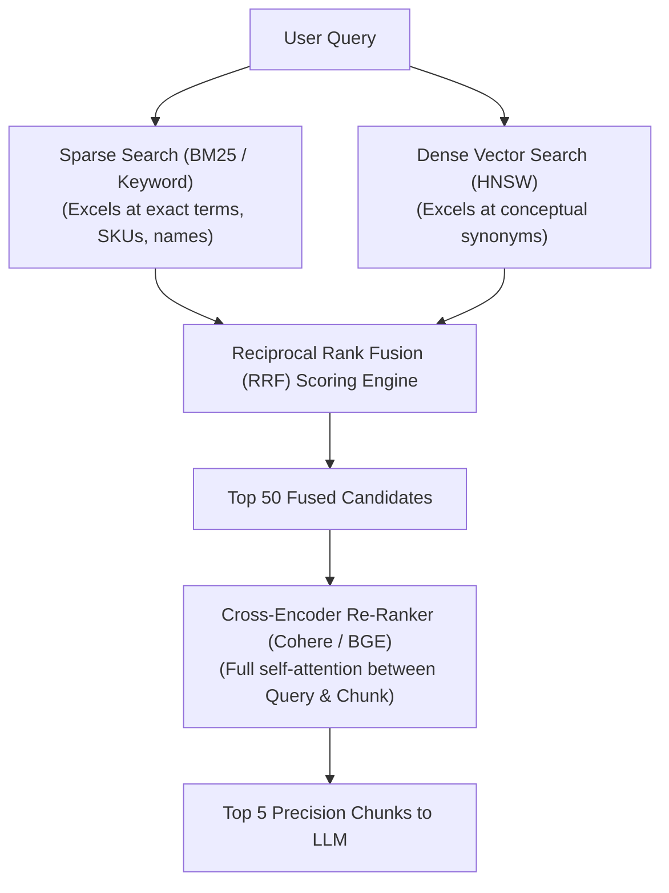
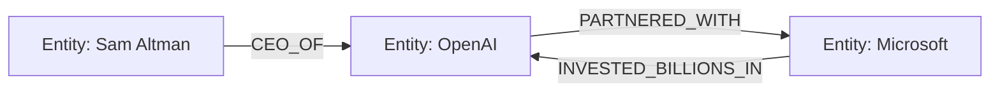

# Agentic AI Chapter 3: Advanced RAG vs Vectorless RAG Deep Dive

> **Core Learning Objective:** Master information retrieval for LLMs. Understand why naive vector search fails in production, how to implement Hybrid Search (BM25 + Dense Vectors) with Reciprocal Rank Fusion (RRF), Cross-Encoder Re-ranking, and next-generation Vectorless RAG (PageIndex & GraphRAG).

---

## 0. Zero-Prerequisite Foundations: What is RAG and Why Does It Exist?

> **The "Open-Book Exam & GPS Coordinates of Meaning" Metaphor**
> Why did the industry invent **RAG (Retrieval-Augmented Generation)**?
> 
> * **The Closed-Book Exam (Pure LLM):**
>   If a student takes a difficult legal or medical exam with no books allowed, they must rely 100% on their memory. If you ask them about a law passed yesterday, or your company's private internal salary policy, they have no way of knowing it! If they try to guess, they will invent plausible-sounding nonsense (**Hallucination**).
> 
> * **The Open-Book Exam (RAG):**
>   Before answering the question, a diligent research assistant sprints into the library, pulls the exact 2 relevant pages from the textbook, paperclips them to the exam sheet, and hands them to the student.
>   The student reads those 2 specific pages and answers with **100% factual accuracy and verifiable citations**.
>   That is **RAG**: We retrieve relevant chunks from your private documents and inject them into the LLM's prompt at runtime!



### What is an "Embedding"? (The GPS Coordinates of Meaning)
In the physical world, every city has GPS coordinates (Latitude and Longitude). New York and Philadelphia have close coordinates because they are physically near each other.

An **Embedding Model** does the exact same thing for human thoughts, but instead of 2 numbers (latitude/longitude), it assigns every sentence a list of **1,536 floating-point numbers**:
* *"I love cute puppies"* $\rightarrow$ `[0.24, -0.89, 0.12, ...]`
* *"Golden retrievers are great dogs"* $\rightarrow$ `[0.23, -0.87, 0.11, ...]` *(Nearly identical GPS coordinates!)*
* *"How to change motor oil in a truck"* $\rightarrow$ `[-0.78, 0.45, -0.62, ...]` *(Far away in a different neighborhood!)*

### What is a "Vector Database"?
A standard SQL database looks for exact text matches (`WHERE text LIKE '%dog%'`).
A **Vector Database** (like Qdrant, Pinecone, or Milvus) is an index built to calculate geometric distances between GPS coordinates. It can scan 10,000,000 paragraphs in **5 milliseconds** to find the paragraphs whose meaning is geometrically closest to the user's question, even if they don't share a single word!

---

## 1. The Naive RAG Architecture & Its Fatal Flaws

Traditional Retrieval-Augmented Generation (RAG) chunks documents, generates dense embedding vectors, and performs cosine similarity search in a vector database:



### Why Naive Vector Search Breaks in Enterprise Systems:
1. **The Semantic Trap (Loss of Exact Keyword Precision):** Querying an exact serial code `ERR-90214-X` or product SKU fails because embedding models generalize numbers into broad semantic spaces.
2. **Context Fragmentation:** Slicing a table or paragraph across arbitrary chunk boundaries destroys tabular columns and multi-paragraph deductions.
3. **Inability to Answer Global Aggregate Queries:** Questions like *"What were the top 3 recurring themes across all 500 customer feedback transcripts this quarter?"* fail completely because every chunk is evaluated in isolation without global context!

---

## 2. Advanced Retrieval: Hybrid Search & Reciprocal Rank Fusion (RRF)

Production search combines **Sparse Keyword Search (BM25)** with **Dense Semantic Vector Search**, fusing their ranked lists using **Reciprocal Rank Fusion (RRF)**:



### The RRF Formula:
$$RRF(d) = \sum_{m \in M} \frac{1}{k + r_m(d)}$$
Where $r_m(d)$ is the rank of document $d$ in system $m$, and $k$ is a constant (typically $60$).

```python
def reciprocal_rank_fusion(dense_ranks: list[str], sparse_ranks: list[str], k: int = 60) -> list[tuple[str, float]]:
    scores = {}
    
    for rank, doc_id in enumerate(dense_ranks, start=1):
        scores[doc_id] = scores.get(doc_id, 0.0) + (1.0 / (k + rank))
        
    for rank, doc_id in enumerate(sparse_ranks, start=1):
        scores[doc_id] = scores.get(doc_id, 0.0) + (1.0 / (k + rank))
        
    return sorted(scores.items(), key=lambda item: item[1], reverse=True)

# Verification
dense_top = ["doc_A", "doc_B", "doc_C"]
sparse_top = ["doc_B", "doc_D", "doc_A"]
fused = reciprocal_rank_fusion(dense_top, sparse_top)
print("RRF Fused Rankings:", fused)
# doc_B ranks #1 because it appeared near the top of BOTH search engines!
```

---

## 3. Vectorless RAG: PageIndex & GraphRAG

### 1. PageIndex (Hierarchical Document Trees)
Instead of embedding chunks blindly, PageIndex creates an **interactive table of contents and structural tree of the document**:
* The LLM navigates the document tree like a human researcher: *Reads Executive Summary $\rightarrow$ Inspects Section 4.2 $\rightarrow$ Reads specific table row*.
* Zero embeddings required! 100% deterministic accuracy for financial audits and legal contracts.

### 2. Microsoft GraphRAG (Knowledge Graph Augmented Retrieval)
Extracts subject-predicate-object triples (`Entity A` $\rightarrow$ `RELATION` $\rightarrow$ `Entity B`) from documents and links them into an interconnected **Knowledge Graph**:


* **Why GraphRAG Wins:** Supports multi-hop traversals across multiple documents (*"How does Company A's supplier in Taiwan affect Company B's supply chain in Germany?"*), answering global thematic questions that vector databases cannot answer.
