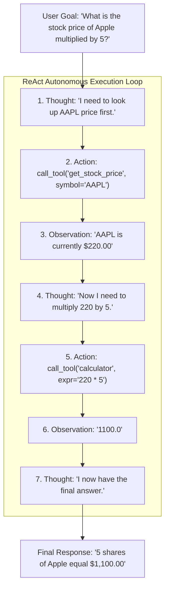
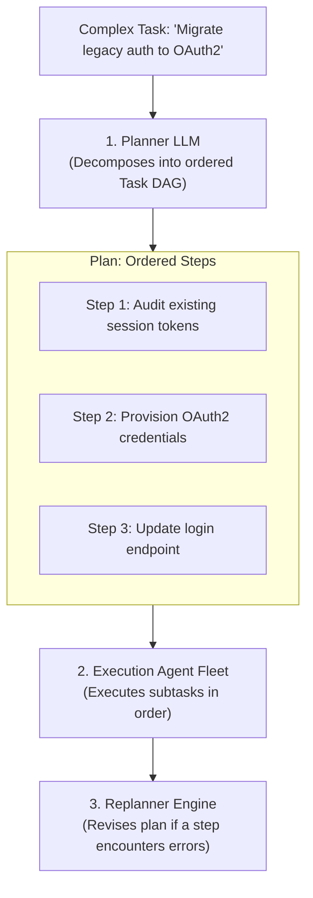
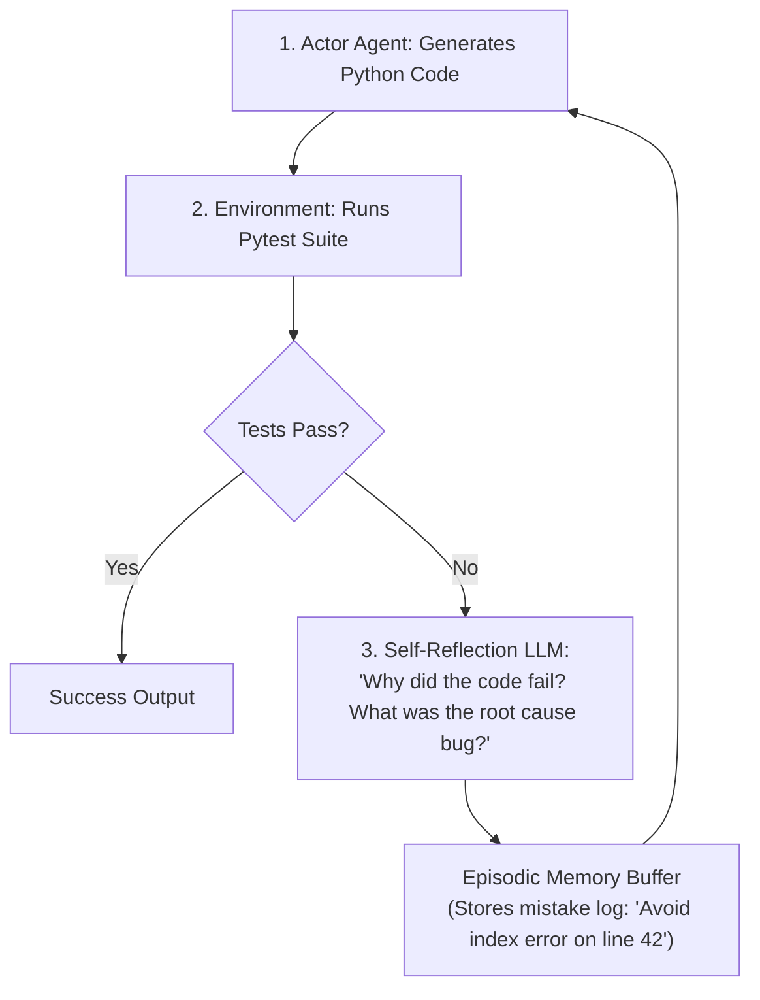

# Agentic AI Chapter 4: Agent Cognitive Architectures: ReAct, Plan-and-Solve & Reflection

> **Core Learning Objective:** Master the cognitive loops that drive autonomous AI agents. Build a working ReAct (Reasoning + Acting) loop from scratch, understand Plan-and-Solve architectures, and implement iterative self-correction with Reflexion.

---

## 1. The ReAct Pattern (Reasoning + Acting)

The **ReAct** architecture (Yao et al., 2022) combines internal reasoning traces with external tool actions in an iterative cycle:



### Complete ReAct Loop Implementation in Python
```python
import re
from typing import Dict, Callable

class SimpleReActAgent:
    def __init__(self, tools: Dict[str, Callable[[str], str]]):
        self.tools = tools
        self.system_prompt = (
            "You solve problems by looping through:\n"
            "Thought: <your reasoning>\n"
            "Action: tool_name[argument]\n"
            "Observation: <result of action>\n"
            "When you have the final answer, output: Final Answer: <your answer>"
        )

    def step(self, prompt: str) -> str:
        # Mock LLM generation simulating reasoning steps
        if "Observation: 220" in prompt:
            return "Thought: I have the stock price. Now multiply by 5.\nAction: calculate[220 * 5]"
        elif "Observation: 1100" in prompt:
            return "Thought: Calculation complete.\nFinal Answer: $1,100.00"
        else:
            return "Thought: I need to get the stock price of Apple.\nAction: get_stock[AAPL]"

    def run(self, query: str, max_iterations: int = 5) -> str:
        history = f"{self.system_prompt}\n\nQuestion: {query}\n"
        
        for iteration in range(max_iterations):
            response = self.step(history)
            print(f"\n[Iteration {iteration + 1}]\n{response}")
            history += response + "\n"

            if "Final Answer:" in response:
                return response.split("Final Answer:")[1].strip()

            # Parse Action: tool_name[arg]
            action_match = re.search(r"Action:\s*(\w+)\[(.*?)\]", response)
            if action_match:
                tool_name, tool_arg = action_match.groups()
                tool_fn = self.tools.get(tool_name)
                observation = tool_fn(tool_arg) if tool_fn else f"Error: Tool {tool_name} not found"
                print(f"Observation: {observation}")
                history += f"Observation: {observation}\n"

        return "Agent reached maximum iteration limit without resolving answer."

# Mock tools
def mock_stock(symbol: str) -> str: return "220"
def mock_calc(expr: str) -> str: return str(eval(expr))

agent = SimpleReActAgent({"get_stock": mock_stock, "calculate": mock_calc})
final = agent.run("What is Apple stock price times 5?")
print("\nFinal Result:", final)
```

---

## 2. Plan-and-Solve Architecture

While ReAct decides each step greedily one by one (which can get lost in deep rabbit holes), **Plan-and-Solve** separates high-level planning from mechanical execution:



---

## 3. Reflexion: Iterative Self-Correction

Reflexion (Shinn et al., 2023) equips agents with an **evaluator and memory of failures**:


*By reading its own previous mistakes in memory, the model refactors its code and avoids repeating bugs, increasing complex coding benchmark accuracy by $> 30\%$.*


## 4. Runnable Model: The Three Loops with Their Safety Limits

Every architecture above is a loop, and every production incident with agents is a loop that did not stop. These versions run offline with a scripted "model" so you can see the guards work.

```python
import json

def react_loop(llm, tools, question, max_steps=5):
    """ReAct: alternate model decisions and tool calls until it answers, repeats itself, or runs out of budget."""
    trace, seen = [], set()
    for _ in range(max_steps):
        out = llm(question, trace)
        if "answer" in out:
            return out["answer"], trace
        key = (out["tool"], json.dumps(out["args"], sort_keys=True))
        if key in seen:                                   # the identical call twice means no progress
            return "STOPPED: repeated tool call", trace
        seen.add(key)
        trace.append((out["tool"], out["args"], tools[out["tool"]](**out["args"])))
    return "STOPPED: step budget exhausted", trace

tools = {"add": lambda a, b: a + b}

script = iter([{"tool": "add", "args": {"a": 2, "b": 3}}, {"answer": "5"}])
answer, trace = react_loop(lambda q, t: next(script), tools, "2+3?")
assert answer == "5" and len(trace) == 1                  # one tool call, then a final answer

answer, trace = react_loop(lambda q, t: {"tool": "add", "args": {"a": 1, "b": 1}}, tools, "?")
assert answer == "STOPPED: repeated tool call" and len(trace) == 1      # an infinite loop is cut after the second identical call

n = iter(range(100))
answer, _ = react_loop(lambda q, t: {"tool": "add", "args": {"a": next(n), "b": 0}}, tools, "?", max_steps=3)
assert answer == "STOPPED: step budget exhausted"         # progress that never ends is cut by the budget

def plan_and_solve(plan, executors, replan, max_replans=1):
    """Run a fixed plan; if a step fails, ask for replacement steps (bounded), then continue."""
    steps, results, i, replans = list(plan), [], 0, 0
    while i < len(steps):
        name = steps[i]
        try:
            results.append((name, executors[name]()))
            i += 1
        except Exception as err:
            if replans >= max_replans:
                raise
            replans += 1
            steps = steps[:i] + replan(name, err) + steps[i + 1:]
    return results

def fetch_primary():
    raise ConnectionError("primary source down")

executors = {"fetch_primary": fetch_primary, "fetch_backup": lambda: "data", "summarise": lambda: "summary"}
done = plan_and_solve(["fetch_primary", "summarise"], executors, lambda name, err: ["fetch_backup"])
assert [name for name, _ in done] == ["fetch_backup", "summarise"]      # the failed step was replaced, the rest ran

def reflexion(generate, critique, max_rounds=3):
    """Generate, critique, and regenerate with the feedback until the critic is satisfied or rounds run out."""
    feedback = None
    for round_no in range(1, max_rounds + 1):
        draft = generate(feedback)
        feedback = critique(draft)
        if feedback is None:
            return draft, round_no
    return draft, max_rounds

generate = lambda fb: "def f(x): return x" if fb is None else "def f(x): return x + 1"
critique = lambda draft: None if "x + 1" in draft else "off by one: expected x + 1"
draft, rounds = reflexion(generate, critique)
assert "x + 1" in draft and rounds == 2                   # fixed after one round of feedback
assert reflexion(lambda fb: "bad", lambda d: "still bad", max_rounds=3) == ("bad", 3)   # the loop is bounded
```

**Pattern selection.** Use **ReAct** when the next step depends on what the last tool returned; **plan-and-solve** when the steps are knowable in advance (cheaper, easier to audit, and you can show the plan to a human before running it); **reflexion** when you have a reliable critic, such as unit tests or a schema validator. A critic that is itself a language model with no ground truth often reinforces the first answer rather than improving it.

### Termination checklist for any agent loop

1. A hard **step budget** and a **token or cost budget**.
2. **Repeated-call detection** (same tool, same arguments).
3. A **wall-clock timeout** around every tool call.
4. A defined behaviour when stopped: return partial work and say why, rather than raising a bare exception.
5. Log the full trace; most agent bugs are diagnosed by reading it.

---

## Further Reading

- [ReAct paper](https://arxiv.org/abs/2210.03629)
- [Anthropic: building effective agents](https://www.anthropic.com/engineering/building-effective-agents)
- [Lilian Weng: LLM powered autonomous agents](https://lilianweng.github.io/posts/2023-06-23-agent/)


---

## Check Yourself

Answer in your head or on paper first, then open each answer.

<details>
<summary><strong>1.</strong> ReAct in one sentence?</summary>

The model alternates reasoning steps and tool actions, using each observation to decide the next step.

</details>

<details>
<summary><strong>2.</strong> Plan-and-solve versus ReAct?</summary>

Plan-and-solve writes a full plan first (fewer calls, reviewable); ReAct decides step by step (more adaptive).

</details>

<details>
<summary><strong>3.</strong> Why do agents need step budgets?</summary>

To stop infinite loops and runaway cost when the model cannot make progress.

</details>

<details>
<summary><strong>4.</strong> Why model an agent as a state machine?</summary>

Explicit states and transitions make behaviour testable, resumable and debuggable.

</details>
