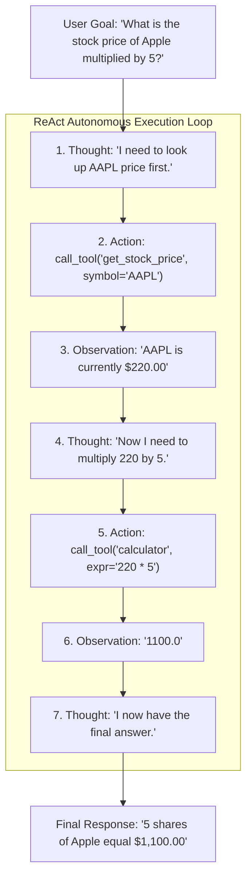
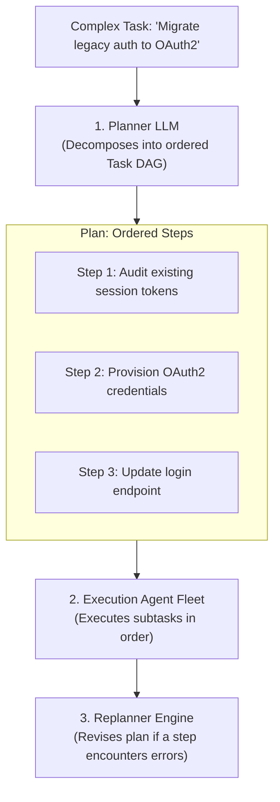
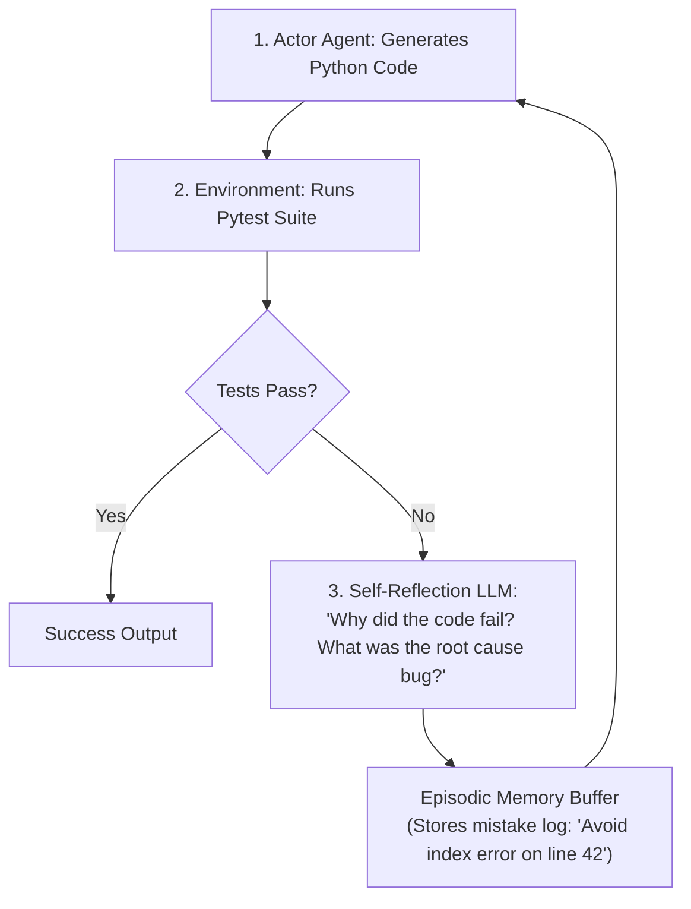

# Agentic AI Chapter 4: Agent Cognitive Architectures: ReAct, Plan-and-Solve & Reflection

> **Core Learning Objective:** Master the cognitive loops that drive autonomous AI agents. Build a working ReAct (Reasoning + Acting) loop from scratch, understand Plan-and-Solve architectures, and implement iterative self-correction with Reflexion.

---

## 1. The ReAct Pattern (Reasoning + Acting)

The **ReAct** architecture (Yao et al., 2022) combines internal reasoning traces with external tool actions in an iterative cycle:



### Complete ReAct Loop Implementation in Python
```python
import re
from typing import Dict, Callable

class SimpleReActAgent:
    def __init__(self, tools: Dict[str, Callable[[str], str]]):
        self.tools = tools
        self.system_prompt = (
            "You solve problems by looping through:\n"
            "Thought: <your reasoning>\n"
            "Action: tool_name[argument]\n"
            "Observation: <result of action>\n"
            "When you have the final answer, output: Final Answer: <your answer>"
        )

    def step(self, prompt: str) -> str:
        # Mock LLM generation simulating reasoning steps
        if "Observation: 220" in prompt:
            return "Thought: I have the stock price. Now multiply by 5.\nAction: calculate[220 * 5]"
        elif "Observation: 1100" in prompt:
            return "Thought: Calculation complete.\nFinal Answer: $1,100.00"
        else:
            return "Thought: I need to get the stock price of Apple.\nAction: get_stock[AAPL]"

    def run(self, query: str, max_iterations: int = 5) -> str:
        history = f"{self.system_prompt}\n\nQuestion: {query}\n"
        
        for iteration in range(max_iterations):
            response = self.step(history)
            print(f"\n[Iteration {iteration + 1}]\n{response}")
            history += response + "\n"

            if "Final Answer:" in response:
                return response.split("Final Answer:")[1].strip()

            # Parse Action: tool_name[arg]
            action_match = re.search(r"Action:\s*(\w+)\[(.*?)\]", response)
            if action_match:
                tool_name, tool_arg = action_match.groups()
                tool_fn = self.tools.get(tool_name)
                observation = tool_fn(tool_arg) if tool_fn else f"Error: Tool {tool_name} not found"
                print(f"Observation: {observation}")
                history += f"Observation: {observation}\n"

        return "Agent reached maximum iteration limit without resolving answer."

# Mock tools
def mock_stock(symbol: str) -> str: return "220"
def mock_calc(expr: str) -> str: return str(eval(expr))

agent = SimpleReActAgent({"get_stock": mock_stock, "calculate": mock_calc})
final = agent.run("What is Apple stock price times 5?")
print("\nFinal Result:", final)
```

---

## 2. Plan-and-Solve Architecture

While ReAct decides each step greedily one by one (which can get lost in deep rabbit holes), **Plan-and-Solve** separates high-level planning from mechanical execution:



---

## 3. Reflexion: Iterative Self-Correction

Reflexion (Shinn et al., 2023) equips agents with an **evaluator and memory of failures**:


*By reading its own previous mistakes in memory, the model refactors its code and avoids repeating bugs, increasing complex coding benchmark accuracy by $> 30\%$.*
