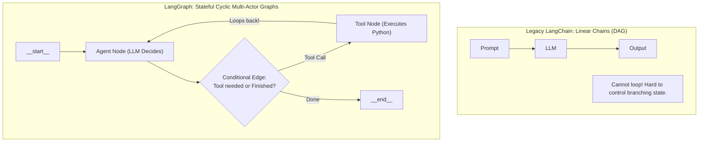
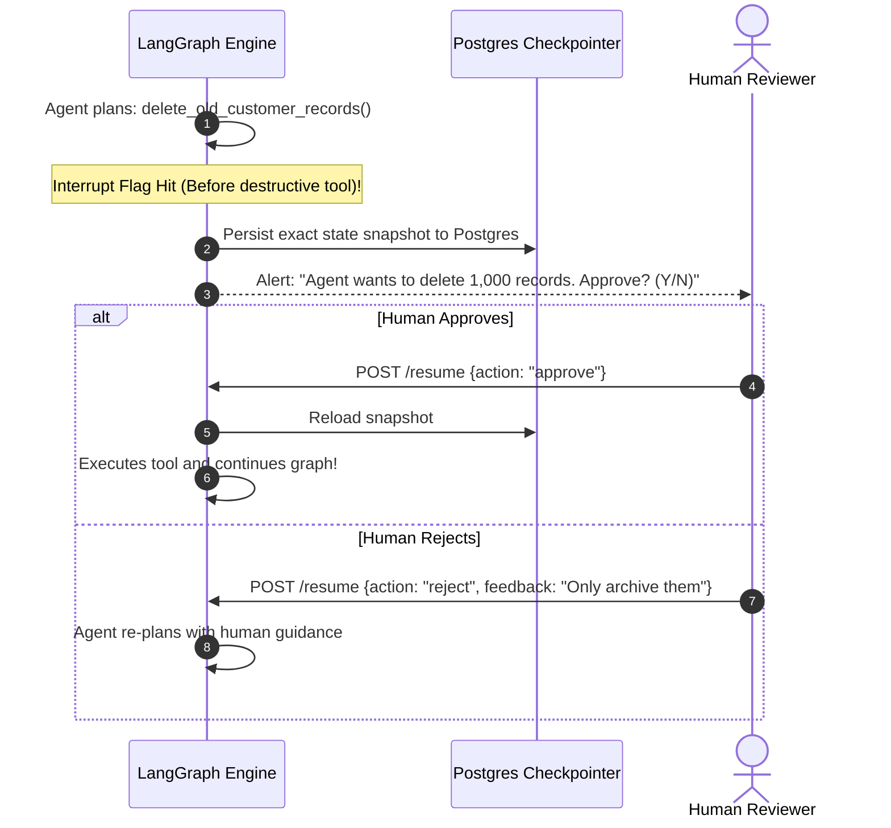

# Agentic AI Chapter 5: LangChain & LangGraph Stateful Workflow Mastery

> **Core Learning Objective:** Master modern stateful agent systems using LangGraph. Understand cyclic graphs, typed state schemas, conditional branching edges, persistence checkpoints, and Human-in-the-Loop approval workflows.

---

## 1. Why LangGraph Replaced Linear Chains

Legacy frameworks (LangChain chains, LCEL) were designed as **Directed Acyclic Graphs (DAGs)**. But real agents are **inherently cyclic**: they try an action, inspect output, loop back, retry, ask clarifications, and refine results.



---

## 2. Core LangGraph Primitives

1. **State:** A centralized typed dictionary (`TypedDict`) shared across all nodes in the graph. Nodes return partial updates that merge into the state.
2. **Nodes:** Plain Python functions that receive the current `State`, perform computation (call an LLM or execute a tool), and return updated keys.
3. **Edges:** Direct transitions from one node to another.
4. **Conditional Edges:** Dynamic routers that inspect the state and determine the next destination node.

---

## 3. LangGraph-Style Agent (Pure-Python Emulation of the Model)

```python
from typing import TypedDict, Annotated, Sequence
import operator

# 1. Define the Global State Schema
class AgentState(TypedDict):
    messages: list[str]
    current_step: int
    tool_output: str | None
    is_finished: bool

# 2. Define Graph Nodes (Pure Python Functions)
def agent_node(state: AgentState) -> dict:
    """Simulates LLM reasoning over the conversation history."""
    step = state.get("current_step", 0) + 1
    print(f"\n[Node: Agent] Evaluating step {step}...")
    
    if step == 1:
        # LLM decides it needs to query the database
        return {"current_step": step, "messages": state["messages"] + ["Calling QueryDB Tool"]}
    else:
        # LLM has tool output; concludes task
        return {"current_step": step, "is_finished": True, "messages": state["messages"] + ["Final Answer Generated"]}

def tool_node(state: AgentState) -> dict:
    """Executes external tool."""
    print("[Node: ToolExecutor] Running SQL query on warehouse...")
    result = "Total Sales: $1.4M across 4,200 orders"
    return {"tool_output": result, "messages": state["messages"] + [f"Tool Result: {result}"]}

# 3. Define Conditional Routing Function
def should_continue(state: AgentState) -> str:
    if state.get("is_finished", False):
        return "end"
    if state.get("tool_output") is None:
        return "call_tool"
    return "agent"

# 4. In-Memory Graph Runner Emulating LangGraph Architecture
class CompiledGraph:
    def __init__(self):
        self.nodes = {"agent": agent_node, "tool": tool_node}

    def invoke(self, initial_state: AgentState) -> AgentState:
        state = initial_state
        current_node = "agent"

        while True:
            # Execute active node
            updates = self.nodes[current_node](state)
            state.update(updates)

            # Evaluate conditional edge
            next_step = should_continue(state)
            if next_step == "end":
                print("\n[Graph] Reached __end__ state!")
                break
            elif next_step == "call_tool":
                current_node = "tool"
            else:
                current_node = "agent"

        return state

# --- Verification Driver ---
graph = CompiledGraph()
final_state = graph.invoke({
    "messages": ["User: What were our Q3 sales?"],
    "current_step": 0,
    "tool_output": None,
    "is_finished": False
})

print("\nFinal State Log:")
for msg in final_state["messages"]:
    print(f"  * {msg}")
```

---

## 4. Human-in-the-Loop & Time-Travel Checkpointing

In production, agents executing destructive actions (e.g. modifying financial ledgers, sending mass emails, dropping tables) must be paused for **Human Approval**:


*Time-travel checkpointing allows developers to inspect every historical node execution, modify past state variables, and branch alternative execution paths during debugging.*

---

## Verified Worked Example: Real LangGraph with Human-in-the-Loop

The section above emulates the LangGraph execution model in plain Python to teach the ideas. The real API is exercised in [`examples/ex02_langgraph_hitl.py`](examples/ex02_langgraph_hitl.py), verified on `langgraph==1.2.13`: a typed `State` with an append reducer (`Annotated[list, operator.add]`), nodes returning partial updates, a conditional edge, an `InMemorySaver` checkpointer, and an `interrupt()` that pauses for approval and resumes with `Command(resume=...)` on the same `thread_id`. Two behaviours worth testing yourself: (1) the side-effecting node runs **only after** approval, and (2) rejecting leaves `executed` out of the log.

**Version note.** LangGraph's API evolves quickly (for example `MemorySaver` became `InMemorySaver`, and the human-in-the-loop primitives changed from static breakpoints to `interrupt`/`Command`). Pin the version and re-run the examples when upgrading.

Pinned for the verified examples: `langgraph==1.2.13`, `mcp==2.3.0`, `pytest==9.1.1` (see `examples/requirements.txt`). All examples run offline with a scripted fake model: `cd examples && pip install -r requirements.txt && pytest -q`.
