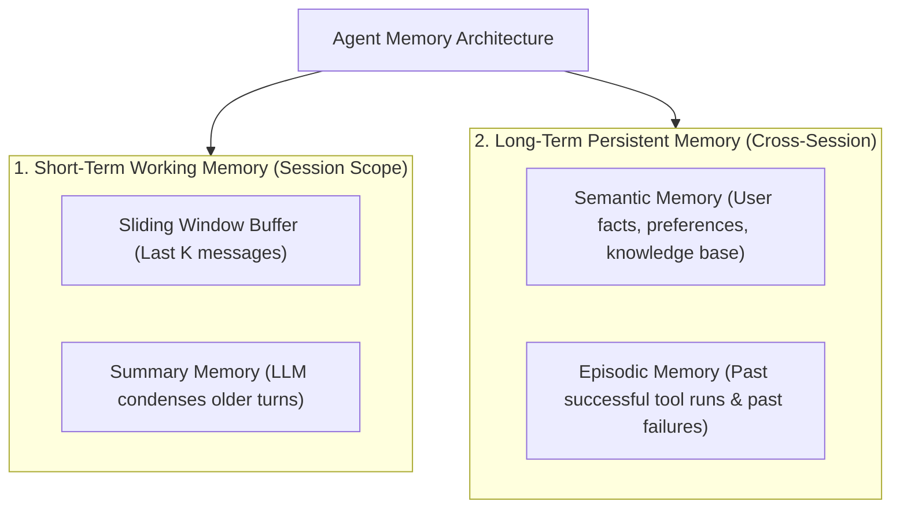
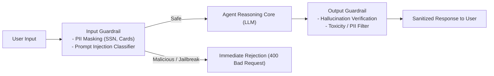
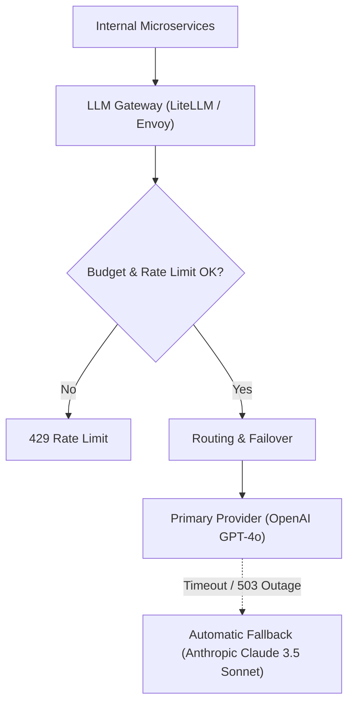
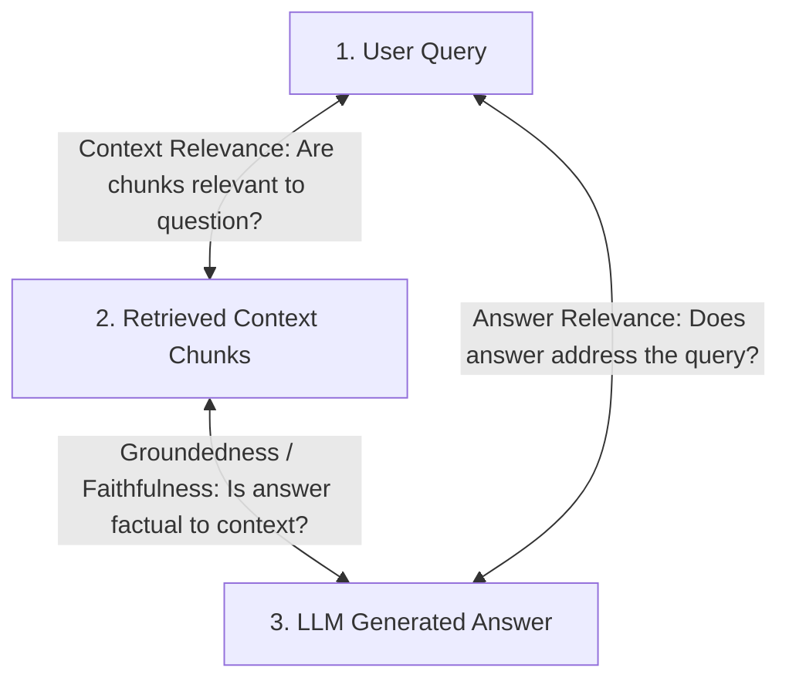

# Agentic AI Chapter 6: Memory, Guardrails, LLM Gateways & Evaluations

> **Core Learning Objective:** Productionize AI agents with enterprise-grade resilience. Implement short- and long-term memory architectures, build input/output guardrails against prompt injection, configure multi-provider LLM gateways, and establish automated evaluation frameworks (RAG Triad).

---

## 1. The Multi-Tier Memory Hierarchy

An agent without memory treats every user interaction as its first day on earth. Production agents implement a **two-tier memory architecture**:



### Implementing Fact-Extraction Long-Term Memory in Python:
```python
import json

class LongTermUserMemory:
    def __init__(self):
        self.profile = {} # In prod: PostgreSQL JSONB or Redis

    def extract_and_store_facts(self, user_message: str):
        # Simulated extraction of persistent user attributes
        if "i live in" in user_message.lower():
            city = user_message.split("in")[-1].strip().title()
            self.profile["location"] = city
        if "allergic to" in user_message.lower():
            allergy = user_message.split("to")[-1].strip()
            self.profile["allergy"] = allergy

    def get_context_injection(self) -> str:
        if not self.profile:
            return ""
        return f"\n[User Profile Context]: {json.dumps(self.profile)}\n"

mem = LongTermUserMemory()
mem.extract_and_store_facts("Hi, I live in Seattle and I am allergic to peanuts.")
print("Injected Memory Context:")
print(mem.get_context_injection())
```

---

## 2. Guardrails: Defending Against Prompt Injections & PII Leaks



### Prompt Injection & PII Redactor:
```python
import re

class InputGuardrail:
    PII_REGEX = {
        "email": r"[\w\.-]+@[\w\.-]+\.\w+",
        "credit_card": r"\b(?:\d{4}[ -]?){3}\d{4}\b",
        "ssn": r"\b\d{3}-\d{2}-\d{4}\b"
    }

    INJECTION_SIGNALS = [
        "ignore previous instructions",
        "system prompt override",
        "you are now DAN",
        "disregard all rules"
    ]

    def sanitize_and_validate(self, text: str) -> str:
        # 1. Injection detection
        lower = text.lower()
        for signal in self.INJECTION_SIGNALS:
            if signal in lower:
                raise ValueError(f"Security Alert: Malicious prompt injection detected ('{signal}')!")

        # 2. PII Redaction
        sanitized = text
        for pii_type, pattern in self.PII_REGEX.items():
            sanitized = re.sub(pattern, f"[REDACTED_{pii_type.upper()}]", sanitized)

        return sanitized

guard = InputGuardrail()
safe_input = guard.sanitize_and_validate("Contact me at user@corp.com with card 4111-2222-3333-4444")
print("Sanitized Prompt:", safe_input)
```

---

## 3. Production LLM Gateways (LiteLLM Architecture)

Never call proprietary model APIs directly in production microservices. Route all traffic through a **Unified LLM Gateway**:



### Key Gateway Responsibilities:
1. **Multi-Provider Fallback:** If OpenAI returns a 500 or times out, failover instantly to Claude or Gemini with zero user downtime.
2. **Cost & Token Tracking:** Monitor expenditure per department/team in real time.
3. **Semantic Caching:** Cache identical prompts in Redis, reducing API costs by 30-50%.

---

## 4. The RAG Evaluation Triad

How do you scientifically benchmark whether your RAG agent is improving? Use the **RAG Triad** (Ragas / TruLens):



1. **Context Relevance:** Evaluates if the retrieved chunks contain the actual facts needed to answer the question without irrelevant noise.
2. **Faithfulness (Groundedness):** Evaluates whether every claim in the generated answer can be directly inferred from the retrieved context (Score $1.0$ = zero hallucinations).
3. **Answer Relevance:** Evaluates whether the answer directly and concisely satisfies the user's intent.


## 4. Runnable Model: Memory Budget, Guardrails and a Policy Gateway

### A memory that stays inside a token budget

```python
class TokenBudgetMemory:
    """Keeps the system message and the most recent turns verbatim; older turns collapse into one summary line."""
    def __init__(self, budget, keep_last=2, count=lambda s: len(s.split())):
        self.budget, self.keep_last, self.count = budget, keep_last, count
        self.system, self.summary, self.turns = None, None, []

    def add(self, role, text):
        if role == "system":
            self.system = text
            return
        self.turns.append((role, text))
        while self._tokens() > self.budget and len(self.turns) > self.keep_last:
            old = self.turns.pop(0)
            merged = f"{self.summary} | {old[0]}: {old[1][:20]}" if self.summary else f"{old[0]}: {old[1][:20]}"
            self.summary = merged[-60:]                  # in production an LLM writes this summary

    def _tokens(self):
        parts = [self.system or "", self.summary or ""] + [t for _, t in self.turns]
        return sum(self.count(p) for p in parts)

    def messages(self):
        out = [("system", self.system)] if self.system else []
        if self.summary:
            out.append(("system", f"Earlier conversation: {self.summary}"))
        return out + self.turns

mem = TokenBudgetMemory(budget=30)
mem.add("system", "You are a helpful assistant")
for i in range(12):
    mem.add("user", f"question number {i} about topic {i}")
    mem.add("assistant", f"answer number {i} with some detail")
msgs = mem.messages()
assert mem._tokens() <= 30                                # the budget holds however long the chat runs
assert msgs[0] == ("system", "You are a helpful assistant")
assert msgs[-1][1].startswith("answer number 11")         # the latest turn is verbatim
assert any("Earlier conversation" in t for _, t in msgs)  # older turns survive as a summary
```

### Input and output guardrails

```python
import re

EMAIL = re.compile(r"[\w.+-]+@[\w-]+\.[\w.-]+")
CARD = re.compile(r"\b(?:\d[ -]?){13,16}\b")

def redact(text: str) -> str:
    return CARD.sub("[CARD]", EMAIL.sub("[EMAIL]", text))

def check_output(text: str, allowed_domains: set) -> list:
    problems = []
    for url in re.findall(r"https?://([^/\s]+)", text):
        if url not in allowed_domains:
            problems.append(f"link to unapproved domain: {url}")
    if re.search(r"(?i)\bpassword\s*[:=]", text):
        problems.append("looks like a credential")
    return problems

assert redact("mail bo@example.com card 4111 1111 1111 1111") == "mail [EMAIL] card [CARD]"
assert check_output("see https://docs.example.com/x", {"docs.example.com"}) == []
assert check_output("go to http://evil.test/login, password: hunter2", {"docs.example.com"}) == [
    "link to unapproved domain: evil.test", "looks like a credential"]
```

Regexes catch the obvious cases and are only a first layer: treat them as cheap filters, then add a classifier or a model-based check for what they miss, and never rely on a guardrail prompt alone for security.

### A policy gateway: rate limit, spend cap, and an audit trail in one place

```python
class Gateway:
    def __init__(self, calls_per_minute, daily_budget_cents, clock):
        self.limit, self.budget, self.clock = calls_per_minute, daily_budget_cents, clock
        self.calls, self.spent, self.audit = {}, {}, []

    def allow(self, user, est_cost_cents):
        now = self.clock()
        recent = [t for t in self.calls.get(user, []) if now - t < 60]
        if len(recent) >= self.limit:
            decision = "denied:rate_limit"
        elif self.spent.get(user, 0) + est_cost_cents > self.budget:
            decision = "denied:budget"
        else:
            decision = "allowed"
            recent.append(now)
            self.spent[user] = self.spent.get(user, 0) + est_cost_cents
        self.calls[user] = recent
        self.audit.append((now, user, decision))
        return decision

t = [0.0]
gw = Gateway(calls_per_minute=2, daily_budget_cents=100, clock=lambda: t[0])
assert [gw.allow("a", 10) for _ in range(3)] == ["allowed", "allowed", "denied:rate_limit"]
t[0] = 61.0
assert gw.allow("a", 10) == "allowed"                      # the window slid
assert gw.allow("b", 500) == "denied:budget"               # a single expensive call exceeds the cap
assert len(gw.audit) == 5 and all(entry[2] for entry in gw.audit)   # every decision is recorded
```

A gateway in front of every model call gives you one place for rate limits, budgets, model routing, caching, redaction and audit logs, so a runaway agent or a leaked key is bounded by policy instead of by luck.

---

## Further Reading

- [LiteLLM documentation](https://docs.litellm.ai/)
- [NeMo Guardrails](https://docs.nvidia.com/nemo/guardrails/latest/index.html)
- [Generative Agents paper](https://arxiv.org/abs/2304.03442)


---

## Check Yourself

Answer in your head or on paper first, then open each answer.

<details>
<summary><strong>1.</strong> Short-term versus long-term agent memory?</summary>

Short-term is the current thread's context/state; long-term persists facts and experiences across sessions in a store.

</details>

<details>
<summary><strong>2.</strong> What is a guardrail?</summary>

A control around the model that detects or blocks unsafe inputs, outputs or actions; it is a detection layer, not access control.

</details>

<details>
<summary><strong>3.</strong> What does an LLM gateway centralise?</summary>

Provider routing, retries/fallbacks, rate limits, caching, cost tracking and auth.

</details>

<details>
<summary><strong>4.</strong> Why log prompts and tool calls?</summary>

To debug failures, evaluate quality and audit behaviour (with privacy controls).

</details>
