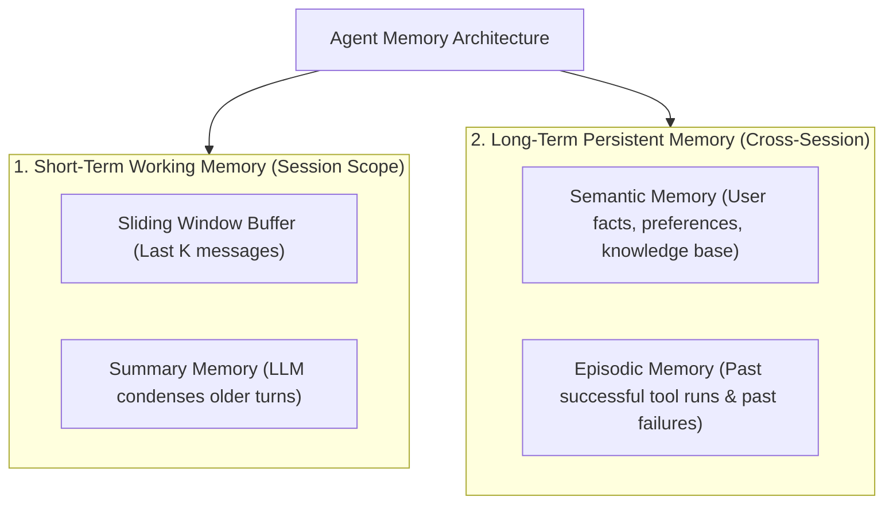
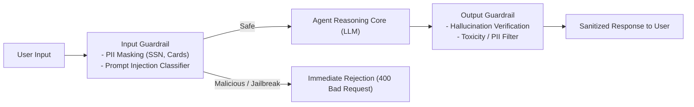
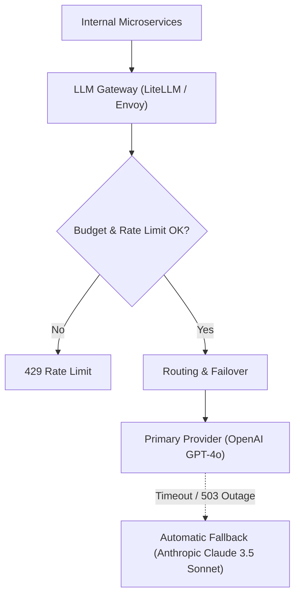
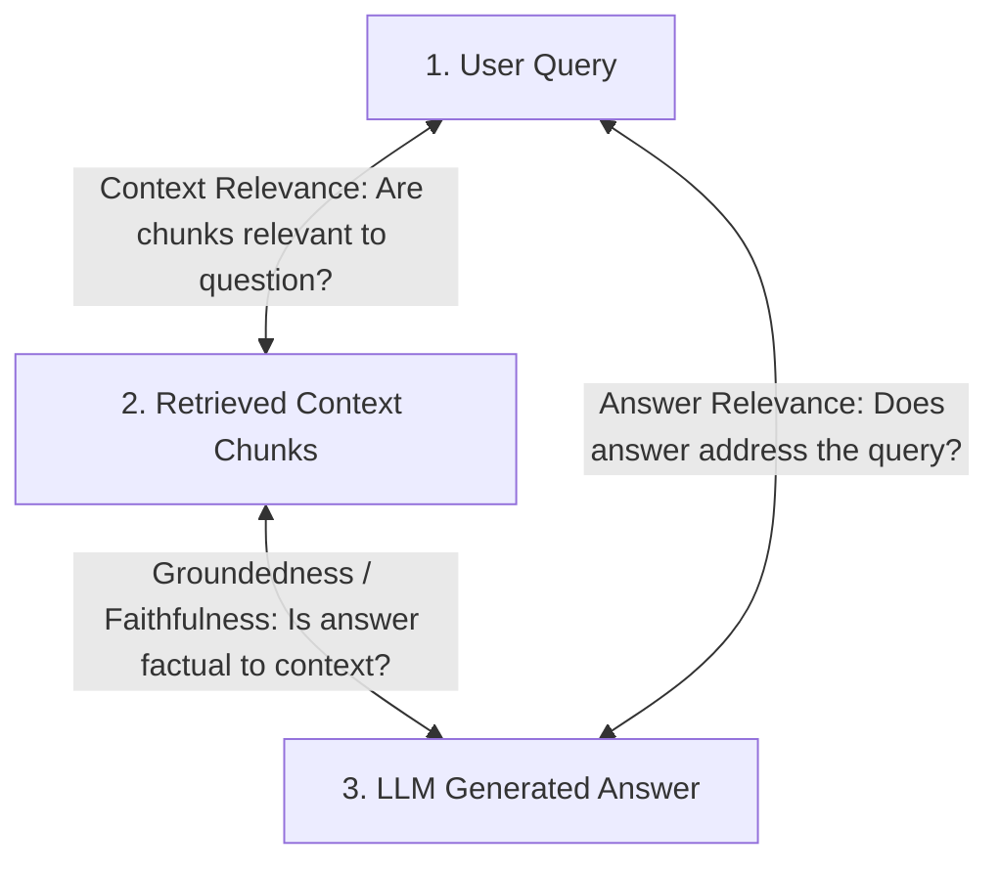

# Agentic AI Chapter 6: Memory, Guardrails, LLM Gateways & Evaluations

> **Core Learning Objective:** Productionize AI agents with enterprise-grade resilience. Implement short- and long-term memory architectures, build input/output guardrails against prompt injection, configure multi-provider LLM gateways, and establish automated evaluation frameworks (RAG Triad).

---

## 1. The Multi-Tier Memory Hierarchy

An agent without memory treats every user interaction as its first day on earth. Production agents implement a **two-tier memory architecture**:



### Implementing Fact-Extraction Long-Term Memory in Python:
```python
import json

class LongTermUserMemory:
    def __init__(self):
        self.profile = {} # In prod: PostgreSQL JSONB or Redis

    def extract_and_store_facts(self, user_message: str):
        # Simulated extraction of persistent user attributes
        if "i live in" in user_message.lower():
            city = user_message.split("in")[-1].strip().title()
            self.profile["location"] = city
        if "allergic to" in user_message.lower():
            allergy = user_message.split("to")[-1].strip()
            self.profile["allergy"] = allergy

    def get_context_injection(self) -> str:
        if not self.profile:
            return ""
        return f"\n[User Profile Context]: {json.dumps(self.profile)}\n"

mem = LongTermUserMemory()
mem.extract_and_store_facts("Hi, I live in Seattle and I am allergic to peanuts.")
print("Injected Memory Context:")
print(mem.get_context_injection())
```

---

## 2. Guardrails: Defending Against Prompt Injections & PII Leaks



### Prompt Injection & PII Redactor:
```python
import re

class InputGuardrail:
    PII_REGEX = {
        "email": r"[\w\.-]+@[\w\.-]+\.\w+",
        "credit_card": r"\b(?:\d{4}[ -]?){3}\d{4}\b",
        "ssn": r"\b\d{3}-\d{2}-\d{4}\b"
    }

    INJECTION_SIGNALS = [
        "ignore previous instructions",
        "system prompt override",
        "you are now DAN",
        "disregard all rules"
    ]

    def sanitize_and_validate(self, text: str) -> str:
        # 1. Injection detection
        lower = text.lower()
        for signal in self.INJECTION_SIGNALS:
            if signal in lower:
                raise ValueError(f"Security Alert: Malicious prompt injection detected ('{signal}')!")

        # 2. PII Redaction
        sanitized = text
        for pii_type, pattern in self.PII_REGEX.items():
            sanitized = re.sub(pattern, f"[REDACTED_{pii_type.upper()}]", sanitized)

        return sanitized

guard = InputGuardrail()
safe_input = guard.sanitize_and_validate("Contact me at user@corp.com with card 4111-2222-3333-4444")
print("Sanitized Prompt:", safe_input)
```

---

## 3. Production LLM Gateways (LiteLLM Architecture)

Never call proprietary model APIs directly in production microservices. Route all traffic through a **Unified LLM Gateway**:



### Key Gateway Responsibilities:
1. **Multi-Provider Fallback:** If OpenAI returns a 500 or times out, failover instantly to Claude or Gemini with zero user downtime.
2. **Cost & Token Tracking:** Monitor expenditure per department/team in real time.
3. **Semantic Caching:** Cache identical prompts in Redis, reducing API costs by 30-50%.

---

## 4. The RAG Evaluation Triad

How do you scientifically benchmark whether your RAG agent is improving? Use the **RAG Triad** (Ragas / TruLens):



1. **Context Relevance:** Evaluates if the retrieved chunks contain the actual facts needed to answer the question without irrelevant noise.
2. **Faithfulness (Groundedness):** Evaluates whether every claim in the generated answer can be directly inferred from the retrieved context (Score $1.0$ = zero hallucinations).
3. **Answer Relevance:** Evaluates whether the answer directly and concisely satisfies the user's intent.
