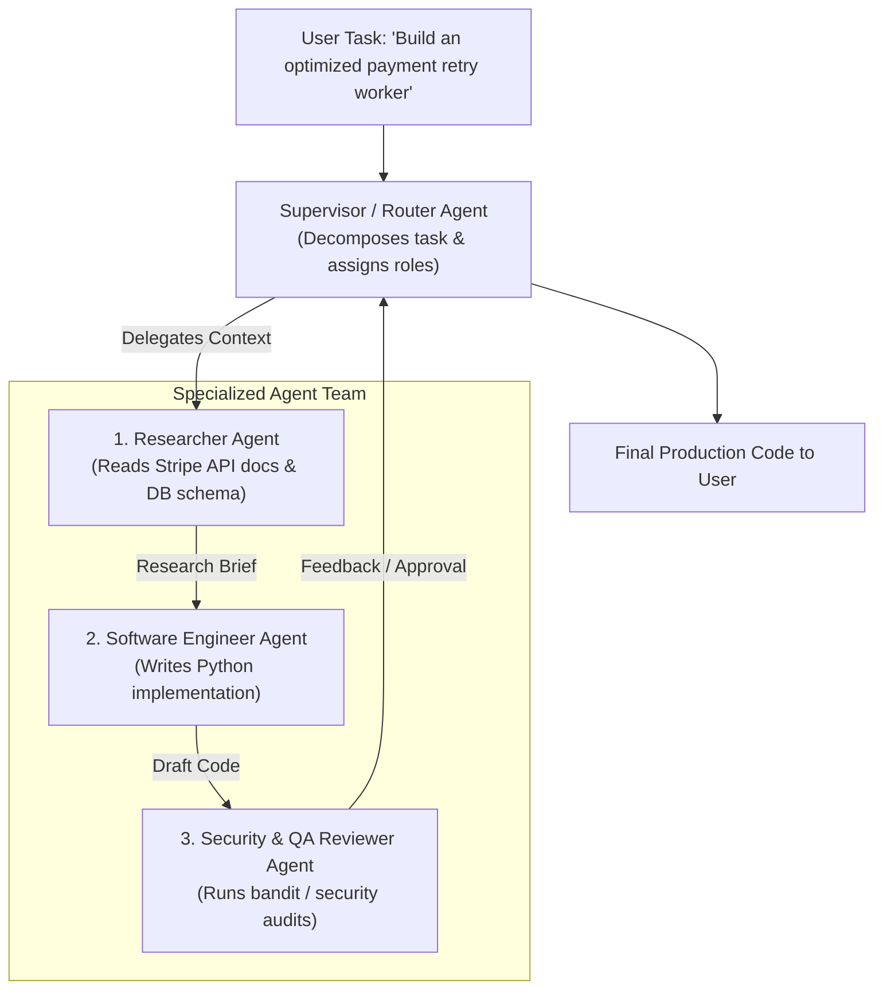
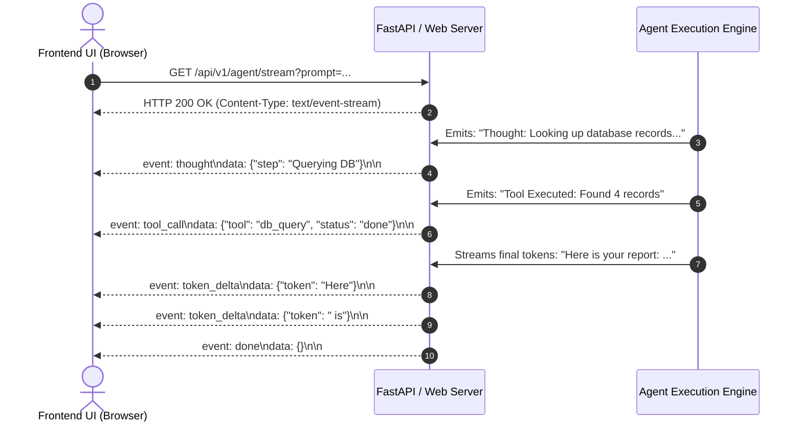

# Agentic AI Chapter 7: Multi-Agent Collaboration & Production Deployment

> **Core Learning Objective:** Master planetary-scale multi-agent systems. Build Supervisor-Worker swarms, implement peer-to-peer handoffs, stream token deltas via Server-Sent Events (SSE), and configure distributed tracing with OpenTelemetry and LangSmith.

---

## 1. Multi-Agent Topologies

As tasks grow complex, a single monolithic agent with 30 tools fails due to context pollution and tool selection confusion. The solution is **Specialized Multi-Agent Teams**:



---

## 2. Multi-Agent Supervisor (Simulation: Scripted Agents, No Real LLM)

```python
from typing import Dict, Any

class Agent:
    def __init__(self, name: str, role_prompt: str):
        self.name = name
        self.role_prompt = role_prompt

    def execute(self, task: str) -> str:
        # Simulated specialized subagent logic
        if self.name == "Researcher":
            return f"[{self.name}] Findings: Stripe recommends exponential jitter backoff on 429/500 errors."
        elif self.name == "Engineer":
            return f"[{self.name}] Generated Python retry decorator using tenacity library."
        elif self.name == "Auditor":
            return f"[{self.name}] Verification Passed: Zero security flaws or unhandled exception leaks."
        return f"[{self.name}] Task completed."

class MultiAgentSupervisor:
    def __init__(self):
        self.agents = {
            "research": Agent("Researcher", "Senior Research Specialist"),
            "coding": Agent("Engineer", "Principal Python Architect"),
            "qa": Agent("Auditor", "AppSec Security Auditor")
        }

    def run_collaborative_workflow(self, project_goal: str) -> Dict[str, str]:
        print(f"\n[Supervisor] Orchestrating Project: '{project_goal}'")
        
        # Step 1: Research
        research_brief = self.agents["research"].execute(project_goal)
        print(research_brief)

        # Step 2: Implementation (passing research context)
        code_artifact = self.agents["coding"].execute(research_brief)
        print(code_artifact)

        # Step 3: Security & Code Audit
        audit_report = self.agents["qa"].execute(code_artifact)
        print(audit_report)

        return {
            "research": research_brief,
            "code": code_artifact,
            "audit": audit_report,
            "status": "APPROVED_FOR_PRODUCTION"
        }

# Verification Driver
supervisor = MultiAgentSupervisor()
result = supervisor.run_collaborative_workflow("Build Stripe webhook listener with retry")
print("\nWorkflow Final Status:", result["status"])
```

---

## 3. Real-Time Streaming Architecture (Server-Sent Events - SSE)

Users will not wait 30 seconds staring at a blank screen while an agent reasons and invokes tools. You must stream intermediate thoughts and token deltas in real-time using **Server-Sent Events (SSE)**:



---

## 4. Production Observability: OpenTelemetry & LangSmith

Every production agent deployment must log comprehensive execution spans:
1. **Trace ID:** Uniquely tracks a user request across all subagents and tools.
2. **Span Metrics:**
   * Exact token consumption (Prompt Tokens + Completion Tokens).
   * Wall-clock latency per LLM call vs per tool execution.
   * Model temperature, system prompt version, and exact JSON payloads.
3. **Error Traces:** Stack traces for flaky external tool APIs.

---

## What the Simulation Above Does and Does Not Show

The supervisor example uses scripted agents (fixed strings) so that the control flow is deterministic and testable. It demonstrates delegation, result passing and a final merge, **not** real model behaviour. For a verified graph with checkpointing and approval see [`examples/ex02_langgraph_hitl.py`](examples/ex02_langgraph_hitl.py); to measure whether a multi-agent design beats a single agent, use the repeated-trial harness in [`examples/ex05_eval_harness.py`](examples/ex05_eval_harness.py): report `pass^k` and a Wilson interval, not a single run.

**Cost reality check.** Multi-agent runs multiply tokens (reported around 15x a chat for research agents versus about 4x for a single agent). If the harness shows no statistically clear gain over the single-agent baseline, ship the single agent.


## 4. Runnable Model: A Supervisor with Handoffs, a Turn Budget and Ping-Pong Detection

Multi-agent systems fail in a characteristic way: two agents keep handing work back and forth. The supervisor below shows the three controls that prevent it.

```python
def supervisor(task, workers, first, max_turns=6, max_repeat=2):
    """Route work between workers. A worker returns {"note", "state"?, "handoff"?}; no handoff means done."""
    state, transcript, handoffs = {"task": task}, [], []
    current = first
    for _ in range(max_turns):
        result = workers[current](state)
        transcript.append((current, result["note"]))
        state.update(result.get("state", {}))
        nxt = result.get("handoff")
        if nxt is None:
            return state, transcript
        handoffs.append((current, nxt))
        if handoffs.count((current, nxt)) > max_repeat:
            raise RuntimeError(f"ping-pong between {current} and {nxt}")
        current = nxt
    raise RuntimeError("turn budget exhausted")

workers = {
    "researcher": lambda s: {"note": "found 3 sources", "state": {"sources": 3}, "handoff": "writer"},
    "writer":     lambda s: {"note": "drafted", "state": {"draft": f"report using {s['sources']} sources"}, "handoff": "reviewer"},
    "reviewer":   lambda s: {"note": "approved", "state": {"approved": True}},
}
state, transcript = supervisor("market report", workers, "researcher")
assert [name for name, _ in transcript] == ["researcher", "writer", "reviewer"]
assert state["approved"] is True and state["draft"] == "report using 3 sources"

bouncing = {
    "a": lambda s: {"note": "not my job", "handoff": "b"},
    "b": lambda s: {"note": "not mine either", "handoff": "a"},
}
try:
    supervisor("unclear task", bouncing, "a", max_turns=20)
    raise AssertionError("expected RuntimeError")
except RuntimeError as err:
    assert "ping-pong" in str(err)                         # caught long before the turn budget

endless = {"a": lambda s: {"note": "next", "handoff": "b"}, "b": lambda s: {"note": "next", "handoff": "c"},
           "c": lambda s: {"note": "next", "handoff": "d"}, "d": lambda s: {"note": "next", "handoff": "e"},
           "e": lambda s: {"note": "next", "handoff": "f"}, "f": lambda s: {"note": "next", "handoff": "g"},
           "g": lambda s: {"note": "end"}}
try:
    supervisor("long chain", endless, "a", max_turns=3)
    raise AssertionError("expected RuntimeError")
except RuntimeError as err:
    assert "turn budget" in str(err)                       # a chain longer than the budget is stopped too
```

### When multiple agents help, and when one agent with tools is better

| Situation | Use | Reason |
| :--- | :--- | :--- |
| Steps share most context and are strictly sequential | One agent with tools | Splitting only adds handoff cost and lost context |
| Subtasks are independent and parallelisable (research five companies) | Workers in parallel plus an aggregator | Wall-clock time drops and each context stays small |
| Different permissions are needed (read-only searcher, writer with approval) | Separate agents | Least privilege: the agent that reads untrusted web pages never holds the write tool |
| You want a second opinion (generate, then review) | Two agents with different prompts | Independent critique catches errors one context overlooks |

**Costs to say aloud.** Every handoff re-sends context (tokens), every extra agent multiplies failure modes, and debugging needs a shared trace id across agents. Start with one agent; split when a measured problem (context overflow, permission separation, parallelism) demands it.

### Production checklist for multi-agent systems

1. A **trace id** propagated through every agent and tool call.
2. **Budgets per run**: turns, tokens, wall-clock, and money.
3. **Typed handoff messages** (a schema), not free text, so a malformed handoff fails loudly.
4. **Idempotent tools** so a retried or duplicated step does not repeat a side effect.
5. A **human escalation path** when the supervisor hits any budget.

---

## Further Reading

- [Anthropic: how we built our multi-agent research system](https://www.anthropic.com/engineering/built-multi-agent-research-system)
- [AutoGen documentation](https://microsoft.github.io/autogen/stable/)
- [OpenTelemetry documentation](https://opentelemetry.io/docs/)


---

## Check Yourself

Answer in your head or on paper first, then open each answer.

<details>
<summary><strong>1.</strong> When is a single agent better than multi-agent?</summary>

When steps are tightly coupled and share lots of state; multi-agent suits broad, parallelisable work.

</details>

<details>
<summary><strong>2.</strong> What is a handoff?</summary>

Transferring control (and chosen context) from one agent to another.

</details>

<details>
<summary><strong>3.</strong> Why bound the number of agents and rounds?</summary>

Cost and latency multiply with agents; unbounded delegation can loop.

</details>

<details>
<summary><strong>4.</strong> How do you decide if multi-agent helped?</summary>

Compare against a single-agent baseline with repeated trials (pass^k, confidence intervals).

</details>
