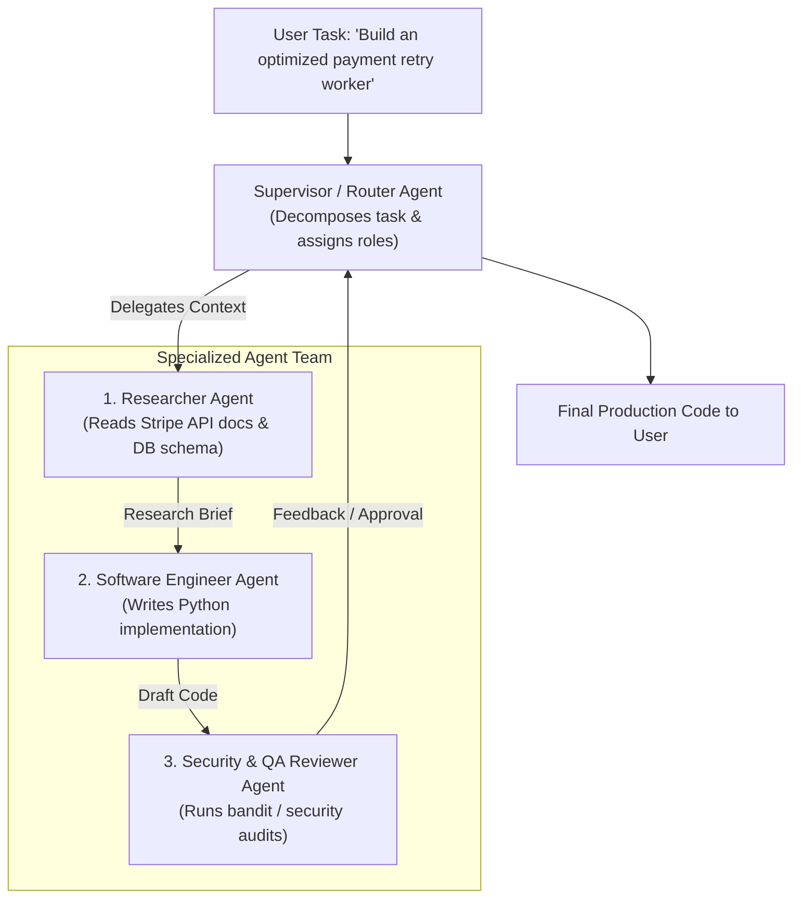
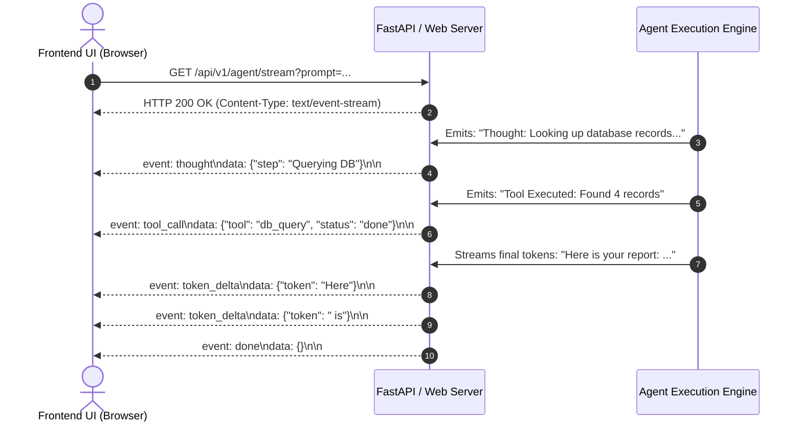

# Agentic AI Chapter 7: Multi-Agent Collaboration & Production Deployment

> **Core Learning Objective:** Master planetary-scale multi-agent systems. Build Supervisor-Worker swarms, implement peer-to-peer handoffs, stream token deltas via Server-Sent Events (SSE), and configure distributed tracing with OpenTelemetry and LangSmith.

---

## 1. Multi-Agent Topologies

As tasks grow complex, a single monolithic agent with 30 tools fails due to context pollution and tool selection confusion. The solution is **Specialized Multi-Agent Teams**:



---

## 2. Multi-Agent Supervisor (Simulation: Scripted Agents, No Real LLM)

```python
from typing import Dict, Any

class Agent:
    def __init__(self, name: str, role_prompt: str):
        self.name = name
        self.role_prompt = role_prompt

    def execute(self, task: str) -> str:
        # Simulated specialized subagent logic
        if self.name == "Researcher":
            return f"[{self.name}] Findings: Stripe recommends exponential jitter backoff on 429/500 errors."
        elif self.name == "Engineer":
            return f"[{self.name}] Generated Python retry decorator using tenacity library."
        elif self.name == "Auditor":
            return f"[{self.name}] Verification Passed: Zero security flaws or unhandled exception leaks."
        return f"[{self.name}] Task completed."

class MultiAgentSupervisor:
    def __init__(self):
        self.agents = {
            "research": Agent("Researcher", "Senior Research Specialist"),
            "coding": Agent("Engineer", "Principal Python Architect"),
            "qa": Agent("Auditor", "AppSec Security Auditor")
        }

    def run_collaborative_workflow(self, project_goal: str) -> Dict[str, str]:
        print(f"\n[Supervisor] Orchestrating Project: '{project_goal}'")
        
        # Step 1: Research
        research_brief = self.agents["research"].execute(project_goal)
        print(research_brief)

        # Step 2: Implementation (passing research context)
        code_artifact = self.agents["coding"].execute(research_brief)
        print(code_artifact)

        # Step 3: Security & Code Audit
        audit_report = self.agents["qa"].execute(code_artifact)
        print(audit_report)

        return {
            "research": research_brief,
            "code": code_artifact,
            "audit": audit_report,
            "status": "APPROVED_FOR_PRODUCTION"
        }

# Verification Driver
supervisor = MultiAgentSupervisor()
result = supervisor.run_collaborative_workflow("Build Stripe webhook listener with retry")
print("\nWorkflow Final Status:", result["status"])
```

---

## 3. Real-Time Streaming Architecture (Server-Sent Events - SSE)

Users will not wait 30 seconds staring at a blank screen while an agent reasons and invokes tools. You must stream intermediate thoughts and token deltas in real-time using **Server-Sent Events (SSE)**:



---

## 4. Production Observability: OpenTelemetry & LangSmith

Every production agent deployment must log comprehensive execution spans:
1. **Trace ID:** Uniquely tracks a user request across all subagents and tools.
2. **Span Metrics:**
   * Exact token consumption (Prompt Tokens + Completion Tokens).
   * Wall-clock latency per LLM call vs per tool execution.
   * Model temperature, system prompt version, and exact JSON payloads.
3. **Error Traces:** Stack traces for flaky external tool APIs.

---

## What the Simulation Above Does and Does Not Show

The supervisor example uses scripted agents (fixed strings) so that the control flow is deterministic and testable. It demonstrates delegation, result passing and a final merge, **not** real model behaviour. For a verified graph with checkpointing and approval see [`examples/ex02_langgraph_hitl.py`](examples/ex02_langgraph_hitl.py); to measure whether a multi-agent design beats a single agent, use the repeated-trial harness in [`examples/ex05_eval_harness.py`](examples/ex05_eval_harness.py): report `pass^k` and a Wilson interval, not a single run.

**Cost reality check.** Multi-agent runs multiply tokens (reported around 15x a chat for research agents versus about 4x for a single agent). If the harness shows no statistically clear gain over the single-agent baseline, ship the single agent.

