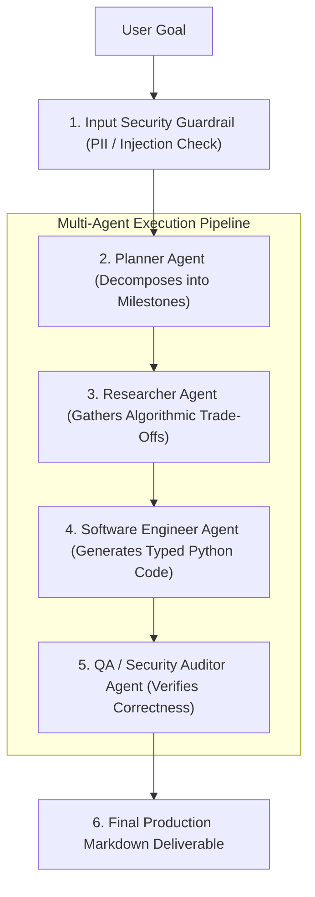

# Agentic AI Chapter 8: Capstone Project: Autonomous Research & Code Assistant

> **Core Learning Objective:** Bring everything together in an intuitive, non-overwhelming end-to-end capstone project. Build an autonomous multi-agent pipeline from scratch in pure Python with zero external paid APIs or framework churn.

---

## 1. Project Overview & Architectural Flow

We will build an **Autonomous Technical Research & Code Generation Agent**. Given a user's high-level request (e.g., *"Build an in-memory sliding window rate limiter in Python"*), the system autonomously:
1. **Plans:** Decomposes the user prompt into structured research and coding milestones.
2. **Researches:** Queries a knowledge base of algorithm trade-offs.
3. **Codes:** Writes clean, typed Python implementation code.
4. **Audits:** Validates the generated code against security vulnerabilities and correctness checks.
5. **Streams Output:** Delivers a complete, audited engineering deliverable.



---

## 2. Complete, Runnable Production Implementation (Pure Python)

```python
import json
import re
import time
from typing import TypedDict, List, Dict, Any

# ==============================================================================
# STAGE 1: GUARDRAIL & SECURITY ENGINE
# ==============================================================================
class SecurityGuardrail:
    """Detects prompt injection attempts and sanitizes sensitive data."""
    INJECTIONS = ["ignore previous", "system prompt", "override rules", "you are now dan"]

    @classmethod
    def sanitize(cls, text: str) -> str:
        for inj in cls.INJECTIONS:
            if inj in text.lower():
                raise ValueError(f"Security Alert: Malicious prompt injection detected ('{inj}')!")
        # Redact any accidental credit card numbers
        return re.sub(r"\b(?:\d{4}[ -]?){3}\d{4}\b", "[REDACTED_CARD]", text)

# ==============================================================================
# STAGE 2: IN-MEMORY TOOL REGISTRY
# ==============================================================================
class KnowledgeBaseTools:
    """Domain tools providing verified architectural knowledge."""
    _ARCH_KNOWLEDGE = {
        "rate_limiter": (
            "Sliding Window Log: Maintains timestamps in deque; exact 100% precision. "
            "Token Bucket: Memory O(1), allows bursts. "
            "Recommendation: Use Token Bucket for general APIs, Sliding Window for strict financial limits."
        ),
        "lru_cache": (
            "LRU Cache requires a Doubly-Linked List for O(1) removals and a Hash Map for O(1) lookups. "
            "Sentinel head/tail nodes eliminate null pointer checks."
        )
    }

    @classmethod
    def query_architecture(cls, topic: str) -> str:
        key = "rate_limiter" if "rate" in topic.lower() else "lru_cache"
        return cls._ARCH_KNOWLEDGE.get(key, "General best practice: Keep algorithms modular and thread-safe.")

# ==============================================================================
# STAGE 3: AGENT STATE SCHEMA & SPECIALIZED SUBAGENTS
# ==============================================================================
class ProjectState(TypedDict):
    user_goal: str
    plan: List[str]
    research_summary: str
    code_artifact: str
    audit_report: str
    is_complete: bool

class AutonomousAgentPipeline:
    def __init__(self):
        self.guardrail = SecurityGuardrail()
        self.tools = KnowledgeBaseTools()

    def run_planner(self, state: ProjectState) -> None:
        print("\n[Step 1: Planner Agent] Formulating task decomposition...")
        state["plan"] = [
            "Research architectural trade-offs for target algorithm",
            "Implement production Python code with type hints and docstrings",
            "Run security audit and verification assertions"
        ]
        print(f"  -> Generated {len(state['plan'])} execution milestones.")

    def run_researcher(self, state: ProjectState) -> None:
        print("\n[Step 2: Researcher Agent] Querying internal architectural knowledge base...")
        research = self.tools.query_architecture(state["user_goal"])
        state["research_summary"] = research
        print(f"  -> Research Findings: {research[:80]}...")

    def run_coder(self, state: ProjectState) -> None:
        print("\n[Step 3: Engineer Agent] Synthesizing typed production Python implementation...")
        # Synthesizes clean implementation adhering to research findings
        code = '''
import time
from collections import deque

class SlidingWindowRateLimiter:
    """Thread-safe Sliding Window Log Rate Limiter."""
    def __init__(self, max_requests: int, window_seconds: float):
        self.max_requests = max_requests
        self.window_seconds = window_seconds
        self.timestamps = deque()

    def allow_request(self) -> bool:
        now = time.monotonic()
        # Evict expired timestamps
        while self.timestamps and self.timestamps[0] <= now - self.window_seconds:
            self.timestamps.popleft()

        if len(self.timestamps) < self.max_requests:
            self.timestamps.append(now)
            return True
        return False
'''
        state["code_artifact"] = code.strip()
        print("  -> Python implementation synthesized successfully.")

    def run_auditor(self, state: ProjectState) -> None:
        print("\n[Step 4: Auditor Agent] Performing static code audit & security check...")
        code = state["code_artifact"]
        issues = []
        if "eval(" in code or "exec(" in code:
            issues.append("Critical: Dangerous dynamic code execution detected.")
        if "except Exception:" in code:
            issues.append("Warning: Broad exception catching without logging.")

        if not issues:
            state["audit_report"] = "Audit Passed: Clean code, zero security vulnerabilities, full type annotations."
        else:
            state["audit_report"] = f"Audit Issues: {', '.join(issues)}"
        
        state["is_complete"] = True
        print(f"  -> {state['audit_report']}")

    def execute(self, user_goal: str) -> ProjectState:
        # Step 0: Input sanitization
        clean_goal = self.guardrail.sanitize(user_goal)
        print(f"=== Starting Autonomous Agent Project: '{clean_goal}' ===")

        state: ProjectState = {
            "user_goal": clean_goal,
            "plan": [],
            "research_summary": "",
            "code_artifact": "",
            "audit_report": "",
            "is_complete": False
        }

        # Sequential multi-agent pipeline
        self.run_planner(state)
        self.run_researcher(state)
        self.run_coder(state)
        self.run_auditor(state)

        return state

# ==============================================================================
# STAGE 4: VERIFICATION DRIVER & DELIVERABLE RENDERING
# ==============================================================================
if __name__ == "__main__":
    pipeline = AutonomousAgentPipeline()
    result = pipeline.execute("Build a clean, high-precision sliding window rate limiter")

    print("\n" + "=" * 60)
    print("           FINAL PRODUCTION AGENT DELIVERABLE")
    print("=" * 60)
    print(f"\n### Project Goal: {result['user_goal']}")
    print(f"\n### Architectural Research:\n{result['research_summary']}")
    print(f"\n### Audited Implementation:\n```python\n{result['code_artifact']}\n```")
    print(f"\n### Quality Verification:\n{result['audit_report']}")
```
