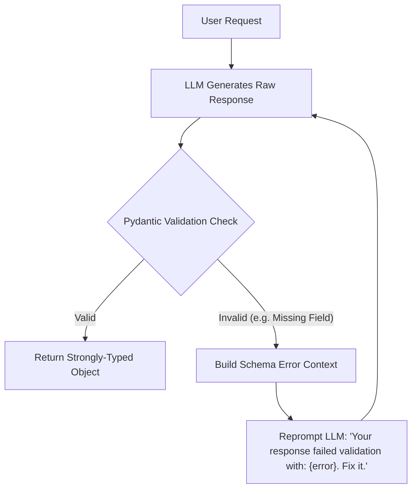
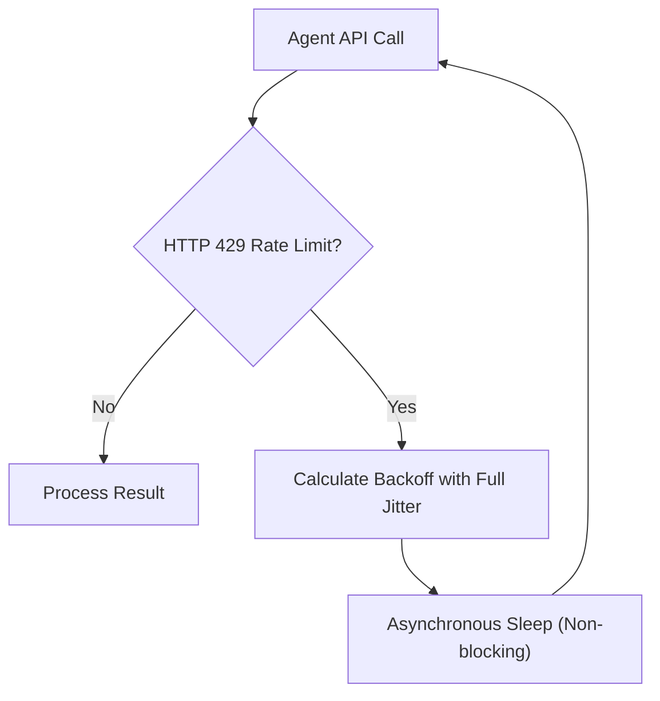
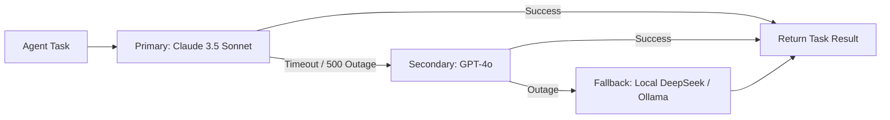

# Chapter 10: Production Resilience, Defensive Prompting, & Rate Limits

> **The Non-Deterministic Nightmare**
> Writing an LLM agent script in a Jupyter Notebook that succeeds once is easy. Running an agent that executes 100,000 workflows a day across enterprise customers without silently failing, halluncinating corrupt JSON, or draining your credit card via runaway recursive loops is an entirely different engineering discipline.
> 
> Production Agentic AI engineering is **defensive engineering**. This chapter covers schema healing, token bucket rate limiters with jitter, multi-provider fallback cascades, and circuit breakers.

---

## 1. Schema Enforcement & Healing with Pydantic & Instructor

LLMs frequently generate invalid JSON: trailing commas, unescaped quotes, or markdown code fences (` ```json `) wrapped around payloads.



### Self-Healing Extraction Pipeline

```python
from pydantic import BaseModel, Field, ValidationError
from typing import List, Optional
import json

class DatabaseQueryPlan(BaseModel):
    target_table: str = Field(description="Name of the table to query")
    columns: List[str] = Field(description="Specific columns to project")
    where_clause: Optional[str] = Field(None, description="SQL WHERE filter clause")
    limit: int = Field(default=10, ge=1, le=100, description="Row limit between 1 and 100")

def execute_with_self_healing(llm_client, user_prompt: str, max_retries: int = 3) -> DatabaseQueryPlan:
    """
    Guarantees typed output by piping Pydantic validation errors back into the LLM
    context for iterative correction.
    """
    conversation = [
        {"role": "system", "content": f"You are a SQL planner. Output pure JSON adhering to schema: {DatabaseQueryPlan.model_json_schema()}"},
        {"role": "user", "content": user_prompt}
    ]

    for attempt in range(max_retries):
        raw_response = llm_client.complete(conversation)
        
        # Clean markdown wrappers if present
        clean_text = raw_response.strip()
        if clean_text.startswith("```json"):
            clean_text = clean_text[7:]
        if clean_text.endswith("```"):
            clean_text = clean_text[:-3]

        try:
            parsed_data = json.loads(clean_text)
            validated_obj = DatabaseQueryPlan.model_validate(parsed_data)
            return validated_obj # 100% Guaranteed valid type!
        except (json.JSONDecodeError, ValidationError) as err:
            if attempt == max_retries - 1:
                raise RuntimeError(f"Agent failed to produce valid schema after {max_retries} attempts: {err}")
            
            # Feed the exact machine validation error back to the model!
            conversation.append({"role": "assistant", "content": raw_response})
            conversation.append({
                "role": "user", 
                "content": f"Schema validation failed: {str(err)}. Return ONLY the corrected JSON payload."
            })
```

---

## 2. Rate Limits, Throttling, & Full Jitter Backoff

When you scale to 50 concurrent agents, OpenAI or Anthropic will immediately return `HTTP 429 Too Many Requests`. 

### Why Exponential Backoff Without Jitter Causes Avalanches

If 50 agents hit a rate limit at the exact same millisecond and all sleep for $2^1 = 2$ seconds, they will all wake up at the exact same millisecond and collide again!

$$\text{Sleep Time} = \text{random}(0, \min(M, B \times 2^{\text{attempt}}))$$



### Production Rate Limiter with Full Jitter

```python
import asyncio
import random
import time

class ResilientLLMCaller:
    def __init__(self, base_delay: float = 0.5, max_delay: float = 30.0, max_retries: int = 5):
        self.base_delay = base_delay
        self.max_delay = max_delay
        self.max_retries = max_retries

    async def call_with_backoff(self, api_func, *args, **kwargs):
        for attempt in range(self.max_retries):
            try:
                return await api_func(*args, **kwargs)
            except Exception as e:
                # Check for rate limit or transient 5xx network errors
                is_rate_limit = "429" in str(e) or "RateLimitError" in type(e).__name__
                if not is_rate_limit or attempt == self.max_retries - 1:
                    raise e

                # Full Jitter formula: random float between 0 and 2^attempt * base
                ceiling = min(self.max_delay, self.base_delay * (2 ** attempt))
                sleep_seconds = random.uniform(0, ceiling)
                
                print(f"[RETRY {attempt + 1}/{self.max_retries}] 429 detected. Jitter backoff for {sleep_seconds:.2f}s...")
                await asyncio.sleep(sleep_seconds)
```

---

## 3. Multi-Provider Fallback Cascade

Relying on a single LLM provider in production is an existential risk. When OpenAI has an API outage, your business stops. A resilient agent architecture uses a **Cascade**:



### Cascade Implementation

```python
from typing import List, Callable, Any

class LLMProviderCascade:
    def __init__(self, providers: List[Callable[[str], str]]):
        self.providers = providers

    def execute_prompt(self, prompt: str) -> str:
        last_exception = None
        for provider in self.providers:
            try:
                # Attempt call with a strict 10-second timeout
                return provider(prompt)
            except Exception as e:
                print(f"[FALLBACK TRIGGERED] Provider {provider.__name__} failed: {e}. Cascading to next...")
                last_exception = e
                continue
        
        raise SystemError(f"All LLM providers in cascade failed! Final error: {last_exception}")
```

---

## 4. Runaway Recursive Loop Circuit Breaker

An autonomous agent with tools can easily enter an infinite loop:
* Agent runs `search("weather in London")`
* Tool returns error: `KeyError: temp`
* Agent repeats `search("weather in London")` forever, consuming $500 in tokens in 20 minutes.

### The Strict Budget Token & Step Circuit Breaker

```python
class AgentExecutionCircuitBreaker:
    def __init__(self, max_steps: int = 15, max_token_budget: int = 50_000, max_cost_dollars: float = 1.00):
        self.max_steps = max_steps
        self.max_token_budget = max_token_budget
        self.max_cost_dollars = max_cost_dollars
        
        self.current_steps = 0
        self.total_tokens_used = 0
        self.total_cost_accrued = 0.0

    def record_step(self, tokens_used: int, step_cost: float):
        self.current_steps += 1
        self.total_tokens_used += tokens_used
        self.total_cost_accrued += step_cost

        if self.current_steps > self.max_steps:
            raise TimeoutError(f"CIRCUIT BREAKER TRIPPED: Max step limit ({self.max_steps}) exceeded!")

        if self.total_tokens_used > self.max_token_budget:
            raise MemoryError(f"CIRCUIT BREAKER TRIPPED: Token budget ({self.max_token_budget}) exhausted!")

        if self.total_cost_accrued > self.max_cost_dollars:
            raise PermissionError(f"CIRCUIT BREAKER TRIPPED: Cost limit (${self.max_cost_dollars}) breached!")
```

Every production agent loop must wrap its execution inside this circuit breaker!


## 4. Runnable Model: Circuit Breaker and Retry with Jitter

Model APIs fail in bursts: a rate limit, a timeout, a regional incident. Two small components turn those failures from outages into slowdowns.

```python
import random

class CircuitBreaker:
    """CLOSED passes calls; after `threshold` consecutive failures it OPENS and fails fast for `cooldown` seconds;
    then HALF_OPEN lets one trial call through: success closes it, failure re-opens it."""
    def __init__(self, threshold, cooldown, clock):
        self.threshold, self.cooldown, self.clock = threshold, cooldown, clock
        self.state, self.failures, self.opened_at = "CLOSED", 0, 0.0

    def call(self, fn):
        if self.state == "OPEN":
            if self.clock() - self.opened_at < self.cooldown:
                raise RuntimeError("circuit open: failing fast")
            self.state = "HALF_OPEN"
        try:
            result = fn()
        except Exception:
            self.failures += 1
            if self.state == "HALF_OPEN" or self.failures >= self.threshold:
                self.state, self.opened_at = "OPEN", self.clock()
            raise
        self.state, self.failures = "CLOSED", 0
        return result

now = [0.0]
breaker = CircuitBreaker(threshold=3, cooldown=30, clock=lambda: now[0])
calls = []

def failing():
    calls.append(1)
    raise ConnectionError("provider down")

for _ in range(3):
    try:
        breaker.call(failing)
    except ConnectionError:
        pass
assert breaker.state == "OPEN" and len(calls) == 3

try:
    breaker.call(failing)
    raise AssertionError("expected fast failure")
except RuntimeError:
    assert len(calls) == 3                                # the provider was not called while the circuit was open

now[0] = 31.0                                             # cooldown over: one trial call is allowed
assert breaker.call(lambda: "ok") == "ok" and breaker.state == "CLOSED"

def backoff_delays(attempts, base, cap, rng):
    """Full jitter: each delay is uniform between 0 and min(cap, base * 2**attempt)."""
    return [rng.uniform(0, min(cap, base * 2 ** k)) for k in range(attempts)]

rng = random.Random(1)
delays = backoff_delays(8, 1.0, 20.0, rng)
assert all(0 <= d <= min(20.0, 2 ** k) for k, d in enumerate(delays))
runs = [backoff_delays(5, 1.0, 20.0, random.Random(s)) for s in range(50)]
assert len({round(r[3], 6) for r in runs}) > 40          # clients spread out instead of retrying in lockstep
```

**Why jitter matters.** Without it, every client that failed at the same moment retries at the same moments (1 s, 2 s, 4 s), creating synchronised waves that keep a recovering provider down. Randomising the delay spreads the load.

### A decision table for model-API failures

| Symptom | Retry? | Action |
| :--- | :--- | :--- |
| `429` rate limited | Yes, honour `Retry-After`, with jitter | Queue and smooth traffic; lower concurrency |
| `500` / `503` provider error | Yes, bounded attempts | Breaker, then fail over to a second model or provider |
| Timeout | Only if the call is idempotent | Shorter timeouts plus hedged requests for latency-critical paths |
| `400` invalid request | No | Fix the request; retrying cannot help |
| Content filter or refusal | No | Return a safe fallback message and log it |
| Truncated output (`max_tokens`) | Maybe | Raise the limit or ask for continuation, not a blind retry |

### Defensive prompting in one paragraph

Put instructions and untrusted data in separate, clearly delimited places; state the task, the output format and what to do when the input is out of scope; validate the output with code (schema, allowed values) instead of trusting the prompt; and assume any prompt can be overridden by hostile input, so keep real authority in permissions, not wording.

---

## Further Reading

- [AWS: exponential backoff and jitter](https://aws.amazon.com/builders-library/timeouts-retries-and-backoff-with-jitter/)
- [OWASP Top 10 for LLM applications](https://genai.owasp.org/llm-top-10/)
- [Martin Fowler: circuit breaker](https://martinfowler.com/bliki/CircuitBreaker.html)


---

## Check Yourself

Answer in your head or on paper first, then open each answer.

<details>
<summary><strong>1.</strong> What does exponential backoff with jitter avoid?</summary>

Synchronised retry storms that overload a recovering service.

</details>

<details>
<summary><strong>2.</strong> Why set timeouts on every LLM and tool call?</summary>

To bound latency and free resources when a dependency hangs.

</details>

<details>
<summary><strong>3.</strong> What is defensive prompting?</summary>

Structuring prompts so untrusted content is delimited and treated as data, plus validating outputs; it reduces but does not remove injection risk.

</details>

<details>
<summary><strong>4.</strong> What is a circuit breaker?</summary>

A component that stops calling a failing dependency for a period so it can recover and callers fail fast.

</details>
