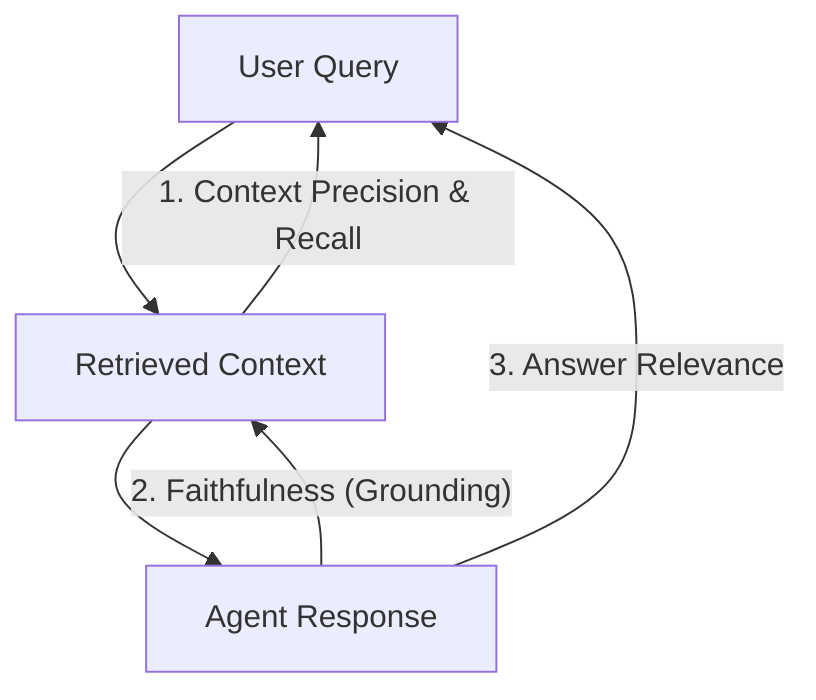

# Chapter 11: Evaluation Harnesses, LLM-As-A-Judge, & CI/CD

> **The Fallacy of the "Vibe Check"**
> Most engineering teams evaluate AI agents through "vibe checks": an engineer tweaks a system prompt, runs 3 manual queries in terminal, says *"looks pretty good"*, and merges to production. Two days later, customer support is overwhelmed because the modified prompt degraded accuracy on edge cases by 28%.
> 
> You cannot improve what you cannot measure. In deterministic software, unit tests check `assert add(2, 2) == 4`. In probabilistic software, you need **Automated Evaluation Harnesses** and **Semantic Assertions** integrated into CI/CD.

---

## 1. The Four Pillars of RAG Evaluation (RAG Triad)

When evaluating retrieval-augmented generation and reasoning agents, we isolate three components: **The Query**, **The Retrieved Context**, and **The Generated Response**.



### The 4 Core Metrics Defined

1. **Faithfulness (Groundedness):** Measures whether every factual claim in the response is strictly supported by the retrieved context. (Prevents hallucinations).
   $$\text{Faithfulness} = \frac{|\text{Supported Claims in Response}|}{|\text{Total Claims in Response}|}$$
2. **Answer Relevance:** Measures how directly the response addresses the user's original query, penalizing redundant or evasive answers.
3. **Context Recall:** Measures whether the retriever fetched all facts necessary to produce the ground-truth answer.
4. **Context Precision:** Measures the signal-to-noise ratio in retrieval. Are the most relevant chunks ranked at the top ($Rank = 1, 2$) rather than buried at the bottom?

---

## 2. Building an Automated "LLM-As-A-Judge" Evaluator from Scratch

We don't need heavy proprietary SaaS platforms to run evaluations. We can build an exact, reproducible evaluation judge in Python using structured outputs:

```python
# eval_harness.py
from pydantic import BaseModel, Field
from typing import List, Literal
import json

class FaithfulnessEvaluation(BaseModel):
    extracted_claims: List[str] = Field(description="List of distinct atomic claims made in the answer")
    unsupported_claims: List[str] = Field(description="Claims that CANNOT be verified from the provided context")
    verdict: Literal["PASS", "FAIL"]
    score: float = Field(ge=0.0, le=1.0, description="Ratio of supported claims / total claims")
    reasoning: str = Field(description="Detailed explanation of factual deviations")

class LLMJudge:
    def __init__(self, judge_client):
        self.client = judge_client

    def evaluate_faithfulness(self, context: str, answer: str) -> FaithfulnessEvaluation:
        system_prompt = (
            "You are an impartial, highly rigorous evaluation judge. Your task is to determine whether "
            "an AI-generated answer is strictly faithful to the provided context. If the answer contains "
            "ANY outside knowledge, unsupported assumptions, or hallucinations, flag them."
        )

        user_prompt = f"""
[CONTEXT]:
{context}

[GENERATED ANSWER]:
{answer}

Evaluate the answer. Return pure JSON matching the FaithfulnessEvaluation schema:
{FaithfulnessEvaluation.model_json_schema()}
"""
        raw_result = self.client.complete(system_prompt, user_prompt)
        return FaithfulnessEvaluation.model_validate_json(raw_result)
```

---

## 3. Creating a Golden Benchmark Evaluation Dataset

To prevent regressions, maintain a `golden_dataset.json` containing 50–200 challenging production queries with known ground truths:

```json
[
  {
    "id": "tc_001",
    "question": "What is our company's refund policy for enterprise software?",
    "ground_truth_context": "Enterprise tier contracts include a 30-day money back guarantee provided written notice is submitted within 14 days of provisioning.",
    "expected_answer": "Enterprise clients receive a 30-day money back guarantee if written notice is submitted within 14 days of provisioning.",
    "min_faithfulness_threshold": 0.95
  },
  {
    "id": "tc_002",
    "question": "Can I deploy the agent on Python 3.8?",
    "ground_truth_context": "The platform requires Python 3.11 or newer due to asyncio TaskGroup dependencies.",
    "expected_answer": "No, Python 3.11 or higher is required.",
    "min_faithfulness_threshold": 1.00
  }
]
```

---

## 4. Integrating the Eval Suite into CI/CD (GitHub Actions)

Never allow an engineer to merge a prompt update or change an embedding model without running the automated evaluation test runner:

```python
# test_agent_regression.py
import pytest
import json
from eval_harness import LLMJudge, FakeOrRealLLMClient

@pytest.fixture
def test_dataset():
    with open("golden_dataset.json") as f:
        return json.load(f)

def test_rag_pipeline_regression(test_dataset):
    judge = LLMJudge(FakeOrRealLLMClient())
    failures = []

    for test_case in test_dataset:
        # 1. Run actual production RAG pipeline
        retrieved_context, agent_answer = run_production_agent(test_case["question"])

        # 2. Evaluate faithfulness
        eval_result = judge.evaluate_faithfulness(retrieved_context, agent_answer)

        if eval_result.score < test_case["min_faithfulness_threshold"]:
            failures.append({
                "id": test_case["id"],
                "score": eval_result.score,
                "reason": eval_result.reasoning,
                "unsupported": eval_result.unsupported_claims
            })

    # Fail CI build if any regression occurs!
    assert len(failures) == 0, f"RAG Evaluation failed on {len(failures)} test cases: {failures}"
```

```yaml
# .github/workflows/agent_eval.yml
name: Agent Evaluation Regression Suite
on:
  pull_request:
    paths:
      - 'prompts/**'
      - 'agents/**'

jobs:
  evaluate-model:
    runs-on: ubuntu-latest
    steps:
      - uses: actions/checkout@v4
      - name: Set up Python
        uses: actions/setup-python@v5
        with:
          python-version: '3.11'
      - name: Run Eval Suite
        env:
          EVAL_LLM_API_KEY: ${{ secrets.EVAL_LLM_API_KEY }}
        run: |
          pip install pytest pydantic
          pytest test_agent_regression.py
```

Now, any prompt modification that introduces subtle hallucinations or degrades retrieval quality is blocked at the Pull Request stage before reaching a single customer!


## Further Reading

- [Judging LLM-as-a-judge (MT-Bench)](https://arxiv.org/abs/2306.05685)
- [Eugene Yan: LLM evaluators](https://eugeneyan.com/writing/llm-evaluators/)
- [lm-evaluation-harness](https://github.com/EleutherAI/lm-evaluation-harness)


---

## Check Yourself

Answer in your head or on paper first, then open each answer.

<details>
<summary><strong>1.</strong> Why calibrate an LLM judge against human labels?</summary>

To measure its agreement and error directions (TPR/FPR) before trusting its scores.

</details>

<details>
<summary><strong>2.</strong> What biases do LLM judges show?</summary>

Position, verbosity, self-preference and formatting bias.

</details>

<details>
<summary><strong>3.</strong> How do you put evals in CI?</summary>

Run a fixed task suite on each change, compare with the baseline within confidence intervals, and block regressions.

</details>

<details>
<summary><strong>4.</strong> What is pass^k?</summary>

The probability that all k independent trials succeed; it measures consistency.

</details>
