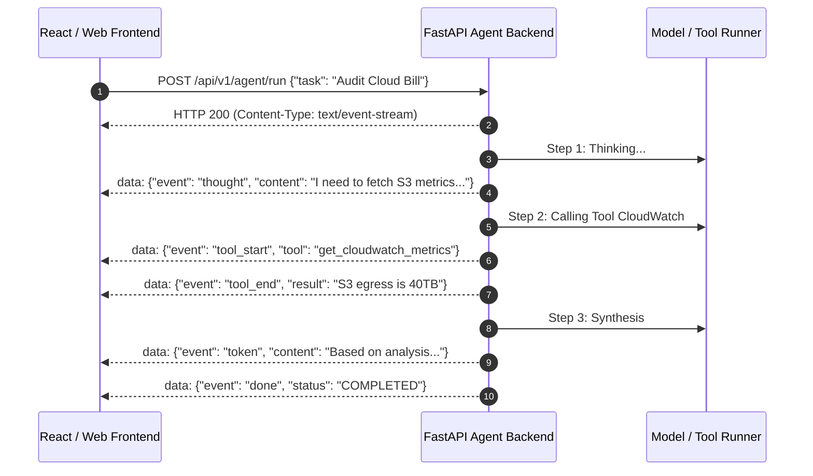
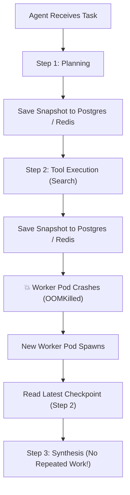
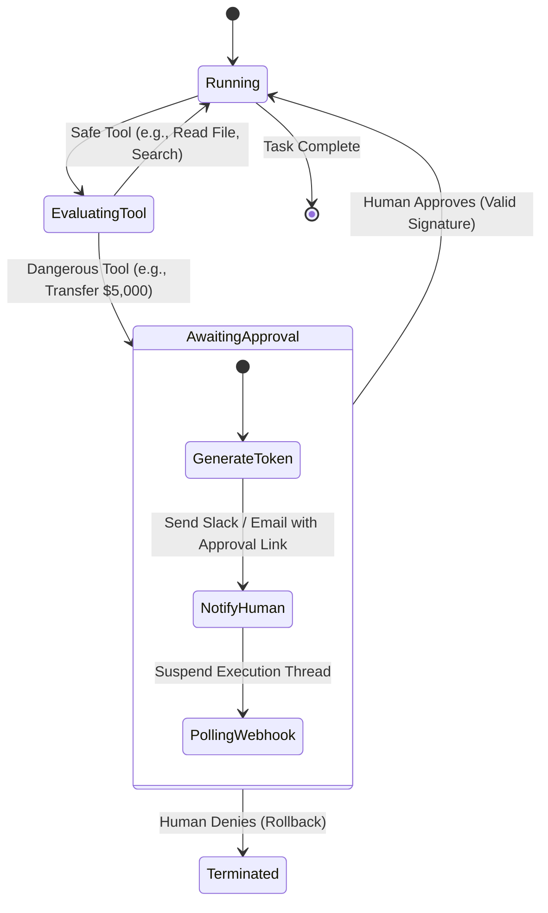

# Chapter 12: Production Agent Deployment, Streaming, & Human-In-The-Loop

> **Beyond the Terminal REPL**
> An AI agent running in a local terminal script is a toy. An enterprise agent must be deployed as a horizontally scalable web service capable of streaming real-time thoughts to frontend UIs, persisting long-running state across infrastructure crashes, and pausing for human managerial approval before triggering irreversible real-world actions.
> 
> This chapter provides the complete architectural blueprint for deploying production-grade agents with **FastAPI**, **Server-Sent Events (SSE)**, **Durable State Checkpointing**, and **Human-in-the-Loop (HITL)** governance.

---

## 1. Streaming Real-Time Agent Telemetry with Server-Sent Events (SSE)

Because agentic workflows often take 10 to 45 seconds (planning, executing web searches, calling APIs, synthesizing results), returning a single blocking HTTP response results in horrible UX and gateway timeouts.

Instead, we stream events token-by-token over an open HTTP connection using **Server-Sent Events (SSE)**:



### Complete FastAPI SSE Agent Streaming Server

```python
# app_streaming_agent.py
import asyncio
import json
from fastapi import FastAPI
from fastapi.responses import StreamingResponse
from pydantic import BaseModel

app = FastAPI(title="Production Agent Gateway")

class AgentRunRequest(BaseModel):
    task: str
    session_id: str

async def agent_event_generator(task: str, session_id: str):
    """
    Simulates a multi-step streaming agent engine yielding JSON SSE frames.
    Format: 'data: <json>\n\n'
    """
    # 1. Thought Event
    yield f"data: {json.dumps({'type': 'thought', 'content': f'Analyzing user request: {task}'})}\n\n"
    await asyncio.sleep(0.5)

    # 2. Tool Execution Start
    yield f"data: {json.dumps({'type': 'tool_call', 'tool': 'search_database', 'args': {'query': task}})}\n\n"
    await asyncio.sleep(1.2) # Simulate async I/O

    # 3. Tool Result
    yield f"data: {json.dumps({'type': 'tool_result', 'tool': 'search_database', 'records_found': 4})}\n\n"
    await asyncio.sleep(0.4)

    # 4. Stream Final Answer Token-by-Token
    final_text = "The database audit identified 4 unattached EBS volumes costing $120/month."
    for word in final_text.split(" "):
        yield f"data: {json.dumps({'type': 'token', 'token': word + ' '})}\n\n"
        await asyncio.sleep(0.08)

    # 5. Completion Marker
    yield f"data: {json.dumps({'type': 'complete', 'status': 'SUCCESS'})}\n\n"

@app.post("/api/v1/agent/stream")
async def run_agent_stream(request: AgentRunRequest):
    return StreamingResponse(
        agent_event_generator(request.task, request.session_id),
        media_type="text/event-stream",
        headers={
            "Cache-Control": "no-cache",
            "Connection": "keep-alive",
            "X-Accel-Buffering": "no" # Prevents NGINX from buffering SSE stream!
        }
    )
```

---

## 2. Durable State Checkpointing Across Pod Crashes

If a Kubernetes worker crashes 4 steps into an 8-step agent research workflow, we cannot restart from Step 0 and re-bill the customer for 10,000 burned tokens.

**Durable Execution** persists an atomic snapshot of the agent's memory and execution pointer after every single tool call:



### Checkpointing Engine Implementation

```python
import sqlite3
import json
from dataclasses import dataclass, asdict
from typing import List, Dict, Any

@dataclass
class AgentStateSnapshot:
    workflow_id: str
    current_step: int
    memory_messages: List[Dict[str, Any]]
    completed_tools: List[str]

class PostgresOrSqliteCheckpointer:
    def __init__(self, db_path: str = "agent_checkpoints.db"):
        self.conn = sqlite3.connect(db_path)
        self._init_table()

    def _init_table(self):
        with self.conn:
            self.conn.execute("""
                CREATE TABLE IF NOT EXISTS checkpoints (
                    workflow_id TEXT PRIMARY KEY,
                    step_index INTEGER,
                    state_json TEXT,
                    updated_at TIMESTAMP DEFAULT CURRENT_TIMESTAMP
                )
            """)

    def save_checkpoint(self, state: AgentStateSnapshot):
        with self.conn:
            self.conn.execute("""
                INSERT OR REPLACE INTO checkpoints (workflow_id, step_index, state_json)
                VALUES (?, ?, ?)
            """, (state.workflow_id, state.current_step, json.dumps(asdict(state))))

    def load_checkpoint(self, workflow_id: str) -> AgentStateSnapshot:
        cursor = self.conn.cursor()
        cursor.execute("SELECT state_json FROM checkpoints WHERE workflow_id = ?", (workflow_id,))
        row = cursor.fetchone()
        if not row:
            return None
        data = json.loads(row[0])
        return AgentStateSnapshot(**data)
```

---

## 3. Human-in-the-Loop (HITL) Interruptible Workflows

An autonomous agent should have permission to read data freely, but **never execute destructive or financial transactions without human authorization**.

### Dangerous Tools Requiring Human Approval:
* `delete_database_records(table, filter)`
* `send_wire_transfer(amount, recipient)`
* `publish_production_dns_records(zone, record)`

### The State Machine for Interruptible Execution



### Implementing Human Authorization Gates

```python
from enum import Enum
import uuid

class ToolSecurityLevel(str, Enum):
    SAFE = "SAFE"
    REQUIRES_HUMAN_APPROVAL = "REQUIRES_HUMAN_APPROVAL"

class HumanApprovalRequiredException(Exception):
    def __init__(self, approval_token: str, tool_name: str, arguments: dict):
        self.approval_token = approval_token
        self.tool_name = tool_name
        self.arguments = arguments
        super().__init__(f"Tool {tool_name} requires managerial approval. Token: {approval_token}")

class GovernedToolExecutor:
    def __init__(self):
        self.pending_approvals = {}

    def execute_tool(self, tool_name: str, tool_security: ToolSecurityLevel, args: dict):
        if tool_security == ToolSecurityLevel.SAFE:
            # Execute immediately
            return self._run_safe_tool(tool_name, args)

        # High-risk action: halt agent and request human signature
        token = str(uuid.uuid4())
        self.pending_approvals[token] = {
            "tool": tool_name,
            "args": args,
            "status": "PENDING"
        }
        raise HumanApprovalRequiredException(token, tool_name, args)

    def submit_human_verdict(self, approval_token: str, approved: bool) -> dict:
        record = self.pending_approvals.get(approval_token)
        if not record or record["status"] != "PENDING":
            raise ValueError("Invalid or expired approval token")

        if approved:
            record["status"] = "APPROVED"
            # Resume and execute the dangerous operation
            return self._run_safe_tool(record["tool"], record["args"])
        else:
            record["status"] = "REJECTED"
            return {"status": "ABORTED_BY_HUMAN_OPERATOR"}

    def _run_safe_tool(self, tool_name, args):
        return {"status": "SUCCESS", "message": f"Executed {tool_name} with {args}"}
```

This ensures full governance and zero possibility of runaway catastrophic actions in production environments!


## Further Reading

- [LangGraph human-in-the-loop](https://docs.langchain.com/oss/python/langgraph/interrupts)
- [MDN: Server-sent events](https://developer.mozilla.org/en-US/docs/Web/API/Server-sent_events)
- [FastAPI streaming responses](https://fastapi.tiangolo.com/advanced/custom-response/)


---

## Check Yourself

Answer in your head or on paper first, then open each answer.

<details>
<summary><strong>1.</strong> Why stream tokens to the client?</summary>

Perceived latency drops because users see output start immediately.

</details>

<details>
<summary><strong>2.</strong> Where do you put human approval in an agent flow?</summary>

Before irreversible or external actions, with the exact action shown to the approver.

</details>

<details>
<summary><strong>3.</strong> What state must survive a restart?</summary>

Conversation thread state and pending approvals, stored in a durable checkpointer.

</details>

<details>
<summary><strong>4.</strong> Why make tools idempotent in HITL flows?</summary>

Resumed nodes may re-run, so side effects must not duplicate.

</details>
