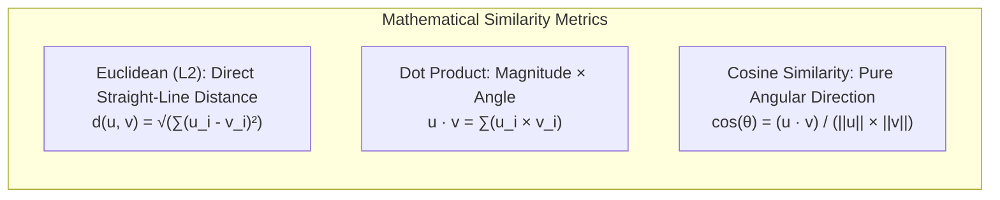
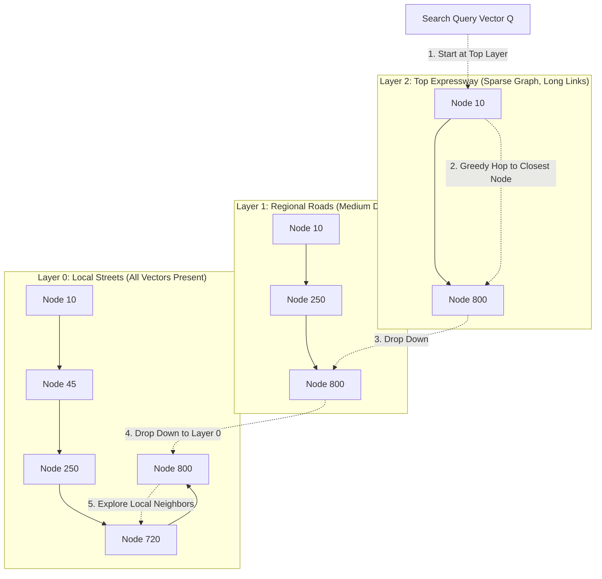
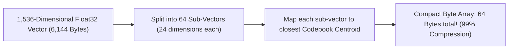

# Chapter 13: Vector Database Internals & HNSW Graph Math

> **Zero-Prerequisite Intuition: The "Galaxy Star Map" Metaphor**
> What is a vector embedding, and why do we need special Vector Databases (Pinecone, Qdrant, Milvus, Chroma)?
> Imagine looking up at the night sky. Every star has 3D coordinates in space: $(X, Y, Z)$.
> * Earth is at $(0, 0, 0)$.
> * Mars is nearby at $(0.5, 0.2, 0.1)$.
> * The Andromeda Galaxy is far away at $(2500000, 890000, 120000)$.
> Because Earth and Mars have coordinates that are close to each other, you know they are in the same neighborhood!
> 
> A **Vector Embedding Model** does the exact same thing for human thoughts and text. It reads a sentence and assigns it coordinates in a **1,536-dimensional space**:
> * `"The dog barked"` $\rightarrow [0.24, -0.81, 0.12, \dots]$
> * `"A puppy made a sound"` $\rightarrow [0.26, -0.79, 0.11, \dots]$ (Extremely close coordinates!)
> * `"Stock market interest rates rose"` $\rightarrow [-0.91, 0.34, -0.88, \dots]$ (Far away coordinates!)
> 
> But here is the crisis: If you have **10,000,000 document vectors**, computing the exact distance between your search query and all 10 million vectors requires billions of floating-point operations. Your search takes **6 seconds**!
> 
> A **Vector Database** uses **Approximate Nearest Neighbors (ANN)** to search 10 million vectors in **less than 8 milliseconds**!

---

## 1. Distance Metrics: Cosine vs. Dot Product vs. Euclidean ($L2$)

How do we mathematically measure the "distance" between two thought vectors $\mathbf{u}$ and $\mathbf{v}$?



* **Euclidean ($L2$) Distance:** Measures the geometric straight-line physical distance. Sensitive to vector magnitude (document length).
* **Dot Product:** Fast to compute on modern CPU/GPU hardware using SIMD instructions.
* **Cosine Similarity:** Measures the angle $\theta$ between vectors, completely ignoring document length.
  $$\cos(\theta) = \frac{\mathbf{u} \cdot \mathbf{v}}{\|\mathbf{u}\| \|\mathbf{v}\|}$$

> [!TIP]
> **Production Optimization:** If you normalize all embedding vectors to unit length ($\|\mathbf{u}\| = 1$) upon ingestion, **Cosine Similarity becomes mathematically identical to Dot Product**! You can replace expensive divisions and square roots with a single blazing-fast hardware vector dot product.

---

## 2. The HNSW Algorithm: Multi-Layer Skip-Graphs

The undisputed state-of-the-art algorithm for vector search is **Hierarchical Navigable Small World (HNSW)**.

### The "Express Train vs. Local Walking" Metaphor
How do you travel from New York to a specific house in Los Angeles?
* You don't walk street-by-street across 3,000 miles (that is brute force $O(N)$).
* You take an **Express Airplane** across the continent (Layer 2).
* You land at LAX and take a **Regional Highway** to the neighborhood (Layer 1).
* You take a **Local Street** to the exact doorstep (Layer 0).



### The Search Mechanics:
1. Start at the top layer entry point with greedy routing: jump to whichever neighboring node is closest to query vector $Q$.
2. When no neighbor is closer to $Q$, drop down one layer and resume greedy routing from that node.
3. At Layer 0 (the bottom layer containing all vectors), execute a **Beam Search** with size `efSearch` to extract the Top-$K$ nearest neighbors.
* **Complexity:** Scales in logarithmic time: $\mathbf{O(\log N)}$ rather than linear time $O(N)$! Searching 10 million vectors takes only ~20 graph hops!

---

## 3. Product Quantization (IVF-PQ): Compressing Vectors

Storing 10 million vectors of 1,536 floats in RAM requires:
$$10,000,000 \times 1536 \times 4\text{ bytes} \approx \mathbf{61.4\text{ Gigabytes of RAM!}}$$
RAM is expensive ($100s/month). **Product Quantization (PQ)** compresses this by 95% down to **3 GB** using lossy vector quantization:



1. Divide the 1,536-dimensional vector into 64 sub-vectors of 24 dimensions each.
2. Run $k$-means clustering on each sub-space to generate 256 centroid prototypes.
3. Instead of storing 24 floats (96 bytes), store a single **8-bit integer (1 byte)** representing the centroid index!
4. Querying computes distance using pre-computed centroid lookup tables, speeding up distance computations by $10\times$.

---

## 4. Metadata Filtering: Pre-Filtering vs. Single-Stage Hybrid Search

In real applications, you rarely search vectors in isolation. You search: *"Find documents similar to 'billing refund' WHERE `user_id = 42` AND `created_year >= 2025`"*.

| Filtering Strategy | How It Works | Danger / Failure Mode |
| :--- | :--- | :--- |
| **Post-Filtering** | Run HNSW vector search to find Top-100 nearest items, then discard items that don't match `user_id = 42`. | **Zero Results Disaster:** If only 1 out of 10,000 items belongs to user 42, the top-100 will contain 0 matching items, returning an empty list! |
| **Pre-Filtering** | Query SQL index first to find all IDs matching `user_id = 42`, then run brute force vector distance only on those matching IDs. | Inefficient if user 42 has 500,000 items (falls back to slow brute force). |
| **Single-Stage Filtered HNSW** (Qdrant / Milvus) | Navigates the HNSW graph while skipping graph nodes during beam search that fail the metadata bitset. | Optimal: Guarantees exact Top-$K$ while preserving $O(\log N)$ graph search speeds. |


## 4. Runnable Model: Memory Arithmetic and the Recall Cost of Searching Fewer Clusters

### Why quantisation matters at a billion vectors

```python
vectors, dim = 1_000_000_000, 768
raw_tb = vectors * dim * 4 / 1e12                            # float32
assert round(raw_tb, 2) == 3.07                              # 3 TB of vectors: far beyond one machine's RAM

sub_vectors = 96                                             # product quantisation: 96 sub-vectors of 8 dimensions
pq_gb = vectors * sub_vectors * 1 / 1e9                      # one byte per sub-vector code
assert pq_gb == 96.0                                         # 96 GB: fits on one large machine
assert raw_tb * 1000 / pq_gb == 32.0                         # a 32x reduction

hnsw_links, bytes_per_link = 32, 4
graph_gb = vectors * hnsw_links * bytes_per_link / 1e9
assert graph_gb == 128.0                                     # an HNSW graph adds its own memory on top of the vectors
```

Takeaway: at scale the question is rarely "which index is fastest" but "what fits in memory". Quantised vectors for the first-pass search, plus the full vectors on disk for re-ranking the top candidates, is the standard compromise.

### The IVF trade-off: probe more clusters, get more recall, pay more time

An IVF index partitions vectors into clusters and searches only the `nprobe` clusters closest to the query. This model builds one and measures recall against exact search.

```python
import random

random.seed(4)
DIM, N, K, QUERIES = 8, 3000, 24, 40
points = [[random.random() for _ in range(DIM)] for _ in range(N)]

def dist2(a, b):
    return sum((x - y) ** 2 for x, y in zip(a, b))

# Build: a few rounds of k-means to get cluster centres
centres = random.sample(points, K)
for _ in range(4):
    buckets = [[] for _ in range(K)]
    for p in points:
        buckets[min(range(K), key=lambda c: dist2(p, centres[c]))].append(p)
    centres = [[sum(col) / len(b) for col in zip(*b)] if b else centres[i] for i, b in enumerate(buckets)]
lists = [[] for _ in range(K)]
for idx, p in enumerate(points):
    lists[min(range(K), key=lambda c: dist2(p, centres[c]))].append(idx)

def search(q, nprobe, k=10):
    order = sorted(range(K), key=lambda c: dist2(q, centres[c]))[:nprobe]
    candidates = [i for c in order for i in lists[c]]
    return set(sorted(candidates, key=lambda i: dist2(q, points[i]))[:k]), len(candidates)

def exact(q, k=10):
    return set(sorted(range(N), key=lambda i: dist2(q, points[i]))[:k])

queries = [[random.random() for _ in range(DIM)] for _ in range(QUERIES)]
truth = [exact(q) for q in queries]
recall, scanned = {}, {}
for nprobe in (1, 4, K):
    hits = scans = 0
    for q, t in zip(queries, truth):
        found, n = search(q, nprobe)
        hits += len(found & t)
        scans += n
    recall[nprobe] = hits / (10 * QUERIES)
    scanned[nprobe] = scans / QUERIES

assert recall[K] == 1.0                                      # probing every cluster is exact search
assert recall[1] <= recall[4] <= recall[K]                   # more probes never reduce recall here
assert recall[1] < 0.95                                      # one probe misses neighbours that sit across a boundary
assert scanned[1] < scanned[4] < scanned[K] == N             # and the cost grows in step: you pay for recall in vectors scanned
```

The numbers vary with the random data, but the shape does not: **recall rises with `nprobe` and so does the work per query**. Production systems tune `nprobe` (or HNSW's `ef_search`) against a recall target measured on their own data, with a fixed latency budget; the ANN index never promises exact answers, so the recall measurement is part of the system.

---

## Further Reading

- [HNSW paper](https://arxiv.org/abs/1603.09320)
- [Pinecone: HNSW explained](https://www.pinecone.io/learn/series/faiss/hnsw/)
- [FAISS wiki](https://github.com/facebookresearch/faiss/wiki)


---

## Check Yourself

Answer in your head or on paper first, then open each answer.

<details>
<summary><strong>1.</strong> What does HNSW trade for speed?</summary>

Memory and a small loss of recall; it builds a layered proximity graph for logarithmic-time search.

</details>

<details>
<summary><strong>2.</strong> What does `efSearch` control?</summary>

The candidate list size at query time: higher means better recall and higher latency.

</details>

<details>
<summary><strong>3.</strong> Why normalise vectors for cosine similarity?</summary>

After L2 normalisation, dot product equals cosine similarity and is cheaper to compute.

</details>

<details>
<summary><strong>4.</strong> How does product quantization save memory?</summary>

It splits vectors into sub-vectors and stores each as a small codebook ID, e.g. 1024 floats to 64 bytes.

</details>
