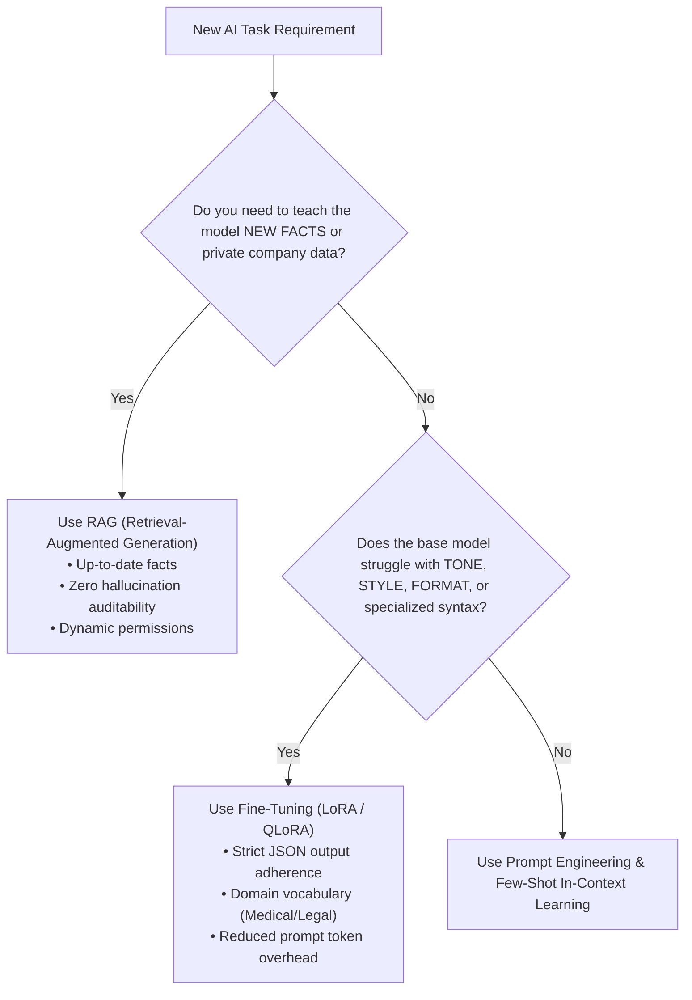
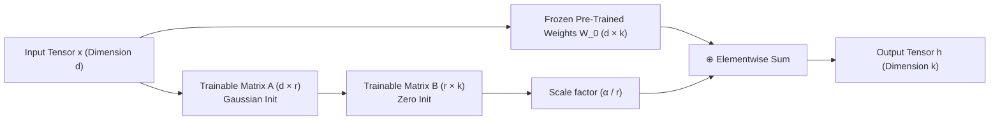
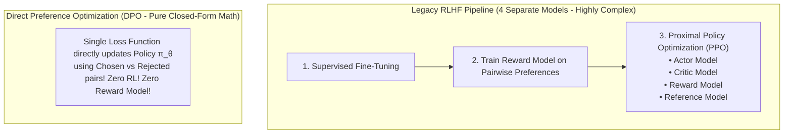

# Chapter 14: Model Fine-Tuning, LoRA, & DPO Alignment

> **Zero-Prerequisite Intuition: The "College Graduate vs. Specialized Surgeon" Metaphor**
> What is Fine-Tuning, and how is it different from RAG and Prompt Engineering?
> Imagine hiring a brilliant college graduate who read the entire world's encyclopedias and libraries. 
> * **Prompt Engineering:** You give the graduate an instruction: *"Please read this email and summarize it in three bullet points."*
> * **RAG (Retrieval-Augmented Generation):** The graduate doesn't know your company's private financial records. So you hand them a physical binder containing yesterday's ledger: *"Answer the client's question using ONLY page 4 of this binder."*
> * **Fine-Tuning:** You want this graduate to become a **Cardiovascular Surgeon**. Handing them a medical textbook during an open-heart surgery is too slow—they must absorb the instincts, surgical vocabulary, muscle memory, and precise medical formatting into their subconscious mind!
> 
> **Fine-tuning alters the internal weights (the brain synapses) of the model.**
> This chapter covers the definitive decision framework for when to fine-tune vs. RAG, the mathematics of **LoRA** and **QLoRA**, and modern model alignment with **DPO (Direct Preference Optimization)**.

---

## 1. The Decision Matrix: Prompting vs. RAG vs. Fine-Tuning



| Dimension | Prompt Engineering | RAG | Fine-Tuning (LoRA) |
| :--- | :--- | :--- | :--- |
| **Primary Purpose** | Guiding instruction behavior | Injecting dynamic external facts | Modifying style, syntax, and instincts |
| **New Knowledge** | Zero (limited by context window) | High (retrieves from billions of docs) | Low (prone to catastrophic forgetting) |
| **Hallucination Risk** | Moderate | Very Low (Grounded in context) | High (if used to memorize facts) |
| **Latency & Cost** | Low setup; High token costs | Medium latency (vector search hop) | Zero retrieval latency; Low token count |

---

## 2. Parameter-Efficient Fine-Tuning: The LoRA Mathematics

Why can't we just train all weights of a modern Large Language Model (e.g., Llama-3 70B)?
To train a 70B parameter model in standard 16-bit precision:
* Weights: 140 GB.
* Gradients: 140 GB.
* Adam Optimizer States (Momentum & Variance): **560 GB**.
* Total VRAM required: **Over 840 Gigabytes of GPU VRAM** (Requiring a cluster of 12 $\times$ \$35,000 NVIDIA H100 GPUs)!

### Low-Rank Adaptation (LoRA)

Published by Microsoft researchers (Hu et al.), LoRA realizes that weight updates during adaptation have a very low **intrinsic rank**.

Instead of updating the full $d \times k$ weight matrix $W_0$:
$$W = W_0 + \Delta W$$

LoRA **freezes the pre-trained weights $W_0$ completely** and decomposes the update $\Delta W$ into two tiny low-rank matrices $A$ and $B$:
$$\Delta W = B \times A$$

Where $W_0 \in \mathbb{R}^{d \times k}$, $B \in \mathbb{R}^{d \times r}$, and $A \in \mathbb{R}^{r \times k}$, with rank $r \ll \min(d, k)$ (typically $r = 8$ or $16$).



* **Parameters Reduced by 99.9%:** For a $4096 \times 4096$ matrix, full training updates **16,777,216 parameters**. With LoRA rank $r = 8$, matrices $A$ and $B$ have only $4096 \times 8 + 8 \times 4096 = \mathbf{65,536\text{ parameters}}$!
* **Zero Inference Latency Overhead:** At deployment, you can mathematically merge the adapter weights directly into the base model: $W_{\text{final}} = W_0 + \frac{\alpha}{r}(BA)$.

---

## 3. QLoRA: Fine-Tuning on a Single Consumer GPU

Tim Dettmers et al. introduced **QLoRA (Quantized LoRA)**, enabling 70B parameter models to be fine-tuned on a single 48 GB GPU.

### The 3 Core Innovations of QLoRA:
1. **NF4 (NormalFloat 4-bit) Quantization:** A mathematically optimal information-theoretic data type for normally distributed neural network weights.
2. **Double Quantization (DQ):** Quantizes the quantization constants themselves, saving an additional 0.37 bits per parameter.
3. **Paged Optimizers:** Uses CUDA Unified Memory to automatically page optimizer memory spikes between GPU VRAM and CPU RAM, preventing out-of-memory crashes.

---

## 4. Alignment & Preference Optimization: DPO vs. RLHF

Once a model is fine-tuned, how do we prevent it from being toxic, and train it to prefer helpful, concise answers?



### The DPO Breakthrough (Rafailov et al., Stanford)
Traditional Reinforcement Learning from Human Feedback (RLHF) required training a separate Reward Model, then using unstable PPO reinforcement learning loops that constantly diverged or suffered mode collapse.

DPO mathematically proves that the reward function can be expressed directly through the language model's own probabilities:

$$\mathcal{L}_{\text{DPO}}(\pi_\theta; \pi_{\text{ref}}) = -\mathbb{E}_{(x, y_w, y_l)} \left[ \log \sigma \left( \beta \log \frac{\pi_\theta(y_w | x)}{\pi_{\text{ref}}(y_w | x)} - \beta \log \frac{\pi_\theta(y_l | x)}{\pi_{\text{ref}}(y_l | x)} \right) \right]$$

Where:
* $x$ is the prompt.
* $y_w$ is the **winning / preferred** human response.
* $y_l$ is the **losing / rejected** response.
* $\pi_\theta$ is the active model, and $\pi_{\text{ref}}$ is the frozen baseline model.

DPO increases the probability of preferred answers while decreasing the probability of rejected answers in a **single standard cross-entropy training pass**!


## 4. Runnable Model: LoRA Arithmetic and the DPO Loss

### How few parameters LoRA trains, and what that does to memory

```python
def lora_params(d_in, d_out, rank):
    return rank * (d_in + d_out)                            # A is (rank x d_in), B is (d_out x rank)

full = 4096 * 4096                                          # one attention projection matrix
lora = lora_params(4096, 4096, rank=16)
assert full == 16_777_216 and lora == 131_072
assert round(100 * lora / full, 2) == 0.78                  # under 1% of that matrix is trained

layers, matrices_per_layer = 32, 4                          # q, k, v, o projections in a 32-layer model
trainable = layers * matrices_per_layer * lora
assert trainable == 16_777_216                              # 16.8M trainable parameters in total

def memory_gb(params_b, bytes_weights, trainable_params, bytes_per_trainable):
    return params_b * 1e9 * bytes_weights / 1e9 + trainable_params * bytes_per_trainable / 1e9

# 7B model. Full fine-tuning keeps weights (2 bytes) plus gradients (2) plus Adam states and fp32 master copy (12): about 16 bytes/param.
full_ft = 7e9 * 16 / 1e9
lora_ft = memory_gb(7, 2, trainable, 16)                    # frozen bf16 weights plus the small trainable set
assert round(full_ft) == 112 and round(lora_ft, 1) == 14.3
assert full_ft / lora_ft > 7                                # roughly an eight-fold reduction, before activations
```

These are weights-and-optimiser figures; activations, batch size and sequence length add more, so treat them as a floor. The conclusion holds: LoRA makes fine-tuning a 7B model feasible on a single large GPU, and with 4-bit base weights (QLoRA) on a consumer card. Rank is the quality-versus-size dial; 8 to 64 covers most uses.

### The DPO loss on toy numbers

Direct Preference Optimisation trains on pairs (chosen `w`, rejected `l`) without a separate reward model:
`loss = -log sigmoid( beta * [(log pi(w) - log ref(w)) - (log pi(l) - log ref(l))] )`

```python
import math

def dpo_loss(pi_w, pi_l, ref_w, ref_l, beta=0.1):
    margin = beta * ((pi_w - ref_w) - (pi_l - ref_l))
    return -math.log(1 / (1 + math.exp(-margin)))

same_as_reference = dpo_loss(-10, -12, -10, -12)
assert abs(same_as_reference - math.log(2)) < 1e-12          # no preference learned yet: loss is log 2

learned = dpo_loss(pi_w=-8, pi_l=-14, ref_w=-10, ref_l=-12)  # policy raised the chosen answer and lowered the rejected one
assert learned < same_as_reference

backwards = dpo_loss(pi_w=-14, pi_l=-8, ref_w=-10, ref_l=-12)
assert backwards > same_as_reference                          # moving the wrong way is penalised

# beta controls how hard the policy is held to the reference: larger beta, sharper loss for the same shift
assert dpo_loss(-8, -14, -10, -12, beta=0.5) < dpo_loss(-8, -14, -10, -12, beta=0.1)
```

What to remember: DPO needs only **preference pairs and the frozen reference model's log-probabilities**; the loss falls when the policy raises the chosen answer relative to the reference more than it raises the rejected one; `beta` limits drift from the reference.

### When to fine-tune at all

| Goal | First try | Fine-tune when |
| :--- | :--- | :--- |
| New knowledge or fresh facts | Retrieval (RAG) | Almost never: weights are a poor database |
| Output format or tone | Prompting with examples, structured output | Prompts get long, costly or inconsistent across many calls |
| A narrow skill with labelled data (classification, extraction) | Few-shot prompting | You have hundreds to thousands of clean examples and need lower latency or cost |
| Preferences or safety behaviour | System prompt and guardrails | You have preference data and a reliable evaluation to prove improvement |

Always compare against a **strong prompted baseline** on a held-out evaluation set; a fine-tune that cannot beat it is not worth maintaining.

---

## Further Reading

- [LoRA paper](https://arxiv.org/abs/2106.09685)
- [DPO paper](https://arxiv.org/abs/2305.18290)
- [Hugging Face PEFT](https://huggingface.co/docs/peft/index)


---

## Check Yourself

Answer in your head or on paper first, then open each answer.

<details>
<summary><strong>1.</strong> What does LoRA train?</summary>

Small low-rank adapter matrices added to frozen weights, so only a tiny fraction of parameters are updated.

</details>

<details>
<summary><strong>2.</strong> What does DPO optimise?</summary>

A preference objective directly from chosen/rejected pairs, without training a separate reward model or running RL.

</details>

<details>
<summary><strong>3.</strong> When fine-tune instead of using RAG?</summary>

To change style, format or skills; use RAG for fresh or private knowledge.

</details>

<details>
<summary><strong>4.</strong> Why hold out an evaluation set before fine-tuning?</summary>

To detect overfitting and regressions on general capabilities.

</details>
