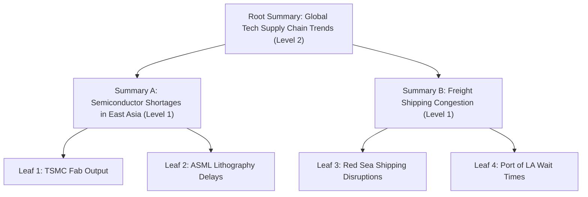

# Chapter 16: Hierarchical Episodic Memory, MemGPT Architectures, and GraphRAG

> **Preceding Bridge:** In [Chapter 06: Memory, Guardrails, Evaluation & Gateways](06-Memory-Guardrails-Evaluation-Gateways.md), you learned basic conversation sliding windows and vector memory stores. In this chapter, we elevate memory to enterprise scale: how long-running autonomous agents remember interactions across months without overflowing context limits, using **Hierarchical Episodic Memory (MemGPT / Letta)**, **Recursive Summarization (RAPTOR)**, and **Knowledge Graph Augmented Retrieval (GraphRAG)**.

---

## 1. Plain-English Jargon Demystifier

| Technical Term | Plain English Translation | Real-World Metaphor |
| :--- | :--- | :--- |
| **Working Memory (RAM)** | The immediate context window currently visible to the LLM (e.g., active tokens). | The physical desk space you have to work on right now. |
| **Episodic Memory** | A time-ordered log of past events and conversations ("What happened on Tuesday?"). | A personal diary with date stamps for every entry. |
| **Semantic Memory** | Extracted factual knowledge independent of when it occurred ("Alice is allergic to peanuts"). | An encyclopedia entry or flashcard. |
| **Core Memory (Persona)** | Read/write slots in the system prompt where the agent records vital facts about the user and itself. | Sticky notes pinned directly to the edge of the computer monitor. |
| **Archival Memory** | High-capacity vector and document storage queried via explicit tool calls. | Filing cabinets in the basement searched by filing code. |
| **RAPTOR Trees** | Recursive summary trees grouping similar text chunks into multi-layer summaries. | A book with chapter summaries, section summaries, and a 1-page executive summary. |
| **GraphRAG** | Extracting entities and relationships into a graph, clustering them into communities, and summarizing whole clusters. | An intelligence agency org-chart connecting persons of interest and their joint organizations. |

---

## 2. Spoon-Fed Mental Model: The OS Virtual Memory Architecture

How can an operating system run a 100 GB video editing program on a machine with only 16 GB of physical RAM?
Through **Virtual Memory and Paging**:
- Active instructions live in **L1/L2 Cache and RAM** (blazing fast, limited space).
- Inactive data is paged out to the **NVMe SSD / Swap file** (huge capacity, slower access).
- When a missing page is requested, a **Page Fault** triggers the OS to fetch it from disk into RAM.

**MemGPT (Letta)** applies the exact same operating system architecture to LLMs:

```
┌────────────────────────────────────────────────────────────────────────┐
│                        LLM CONTEXT WINDOW                              │
│                                                                        │
│  ┌─────────────────────────┐         ┌───────────────────────────────┐ │
│  │   CORE MEMORY (Slots)   │         │    WORKING CONVERSATION       │ │
│  │  - User: Alice (CEO)    │         │  - User: "Can we review Q3?"  │ │
│  │  - Agent: Financial Bot │         │  - Agent: "Loading docs..."   │ │
│  └───────────┬─────────────┘         └───────────────┬───────────────┘ │
└──────────────┼───────────────────────────────────────┼─────────────────┘
               │ (Tool: core_memory_replace)           │ (Context Overflow)
               ▼                                       ▼
┌──────────────────────────────┐         ┌───────────────────────────────┐
│     ARCHIVAL STORAGE         │         │     RECALL MEMORY             │
│  Vector Database (Pinecone)  │         │  Complete SQL Event Log       │
│  100,000 document chunks     │         │  Every conversation ever      │
└──────────────────────────────┘         └───────────────────────────────┘
```

The LLM manages its own memory via tool calls:
- `core_memory_append(section, content)`: Updates sticky notes.
- `archival_memory_insert(content)`: Writes long-term knowledge to vector disk.
- `archival_memory_search(query)`: Performs a "page fault" to load past knowledge into context.

---

## 3. Microsoft GraphRAG & RAPTOR Trees

### Why Flat Vector Search Fails for Global Syntheses
Suppose you feed 1,000 earnings call transcripts into a vector database and ask:
> *"What were the top 3 global supply chain bottlenecks across all tech companies this quarter?"*

**Naive RAG completely fails!** Every vector chunk talks about one specific factory or port. Cosine similarity only retrieves 5 arbitrary fragments. It has no way to synthesize a bird's-eye view across 1,000 files!

### Solution 1: RAPTOR (Recursive Abstractive Processing for Tree-Organized Retrieval)
1. Split documents into small leaf chunks ($L_0$).
2. Cluster similar chunks using Gaussian Mixture Models on embedding vectors.
3. Use an LLM to generate a summary for each cluster ($L_1$).
4. Recursively cluster and summarize the summaries ($L_2 \to L_{root}$).
5. **Retrieval:** If the query is broad and thematic, search high-level tree nodes ($L_2$); if the query is detailed, search leaf nodes ($L_0$).



### Solution 2: GraphRAG (Entity-Relationship Knowledge Graphs)
1. **Extraction:** LLM extracts entities (`Company`, `Person`, `Location`, `Technology`) and relationships (`SUPPLIES_TO`, `INVESTS_IN`).
2. **Community Detection:** Uses the **Leiden Algorithm** to detect hierarchical communities of densely connected entities in the graph.
3. **Community Reports:** LLMs summarize each community at multiple granularity levels.
4. **Global Query Answering:** The system answers high-level questions by mapping-reducing over community summaries rather than individual raw chunks.

---

## 4. Junior vs Staff Implementation: Agent Memory Systems

```
┌─────────────────────────────────────────────────────────────────────────┐
│ JUNIOR IMPLEMENTATION: The Endless Chat History Array                   │
├─────────────────────────────────────────────────────────────────────────┤
│ messages.append({"role": "user", "content": user_input})                │
│ # Crashes after 50 turns with ContextWindowExceededError!               │
│ # Or costs $2.50 per query sending 128k redundant tokens every turn!    │
└─────────────────────────────────────────────────────────────────────────┘
                                   │
                                   ▼
┌─────────────────────────────────────────────────────────────────────────┐
│ STAFF IMPLEMENTATION: MemGPT State Machine Architecture                 │
├─────────────────────────────────────────────────────────────────────────┤
│ - Core Memory slots (User Persona & Agent Goal) pinned in prompt        │
│ - FIFO Working Memory buffer with automated eviction threshold          │
│ - Evicted messages summarized and archived into vector/SQL storage      │
│ - LLM self-edits its core memory via explicit tool calls                │
└─────────────────────────────────────────────────────────────────────────┘
```

---

## 5. Complete Runnable Implementation: MemGPT Memory Engine

Here is a pure-Python, zero-dependency implementation of an OS-style hierarchical memory manager:

```python
import time
from typing import List, Dict, Optional


class CoreMemory:
    """Working RAM: Always visible in system prompt, editable by LLM tools."""
    def __init__(self):
        self.sections: Dict[str, str] = {
            "human_profile": "Name: Alice | Role: Security Engineer | Preferences: Python only",
            "persona": "Name: Aegis | Role: Security Architect Assistant | Style: Direct, rigorous"
        }

    def update_section(self, section: str, new_content: str) -> str:
        self.sections[section] = new_content
        return f"[SUCCESS] Core memory section '{section}' updated."

    def compile_prompt(self) -> str:
        lines = ["=== CORE MEMORY (PERSISTENT CONTEXT) ==="]
        for key, val in self.sections.items():
            lines.append(f"<{key}>\n{val}\n</{key}>")
        lines.append("========================================")
        return "\n".join(lines)


class HierarchicalMemoryManager:
    """
    Manages three memory tiers:
      Tier 1: Core Memory (System prompt slots)
      Tier 2: Working Conversation Buffer (Max N turns)
      Tier 3: Archival Memory (Long-term vector/keyword storage)
    """
    def __init__(self, max_working_turns: int = 4):
        self.core = CoreMemory()
        self.working_buffer: List[Dict[str, str]] = []
        self.archival_store: List[Dict[str, str]] = []
        self.max_working_turns = max_working_turns

    def add_message(self, role: str, content: str) -> None:
        """Appends to working buffer; triggers paging when capacity is exceeded."""
        self.working_buffer.append({"role": role, "content": content, "timestamp": time.time()})
        
        # Check for context overflow (Page out oldest messages)
        if len(self.working_buffer) > self.max_working_turns:
            self._page_out_oldest()

    def _page_out_oldest(self) -> None:
        """Evicts oldest interaction and stores in long-term Archival Store."""
        evicted = self.working_buffer.pop(0)
        # In production, an LLM summarizes or embeds this before storing
        archive_entry = {
            "content": f"Archived {evicted['role']}: {evicted['content']}",
            "archived_at": time.time()
        }
        self.archival_store.append(archive_entry)
        print(f"[PAGING] Evicted message to Archival Storage: '{evicted['content'][:40]}...'")

    def search_archival(self, keyword: str) -> List[str]:
        """Tool callable by the agent to retrieve past knowledge."""
        matches = [entry["content"] for entry in self.archival_store if keyword.lower() in entry["content"].lower()]
        return matches

    def build_full_llm_payload(self, current_user_query: str) -> str:
        """Compiles Core Memory + Working History for next LLM generation."""
        payload = [self.core.compile_prompt()]
        payload.append("\n=== ACTIVE CONVERSATION ===")
        for msg in self.working_buffer:
            payload.append(f"{msg['role'].upper()}: {msg['content']}")
        payload.append(f"USER: {current_user_query}")
        return "\n".join(payload)


# --- Production Verification ---
if __name__ == "__main__":
    agent_mem = HierarchicalMemoryManager(max_working_turns=3)

    print("--- [STAGE 1] Normal Conversation Turns ---")
    agent_mem.add_message("user", "Hello, remember that my project deadline is November 15.")
    agent_mem.add_message("assistant", "Noted! November 15 recorded.")
    agent_mem.add_message("user", "We are using PostgreSQL for our database.")
    agent_mem.add_message("assistant", "PostgreSQL database confirmed.")

    print("\n--- [STAGE 2] Paging Out Due to Context Overflow ---")
    # This 5th message will trigger eviction of the first message to Archival Store
    agent_mem.add_message("user", "Let's also configure Redis for caching.")

    print("\n--- [STAGE 3] Tool-Based Archival Memory Search ---")
    query_results = agent_mem.search_archival("deadline")
    print(f"Agent queries archival for 'deadline': {query_results}")

    print("\n--- [STAGE 4] Compiled Prompt Delivered to LLM ---")
    print(agent_mem.build_full_llm_payload("What cache are we using?"))
```

---

## 6. Chapter Milestone Check

Verify your understanding before moving forward:

1. **How does MemGPT prevent context window exhaustion in continuous running agents?**
   - *Answer:* It treats the context window as RAM and separates it from external storage (disk). When the working memory reaches capacity, older messages are automatically summarized, paged out to archival storage, and retrieved only when the agent issues a search tool call.
2. **What is the key advantage of RAPTOR's tree-structured retrieval over standard flat chunking?**
   - *Answer:* Flat chunking cannot answer broad, thematic questions spanning an entire library. RAPTOR builds recursive cluster summaries, allowing queries to be answered at varying levels of semantic abstraction.
3. **In GraphRAG, what does the Leiden community detection algorithm accomplish?**
   - *Answer:* It partitions densely connected clusters of entities (e.g., all people and projects within a single department) so the system can generate structured, high-level summaries of entire interconnected domains.
