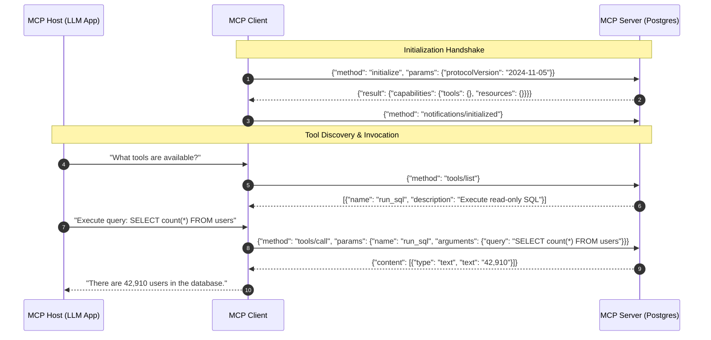

# Chapter 17: Model Context Protocol (MCP) and Multi-Agent Swarm Orchestration

> **Preceding Bridge:** In [Chapter 07: Multi-Agent Collaboration](07-Multi-Agent-Collaboration-And-Production.md) and [Chapter 16: Hierarchical Episodic Memory](16-Hierarchical-Episodic-Memory-And-GraphRAG.md), you learned how individual agents think, use tools, and retain memory. In this chapter, we explore how modern production agents interface with external enterprise infrastructure via Anthropic's **Model Context Protocol (MCP)**, and how multi-agent swarms reach deterministic consensus without infinite ping-pong loops.

---

## 1. Plain-English Jargon Demystifier

| Technical Term | Plain English Translation | Real-World Metaphor |
| :--- | :--- | :--- |
| **MCP (Model Context Protocol)** | An open JSON-RPC 2.0 standard allowing any AI model to securely connect to external tools and data sources. | The **USB-C port** for AI: one universal cable connects your laptop to monitors, drives, and chargers. |
| **MCP Host** | The application running the AI assistant (e.g., Claude Desktop, Antigravity IDE, Cursor). | The laptop computer that has the USB-C port. |
| **MCP Client** | The software connector inside the host that negotiates with external tool servers. | The USB host controller on the motherboard. |
| **MCP Server** | A standalone microservice exposing specific tools, resources, or prompts via JSON-RPC. | An external hard drive, camera, or keyboard plugged into the USB port. |
| **Multi-Agent Swarm** | A network of specialized agents cooperating to solve complex, multi-stage goals. | A surgical team: lead surgeon, anesthesiologist, scrub nurse, and monitoring technician. |
| **Blackboard Architecture** | A shared global memory space where agents post partial findings and inspect others' outputs. | A physical whiteboard in a war room where detectives pin clues and connect string. |
| **Handoff Token** | A structured state object passed from one agent to another during delegation. | A relay race baton passed from Runner 1 to Runner 2. |

---

## 2. Spoon-Fed Mental Model: The USB-C Standard for AI Agents

Before 2024, every AI framework had proprietary, non-interoperable tool definitions:
- LangChain had its custom `@tool` decorator.
- LlamaIndex had its custom `FunctionTool`.
- AutoGen had its custom function registry.
- OpenAI and Anthropic had different JSON schema payload formats.

If an enterprise built a secure PostgreSQL tool, they had to rewrite the tool 5 times for 5 different frameworks!

**Anthropic's Model Context Protocol (MCP)** unified the entire ecosystem into a standard client-server protocol over JSON-RPC 2.0:

```
┌─────────────────────────────────────────────────────────────┐
│                       MCP HOST                              │
│   (Antigravity IDE / Claude Desktop / Custom Agent App)     │
│                                                             │
│               ┌─────────────────────────┐                   │
│               │       MCP CLIENT        │                   │
│               └────────────┬────────────┘                   │
└────────────────────────────┼────────────────────────────────┘
             JSON-RPC 2.0 over stdin/stdout OR HTTP-SSE
        ┌────────────────────┼────────────────────┐
        ▼                    ▼                    ▼
┌───────────────┐    ┌───────────────┐    ┌───────────────┐
│  MCP SERVER   │    │  MCP SERVER   │    │  MCP SERVER   │
│  PostgreSQL   │    │  Filesystem   │    │  Git / GitHub │
│  (Database)   │    │  (OS Access)  │    │  (DevOps)     │
└───────────────┘    └───────────────┘    └───────────────┘
```

Now, write a tool **once** as an MCP server in Python, TypeScript, or Go, and **every** AI host in the world can instantly discover its tools, call them, and inspect resources securely.

---

## 3. The 3 Primitives of MCP

Every MCP server exposes three core capabilities:

1. **Tools:** Executable functions that take JSON parameters and perform actions (e.g., `execute_sql_query`, `deploy_kubernetes_pod`).
2. **Resources:** Read-only data URIs representing file contents, database schemas, or system logs (e.g., `postgres://prod_db/schema`, `file:///logs/app.log`).
3. **Prompts:** Pre-engineered templates with instructions and context that guide the model for specific workflows (e.g., `review_pr_diff`, `triage_incident`).



---

## 4. Multi-Agent Swarm Topologies: Avoiding the Infinite Loop

When multiple agents interact, how do you prevent them from getting stuck in an endless loop (*Agent A asks Agent B, Agent B asks Agent A back*)?

```
┌────────────────────────────────────────────────────────────────────────┐
│ 1. SUPERVISOR PATTERN (Hierarchical)                                   │
│    - One Boss Agent breaks down the goal into subtasks.                │
│    - Worker agents NEVER speak directly to each other; they report     │
│      back to the Supervisor.                                           │
│    - Best for: Deterministic workflows, rigid business rules.          │
├────────────────────────────────────────────────────────────────────────┤
│ 2. SWARM / PEER HANDOFF (Autonomous Delegation)                        │
│    - The Triaging Agent transfers state directly to a Specialist.      │
│    - State is packaged in a deterministic Handoff context object.      │
│    - Maximum turn budget enforced (e.g., Max 10 total handoffs).       │
├────────────────────────────────────────────────────────────────────────┤
│ 3. BLACKBOARD PATTERN (Collaborative Consensus)                        │
│    - Shared key-value state store.                                     │
│    - Agents monitor state updates and contribute specialized analysis. │
│    - Convergence reached when all active consensus flags evaluate true.│
└────────────────────────────────────────────────────────────────────────┘
```

---

## 5. Junior vs Staff Implementation: Agent Tool Integration

```
┌─────────────────────────────────────────────────────────────────────────┐
│ JUNIOR IMPLEMENTATION: Ad-Hoc Python Function Monkey-Patching           │
├─────────────────────────────────────────────────────────────────────────┤
│ def query_db(q): ...                                                    │
│ # Injected into OpenAI call with hand-crafted schemas.                  │
│ # Completely non-portable: cannot be reused in Cursor, Claude, or IDE.  │
│ # Crashes silently when parameters change without validation.           │
└─────────────────────────────────────────────────────────────────────────┘
                                   │
                                   ▼
┌─────────────────────────────────────────────────────────────────────────┐
│ STAFF IMPLEMENTATION: Formal MCP Server with Protocol Validation        │
├─────────────────────────────────────────────────────────────────────────┤
│ - Complies with JSON-RPC 2.0 MCP standard specification                 │
│ - Strict Pydantic / JSON-Schema validation of arguments & return types  │
│ - Isolated process sandbox (stdio / SSE separation)                     │
│ - Instant plug-and-play compatibility with any MCP-compliant AI client  │
└─────────────────────────────────────────────────────────────────────────┘
```

---

## 6. Complete Runnable Implementation: Pure-Python MCP Server & Swarm Orchestrator

Here is a 100% runnable, zero-external-dependency script implementing an MCP-compatible JSON-RPC tool server and a deterministic 2-agent consensus swarm:

```python
import json
from typing import Dict, Any, List


class MCPServer:
    """
    Simulates a compliant Model Context Protocol Server over JSON-RPC 2.0.
    Exposes:
      1. Tools: 'get_system_metrics', 'restart_service'
      2. Resources: 'system://health'
    """
    def __init__(self, server_name: str):
        self.name = server_name
        self.tools = {
            "get_system_metrics": {
                "description": "Returns current CPU, RAM, and disk utilization percentages.",
                "parameters": {"type": "object", "properties": {}},
                "handler": self._get_system_metrics
            },
            "restart_service": {
                "description": "Restarts a target microservice container safely.",
                "parameters": {
                    "type": "object",
                    "properties": {"service_name": {"type": "string"}},
                    "required": ["service_name"]
                },
                "handler": self._restart_service
            }
        }

    def _get_system_metrics(self, args: Dict[str, Any]) -> str:
        return json.dumps({"cpu_percent": 94.2, "ram_percent": 88.7, "status": "DEGRADED"})

    def _restart_service(self, args: Dict[str, Any]) -> str:
        service = args.get("service_name", "unknown")
        return json.dumps({"action": "RESTART", "target": service, "result": "SUCCESS", "exit_code": 0})

    def handle_request(self, raw_rpc: str) -> str:
        """Processes incoming JSON-RPC 2.0 requests."""
        req = json.loads(raw_rpc)
        req_id = req.get("id")
        method = req.get("method")
        params = req.get("params", {})

        if method == "initialize":
            return json.dumps({
                "jsonrpc": "2.0",
                "id": req_id,
                "result": {
                    "serverInfo": {"name": self.name, "version": "1.0.0"},
                    "capabilities": {"tools": list(self.tools.keys())}
                }
            })

        elif method == "tools/list":
            tools_list = [
                {"name": name, "description": t["description"], "inputSchema": t["parameters"]}
                for name, t in self.tools.items()
            ]
            return json.dumps({"jsonrpc": "2.0", "id": req_id, "result": {"tools": tools_list}})

        elif method == "tools/call":
            tool_name = params.get("name")
            tool_args = params.get("arguments", {})
            if tool_name not in self.tools:
                return json.dumps({
                    "jsonrpc": "2.0",
                    "id": req_id,
                    "error": {"code": -32601, "message": f"Tool '{tool_name}' not found."}
                })

            handler = self.tools[tool_name]["handler"]
            output = handler(tool_args)
            return json.dumps({
                "jsonrpc": "2.0",
                "id": req_id,
                "result": {"content": [{"type": "text", "text": output}]}
            })

        return json.dumps({
            "jsonrpc": "2.0",
            "id": req_id,
            "error": {"code": -32600, "message": "Invalid request."}
        })


class MultiAgentSwarmCoordinator:
    """
    Demonstrates a deterministic 2-agent incident triage swarm:
      1. Triage Agent (Diagnostician) inspects metrics via MCP.
      2. Remediation Agent (Operator) reviews diagnosis and executes remediation.
    """
    def __init__(self, mcp_server: MCPServer):
        self.mcp = mcp_server
        self.step_budget = 5

    def run_incident_response(self, incident_alert: str):
        print("=" * 70)
        print(" MULTI-AGENT SWARM WITH MODEL CONTEXT PROTOCOL (MCP)")
        print("=" * 70)
        print(f"[ALERT RECEIVED]: '{incident_alert}'\n")

        # Step 1: Initialize MCP Session
        init_req = json.dumps({"jsonrpc": "2.0", "id": 1, "method": "initialize"})
        print(f"[HOST -> MCP SERVER] {init_req}")
        init_res = self.mcp.handle_request(init_req)
        print(f"[MCP SERVER -> HOST] {init_res}\n")

        # Step 2: Agent 1 (Diagnostician) Calls get_system_metrics
        print("--- [PHASE 1] Agent 1 (Diagnostician) Executing Tool Call ---")
        metrics_req = json.dumps({
            "jsonrpc": "2.0",
            "id": 2,
            "method": "tools/call",
            "params": {"name": "get_system_metrics", "arguments": {}}
        })
        metrics_res = json.loads(self.mcp.handle_request(metrics_req))
        metrics_data = json.loads(metrics_res["result"]["content"][0]["text"])
        print(f"[AGENT 1] Tool Output: CPU={metrics_data['cpu_percent']}%, RAM={metrics_data['ram_percent']}%")

        # Step 3: Handoff to Agent 2 (Remediation Specialist)
        print("\n--- [PHASE 2] Swarm Handoff: Diagnostician -> Remediation Specialist ---")
        handoff_packet = {
            "root_cause": "High CPU bottleneck on payment_gateway service",
            "recommended_action": "restart_service"
        }
        print(f"[HANDOFF STATE]: {handoff_packet}")

        # Step 4: Agent 2 Executes Remediation via MCP
        print("\n--- [PHASE 3] Agent 2 (Remediation) Calling Tool ---")
        remediation_req = json.dumps({
            "jsonrpc": "2.0",
            "id": 3,
            "method": "tools/call",
            "params": {"name": "restart_service", "arguments": {"service_name": "payment_gateway"}}
        })
        remediation_res = json.loads(self.mcp.handle_request(remediation_req))
        action_result = json.loads(remediation_res["result"]["content"][0]["text"])
        print(f"[AGENT 2] Remediation Executed: Status={action_result['result']}, ExitCode={action_result['exit_code']}")
        print("\n[INCIDENT RESOLVED]: Swarm achieved consensus and remediated incident safely.")
        print("=" * 70)


if __name__ == "__main__":
    server = MCPServer(server_name="enterprise-infra-mcp")
    coordinator = MultiAgentSwarmCoordinator(mcp_server=server)
    coordinator.run_incident_response("P1: High Latency and CPU Throttling on Core Cluster")
```

---

## 7. Chapter Milestone Check

Verify your understanding before continuing:

1. **Why is the Model Context Protocol (MCP) considered the "USB-C" of the AI industry?**
   - *Answer:* It provides a single universal, standardized communication protocol (JSON-RPC 2.0) for exposing tools, prompts, and resources. Developers implement tools once on an MCP server, and any AI application can immediately connect and consume them without custom SDK integration.
2. **What are the three core primitives exposed by an MCP server?**
   - *Answer:* Tools (callable actions), Resources (read-only data URIs), and Prompts (reusable LLM interaction templates).
3. **How does a supervisor multi-agent architecture prevent infinite recursion between agents?**
   - *Answer:* Worker agents are not permitted to delegate directly to each other; all communication routes back through the supervisor, which tracks a strict finite turn budget and halts the workflow when convergence criteria are met.

---

## Verified Worked Example and Version Note (MCP SDK)

A real MCP server with one tool and one resource is in [`examples/ex04_mcp_server.py`](examples/ex04_mcp_server.py), verified on `mcp==2.3.0`. **The Python SDK changed between major versions:** in 1.x the server class is `mcp.server.fastmcp.FastMCP`; in 2.x it is `mcp.server.mcpserver.MCPServer`. Type hints and the docstring become the tool's JSON Schema in both. Always pin the SDK version and check the migration notes when upgrading.

Pinned for the verified examples: `langgraph==1.2.13`, `mcp==2.3.0`, `pytest==9.1.1` (see `examples/requirements.txt`). All examples run offline with a scripted fake model: `cd examples && pip install -r requirements.txt && pytest -q`.


## Further Reading

- [Model Context Protocol](https://modelcontextprotocol.io/)
- [MCP Python SDK](https://github.com/modelcontextprotocol/python-sdk)
- [OpenAI Swarm](https://github.com/openai/swarm)


---

## Check Yourself

Answer in your head or on paper first, then open each answer.

<details>
<summary><strong>1.</strong> What problem does MCP solve?</summary>

It standardises how AI applications connect to tools and data, turning M-by-N integrations into M plus N.

</details>

<details>
<summary><strong>2.</strong> Name MCP's three primitives.</summary>

Tools, resources and prompts.

</details>

<details>
<summary><strong>3.</strong> What changed in the Python SDK between 1.x and 2.x?</summary>

The server class `FastMCP` (`mcp.server.fastmcp`) became `MCPServer` (`mcp.server.mcpserver`); pin the version.

</details>

<details>
<summary><strong>4.</strong> Why treat third-party MCP servers as untrusted?</summary>

Their tool descriptions enter the prompt and their code runs on your behalf: tool poisoning and injection are possible.

</details>
