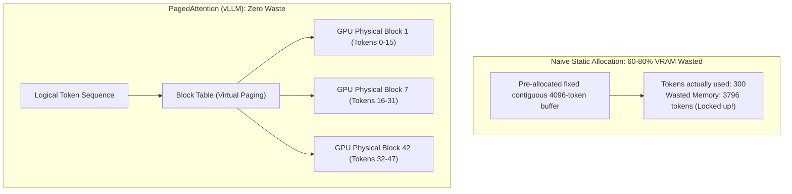

# Chapter 18: GPU Serving Mechanics: PagedAttention, Continuous Batching, and vLLM

> **Preceding Bridge:** In [Chapter 12: Production Agent Deployment](12-Production-Agent-Deployment-Streaming-And-Human-In-The-Loop.md), you learned how to stream LLM responses and manage user sessions. But how does an inference engine like vLLM or TensorRT-LLM actually execute transformer models on physical Nvidia GPUs? In this chapter, we explore the hardware-level bottleneck of modern AI: the **KV Cache**, **PagedAttention**, **Continuous Batching**, and **Prefix Caching**.

---

## 1. Plain-English Jargon Demystifier

| Technical Term | Plain English Translation | Real-World Metaphor |
| :--- | :--- | :--- |
| **Prefill Phase** | The GPU reading and encoding the entire input prompt all at once. | Reading an entire legal contract before beginning to speak. Compute-heavy! |
| **Decode Phase** | The GPU generating one single output token at a time, autoregressively. | Speaking one word every second. Memory bandwidth-bound! |
| **KV Cache** | Storing Key and Value vectors for past tokens in GPU VRAM so we don't recalculate them on every new token. | A chalkboard where you keep notes on what you've already said so you don't repeat yourself. |
| **Memory Fragmentation** | Wasted GPU memory caused by reserving large blocks that aren't fully filled. | Reserving an entire 8-person dining table for a single diner who might invite friends later. |
| **PagedAttention** | Dividing the KV cache into small fixed-size virtual memory pages (e.g., 16 tokens/block), eliminating fragmentation. | Booking dining hall seats one chair at a time as guests actually arrive at the door. |
| **Continuous Batching** | Evicting completed requests immediately and inserting new requests at each token generation step. | A fast-moving conveyor belt where finished packages leave and new packages join instantly. |
| **Prefix Caching** | Reusing the pre-computed KV Cache of a shared system prompt across hundreds of users. | Printing 1,000 copies of the syllabus once, instead of writing it out by hand for every student. |

---

## 2. Spoon-Fed Mental Model: The Restaurant Reservation Problem

Imagine an expensive restaurant with 80 seats.

### The Naive Serving Model (Static Batching):
- When 4 guests walk in, the host asks: *"What is the maximum number of dishes you could possibly order?"*
- Guests reply: *"Maybe 50 dishes, maybe only 2."*
- The host locks down 50 tables just in case, and **refuses to seat any other customers until those 4 guests pay and leave!**
- Result: **75% of tables sit completely empty and wasted**, and outside lines grow out of control.

### The PagedAttention Model (vLLM):
- The host gives each customer a table for just **1 dish at a time**.
- As the customer finishes a dish and orders another, the waiter pulls up an extra modular table segment from storage.
- When a customer finishes their meal, their tables are immediately reassigned to waiting patrons in the lobby!
- Result: **Near 100% table utilization**, zero wasted space, and 5x higher throughput!



---

## 3. The Mathematics of KV Cache Memory Consumption

Why does GPU memory (VRAM) run out so quickly during inference?
For every token processed, the transformer computes Key and Value vectors for all attention heads across all layers.

The formula for KV Cache size is:
$$\text{KV Cache Bytes} = 2 \times n_{\text{layers}} \times n_{\text{heads}} \times d_{\text{head}} \times \text{seq\_len} \times \text{bytes\_per\_element}$$

### Real-World Example: Llama-3-70B (FP16, 2 bytes/float)
* Layers ($n_{\text{layers}}$): 80
* KV Heads ($n_{\text{heads}}$): 8 (Grouped-Query Attention)
* Head Dimension ($d_{\text{head}}$): 128
* Bytes per element: 2 (FP16)

$$\text{Per Token Memory} = 2 \times 80 \times 8 \times 128 \times 2 = 327,680\text{ bytes} \approx 320\text{ KB per token}$$

For a single user generating a **4,096-token sequence**:
$$\text{VRAM required per user} = 4,096 \times 320\text{ KB} \approx 1.28\text{ GB}$$

If you want to serve **100 concurrent users**, you need **128 GB of VRAM solely for the KV Cache**, on top of the 140 GB needed just to store the model weights!

---

## 4. Continuous Batching vs Static Batching

In traditional DL frameworks (HuggingFace transformers), batching is static:
- Request A finishes in 50 tokens.
- Request B takes 1,000 tokens.
- Request A's GPU thread must sit completely idle for 950 steps waiting for Request B to finish!

**Continuous (Iteration-Level) Batching** schedules at the granularity of a **single token iteration**:
1. At step $T$, Request A generates its `<|endoftext|>` token and is instantly evicted.
2. Request C from the waiting queue is slotted into Request A's vacant slot immediately.
3. GPU cores operate at 95%+ compute saturation continuously!

---

## 5. Junior vs Staff Implementation: LLM Serving

```
┌────────────────────────────────────────────────────────────────────────┐
│ JUNIOR IMPLEMENTATION: Raw HuggingFace Pipeline in FastAPI             │
├────────────────────────────────────────────────────────────────────────┤
│ - Model loaded with AutoModelForCausalLM.from_pretrained()             │
│ - Naive Python thread lock around model.generate()                     │
│ - Memory crashes with CUDA Out of Memory (OOM) at 6 concurrent users   │
│ - Throughput: ~15 tokens/sec total cluster output                      │
└────────────────────────────────────────────────────────────────────────┘
                                   │
                                   ▼
┌────────────────────────────────────────────────────────────────────────┐
│ STAFF IMPLEMENTATION: vLLM Distributed Serving with PagedAttention     │
├────────────────────────────────────────────────────────────────────────┤
│ - vLLM engine with PagedAttention block manager (16 tokens/block)      │
│ - Continuous iteration-level batching with asynchronous scheduling     │
│ - Prefix Caching enabled: System prompt cached across all tenants      │
│ - Chunked Prefill: Smooths TTFT (Time To First Token) latency spikes   │
│ - Throughput: ~2,500+ tokens/sec on the exact same hardware!          │
└────────────────────────────────────────────────────────────────────────┘
```

---

## 6. Complete Runnable Implementation: KV Cache Paging Simulator

Here is a pure Python simulation demonstrating how PagedAttention allocates non-contiguous memory blocks and tracks virtual-to-physical block tables:

```python
import math
from typing import List, Dict, Optional


class PhysicalBlock:
    """Represents a physical chunk of GPU High Bandwidth Memory (HBM)."""
    def __init__(self, block_id: int, block_size: int = 16):
        self.block_id = block_id
        self.block_size = block_size
        self.slots_used = 0

    def is_full(self) -> bool:
        return self.slots_used >= self.block_size

    def allocate_slot(self) -> int:
        if self.is_full():
            raise MemoryError("Block is full!")
        slot = self.slots_used
        self.slots_used += 1
        return slot


class PagedAttentionMemoryManager:
    """
    Simulates vLLM's PagedAttention block manager.
    Eliminates internal and external GPU memory fragmentation.
    """
    def __init__(self, total_gpu_blocks: int, block_size: int = 16):
        self.block_size = block_size
        self.free_blocks: List[int] = list(range(total_gpu_blocks))
        self.physical_blocks: Dict[int, PhysicalBlock] = {
            i: PhysicalBlock(i, block_size) for i in range(total_gpu_blocks)
        }
        # Mapping: {request_id: [physical_block_id_1, physical_block_id_2, ...]}
        self.block_tables: Dict[str, List[int]] = {}

    def allocate_request(self, request_id: str, prompt_token_count: int) -> None:
        """Allocates initial physical blocks for a new prompt."""
        blocks_needed = math.ceil(prompt_token_count / self.block_size)
        if len(self.free_blocks) < blocks_needed:
            raise MemoryError(f"CUDA OOM: Out of GPU blocks! Needed {blocks_needed}, free {len(self.free_blocks)}")

        allocated = []
        remaining_tokens = prompt_token_count
        for _ in range(blocks_needed):
            b_id = self.free_blocks.pop(0)
            allocated.append(b_id)
            tokens_in_this_block = min(remaining_tokens, self.block_size)
            self.physical_blocks[b_id].slots_used = tokens_in_this_block
            remaining_tokens -= tokens_in_this_block

        self.block_tables[request_id] = allocated
        print(f"[ALLOCATE] Request '{request_id}' ({prompt_token_count} tokens) -> Physical Blocks: {allocated}")

    def append_generated_token(self, request_id: str) -> None:
        """Appends one autoregressively generated token (Decode phase)."""
        table = self.block_tables[request_id]
        last_block_id = table[-1]
        last_block = self.physical_blocks[last_block_id]

        if not last_block.is_full():
            last_block.allocate_slot()
        else:
            # Current block full: allocate a new page from free pool
            if not self.free_blocks:
                raise MemoryError(f"CUDA OOM: Cannot allocate new block for {request_id}!")
            new_block_id = self.free_blocks.pop(0)
            self.physical_blocks[new_block_id].slots_used = 1
            table.append(new_block_id)
            print(f"[PAGE EXPANSION] Request '{request_id}' allocated new Physical Block: {new_block_id}")

    def free_request(self, request_id: str) -> None:
        """Frees all blocks used by completed request, returning them to pool."""
        table = self.block_tables.pop(request_id, [])
        for b_id in table:
            self.physical_blocks[b_id].slots_used = 0
            self.free_blocks.append(b_id)
        print(f"[FREE] Request '{request_id}' finished. Freed blocks: {table}")

    def stats(self) -> Dict[str, float]:
        total_blocks = len(self.physical_blocks)
        used_blocks = total_blocks - len(self.free_blocks)
        return {
            "total_blocks": total_blocks,
            "used_blocks": used_blocks,
            "utilization_pct": round((used_blocks / total_blocks) * 100, 2)
        }


# --- Verification ---
if __name__ == "__main__":
    print("=" * 70)
    print(" PAGED ATTENTION VIRTUAL MEMORY SIMULATION")
    print("=" * 70)

    # 10 blocks of 16 tokens each = 160 total tokens capacity
    manager = PagedAttentionMemoryManager(total_gpu_blocks=10, block_size=16)

    # Allocate Request 1 (Prompt: 25 tokens -> needs 2 blocks: 16 + 9)
    manager.allocate_request("req_alice", prompt_token_count=25)

    # Allocate Request 2 (Prompt: 30 tokens -> needs 2 blocks: 16 + 14)
    manager.allocate_request("req_bob", prompt_token_count=30)

    print("\nCurrent Memory State:", manager.stats())

    # Simulate generation of 10 tokens for Alice (fills first block and expands to 3rd block)
    print("\n--- Generating 10 new tokens for req_alice ---")
    for _ in range(10):
        manager.append_generated_token("req_alice")

    print(f"Alice's updated Block Table: {manager.block_tables['req_alice']}")
    print("Memory State after generation:", manager.stats())

    # Bob finishes and leaves
    print("\n--- Bob finishes generation ---")
    manager.free_request("req_bob")
    print("Memory State after Bob left:", manager.stats())
    print("=" * 70)
```

---

## 7. Chapter Milestone Check

Verify your understanding before moving forward:

1. **Why does the autoregressive Decode phase of an LLM spend most of its time waiting on GPU memory bandwidth rather than compute?**
   - *Answer:* For each new single token, the GPU must stream billions of model weights and millions of past KV cache values from high-bandwidth memory (HBM) into SRAM registers just to perform a handful of matrix-vector multiplications.
2. **How does PagedAttention eliminate the 60-80% memory waste common in naive static serving?**
   - *Answer:* Instead of pre-allocating a contiguous array for the worst-case sequence length (e.g., 4096 tokens), PagedAttention allocates small virtual blocks (e.g., 16 tokens) dynamically as tokens are generated, mapping non-contiguous physical blocks via a block table.
3. **What is Prefix Caching and why is it game-changing for agentic multi-turn chats?**
   - *Answer:* Multi-turn agents repeatedly send the same system prompt and tools list. Prefix caching retains the KV cache of that shared prefix across requests, dropping the time-to-first-token (TTFT) and compute cost to near zero.
