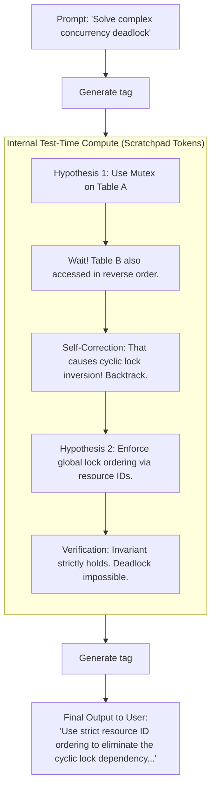

# Chapter 19: Reasoning Models, Test-Time Compute, and GRPO

> **Preceding Bridge:** In [Chapter 01: LLM Foundations](01-LLM-Foundations-Tokenization-Inference.md) and [Chapter 14: Model Fine-Tuning & DPO](14-Model-Fine-Tuning-LoRA-And-DPO-Alignment.md), you learned standard next-token autoregressive generation and preference alignment. In this chapter, we explore the definitive AI paradigm shift of 2025/2026: **Test-Time Compute**, **Thinking Tokens (`<think> ... </think>`)**, and **Group Relative Policy Optimization (GRPO)** popularized by DeepSeek-R1 and OpenAI o1/o3.

---

## 1. Plain-English Jargon Demystifier

| Technical Term | Plain English Translation | Real-World Metaphor |
| :--- | :--- | :--- |
| **Test-Time Compute** | Allowing the model to generate internal reasoning tokens before outputting its final response. | A student writing calculations on scratch paper before writing the final answer on the exam sheet. |
| **Thinking Tokens (`<think>`)** | Hidden internal tokens where the model explores hypotheses, backtracks, and checks its own logic. | The internal monologue inside your head before you speak aloud. |
| **PPO (Proximal Policy Optimization)** | Classic RL method requiring a heavy second neural network (Critic) to estimate state values. | A student taking a test with an expensive private tutor standing over their shoulder scoring every move. |
| **GRPO (Group Relative Policy Optimization)** | Modern RL that samples a group of answers to the same question and scores them relative to the group average (No Critic!). | A teacher having 8 students solve the same problem on a whiteboard and grading each relative to the class mean. |
| **RLVR (RL with Verifiable Rewards)** | Training models on tasks with unambiguous ground-truth answers (math, code execution, formal logic). | A compiler or calculator automatically giving a green checkmark or red X. Zero human labelers needed! |

---

## 2. Spoon-Fed Mental Model: Blitz Chess vs Grandmaster Deep Thought

Imagine two chess players:

### Pre-2025 LLMs (Next-Token Prediction):
- Plays **Speed Blitz Chess**: Must move a piece every **0.5 seconds**.
- If you ask a 10-step math problem or a complex security audit question, it outputs the very first word that sounds statistically likely.
- If it takes a wrong turn at Step 3, **it cannot go back!** It stubbornly doubles down on the mistake and hallucinates the rest of the answer.

### 2025/2026 Reasoning Models (Test-Time Compute):
- Plays **Classical Tournament Chess**: Has **20 minutes of clock time** to deliberate.
- It explores Branch A: *"Wait, if I move the rook here, black counters with knight. That's a trap!"*
- It **backtracks** and explores Branch B: *"What if I sacrifice the bishop first? Yes, that forces checkmate in 4."*
- Only after verifying its logic on internal scratchpad tokens does it produce the final move.



---

## 3. The Mathematics of GRPO (Group Relative Policy Optimization)

In standard RLHF (PPO), training requires **two large models loaded simultaneously into GPU VRAM**:
1. The **Actor Model** ($\pi_\theta$): Generates the text.
2. The **Critic Model** ($V_\phi$): Estimates the expected reward of every token.
*Problem:* The Critic takes as much GPU memory as the Actor, halving your effective batch size!

### How DeepSeek-R1 Eliminates the Critic with GRPO:
For each input prompt $q$, the model samples a **group of $G$ candidate outputs** $\{o_1, o_2, \dots, o_G\}$.
Each output $o_i$ receives a verifiable scalar reward $r_i$ (e.g., $1.0$ if unit tests pass, $0.0$ if they fail).

The **Advantage** $\hat{A}_i$ is computed simply by standardizing rewards against the group mean and standard deviation:
$$\hat{A}_i = \frac{r_i - \text{mean}(\{r_1, \dots, r_G\})}{\text{std}(\{r_1, \dots, r_G\})}$$

```
Group of 4 outputs for a coding problem:
  o1: Syntax error (Reward = 0.0)  -> Advantage = -1.15 (Penalized!)
  o2: Wrong output (Reward = 0.0)  -> Advantage = -1.15 (Penalized!)
  o3: Passes tests (Reward = 1.0)  -> Advantage = +0.77 (Rewarded!)
  o4: Passes tests (Reward = 1.0)  -> Advantage = +0.77 (Rewarded!)
```
**Why GRPO is revolutionary:** It eliminates the Critic network completely, freeing up **50% of GPU memory** and allowing massive reinforcement learning runs on consumer-accessible clusters!

---

## 4. Junior vs Staff Implementation: Integrating Reasoning Models

```
┌────────────────────────────────────────────────────────────────────────┐
│ JUNIOR IMPLEMENTATION: Blind ReAct Loop Spam                           │
├────────────────────────────────────────────────────────────────────────┤
│ while True:                                                            │
│     action = llm("Think step by step and call a tool")                 │
│ # Flaws:                                                               │
│ - Burns 30 expensive API roundtrips asking external tools trivial      │
│   questions that could be deduced via internal test-time compute.      │
│ - Fails to strip `<think>` tags, leaking internal messy scratchpad     │
│   tokens into user-facing frontend UI!                                 │
└────────────────────────────────────────────────────────────────────────┘
                                   │
                                   ▼
┌────────────────────────────────────────────────────────────────────────┐
│ STAFF IMPLEMENTATION: Dual-Stream Reasoning Protocol                   │
├────────────────────────────────────────────────────────────────────────┤
│ - Leverages test-time compute for algorithmic planning.                │
│ - Separates thinking stream (`<think>`) from response stream (`text`)   │
│   allowing collapsible "Thought Process" UI widgets.                   │
│ - Enforces strict timeout and token caps on reasoning budgets.         │
└────────────────────────────────────────────────────────────────────────┘
```

---

## 5. Complete Runnable Implementation: GRPO Advantage & Reasoning Parser

Here is a 100% runnable, zero-dependency Python script demonstrating GRPO group advantage calculation and a production reasoning token streaming parser:

```python
import math
import re
from typing import List, Dict, Tuple


def calculate_grpo_advantages(rewards: List[float], eps: float = 1e-6) -> List[float]:
    """
    Computes Group Relative Policy Optimization (GRPO) normalized advantages.
    A_i = (r_i - mean) / (std + eps)
    Zero critic network required!
    """
    n = len(rewards)
    if n == 0:
        return []
    
    mean = sum(rewards) / n
    variance = sum((r - mean) ** 2 for r in rewards) / n
    std = math.sqrt(variance)

    advantages = [(r - mean) / (std + eps) for r in rewards]
    return [round(a, 4) for a in advantages]


class ReasoningStreamParser:
    """
    Production parser for models outputting <think> ... </think> tokens.
    Separates the internal reasoning trace from the final user response.
    """
    def __init__(self):
        self.is_thinking = False
        self.thought_buffer = []
        self.response_buffer = []

    def parse_chunk(self, token_chunk: str) -> Dict[str, str]:
        """
        Parses incoming streaming token chunks.
        Returns dict with current state and clean tokens.
        """
        emitted = {"thought": "", "response": ""}
        
        # Check for opening thinking tag
        if "<think>" in token_chunk:
            self.is_thinking = True
            token_chunk = token_chunk.replace("<think>", "")

        # Check for closing thinking tag
        if "</think>" in token_chunk:
            parts = token_chunk.split("</think>")
            # Left part was thinking
            if self.is_thinking:
                self.thought_buffer.append(parts[0])
                emitted["thought"] = parts[0]
            self.is_thinking = False
            # Right part is final answer
            self.response_buffer.append(parts[1])
            emitted["response"] = parts[1]
            return emitted

        if self.is_thinking:
            self.thought_buffer.append(token_chunk)
            emitted["thought"] = token_chunk
        else:
            self.response_buffer.append(token_chunk)
            emitted["response"] = token_chunk

        return emitted

    def get_final_state(self) -> Tuple[str, str]:
        return "".join(self.thought_buffer).strip(), "".join(self.response_buffer).strip()


# --- Production Verification ---
def run_reasoning_benchmark():
    print("=" * 70)
    print(" GRPO ADVANTAGE CALCULATION & REASONING STREAM PARSER")
    print("=" * 70)

    # 1. Benchmark GRPO Group Normalization
    print("\n--- [EXPERIMENT 1] GRPO Group Advantage Calculation ---")
    # Simulate rewards for a group of 6 outputs generated for a math proof
    # Outputs 0, 1 failed (0.0). Output 2 partial (0.5). Outputs 3, 4, 5 passed (1.0).
    sample_rewards = [0.0, 0.0, 0.5, 1.0, 1.0, 1.0]
    advantages = calculate_grpo_advantages(sample_rewards)

    print(f"Sample Rewards (Group of {len(sample_rewards)}): {sample_rewards}")
    print(f"GRPO Advantages Computed     : {advantages}")
    
    assert advantages[0] < 0, "Failed outputs must receive negative advantage!"
    assert advantages[-1] > 0, "Passing outputs must receive positive advantage!"
    print("  [PASS] GRPO normalized group advantages without requiring a Critic network.")

    # 2. Benchmark Streaming Reasoning Parser
    print("\n--- [EXPERIMENT 2] Streaming <think> Token Extraction ---")
    simulated_stream = [
        "<think>",
        "Let's analyze ",
        "the time complexity.\n",
        "If we sort first, it takes O(N log N). ",
        "Can we do O(N)? Yes, with a hash set.",
        "</think>",
        "The optimal solution ",
        "runs in O(N) time ",
        "using a HashSet."
    ]

    parser = ReasoningStreamParser()
    print("Streaming tokens received from LLM:")
    for chunk in simulated_stream:
        out = parser.parse_chunk(chunk)
        if out["thought"]:
            print(f"  [SCRATCHPAD THINKING]: {out['thought']}")
        if out["response"]:
            print(f"  [USER-FACING OUTPUT ]: {out['response']}")

    full_thoughts, full_response = parser.get_final_state()
    print("-" * 70)
    print(f"Final Collapsible Thoughts ({len(full_thoughts)} chars): '{full_thoughts[:45]}...'")
    print(f"Final Clean UI Response   ({len(full_response)} chars): '{full_response}'")
    assert "<think>" not in full_response and "</think>" not in full_response
    print("  [PASS] Thinking tokens cleanly segregated from user response.")
    print("=" * 70)


if __name__ == "__main__":
    run_reasoning_benchmark()
```

---

## 6. Chapter Milestone Check

Verify your understanding before continuing:

1. **How does Group Relative Policy Optimization (GRPO) eliminate the need for a Critic network?**
   - *Answer:* Instead of training a separate multi-billion-parameter neural network to predict the reward baseline of each state, GRPO samples a cohort of $G$ responses for the same query and scores each response relative to the cohort's empirical mean and standard deviation.
2. **What is Test-Time Compute and why does it outperform pure pre-training scaling for reasoning tasks?**
   - *Answer:* Pre-training scaling only improves the model's static statistical intuition. Test-Time Compute grants the model dynamic inference-time token budget to explore hypotheses, verify invariants, detect contradictions, and self-correct before outputting the final token.
3. **Why must autonomous agent architectures separate thinking tokens from final response streams?**
   - *Answer:* Leaking raw chain-of-thought scratchpad tokens clutters user interfaces, increases downstream token usage when fed back into chat history, and may expose internal prompt instructions.


## Further Reading

- [DeepSeekMath (GRPO)](https://arxiv.org/abs/2402.03300)
- [DeepSeek-R1 paper](https://arxiv.org/abs/2501.12948)
- [Chain-of-thought prompting paper](https://arxiv.org/abs/2201.11903)


---

## Check Yourself

Answer in your head or on paper first, then open each answer.

<details>
<summary><strong>1.</strong> What is test-time compute?</summary>

Spending more computation at inference (longer reasoning, sampling several answers, search) to improve answers.

</details>

<details>
<summary><strong>2.</strong> How does GRPO avoid a value model?</summary>

It samples a group of answers per prompt and uses each answer's reward relative to the group mean as the advantage.

</details>

<details>
<summary><strong>3.</strong> What makes a reward 'verifiable'?</summary>

It can be checked automatically (unit tests, exact answers), enabling RL without human labels.

</details>

<details>
<summary><strong>4.</strong> Why can longer reasoning hurt cost and latency?</summary>

More tokens are generated and billed; use budgets and routing to reasoning only when needed.

</details>
