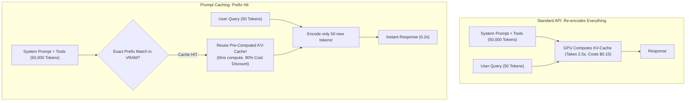

# Chapter 20: Context Compaction, Prompt Caching, and Token Budget Schedulers

> **Preceding Bridge:** In [Chapter 16: Hierarchical Episodic Memory](16-Hierarchical-Episodic-Memory-And-GraphRAG.md) and [Chapter 18: GPU Serving Mechanics & PagedAttention](18-GPU-Serving-Mechanics-PagedAttention-And-vLLM.md), you learned how LLM memory functions on the GPU. In this chapter, we explore how production agent architects handle massive long-context workloads efficiently: **Prompt Caching mechanics**, **The Lost-in-the-Middle Phenomenon**, and **Dynamic Context Compaction Algorithms (Observation Pruning & LLMLingua)**.

---

## 1. Plain-English Jargon Demystifier

| Technical Term | Plain English Translation | Real-World Metaphor |
| :--- | :--- | :--- |
| **Prompt Caching** | Reusing the pre-computed GPU KV-cache for identical prompt prefixes across subsequent API requests. | Keeping a thick reference textbook open on your desk so you don't have to re-read it from Page 1 every morning. |
| **Cache Hit / Miss** | Whether the initial tokens of your prompt exactly match an existing cached KV-cache block. | A fingerprint match at the passport border: match = instant green lane; mismatch = full manual search. |
| **Lost-in-the-Middle** | The empirical tendency of LLMs to recall information placed at the very start or end of a prompt, but forget facts in the center. | Remembering the intro and grand finale of a 3-hour movie, but completely forgetting what happened at minute 90. |
| **Observation Pruning** | Stripping verbose, raw tool outputs (e.g., a 5,000-line JSON payload) once the agent has extracted the core answer. | Erasing your rough chalkboard math calculations once you've written down the final equation. |
| **LLMLingua** | Using a small, fast model to calculate token information entropy and deleting 50% of low-information filler words. | Sending a concise telegram: *"Arriving noon send car"* instead of a flowery 3-paragraph letter. |

---

## 2. Spoon-Fed Mental Model: The Open Textbook on the Desk

Imagine a research assistant tasked with answering questions based on a 400-page company legal handbook.

### Without Prompt Caching (Naive Approach):
- **User 1 asks:** *"What is the parental leave policy?"*
  The assistant reads all 400 pages, finds the answer, and speaks.
- **User 2 asks:** *"What is the dental coverage limit?"*
  The assistant **re-reads all 400 pages from scratch**, wasting 10 minutes before speaking!
- Cost: Massive. Latency: High.

### With Prompt Caching (Anthropic & OpenAI Mechanics):
- The assistant reads the 400-page handbook once, notes the exact page positions in memory, and **leaves the book open on the desk**.
- When User 2 arrives, the assistant skips the 400 pages entirely, reads only the 1-sentence question, and answers in **200 milliseconds**!
- Cost: **90% discount** on cached tokens.
- Latency: **80% reduction** in Time-to-First-Token (TTFT).



---

## 3. The 3 Architectural Rules of Prompt Caching

To guarantee a **100% Cache Hit Rate** in production agent frameworks:

1. **Prefix Invariance:** Caching operates strictly from the **very first character forward**. If you change a single word in the system prompt or reorder tool definitions, **every single token after that change suffers a Cache Miss!**
2. **Static-to-Dynamic Ordering:** Always structure prompts in order of least-frequently-changing to most-frequently-changing:
   $$\text{Static System Instructions} \longrightarrow \text{Tool Schemas} \longrightarrow \text{Few-Shot Examples} \longrightarrow \text{Dynamic User Conversation}$$
3. **Minimum Token Threshold:** Providers enforce minimum token barriers (e.g., minimum 1,024 tokens for Anthropic Claude and OpenAI). Small prompts do not trigger caching.

---

## 4. Defeating "Lost-in-the-Middle": Context Window Compaction

Research reveals that in 128k+ token prompts, model attention forms a **U-shaped curve**: accuracy is highest near token 0 and token 128,000, and plummets in the middle 20% to 80% range!

```
ATTENTION ACCURACY VS TOKEN POSITION:
100% ────┐                                           ┌────
         │                                           │
 70%     │                                           │
         └─────────────┐               ┌─────────────┘
 40%                   └───────────────┘
                     (Lost-in-the-Middle)
      0% ─────────────────────────────────────────────────
       Token 0          Middle (Tokens 30k-90k)       Token 128k
```

### Production Compaction Techniques:
1. **Observation Pruning:** When an agent runs `curl` or `fetch_sql` that returns 10,000 lines of data, the agent processes it into a 2-line conclusion. The full 10,000 lines are immediately replaced in history with: `[Raw payload pruned. Key takeaway: 42 records matched]`.
2. **Context Window Sliding Compactor:** When context exceeds 70% of maximum budget, older intermediate tool dialogue is compressed into a single deterministic summary block.

---

## 5. Complete Runnable Implementation: Prompt Cache Simulator & Context Compactor

Here is a 100% runnable, zero-dependency Python script demonstrating prompt prefix hash caching and dynamic observation compaction:

```python
import hashlib
import time
from typing import List, Dict, Tuple, Optional


class PromptCacheManager:
    """
    Simulates GPU KV-Cache Prefix Hashing.
    Measures latency and cost savings between Cache Hits and Cache Misses.
    """
    def __init__(self, min_cacheable_tokens: int = 50):
        # KV Cache Store: {prefix_hash: precomputed_kv_blocks}
        self.kv_cache_registry: Dict[str, str] = {}
        self.min_tokens = min_cacheable_tokens

    def _hash_prefix(self, text: str) -> str:
        return hashlib.sha256(text.encode("utf-8")).hexdigest()

    def execute_inference(self, system_prefix: str, user_query: str) -> Dict[str, float]:
        """Simulates processing a query with prefix caching."""
        prefix_tokens = len(system_prefix.split())
        query_tokens = len(user_query.split())

        prefix_hash = self._hash_prefix(system_prefix)

        if prefix_tokens >= self.min_tokens and prefix_hash in self.kv_cache_registry:
            # CACHE HIT! Skip computing prefix KV-cache
            latency = 0.05 + (query_tokens * 0.002)
            # Cached tokens get 90% discount ($0.30 per 1M instead of $3.00)
            cost = (prefix_tokens * 0.0000003) + (query_tokens * 0.000003)
            hit = True
        else:
            # CACHE MISS! Must compute full sequence from scratch
            latency = (prefix_tokens * 0.005) + (query_tokens * 0.005)
            cost = (prefix_tokens * 0.000003) + (query_tokens * 0.000003)
            hit = False
            # Store in cache for next time
            if prefix_tokens >= self.min_tokens:
                self.kv_cache_registry[prefix_hash] = "KV_BLOCKS_ALLOCATED"

        return {
            "cache_hit": hit,
            "latency_seconds": round(latency, 4),
            "cost_dollars": round(cost, 6),
            "total_tokens": prefix_tokens + query_tokens
        }


class ContextCompactor:
    """
    Observation Pruning Engine:
    Reduces context window bloating by stripping oversized tool returns.
    """
    def __init__(self, max_tool_output_chars: int = 150):
        self.max_chars = max_tool_output_chars

    def compact_history(self, messages: List[Dict[str, str]]) -> List[Dict[str, str]]:
        compacted = []
        for msg in messages:
            if msg["role"] == "tool_result" and len(msg["content"]) > self.max_chars:
                pruned_content = (
                    msg["content"][:self.max_chars]
                    + f"\n... [PRUNED {len(msg['content']) - self.max_chars} redundant characters by Compactor]"
                )
                compacted.append({"role": "tool_result", "content": pruned_content})
            else:
                compacted.append(msg)
        return compacted


# --- Production Verification ---
def run_caching_and_compaction_benchmark():
    print("=" * 70)
    print(" PROMPT CACHING & CONTEXT COMPACTION BENCHMARK")
    print("=" * 70)

    # 1. Benchmark Prompt Caching
    print("\n--- [EXPERIMENT 1] Prompt Caching Hit vs Miss ---")
    cache_mgr = PromptCacheManager(min_cacheable_tokens=20)

    # Massive static system prompt (simulating 60 words)
    system_handbook = (
        "You are an enterprise legal compliance analyst for Acme Global Corp. "
        "Adhere to all ISO 27001 policies. Validate all user roles before providing information. "
        "Never disclose unreleased financial projections. Use formal tone at all times. "
        "Format all responses using standard Markdown tables with source citations."
    )

    # First Call: Cache Miss (Cold Start)
    res_cold = cache_mgr.execute_inference(system_handbook, "What is our data retention policy?")
    print(f"Call 1 (Cold Start) : Hit={res_cold['cache_hit']}  | Latency={res_cold['latency_seconds']}s | Cost=${res_cold['cost_dollars']}")

    # Second Call: Cache Hit (Identical Prefix!)
    res_warm = cache_mgr.execute_inference(system_handbook, "Can we export customer data to S3?")
    print(f"Call 2 (Cached Hit) : Hit={res_warm['cache_hit']}  | Latency={res_warm['latency_seconds']}s | Cost=${res_warm['cost_dollars']}")

    speedup = res_cold["latency_seconds"] / res_warm["latency_seconds"]
    savings = (1.0 - (res_warm["cost_dollars"] / res_cold["cost_dollars"])) * 100
    print(f"\nPrompt Caching Speedup: {speedup:.1f}x Faster! Cost Savings: {savings:.1f}%")
    assert res_warm["cache_hit"] is True, "Second call failed to trigger cache hit!"

    # 2. Benchmark Context Compactor
    print("\n" + "=" * 70)
    print("--- [EXPERIMENT 2] Observation Pruning Context Compaction ---")
    compactor = ContextCompactor(max_tool_output_chars=80)

    raw_dialogue = [
        {"role": "user", "content": "Fetch the database records for customer 42."},
        {"role": "tool_result", "content": "RECORD_001: Alice, Age 30, Score 99 ... " + ("X" * 5000)},  # 5,000 char flood!
        {"role": "assistant", "content": "Customer 42 has a high credit score."}
    ]

    initial_chars = sum(len(m["content"]) for m in raw_dialogue)
    compacted_dialogue = compactor.compact_history(raw_dialogue)
    final_chars = sum(len(m["content"]) for m in compacted_dialogue)

    print(f"Initial Context Size: {initial_chars:,} characters")
    print(f"Compacted Context   : {final_chars:,} characters")
    print(f"Pruning Reduction   : {(1.0 - (final_chars / initial_chars)) * 100:.1f}% context space reclaimed!")
    assert final_chars < initial_chars * 0.1, "Compactor failed to prune bloated tool results!"
    print("  [PASS] Bloated raw tool outputs safely pruned without losing conversation history.")
    print("=" * 70)


if __name__ == "__main__":
    run_caching_and_compaction_benchmark()
```

---

## 6. Chapter Milestone Check

Verify your understanding before continuing:

1. **Why does moving user-specific input to the top of a prompt destroy prompt caching?**
   - *Answer:* Prompt caching operates from the first character forward. Changing the start of the prompt generates a completely different prefix hash, causing an immediate cache miss on the entire prompt and forcing full re-computation.
2. **What causes the "Lost-in-the-Middle" phenomenon in 100k+ token prompts?**
   - *Answer:* Transformer self-attention mechanisms naturally place higher attention weights on initial positional tokens (primacy effect) and recent trailing tokens (recency effect), creating an attention trough in the middle of long contexts.
3. **What is observation pruning and when should an agent execute it?**
   - *Answer:* It is the practice of replacing large intermediate raw tool outputs (e.g. multi-megabyte JSON payloads or SQL table dumps) with concise summaries once the agent has finished parsing the necessary factual deductions, preserving context space for future turns.


## Further Reading

- [Anthropic: prompt caching](https://docs.anthropic.com/en/docs/build-with-claude/prompt-caching)
- [Lost in the middle paper](https://arxiv.org/abs/2307.03172)
- [LLMLingua paper](https://arxiv.org/abs/2310.05736)


---

## Check Yourself

Answer in your head or on paper first, then open each answer.

<details>
<summary><strong>1.</strong> What does prompt caching require of your prompt layout?</summary>

Stable content (system prompt, tools, shared documents) first, volatile content last, so the prefix can be reused.

</details>

<details>
<summary><strong>2.</strong> What is context compaction?</summary>

Summarising or trimming history and tool outputs to keep the prompt within budget while preserving key facts.

</details>

<details>
<summary><strong>3.</strong> What is 'lost in the middle'?</summary>

Models use information at the start and end of long prompts better than in the middle; order evidence accordingly.

</details>

<details>
<summary><strong>4.</strong> How do you budget tokens?</summary>

Reserve output and system space, summarise history, then fit the best-ranked evidence in the remainder.

</details>
