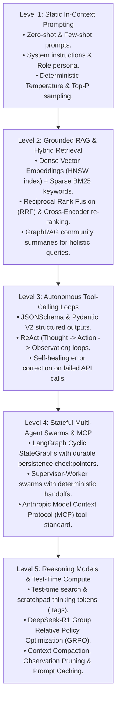
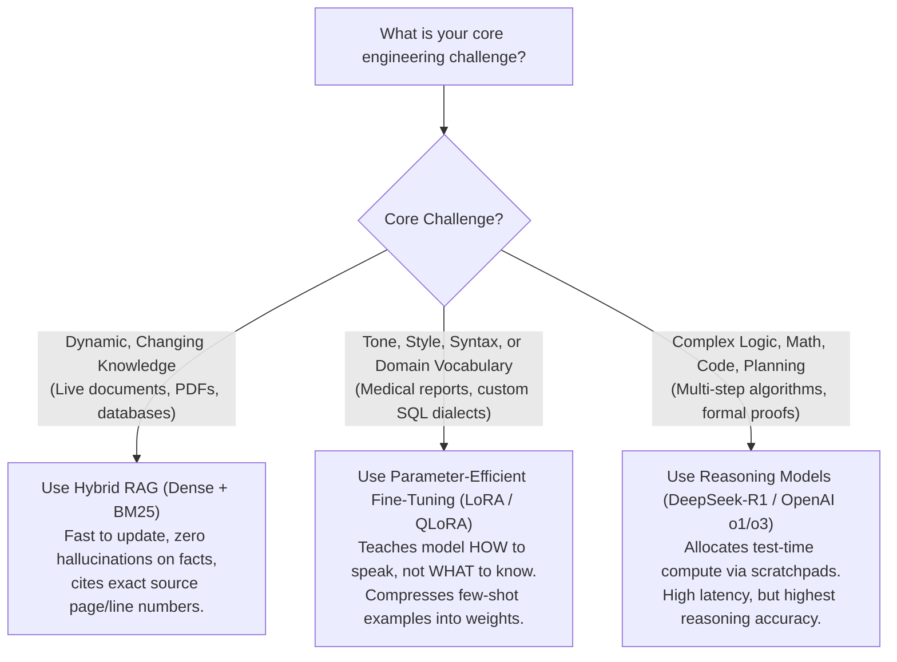

# Chapter 21: Track 4 Recap — The Agentic AI & Cognitive Architecture Playbook

> **Core Learning Objective:** Consolidate everything you have mastered across Track 4 into an executive, production-ready AI systems blueprint. This chapter provides a high-yield synthesis of the 5 Levels of Agentic AI, tokenization and KV-cache mechanics, the RAG vs Fine-Tuning vs Reasoning decision matrix, multi-agent swarms with MCP, and production defense against hallucinations, infinite loops, and prompt injection attacks.

---

## 1. The 5 Levels of Agentic AI Architecture

Building AI systems in production is not about sending basic prompts to an API. It is an evolving hierarchy of cognitive autonomy:

---

## 2. Plain-English Jargon Demystifier (Track 4 Edition)

| Term | The Formal Definition | Plain-English Real-World Metaphor | Why It Matters in Production |
| :--- | :--- | :--- | :--- |
| **Token** | The atomic chunk of text (word fragment) processed by language models (~4 characters). | **A Scrabble Letter Tile**: text is sliced into standard tiles before the computer can process it. | Determines inference cost, context window limits, and throughput speeds. |
| **KV-Cache** | GPU memory cache storing Key and Value projection matrices for all preceding tokens in a prompt. | **The Court Stenographer's Transcript**: remembering every previously spoken word so the model doesn't re-read from scratch. | Eliminates quadratic $O(N^2)$ re-computation during token generation; main bottleneck of GPU VRAM. |
| **PagedAttention** | vLLM memory management allocating KV-cache into non-contiguous virtual memory blocks. | **An Operating System's Virtual Memory / RAM Paging**: stops allocating giant rigid blocks, eliminating VRAM waste. | Increases GPU serving concurrency and batch size by $2\text{x}$ to $4\text{x}$. |
| **HNSW** | Hierarchical Navigable Small World: multi-layer graph index for vector nearest-neighbor search. | **An Express Subway System**: top layers make cross-city express jumps; bottom layers walk to the exact street address. | Delivers sub-millisecond similarity search across millions of vectors in $O(\log N)$ time. |
| **ReAct Loop** | Reason + Act: prompt architecture alternating between internal reasoning, external tool execution, and observation. | **A Detective at a Crime Scene**: think about the clue $\to$ run fingerprint test $\to$ read the lab result $\to$ repeat. | The foundational loop powering all autonomous coding and research agents. |
| **MCP (Model Context Protocol)** | Open JSON-RPC standard created by Anthropic for exposing tools, prompts, and resources to AI models. | **The USB-C Cable of AI**: any AI client can plug into any data source or tool server without custom glue code. | Universal tool interoperability across local filesystems, GitHub, PostgreSQL, and APIs. |
| **GRPO** | Group Relative Policy Optimization: RL algorithm evaluating candidate completions relative to group scores. | **Grading on a Curve**: instead of hiring an expensive critic teacher, compare students' test scores against their peers. | Eliminates the massive critic model in DeepSeek-R1, reducing training VRAM by $>50\%$. |
| **Prompt Caching** | Reusing pre-computed KV-cache states for identical prompt prefixes across API calls. | **A Speed-Dial Button**: skipping the first 2,000 words of legal terms because the model already processed them. | Reduces API latency by up to $80\%$ and costs by up to $50\text{--}90\%$. |

---

## 3. The RAG vs. Fine-Tuning vs. Reasoning Decision Matrix

One of the most critical Staff AI architecture questions is: *"Should we build RAG, fine-tune a model with LoRA, or use a reasoning model?"*

| Dimension | Hybrid RAG | LoRA Fine-Tuning | Reasoning Models (GRPO) |
| :--- | :--- | :--- | :--- |
| **Update Velocity** | **Instant**: add/delete vector in DB. | **Slow**: requires hours of GPU re-training. | **Static**: depends on base model knowledge. |
| **Source Citations** | **100% Verifiable**: returns chunk metadata. | **Zero**: knowledge is baked into weights. | **Partial**: can trace `<think>` steps. |
| **Best For** | Internal company documentation, live APIs. | Output formatting, proprietary styles, classification. | Complex multi-step reasoning, competitive coding. |
| **Compute Cost** | Low GPU cost (vector search + standard LLM). | Moderate training cost ($10--$50 on cloud GPUs). | Higher inference latency ($3\times - 10\times$ generation tokens). |

---

## 4. Production Resilience & Security Guardrail Checklist

Never deploy an autonomous agent to production without these 5 battle-tested defenses:

1. **Defensive Schema Validation:** Always wrap tool arguments in Pydantic V2 models. If an LLM hallucinates an invalid argument, capture the `ValidationError` and feed it back to the agent in the observation block to trigger automatic self-correction.
2. **Infinite Loop Circuit Breaker:** Always cap tool loops with a hard iteration ceiling (`max_iterations = 10`) and a token budget. If an agent repeats the same tool call with identical arguments twice, abort and request human assistance.
3. **Prompt Injection Quarantine (The Dual-LLM Pattern):** Never allow an untrusted tool observation (e.g. text fetched from a public website) to mix directly into the privileged system prompt. Use a secondary "Quarantine LLM" to extract only safe data fields before passing them to the primary executive agent.
4. **Exponential Backoff with Full Jitter:** When calling commercial LLM APIs, never use simple linear retries. Use exponential backoff ($2^n$) randomized with full jitter ($\text{random}(0, \text{backoff})$) to prevent the Thundering Herd from amplifying rate-limit errors.
5. **Context Compaction & Observation Pruning:** After a tool returns a massive 50 KB output (e.g. a large JSON response), prune and summarize the observation down to the 5 critical keys before appending it to conversation history, preventing the **"Lost-in-the-Middle"** degradation.

---

## 5. The Junior vs. Senior Antipattern Graveyard

| # | The Junior Antipattern | What Goes Wrong in Production | The Senior / Staff Solution |
| :---: | :--- | :--- | :--- |
| **1** | Trusting raw LLM strings to execute Python code or SQL queries directly. | **Remote Code Execution (RCE) / SQL Injection**: malicious users craft prompts causing the agent to drop tables or wipe disks! | Execute code in isolated sandboxes (gVisor, WebAssembly, Docker) with strict read-only AST checks. |
| **2** | Pure dense vector search with no keyword matching. | **The SKU / Identifier Blindspot**: searching for exact error code `"ERR-504-TIMEOUT"` returns unrelated articles with high semantic similarity! | Always implement **Hybrid Search**: combine BM25 keyword matching with Dense Vector embeddings using Reciprocal Rank Fusion (RRF). |
| **3** | Evaluating AI systems by manually reading 5 prompt responses in a notebook. | **Silent Regression**: changing a single prompt word improves one case but silently breaks 40 other downstream use cases. | Build automated **LLM-as-a-Judge Evaluation Harnesses** testing Faithfulness, Answer Relevance, and Context Recall in CI/CD. |
| **4** | Stuffing entire 200-page PDF documents into the context window without chunking. | **Attention Degradation (Lost-in-the-Middle)**: models pay attention to the beginning and end of long contexts, completely ignoring crucial facts in the middle. | Chunk documents using hierarchical parent-child splitters or GraphRAG community summaries; place critical instructions at the very end. |
| **5** | Designing multi-agent systems where every agent broadcasts messages to every other agent. | **Combinatorial Swarm Chaos**: agents trigger endless cascading loops of polite replies without ever completing the task! | Use a **Supervisor-Worker Topology** with strict deterministic state transitions in LangGraph. |

---

## 6. Track 4 Graduation Milestone Check

Before you proceed to **Track 5: DSA Interview Playbook**, confirm that you command these 4 core capabilities:
- [x] *Can you build an end-to-end autonomous research and coding agent using a ReAct loop with structured outputs from scratch?*
- [x] *Can you design a production-grade Hybrid RAG pipeline combining Dense HNSW vectors, BM25, and Cross-Encoder re-ranking?*
- [x] *Can you explain how PagedAttention and KV-cache prefix caching eliminate GPU memory bottlenecks?*
- [x] *Can you implement Anthropic's Model Context Protocol (MCP) to decouple tools from model runtimes?*

> [!TIP]
> **Next Stop: Track 5 (DSA Interview Playbook)!**
> You have mastered modern software engineering, low-level systems, global distributed architectures, and autonomous AI systems. Now it is time to sharpen your algorithmic problem-solving and conquer the 45-minute live coding whiteboard interview! Proceed to [Track 5: DSA Interview Playbook](../05-DSA-Interview-Playbook/01-Interview-Tactics-Dry-Run-Communication.md)!

## Further Reading

- [Anthropic: building effective agents](https://www.anthropic.com/engineering/building-effective-agents)
- [Model Context Protocol](https://modelcontextprotocol.io/)
- [LangGraph documentation](https://docs.langchain.com/oss/python/langgraph/overview)

---

## Check Yourself

Answer in your head or on paper first, then open each answer.

<strong>1.</strong> Name the layers of a production agent stack.

Model/gateway, tools and MCP, memory, orchestration (graph), guardrails, evaluation, observability.

<strong>2.</strong> What is the most important habit for agent engineering?

Evaluate with repeated trials against a baseline before trusting any design.

<strong>3.</strong> What turns a demo into a product?

Reliability engineering: budgets, retries, idempotency, approvals and monitoring.

<strong>4.</strong> Which version-sensitive pieces should you pin?

Framework and SDK versions (LangGraph, MCP) and model IDs.

