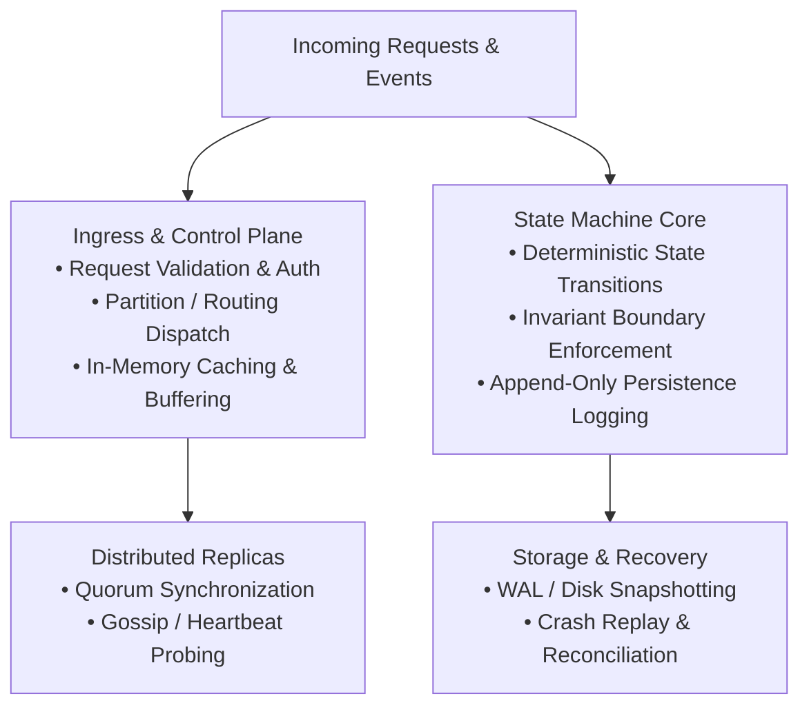

# Module 03: Edge Infrastructure, Reverse Proxies & API Gateways

> **Brand new to this topic?** Start with [`00_FOUNDATIONS_PLAYGROUND.md`](00_FOUNDATIONS_PLAYGROUND.md) - the same ideas in
> plain language, with runnable standard-library code you can execute right now.
> No Docker, no server, no `pip install`.

---

## 🗺️ Recommended Step-by-Step Learning Path

Follow this exact sequence to achieve complete mastery of this module:

| Step | File to Open | What You Will Do |
| :---: | :--- | :--- |
| **1** | **[01_README.md](01_README.md)** | Read conceptual overview, architectural foundations, and mental models. |
| **2** | **[00_FOUNDATIONS_PLAYGROUND.md](00_FOUNDATIONS_PLAYGROUND.md)** | Practice beginner spoonfed micro-drills and line-by-line syntax breakdowns. |
| **3** | **[00_try_it_yourself.py](00_try_it_yourself.py)** | Run in terminal (`python 00_try_it_yourself.py`) for an interactive zero-dependency sandbox. |
| **4** | **[02_interactive_api_gateway_proxy.ipynb](02_interactive_api_gateway_proxy.ipynb)** | Open in Jupyter/VS Code to run interactive visual experiments and benchmarks. |
| **5** | **[03_edge_caching_simulation_demo.py](03_edge_caching_simulation_demo.py)** | Run in terminal (`python 03_edge_caching_simulation_demo.py`) to explore 03 Edge Caching Simulation Demo code patterns. |
| **6** | **[06_TROUBLESHOOTING_AND_EDGE_CASES.md](06_TROUBLESHOOTING_AND_EDGE_CASES.md)** | Study forensic runbooks, edge cases, and real-world failure post-mortems. |
| **7** | **[05_SELF_ASSESSMENT_AND_CHALLENGES.md](05_SELF_ASSESSMENT_AND_CHALLENGES.md)** | Test your knowledge with self-assessment quizzes, challenges, and diagnostic scenarios. |
| **8** | **[04_PROJECT_GUIDE.md](04_PROJECT_GUIDE.md)** | Follow guided project implementation for `starter/` and `project_solution/`. |
| **9** | **[problems/](problems/)** | Solve hands-on problem bank challenges and verify with `pytest problems/tests`. |
| **10** | **[debug_lab/](debug_lab/)** | Diagnose and fix silent production bugs in the Bug Hunter Drill. |

---


## 🎯 Executive Overview & Production Relevance
Edge reverse proxies and Layer 7 gateways provide TLS termination, request path routing, rate limiting, and DDoS mitigation to protect backend microservice clusters.

---

## 🏛️ System Architecture Blueprint


### Subsystem Anatomy & Invariants
1. **Control & Routing Tier:** Dispatches incoming operations, enforces rate limits and authentication, and routes requests to appropriate shards.
2. **Algorithmic State Machine:** Implements state transitions with deterministic mathematical guarantees and complete isolation against partial failure.
3. **Storage & Durability Tier:** Converts random mutations into structured append-only disk operations, ensuring zero data loss under abrupt process crashes.
4. **Replication & Fault Tolerance:** Detects partition failures and rebalances workloads without human intervention.

---

## 🧮 Theoretical Principles & Mathematical Models
### 1. Invariant Formulations & Complexity Bounds
- **Time Complexity Bounds:** Core operations must execute in O(1) amortized time or O(log N) worst-case time to avoid latency cliff degradation under scale.
- **Space Complexity Bounds:** In-memory metadata must scale sub-linearly with respect to total items, leveraging compact binary representations and probabilistic pruning.
- **Convergence Guarantees:** Distributed replicas must converge to identical states upon network partition healing, satisfying either Strong Linearizability (CP) or Eventual Causal Ordering (AP).

### 2. Hardware Resource Constraints
- **Memory Bandwidth & Cache Lines:** Sequential data traversal leverages CPU L1/L2 prefetching (1-4 ns), whereas random memory pointer chasing stalls CPU pipelines (100 ns).
- **Disk I/O Physics:** NVMe SSDs provide up to 100,000 random 4KB IOPS, but sequential append-only writes achieve gigabytes per second of raw throughput.
- **Network Serialization Overhead:** Binary wire protocols eliminate text parsing overhead and minimize network interface card (NIC) packet serialization delays.

---

## ⚖️ Architectural Trade-Off Analysis Matrix

| Architectural Decision / Paradigm | Operational Trade-offs & Strengths | Recommended Production Selection |
| :--- | :--- | :--- |
| **In-Memory Volatility vs Durable Disk Logging** | In-memory operations achieve sub-millisecond latencies; Disk logging guarantees zero data loss on power failure. | Combine both: write mutations to append-only WAL first, then mutate in-memory state. |
| **Strong Consistency (Linearizability) vs Eventual Consistency** | Strong consistency prevents stale reads but halts writes during network partitions; Eventual consistency maximizes availability. | Choose based on domain: Strong consistency for financial ledgers; Eventual consistency for social feeds. |
| **Push-Based Fanout vs Pull-Based Aggregation** | Push delivers instant updates to subscribers; Pull avoids massive write amplification on high-degree nodes. | Implement Hybrid architectures: Push for low-volume entities; Pull and merge for high-volume entities. |
| **Pessimistic Locking vs Optimistic Concurrency Control (OCC)** | Pessimistic locking eliminates rollback churn; OCC maximizes throughput when write contention is low. | Use OCC with version timestamps for read-heavy systems; Pessimistic distributed locks for high-contention flash inventory. |

---

## 🚨 Critical Production Failure Modes & Runbooks

| Failure Scenario & Symptom | Forensic Root Cause | SRE Hardening & Invariant Fix |
| :--- | :--- | :--- |
| **Cascading Cluster Brownout** | A slow downstream dependency causes worker thread pools to back up, exhausting gateway connections. | Configure aggressive client timeouts, thread pool isolation (Bulkheads), and 3-state Circuit Breakers. |
| **Thundering Herd Stampede** | Synchronized expiration of hot cached keys causes thousands of concurrent requests to overwhelm the database. | Implement SingleFlight mutex request coalescing, negative caching, and random TTL jitter. |
| **Split-Brain State Divergence** | A network partition isolates cluster nodes, causing two independent subgroups to both accept writes as leaders. | Require strict Majority Quorum before acknowledging any write to clients. |
| **Memory Leak via Unbounded Queues** | Unbounded FIFO in-memory queues accumulate tasks faster than consumers can drain them, triggering OS OOM killer. | Enforce bounded queue sizes with proactive backpressure, drop policies, or dead-letter queues. |

---

## 📊 SRE Telemetry, SLIs & Alerting Runbooks

| Production SLI Metric | Healthy Target | P1 Alert Threshold | Immediate Automated & Manual Mitigation |
| :--- | :--- | :--- | :--- |
| **p99 Request Latency** | < 25 ms | > 150 ms for 2 min | Shed non-essential background traffic; trigger horizontal container scaling. |
| **Error Rate (HTTP 5xx / RPC)**| < 0.01% | > 1.0% for 1 min | Trip circuit breaker to fallback route; verify database connection pool headroom. |
| **Worker Queue Depth** | < 50 items | > 5,000 items | Reject unauthenticated writes with HTTP 429; provision additional consumer workers. |
| **Storage / Memory Utilization**| < 70% capacity | > 85% capacity | Trigger WAL segment compaction; evict expired LRU cache partitions. |

---

## 📋 Whiteboard Interview & Staff Defense Checklist

When presenting this architectural module in a Staff/Principal interview, ensure you defend:
- [ ] **Capacity Math:** Back-of-the-envelope calculations for peak QPS, ingress/egress bandwidth, and multi-year storage retention.
- [ ] **Boundary Separation:** Clear demarcation between Ingress (Edge), Application Services, and Storage/Cache tiers.
- [ ] **Data Model Rigor:** Partition keys, primary keys, sharding schemes, and access-pattern justifications.
- [ ] **Fault Tolerance:** Explicit failover protocols for power loss, network partition, and storage corruption.
- [ ] **Trade-Off Articulation:** Ability to clearly explain why this design was chosen over viable alternatives.

---

## 🛠️ Hands-on Engineering, TDD & Verification

This module includes a dual-track learning setup: an in-process architectural simulation model in `project_solution/` and an interactive student TDD template in `starter/`.

### 1. Run the Interactive Exploration Notebook
Explore the interactive architectural lab in VS Code or Jupyter:
```bash
jupyter notebook 00_interactive_api_gateway_proxy.ipynb
```

### 2. Execute the Standalone Demo Script
Observe the components interacting under simulated workload:
```bash
python 01_edge_caching_simulation_demo.py
```

### 3. Run the Automated Pytest Verification Suite
Verify reference implementation invariants:
```bash
pytest project_solution/ -v
```

To test your own implementation in `starter/`:
```bash
cd starter
pytest ../project_solution/ -v
```

---

## 📂 Pedagogical Scaffolding & Directory Tour

Each component in this module fulfills a specific role in your engineering progression:

| File / Directory | Purpose & Recommended Usage |
| :--- | :--- |
| **[`00_interactive_*.ipynb`](02_interactive_api_gateway_proxy.ipynb)** | Interactive hands-on simulation notebook with runnable visualization cells. |
| **[`03_edge_caching_simulation_demo.py`](03_edge_caching_simulation_demo.py)** | Standalone Python executable demonstrating core mechanics and latency profiles. |
| **[`04_PROJECT_GUIDE.md`](04_PROJECT_GUIDE.md)** | Step-by-step implementation guide featuring **3 progressive difficulty tiers** (Tier 1: Novice, Tier 2: Core, Tier 3: Architect). |
| **[`06_TROUBLESHOOTING_AND_EDGE_CASES.md`](06_TROUBLESHOOTING_AND_EDGE_CASES.md)** | Deep-dive guide into production bugs, concurrency races, and operational post-mortems. |
| **[`debug_lab/`](debug_lab/SYMPTOMS.md)** | Dedicated incident lab featuring defective implementation (`broken_*.py`), symptom telemetry, and forensic solutions. |
| **[`05_SELF_ASSESSMENT_AND_CHALLENGES.md`](05_SELF_ASSESSMENT_AND_CHALLENGES.md)** | 10 diagnostic interview questions with deep explanations plus 2–3 machine-coding design challenges. |
| **[`project_solution/api_gateway_proxy.py`](project_solution/api_gateway_proxy.py)** | Verified, complete in-process architectural simulation reference model. |
| **[`starter/api_gateway_proxy.py`](starter/api_gateway_proxy.py)** | Student boilerplate raising `NotImplementedError` for TDD mastery. |

---

## 🧭 Curriculum Graph Navigation

Connect this module to the broader distributed systems curriculum:

### ⬅️ Prerequisites
- [Prerequisite: Module 02 Network Protocols Transport API Paradigms](../Module_02_Network_Protocols_Transport_API_Paradigms/01_README.md)

### ➡️ Next Steps
- [Next Module: Module 04 Load Balancing Algorithms Health Probes](../Module_04_Load_Balancing_Algorithms_Health_Probes/01_README.md)

### 🏁 Phase Benchmark & Core Frameworks
- **[Relevant Phase Benchmark Checkpoint](../Phase_Checkpoints/PHASE_1_CHECKPOINT.md)**
- **[Master Syllabus](../MASTER_SYLLABUS.md)**
- **[System Design Frameworks & Cheatsheet](../SYSTEM_DESIGN_FRAMEWORKS_AND_CHEATSHEET.md)**
- **[Global Debugging Playbook](../GLOBAL_DEBUGGING_PLAYBOOK.md)**
- **[Study Plans & Pacing Guide](../STUDY_PLANS_AND_PACING_GUIDE.md)**
