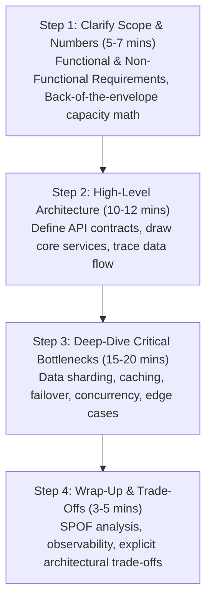

# Start Here: The Beginner's Guide to System Design Mastery

> *"Any fool can write code that a computer can understand. Good programmers design systems that human organizations can understand, scale, and maintain."*

Welcome to **System Design Mastery**. If you have ever felt intimidated by acronyms like *CAP, Raft, Paxos, Consistent Hashing, CDC, CQRS, or Saga*, this guide is your sanctuary. 

System Design is **not** an arcane art reserved for principal engineers at Big Tech. At its core, System Design is simply the science of managing **four finite physical resources**:
1. **CPU**: How fast can we compute?
2. **RAM**: How much fast-access temporary state can we hold?
3. **Disk**: How reliably can we store data durably?
4. **Network**: How fast can data travel between computers without dropping packets?

Everything in System Design is a **trade-off** between these four physical constraints.

---

## Before anything else: the playground in every module

Every module opens with a file called **`00_FOUNDATIONS_PLAYGROUND.md`**. It is
the gentlest thing in the course and it is deliberately first.

Each one gives you an everyday analogy for the module's core idea, then a page of
plain Python you can run immediately - standard library only, so there is no
Docker to start, no server to install and nothing to `pip install`. Beside it sits
`00_try_it_yourself.py`, which is that page as a runnable script:

```bash
cd Module_01_*/          # or any module
python 00_try_it_yourself.py
```

Every claim the page makes is checked by an `assert` as the script runs. If it
finishes with `All checks passed`, you have just watched the idea prove itself on
your own machine rather than reading an assurance that it is true.

Read the playground, run the script, *then* open the README. If the README starts
to feel abstract, come back - the playground is the concrete version of the same
thing.

---

## 🧭 The 4-Step Universal Design Framework

Whenever you are asked to design a system — whether in a Staff Engineer interview, an RFC review, or an architectural meeting at work — **never start by drawing boxes**. Always execute this strict 4-step framework:



---

## 🏢 Mental Model: Vertical vs. Horizontal Scaling

Imagine you run a restaurant kitchen:
- **Vertical Scaling (Scaling Up)**: You buy an industrial super-stove or hire a super-chef.
  - *Pros*: Simple, no distributed communication bugs, zero network latency between components.
  - *Cons*: Has a hard physical ceiling (a server can only hold so many CPU cores and RAM chips) and hardware costs grow exponentially. If the single chef faints, the kitchen halts completely (Single Point of Failure).
- **Horizontal Scaling (Scaling Out)**: You build 10 identical cooking stations with a manager (Load Balancer) distributing ticket orders across 10 chefs.
  - *Pros*: Virtually unlimited scale; if Chef #4 gets sick, Chefs #1, #2, #3, and #5–#10 keep cooking (High Availability).
  - *Cons*: Highly complex. How do chefs coordinate when two customers order the last steak? (Distributed Concurrency & Consensus).

---

## ⏱️ The Latency Numbers Every Architect Must Memorize

Computers operate at wildly different time scales. Understanding these orders of magnitude will make your architectural decisions obvious:

| Operation | Real Time | Scaled to Human Perspective (1 ns = 1 sec) |
| :--- | :--- | :--- |
| **L1 CPU Cache Reference** | **0.5 ns** | **0.5 seconds** (a heartbeat) |
| **L2 CPU Cache Reference** | **7 ns** | **7 seconds** |
| **Main RAM Memory Read** | **100 ns** | **1.7 minutes** |
| **Send 1 KB over 1 Gbps Network** | **10 µs (10,000 ns)** | **2.8 hours** |
| **Read 1 MB sequentially from SSD** | **250 µs** | **2.9 days** |
| **Roundtrip inside same Datacenter** | **500 µs** | **5.8 days** |
| **Read 1 MB sequentially from HDD** | **20,000 µs (20 ms)** | **7.7 months** |
| **Transatlantic Packet Roundtrip** | **150,000 µs (150 ms)** | **4.7 years!** |

> **Key Insight**: Reading from RAM is **200,000 times faster** than reading from spinning disk, and talking across datacenters is **1.5 million times slower** than main memory! That is why in-memory caching (Redis) and keeping hot data in RAM is the #1 trick of high-throughput architectures.

---

## 🔄 The 4-Step Engineering Learning Loop

Every module in this course follows a rigorous engineering loop:

1. **README & Theory:** Master the architectural theory, capacity estimation, and failure modes.
2. **Interactive Jupyter Notebook (`00_interactive_*.ipynb`):** Simulate topologies, visualize hash rings, and experiment with parameter curves.
3. **Starter TDD Practice (`starter/`):** Implement the core system engine from skeletal stubs. Run `pytest` to watch tests turn from red to green.
4. **Diagnostic Self-Assessment (`SELF_ASSESSMENT_AND_CHALLENGES.md`):** Test your ability to answer real architectural interview questions and tackle hands-on machine coding challenges.

Proceed to **[Module 00: Fundamentals & Interview Playbook](Module_00_System_Design_Fundamentals_Interview_Playbook/01_README.md)** or inspect the full **[MASTER_SYLLABUS.md](MASTER_SYLLABUS.md)** to get started!
