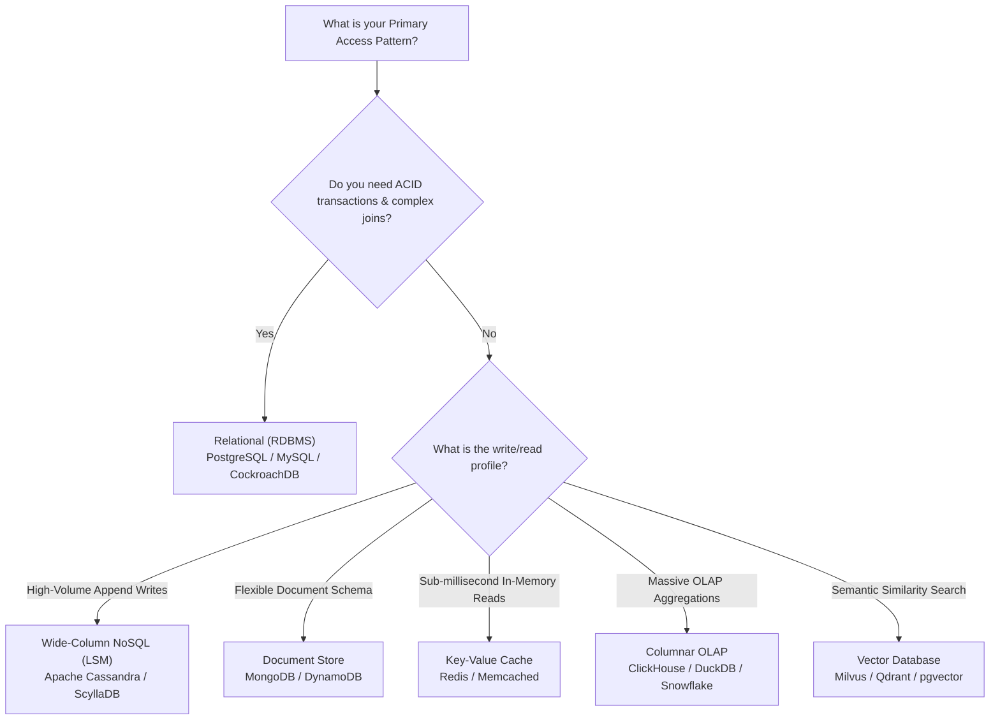

# System Design Frameworks, Decision Matrices & Cheat Sheet

This master reference is your **architectural cheat sheet** — containing the mathematical formulas, decision trees, and trade-off matrices required to design production-grade systems.

---

## 🧮 1. Back-of-the-Envelope Capacity Estimation Cheat Sheet

### Powers of 10 & Data Units
| Power | Approximate Value | Data Size Name |
| :--- | :--- | :--- |
| $10^3$ | 1 Thousand | 1 KB (Kilobyte) |
| $10^6$ | 1 Million | 1 MB (Megabyte) |
| $10^9$ | 1 Billion | 1 GB (Gigabyte) |
| $10^{12}$ | 1 Trillion | 1 TB (Terabyte) |
| $10^{15}$ | 1 Quadrillion | 1 PB (Petabyte) |

### Seconds in Time
- $1 \text{ Day} = 24 \times 60 \times 60 = \mathbf{86,400\text{ seconds}} \approx \mathbf{10^5\text{ seconds}}$ (use $10^5$ for lightning-fast mental math!).
- $1 \text{ Month} \approx 2.5 \times 10^6\text{ seconds}$.
- $1 \text{ Year} \approx 3.15 \times 10^7\text{ seconds}$.

### The Universal Estimation Formulas

1. **Average Queries Per Second (QPS)**:
   $$\text{QPS} = \frac{\text{Total Requests per Day}}{86,400} \approx \frac{\text{Daily Active Users (DAU)} \times \text{Requests per User}}{100,000}$$

2. **Peak QPS**:
   $$\text{Peak QPS} = \text{Average QPS} \times \text{Peak Multiplier} \quad (\text{typically } 2\times \text{ to } 5\times)$$

3. **Storage Ingress per Day**:
   $$\text{Daily Storage} = \text{Daily Writes} \times \text{Average Payload Size}$$

4. **Storage Growth over 5 Years**:
   $$\text{5-Year Storage} = \text{Daily Storage} \times 365 \times 5 \approx \text{Daily Storage} \times 1,825$$

5. **Network Bandwidth (Throughput)**:
   $$\text{Bandwidth Ingress (bytes/sec)} = \text{Write QPS} \times \text{Write Payload Size}$$
   $$\text{Bandwidth Egress (bytes/sec)} = \text{Read QPS} \times \text{Read Payload Size}$$
   *(Convert to bits/sec by multiplying bytes/sec by 8, e.g. 100 MB/s = 800 Mbps).*

6. **RAM Sizing (The 80-20 Rule)**:
   - 80% of daily read requests access 20% of the daily data volume.
   - $\text{Cache Size Needed} = \mathbf{20\% \times \text{Daily Read Data Volume}}$.

---

## 🗄️ 2. The Database Selection Decision Tree

| Database Type | Engine Examples | Under-the-Hood Storage | Best Used For | Anti-Pattern For |
| :--- | :--- | :--- | :--- | :--- |
| **Relational (RDBMS)** | PostgreSQL, MySQL, CockroachDB | B-Tree / WAL | Financial ledgers, multi-table joins, ACID transactions. | Massive unstructured blobs, unbounded write ingestion. |
| **Document NoSQL** | MongoDB, Couchbase | WiredTiger (B-Tree/LSM) | Product catalogs, user profiles, rapidly changing schemas. | Deep relational joins, strict multi-record accounting. |
| **Wide-Column NoSQL** | Apache Cassandra, ScyllaDB | LSM-Tree + SSTables | High-velocity append writes, IoT sensor data, chat history. | Complex ad-hoc multi-table queries, updates across rows. |
| **Key-Value Cache** | Redis, Dragonfly, KeyDB | In-Memory Hash + Event Loop | Session storage, caching, distributed locks, rate limit counters. | Durable primary store for relational transaction logs. |
| **Columnar OLAP** | ClickHouse, DuckDB, Snowflake | Column-oriented columnar | Data warehousing, real-time analytics aggregations (SUM/AVG). | Point lookups (`SELECT WHERE id = 123`), single-row transactions. |
| **Vector DB** | Milvus, Qdrant, pgvector | HNSW / IVF graph indexes | AI embeddings, semantic search, multimodal RAG retrieval. | Standard scalar equality queries. |

---

## 📨 3. Message Broker & Stream Selection Matrix

| Engine | Architecture Type | Message Persistence | Ordering Guarantees | Max Throughput | Ideal Use Case |
| :--- | :--- | :--- | :--- | :--- | :--- |
| **Apache Kafka** | Distributed Partitioned Commit Log | Long-term disk retention (days/months) | Strict per-partition ordering | Millions of msg/sec | Event sourcing, activity streaming, CDC pipeline. |
| **RabbitMQ** | AMQP Message Broker with Exchanges | Transient or durable until acknowledged | FIFO per queue | Tens of thousands/sec | Complex routing, task queues, RPC patterns. |
| **Redis Pub/Sub** | Ephemeral In-Memory Broadcast | Zero persistence (fire-and-forget) | Best effort | Extremely low latency (<1ms) | Live chat signaling, real-time presence indicators. |
| **AWS SQS** | Fully-Managed Distributed Queue | 14 days max retention | Standard (unordered) or FIFO | Virtually unlimited | Cloud-native asynchronous worker task processing. |

---

## ⚖️ 4. The CAP & PACELC Trade-Off Theorem

### The CAP Theorem
In any distributed system communicating over a network, network partitions ($P$) **will inevitably happen**. Therefore, you must choose between:
- **Consistency ($C$)**: Every read receives the most recent write or an error (e.g. Raft/Paxos clusters, CockroachDB, HBase).
- **Availability ($A$)**: Every non-failing node returns a response, but it may contain stale data (e.g. Cassandra, DynamoDB with eventual consistency).

### The PACELC Extension
CAP only applies during active network partitions. PACELC explains what happens **during normal operation**:
- If there is a **P**artition: Choose between **A**vailability and **C**onsistency.
- **E**lse (normal operation): Choose between **L**atency and **C**onsistency.
  - **PC/EC**: Always favors consistency (PostgreSQL synchronous replication, Google Spanner).
  - **PA/EL**: Always favors speed and availability (Cassandra with Read Repair, DynamoDB).
