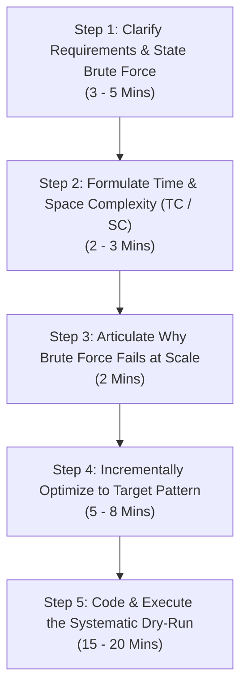

# DSA Interview Playbook: Communication, Optimization & The Dry-Run Framework

> **Core Objective:** Master the behavioral and technical execution framework required to clear Data Structures & Algorithms rounds at top-tier Product-Based Companies (Google, Meta, Uber, Amazon).

---

## 1. The 5-Step Interview Communication Loop

Interviews at top companies are **collaborative problem-solving simulations**, not solitary coding tests. The interviewer is evaluating your thought process, communication clarity, and ability to handle edge cases.



### Step 1: Clarify & Propose the Brute Force
* **Never jump directly into coding.** Ask about input constraints ($N \le 10^3$ vs $N \le 10^6$), memory limits, whether inputs are sorted, if duplicates exist, and what should be returned for empty inputs.
* Immediately articulate the simplest brute-force algorithm:
  > *"To ensure we have a solid baseline, the brute-force approach would be to iterate through all possible subarrays using a nested loop, computing the sum for each. This would guarantee correctness."*

### Step 2: Discuss TC & SC of Brute Force
* State the time and space complexity explicitly using Big-O notation:
  > *"This brute-force approach requires examining $\frac{N(N+1)}{2}$ subarrays, resulting in $O(N^2)$ time complexity and $O(1)$ auxiliary space complexity."*

### Step 3: Convey Clearly Why Brute Force Breaks Under High Traffic
* Interviewers love when you connect algorithmic complexity to real-world infrastructure constraints:
  > *"If our input size $N$ is $10^5$, an $O(N^2)$ algorithm performs roughly $10^{10}$ operations. Standard CPU architectures execute approximately $10^8$ operations per second, meaning this query would take ~100 seconds to respond, timing out our HTTP gateway and dropping user requests."*

### Step 4: Incremental Optimization
* Identify the bottleneck: *Are we repeating duplicate calculations? (Memoization/DP). Are we doing linear lookups? (Hash Map/Set). Is the data monotonic? (Two Pointers/Binary Search).*
* Propose the optimal strategy and get interviewer agreement **before typing code**.

### Step 5: The Structured Dry-Run (Most Important Step)
* **Never say "I'm done" the second you type the last line of code.**
* Walk through an explicit trace table with sample inputs, tracking variable values step-by-step.

---

## 2. The Universal Dry-Run Trace Matrix

When presenting code to the interviewer, draw out a trace matrix on the whiteboard or scratchpad:

### Example Problem: Two Sum (Find indices summing to target = 9 in `nums = [2, 7, 11, 15]`)

```text
Input: nums = [2, 7, 11, 15], target = 9
Lookup Map: seen = {}

+-----+-----+---------------+----------------+----------------+---------------------+
| Step|  i  | nums[i] (val) | complement     | in seen?       | Action Taken        |
|     |     |               | (target - val) |                |                     |
+-----+-----+---------------+----------------+----------------+---------------------+
|  1  |  0  |       2       | 9 - 2 = 7      | False          | seen[2] = 0         |
|  2  |  1  |       7       | 9 - 7 = 2      | True (seen[2]) | Return [seen[2], 1] |
+-----+-----+---------------+----------------+----------------+---------------------+

Result Returned: [0, 1]
Edge Case Verification:
- Empty array: Handled (returns [])
- No pair sums to target: Handled (loop terminates, returns [])
```

---

## 3. High-Frequency Pattern Reference Cheat Sheet

| Pattern | Common Triggers / Keywords | Typical Data Structure | Time / Space |
| :--- | :--- | :--- | :--- |
| **Sliding Window** | Contiguous subarrays/substrings, "longest/shortest window with sum $\le K$" | Two pointers (`left`, `right`), Hash Map | $O(N)$ / $O(K)$ |
| **Two Pointers** | Sorted array, searching pairs, palindrome validation, partitioning in-place | Pointers at `left = 0`, `right = N-1` | $O(N)$ / $O(1)$ |
| **Fast & Slow Pointers** | Cycle detection in linked list, middle of linked list, circular arrays | `slow = slow.next`, `fast = fast.next.next` | $O(N)$ / $O(1)$ |
| **Monotonic Stack** | "Next Greater Element", "Largest Rectangle in Histogram", stock span | Stack holding indices with strictly monotonic values | $O(N)$ / $O(N)$ |
| **Top K Elements** | Find the $K$ most frequent items, $K$-th largest element in stream | Min-Heap or Max-Heap (`heapq`) of size $K$ | $O(N \log K)$ / $O(K)$ |
| **Intervals Overlap** | Meeting rooms, calendar conflicts, merge overlapping ranges | Sort intervals by `start_time` | $O(N \log N)$ / $O(N)$ |
| **Binary Search on Answer** | "Minimize the maximum capacity", monotonic condition function | `low`, `high`, `mid`, verify `is_valid(mid)` | $O(\log(\text{range}) \cdot N)$ |
| **Topological Sort** | Course scheduling, task dependency DAG, build order | In-degree array + BFS Queue (Kahn's Algorithm) | $O(V + E)$ / $O(V + E)$ |
| **Trie (Prefix Tree)** | Autocomplete, word search, prefix matching | Multi-way tree (`children = dict`, `is_end = bool`) | $O(L)$ query ($L = \text{length}$) |
| **0/1 Knapsack / DP** | Subset sum, partitioning, optimal selection with weight constraints | 2D / 1D DP table (bottom-up iteration) | $O(N \cdot W)$ |


## Generated Dry-Run Traces

A dry run is only useful if it is faithful to the code. The repository includes a tracer that **generates** the trace from the actual solution, so it cannot drift from what the code does:

```text
$ python practice/trace.py 1 "[2,7,11,15]" 9
two_sum([2, 7, 11, 15], 9)
  line  46  seen: dict[int, int] = {}                        nums=[2, 7, 11, 15]  target=9
  line  47  for i, num in enumerate(nums):                   seen={2: 0}
  line  48  complement = target - num                        seen={2: 0}  i=0  num=2
  line  49  if complement in seen:                           seen={2: 0}  complement=7
  line  51  seen[num] = i                                    seen={2: 0}
  line  47  for i, num in enumerate(nums):                   seen={2: 0}
  line  48  complement = target - num                        seen={2: 0}  i=1  num=7
  line  49  if complement in seen:                           seen={2: 0}  complement=2
  line  50  return [seen[complement], i]                     seen={2: 0}
  line  50  return [0, 1]
=> [0, 1]
```

How to read it: each row is a line about to execute, and the values next to it are the variables that changed since the previous line (so they show the effect of the line above). Here you can watch `seen` fill with `{2: 0}`, then `complement` become `2` on the second pass and the function return `[0, 1]`.

Use it three ways: trace the reference solution on the example to learn the mechanism, trace **your own stub** with `--stub` to see where it diverges, and trace a failing fuzz input (the harness prints the counterexample) to find the exact line where your variable goes wrong. Arguments after the problem number are Python literals, for example `python practice/trace.py 20 "[1,3,5,7,9]" 7`.

---

## Further Reading

- [Big-O cheat sheet](https://www.bigocheatsheet.com/)
- [Python time complexity](https://wiki.python.org/moin/TimeComplexity)


---

## Check Yourself

Answer in your head or on paper first, then open each answer.

<details>
<summary><strong>1.</strong> What do you say first when given a coding problem?</summary>

Restate it, ask clarifying questions about inputs and constraints, and confirm examples and edge cases.

</details>

<details>
<summary><strong>2.</strong> Why describe brute force before optimising?</summary>

It proves correctness of your understanding and the bottleneck suggests the optimisation.

</details>

<details>
<summary><strong>3.</strong> How do you dry-run your solution?</summary>

Trace a small example line by line, track variable values, then test edge cases.

</details>

<details>
<summary><strong>4.</strong> What do you do when stuck?</summary>

Think aloud, simplify the problem, try a small case, and ask for a hint rather than going silent.

</details>
