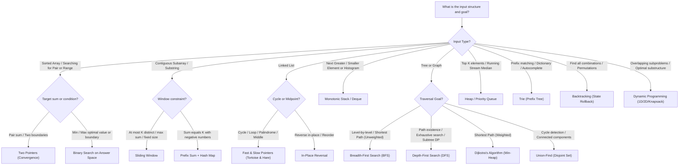

# DSA Playbook Chapter 2: The 15 Essential Coding Patterns & Reusable Templates

> **Core Objective:** Master the 15 fundamental algorithmic patterns that solve 95% of LeetCode Medium/Hard interview problems at Google, Meta, Amazon, and Microsoft.

---

## 0. The Master 1-Page Pattern Recognition Decision Tree

When you read an interview question, how do you instantly know which pattern to apply within 30 seconds? Follow this exact decision tree:



### Rapid 30-Second Pattern Recognition Matrix

| Clues in Problem Statement | Likely Optimal Pattern | Time Complexity |
| :--- | :--- | :--- |
| Sorted array, find pair summing to $X$ | **Two Pointers** | $O(N)$ time, $O(1)$ space |
| "Longest substring with...", "Contiguous subarray with sum $\le K$" | **Sliding Window** | $O(N)$ time, $O(K)$ space |
| "Next greater temperature", "Largest rectangle in histogram" | **Monotonic Stack** | $O(N)$ time, $O(N)$ space |
| "Shortest path in unweighted grid", "Level-order traversal" | **BFS with Queue** | $O(V + E)$ time |
| "Count total paths", "Find maximum profit without adjacent items" | **Dynamic Programming** | $O(N)$ or $O(N \cdot M)$ |
| "Top $K$ most frequent words", "Merge $K$ sorted streams" | **Min/Max Heap** | $O(N \log K)$ |
| "Implement autocomplete", "Find words matching pattern with '.'" | **Trie with DFS** | $O(L)$ where $L$ is word length |

---

## Pattern 1: Two Pointers (Convergence)

### When to Use:
* Input array is **sorted**.
* Searching for pairs that meet a target condition without $O(N^2)$ nested loops.

### Python Master Template:
```python
def two_sum_sorted(arr: list[int], target: int) -> list[int]:
    """Finds two indices whose values sum to target in O(N) time, O(1) space."""
    left, right = 0, len(arr) - 1

    while left < right:
        current_sum = arr[left] + arr[right]
        if current_sum == target:
            return [left, right]
        elif current_sum < target:
            left += 1  # Need a larger sum
        else:
            right -= 1 # Need a smaller sum

    return []
```

---

## Pattern 2: Sliding Window (Dynamic Expansion & Contraction)

### When to Use:
* Searching for the **longest/shortest contiguous subarray or substring** satisfying a condition (e.g. at most $K$ distinct characters).

### Python Master Template:
```python
def longest_substring_k_distinct(s: str, k: int) -> int:
    """Finds length of longest substring with at most k distinct characters."""
    char_counts = {}
    max_length = 0
    left = 0

    for right in range(len(s)):
        # 1. Expand window by including s[right]
        char_counts[s[right]] = char_counts.get(s[right], 0) + 1

        # 2. Shrink window from left until constraint is restored
        while len(char_counts) > k:
            char_counts[s[left]] -= 1
            if char_counts[s[left]] == 0:
                del char_counts[s[left]]
            left += 1

        # 3. Record valid window size
        max_length = max(max_length, right - left + 1)

    return max_length
```

---

## Pattern 3: Fast & Slow Pointers (Floyd's Tortoise and Hare)

### When to Use:
* Cycle detection in linked lists or arrays.
* Finding the exact midpoint of a linked list in a single pass.

### Python Master Template:
```python
class ListNode:
    def __init__(self, val=0, next=None):
        self.val = val
        self.next = next

def has_cycle(head: ListNode | None) -> bool:
    """Detects cycles in linked list in O(N) time and O(1) space."""
    slow = fast = head

    while fast and fast.next:
        slow = slow.next
        fast = fast.next.next
        if slow is fast:
            return True # Cycle detected

    return False
```

---

## Pattern 4: Monotonic Stack (Next Greater Element)

### When to Use:
* Finding the **next greater** or **previous smaller** element for every position in an array in $O(N)$ time.

### Python Master Template:
```python
def next_greater_element(nums: list[int]) -> list[int]:
    """Computes next greater element for each index in O(N) time."""
    result = [-1] * len(nums)
    stack = [] # Stores indices with decreasing values

    for i, val in enumerate(nums):
        # Resolve all elements in stack that are smaller than current val
        while stack and nums[stack[-1]] < val:
            prev_idx = stack.pop()
            result[prev_idx] = val
        stack.append(i)

    return result
```

---

## Pattern 5: Top K Elements (Min-Heap / Max-Heap)

### When to Use:
* Finding the $K$ largest or smallest elements in an unsorted list or streaming input without sorting the entire array in $O(N \log N)$.

### Python Master Template:
```python
import heapq

def find_k_largest(nums: list[int], k: int) -> list[int]:
    """Finds top K largest numbers in O(N log K) time and O(K) space."""
    min_heap = []

    for num in nums:
        heapq.heappush(min_heap, num)
        if len(min_heap) > k:
            heapq.heappop(min_heap) # Evict smallest

    return min_heap # Contains the K largest elements
```

---

## Pattern 6: Binary Search on Answer (Monotonic Predicate)

### When to Use:
* Optimization problems: *"Find the minimum speed to eat bananas in $H$ hours"* or *"Find maximum capacity"*.

### Python Master Template:
```python
def binary_search_predicate(low: int, high: int, is_valid_fn) -> int:
    """Finds minimum valid integer satisfying monotonic condition in O(log(range))."""
    ans = high

    while low <= high:
        mid = (low + high) // 2
        if is_valid_fn(mid):
            ans = mid
            high = mid - 1 # Try to find an even smaller valid answer
        else:
            low = mid + 1  # Need larger value

    return ans
```

---

## Pattern 7: Topological Sort (Kahn's In-Degree Algorithm)

### When to Use:
* Task scheduling, course prerequisites, build systems represented as a Directed Acyclic Graph (DAG).

### Python Master Template:
```python
from collections import deque

def topological_sort(num_nodes: int, edges: list[list[int]]) -> list[int]:
    """Computes topological ordering or returns empty list if cycle exists."""
    adj = {i: [] for i in range(num_nodes)}
    in_degree = [0] * num_nodes

    for src, dst in edges:
        adj[src].append(dst)
        in_degree[dst] += 1

    queue = deque([i for i in range(num_nodes) if in_degree[i] == 0])
    order = []

    while queue:
        node = queue.popleft()
        order.append(node)

        for neighbor in adj[node]:
            in_degree[neighbor] -= 1
            if in_degree[neighbor] == 0:
                queue.append(neighbor)

    return order if len(order) == num_nodes else [] # Valid DAG check
```
