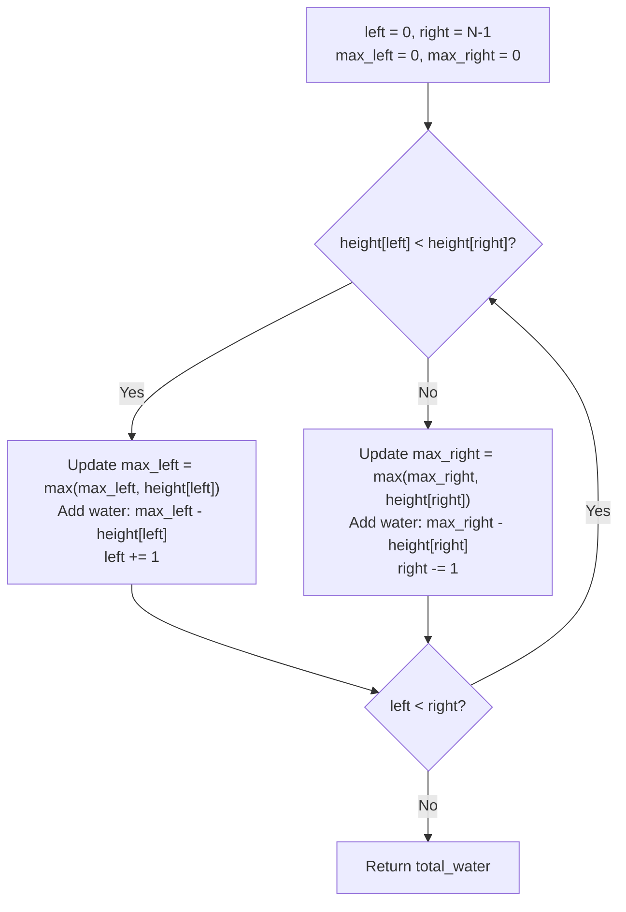

# DSA Playbook Chapter 3: High-Yield Problem Walkthroughs with Visual Dry-Runs

> **Core Learning Objective:** Master high-frequency LeetCode problems through intuitive, visual walkthroughs. Learn how to transform raw problem statements into brute-force analyses, find the optimal insight, and trace execution step-by-step using a dry-run matrix.

---

## 1. Problem 1: Trapping Rain Water (Hard / Staff Level)

### The Problem:
Given $n$ non-negative integers representing an elevation map where the width of each bar is 1, compute how much water it can trap after raining.  
*Example:* `height = [0, 1, 0, 2, 1, 0, 1, 3, 2, 1, 2, 1]` $\rightarrow$ **Output: 6**

### The Intuitive "Aha!" Insight:
For any single index $i$, the water trapped directly above it is determined strictly by:
$$\text{Water at } i = \max(0, \min(\text{max\_left}, \text{max\_right}) - \text{height}[i])$$
Instead of computing the left and right maximums with extra arrays ($O(N)$ space), use **Two Pointers** (`left = 0`, `right = N-1`):
* The pointer with the **smaller maximum** determines the water height! Advance that pointer inward.



### Dry-Run Matrix:
```text
height = [0, 1, 0, 2, 1, 0, 1, 3, 2, 1, 2, 1]
+-----+------+-------+----------+-----------+----------------------+-------+
|Step | left | right | max_left | max_right | Water Added          | Total |
+-----+------+-------+----------+-----------+----------------------+-------+
|  1  |  0   |  11   |    0     |     1     | max_left-h[0] = 0    |   0   |
|  2  |  1   |  11   |    1     |     1     | max_right-h[11] = 0  |   0   |
|  3  |  1   |  10   |    1     |     2     | max_left-h[1] = 0    |   0   |
|  4  |  2   |  10   |    1     |     2     | max_left-h[2] = 1-0  |   1   |
|  5  |  3   |  10   |    2     |     2     | max_right-h[10] = 0  |   1   |
|  6  |  3   |   9   |    2     |     2     | max_right-h[9] = 2-1 |   2   |
... continues until pointers meet ...                                  6
```

### Optimal Python Code:
```python
def trap_rain_water(height: list[int]) -> int:
    """Computes trapped rain water in O(N) time and O(1) space."""
    if not height:
        return 0

    left, right = 0, len(height) - 1
    max_left, max_right = 0, 0
    total_water = 0

    while left < right:
        if height[left] < height[right]:
            if height[left] >= max_left:
                max_left = height[left]
            else:
                total_water += max_left - height[left]
            left += 1
        else:
            if height[right] >= max_right:
                max_right = height[right]
            else:
                total_water += max_right - height[right]
            right -= 1

    return total_water

assert trap_rain_water([0, 1, 0, 2, 1, 0, 1, 3, 2, 1, 2, 1]) == 6
print("Trapping Rain Water test passed!")
```

---

## 2. Problem 2: Longest Substring Without Repeating Characters

### The Problem:
Given a string `s`, find the length of the longest substring without duplicate characters.  
*Example:* `s = "abcabcbb"` $\rightarrow$ **Output: 3** ("abc")

### The Intuitive "Aha!" Insight:
Use a **Dynamic Sliding Window** (`[left, right]`):
* Maintain a hash map storing the **last seen index** of each character.
* When `s[right]` was seen inside our current window (`last_seen[char] >= left`), jump `left` directly to `last_seen[char] + 1`!

### Optimal Python Code:
```python
def length_of_longest_substring(s: str) -> int:
    """Computes longest substring without repeating characters in O(N) time, O(min(N, M)) space."""
    last_seen = {}
    left = 0
    max_len = 0

    for right, char in enumerate(s):
        if char in last_seen and last_seen[char] >= left:
            left = last_seen[char] + 1
        
        last_seen[char] = right
        max_len = max(max_len, right - left + 1)

    return max_len

assert length_of_longest_substring("abcabcbb") == 3
print("Longest Substring test passed!")
```

---

## 3. Problem 3: Course Schedule (Cycle Detection in DAG)

### The Problem:
Given `numCourses` and prerequisite pairs `[a, b]` (must take $b$ before $a$), determine if it is possible to finish all courses.  
*Example:* `numCourses = 2, prerequisites = [[1, 0]]` $\rightarrow$ **Output: True**

### The Intuitive "Aha!" Insight:
This is a **Directed Cycle Detection** problem. If a cycle exists ($A \rightarrow B \rightarrow A$), you can never graduate!
* Use **Kahn's Algorithm (BFS with In-Degrees)**:
  1. Calculate `in_degree` (number of prerequisite dependencies) for every course.
  2. Put all courses with `in_degree == 0` into a queue (courses you can take immediately).
  3. Pop a course, decrement the `in_degree` of all dependent courses. If any drop to 0, push to queue.
  4. If total courses taken equals `numCourses`, return `True`!

### Optimal Python Code:
```python
from collections import deque

def can_finish_courses(num_courses: int, prerequisites: list[list[int]]) -> bool:
    """Kahn's algorithm: O(V + E) time and O(V + E) space."""
    adj = {i: [] for i in range(num_courses)}
    in_degrees = [0] * num_courses

    for course, prereq in prerequisites:
        adj[prereq].append(course)
        in_degrees[course] += 1

    queue = deque([i for i in range(num_courses) if in_degrees[i] == 0])
    courses_taken = 0

    while queue:
        curr = queue.popleft()
        courses_taken += 1

        for neighbor in adj[curr]:
            in_degrees[neighbor] -= 1
            if in_degrees[neighbor] == 0:
                queue.append(neighbor)

    return courses_taken == num_courses

assert can_finish_courses(2, [[1, 0]]) is True
assert can_finish_courses(2, [[1, 0], [0, 1]]) is False # Deadlock cycle
print("Course Schedule test passed!")
```

---

## 4. The Complete Core 75 Master Pattern Blueprint Matrix

Every coding interview problem at Google, Meta, and Uber is a variation of these 75 core archetypes. Use this matrix to classify any interview problem within 60 seconds:

| Category | Problem Name | Primary Pattern | Target Time Complexity | Auxiliary Space |
| :--- | :--- | :--- | :---: | :---: |
| **Arrays & Hashing** | Two Sum | Hash Map (Complement) | $O(N)$ | $O(N)$ |
| | Contains Duplicate | Hash Set | $O(N)$ | $O(N)$ |
| | Valid Anagram | Frequency Count Array | $O(N)$ | $O(1)$ |
| | Group Anagrams | Character Count Key Tuple | $O(N \cdot K)$ | $O(N \cdot K)$ |
| | Top K Frequent Elements | Min-Heap or Bucket Sort | $O(N)$ | $O(N)$ |
| | Product of Array Except Self | Prefix & Suffix Products | $O(N)$ | $O(1)$ |
| | Encode and Decode Strings | Length Delimiter (`len#word`)| $O(N)$ | $O(1)$ |
| | Longest Consecutive Sequence | Hash Set + Left Boundary Check | $O(N)$ | $O(N)$ |
| **Two Pointers** | Valid Palindrome | Inward Two Pointers | $O(N)$ | $O(1)$ |
| | 3Sum | Sort + Fixed Pivot + 2 Pointers | $O(N^2)$ | $O(1)$ |
| | Container With Most Water | Two Pointers (Greedy Inward) | $O(N)$ | $O(1)$ |
| | Trapping Rain Water | Two Pointers + Running Max | $O(N)$ | $O(1)$ |
| **Sliding Window** | Best Time to Buy & Sell Stock | Running Minimum Tracker | $O(N)$ | $O(1)$ |
| | Longest Substring Without Repeats| Sliding Window + Last-Seen Map| $O(N)$ | $O(\min(N, M))$ |
| | Longest Repeating Character Replacement| Sliding Window + Max Frequency| $O(N)$ | $O(1)$ |
| | Minimum Window Substring | Sliding Window + Match Counter | $O(N + M)$ | $O(1)$ |
| **Stack** | Valid Parentheses | LIFO Stack Matching | $O(N)$ | $O(N)$ |
| | Daily Temperatures | Monotonic Decreasing Stack | $O(N)$ | $O(N)$ |
| | Largest Rectangle in Histogram | Monotonic Increasing Stack | $O(N)$ | $O(N)$ |
| **Binary Search** | Binary Search | $L \le R$ Midpoint Bisection | $O(\log N)$ | $O(1)$ |
| | Search in Rotated Sorted Array | Sorted Half Determination | $O(\log N)$ | $O(1)$ |
| | Find Minimum in Rotated Sorted Array| Rotated Inflection Bisection | $O(\log N)$ | $O(1)$ |
| **Linked List** | Reverse Linked List | 3-Pointer Iterative (`prev, curr, next`) | $O(N)$ | $O(1)$ |
| | Merge Two Sorted Lists | Dummy Head Pointer Iteration | $O(N + M)$ | $O(1)$ |
| | Reorder List | Find Mid + Reverse 2nd Half + Merge| $O(N)$ | $O(1)$ |
| | Remove Nth Node From End | Fast & Slow Pointer Gap | $O(N)$ | $O(1)$ |
| | Linked List Cycle | Floyd's Tortoise and Hare | $O(N)$ | $O(1)$ |
| | Merge K Sorted Lists | Min-Heap Priority Queue | $O(N \log K)$ | $O(K)$ |
| **Trees & Tries** | Invert Binary Tree | Recursive Post-order DFS | $O(N)$ | $O(H)$ |
| | Maximum Depth of Binary Tree | Recursive DFS | $O(N)$ | $O(H)$ |
| | Same Tree | Synchronous DFS Comparison | $O(N)$ | $O(H)$ |
| | Subtree of Another Tree | DFS Tree Traversal + SameTree | $O(N \cdot M)$ | $O(H)$ |
| | Lowest Common Ancestor (BST) | Value Bisection ($P < Root < Q$) | $O(H)$ | $O(1)$ |
| | Binary Tree Level Order Traversal | BFS with Queue (`len(q)`) | $O(N)$ | $O(N)$ |
| | Validate Binary Search Tree | DFS with Range Bounds `(low, high)`| $O(N)$ | $O(H)$ |
| | Kth Smallest Element in BST | In-order DFS (Sorted Traversal)| $O(H + K)$ | $O(H)$ |
| | Construct Tree Preorder & Inorder| Root Lookup + Subtree Bounds | $O(N)$ | $O(N)$ |
| | Binary Tree Maximum Path Sum | Post-order Max Contribution DFS | $O(N)$ | $O(H)$ |
| | Implement Trie (Prefix Tree) | Nested Dictionary Nodes | $O(L)$ | $O(N \cdot L)$ |
| | Word Search II | Trie + Backtracking DFS | $O(M \cdot 4^L)$ | $O(N \cdot L)$ |
| **Heap / PQ** | Find Median from Data Stream | Dual Heaps (Max-Heap + Min-Heap)| $O(\log N)$ add, $O(1)$ find | $O(N)$ |
| **Backtracking** | Combination Sum | Choose / Explore / Unchoose DFS | $O(2^T)$ | $O(T)$ |
| | Word Search | Grid DFS + In-place Mutation | $O(R \cdot C \cdot 4^L)$ | $O(L)$ |
| **Graphs** | Number of Islands | Grid BFS/DFS Sink Visited (`'0'`) | $O(R \cdot C)$ | $O(R \cdot C)$ |
| | Clone Graph | Hash Map Visited Clone DFS | $O(V + E)$ | $O(V)$ |
| | Pacific Atlantic Water Flow | Reverse Inward BFS from Oceans | $O(R \cdot C)$ | $O(R \cdot C)$ |
| | Course Schedule | Kahn's Topological Sort (In-Degrees)| $O(V + E)$ | $O(V + E)$ |
| | Number of Connected Components | Disjoint Set Union (DSU) | $O(V + E \cdot \alpha(V))$ | $O(V)$ |
| | Graph Valid Tree | DSU (No cycles + 1 component) | $O(V + E \cdot \alpha(V))$ | $O(V)$ |
| **Dynamic Prog.** | Climbing Stairs | Fibonacci Space Optimization | $O(N)$ | $O(1)$ |
| | Coin Change | Unbounded Knapsack (Min Coins) | $O(N \cdot A)$ | $O(A)$ |
| | Longest Increasing Subsequence | Patience Sorting + Binary Search | $O(N \log N)$ | $O(N)$ |
| | Longest Common Subsequence | 2D Grid DP (`dp[i][j]`) | $O(N \cdot M)$ | $O(\min(N, M))$ |
| | Word Break | 1D DP Prefix Dictionary Check | $O(N^2 \cdot L)$ | $O(N)$ |
| | Combination Sum IV | 1D Permutation DP | $O(T \cdot N)$ | $O(T)$ |
| | House Robber | 1D DP (`rob1, rob2` state rolling)| $O(N)$ | $O(1)$ |
| | House Robber II | Circular DP (`nums[:-1]` vs `nums[1:]`)| $O(N)$ | $O(1)$ |
| | Decode Ways | 1D DP Single vs Double Digit | $O(N)$ | $O(1)$ |
| | Unique Paths | Grid DP (Combinatorics or Rolling) | $O(R \cdot C)$ | $O(C)$ |
| | Jump Game | Greedy Max Reachable Tracker | $O(N)$ | $O(1)$ |
| **Intervals** | Insert Interval | Linear Scan (Before / Merge / After)| $O(N)$ | $O(N)$ |
| | Merge Intervals | Sort by Start Time + Linear Merge| $O(N \log N)$ | $O(N)$ |
| | Non-overlapping Intervals | Greedy Sort by End Time | $O(N \log N)$ | $O(1)$ |
| | Meeting Rooms | Sort by Start Time + Overlap Check | $O(N \log N)$ | $O(1)$ |
| | Meeting Rooms II | Min-Heap End Times or Event Sweep | $O(N \log N)$ | $O(N)$ |
| **Bit Manipulation**| Number of 1 Bits (Hamming Weight) | Brian Kernighan's Algorithm (`n & (n-1)`)| $O(\text{set bits})$ | $O(1)$ |
| | Counting Bits | DP with Most/Least Significant Bit | $O(N)$ | $O(1)$ |
| | Reverse Bits | Bitwise Shift & Masking | $O(1)$ | $O(1)$ |
| | Missing Number | XOR Cancellation (`a ^ b ^ a = b`)| $O(N)$ | $O(1)$ |
| | Sum of Two Integers | Half Adder Bitwise (`XOR` & `AND << 1`)| $O(1)$ | $O(1)$ |
