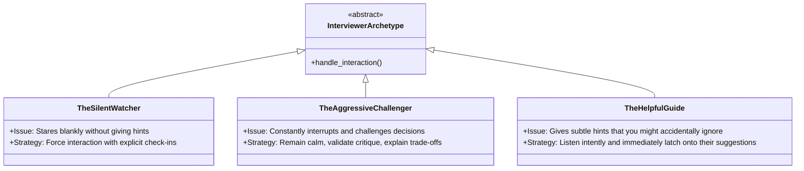

# Chapter 04: The 45-Minute Ticking Clock Mock Interview Simulations

> **The Physiology of Interview Panic**
> Solving a Dynamic Programming problem on your couch with Spotify playing is entirely different from solving it with 28 minutes left on a countdown timer, while a silent Google engineer stares at your blinking cursor through a webcam.
> 
> Technical interviews do not just test your data structure knowledge—they test your **emotional regulation**, **working memory under cortisol surges**, and **real-time communication clarity**.
> 
> This chapter provides the exact minute-by-minute protocol, communication scripts, and psychological playbooks to dominate the 45-minute interview.

---

## 1. The Minute-by-Minute Survival Timeline

```mermaid
gantt
    title The 45-Minute Technical Interview Breakdown
    dateFormat X
    axisFormat %s min

    section Phase 1: Clarification
    Probing Constraints & Edge Cases   :0, 5
    section Phase 2: Exploration
    Brute Force & Algorithmic Trade-offs :5, 15
    section Phase 3: Implementation
    Clean Coding with Out-Loud Narration:15, 30
    section Phase 4: Verification
    Trace Table Dry-Run & Edge Cases    :30, 40
    section Phase 5: Complexity
    Big-O & Follow-up Optimization      :40, 45
```



### Minutes 00:00 – 05:00: Constraint Probing (Never Jump to Code!)
The most common rookie mistake is writing code in the first 2 minutes. This signals impulsiveness. 

**Your Verbal Script:**
> *"Before I begin considering algorithms, I'd like to confirm the constraints and edge conditions to ensure I fully understand the problem boundary."*

*   **Size of input ($N$):** *"What is the maximum range of $N$? Is it $10^3$ (where $O(N^2)$ is acceptable) or $10^5$ (which requires $O(N)$ or $O(N \log N)$)?"*
*   **Data Types & Signs:** *"Can the numbers be negative? Can the array contain duplicates? Can the input string contain Unicode or spaces?"*
*   **Input Extremes:** *"How should we handle an empty list or `None` input? Should we raise an exception or return a default value?"*

---

### Minutes 05:00 – 15:00: Brute Force & Discussion
Always state the naive brute force solution first. It proves you understand the baseline problem and gives you an immediate fallback.

**Your Verbal Script:**
> *"The naive approach would be a nested loop checking every pair. That would take $O(N^2)$ time and $O(1)$ space. However, because $N$ can be up to $10^5$, this will exceed our 1-second execution limit. We can optimize this by trading space for time using a Hash Map to reduce time complexity to $O(N)$."*

**Get Explicit Alignment Before Typing:**
> *"Does this $O(N)$ approach sound like a good direction to implement?"*
*(Wait for the interviewer to say "Yes, go ahead" before typing!)*

---

### Minutes 15:00 – 30:00: Implementation with Continuous Narration
Never sit in total silence for more than 45 seconds. The interviewer cannot read your mind. If you are silent, they assume you are completely lost.

**Narration Tactics:**
*   *"I am initializing two pointers: `left` at index 0 and `right` at the end of the array."*
*   *"I'm wrapping this division in a conditional check to guard against division-by-zero."*
*   *"I'm choosing a `deque` here rather than a standard `list` because we need $O(1)$ pops from the left side."*

---

### Minutes 30:00 – 40:00: The Trace-Table Dry Run
When you finish the last line of code, **NEVER say: "I'm done."**
Saying "I'm done" shifts the burden of proof to the interviewer. Instead, say:
> *"Now that the implementation is complete, I'm going to walk through the code with a concrete example and check our edge cases."*

Draw a small ASCII trace table directly in the editor:
```text
Dry-Run with nums = [2, 7, 11, 15], target = 9
seen = {}

Step 1: num = 2, complement = 7. 7 not in seen. seen[2] = 0.
Step 2: num = 7, complement = 2. 2 IS in seen (index 0).
Return [0, 1]. Correct!
```

---

### Minutes 40:00 – 45:00: Complexity & Wrap-Up
State time and space complexity with mathematical precision:
> *"Time Complexity is $O(N)$ where $N$ is the number of elements in the array, as we iterate through the list exactly once with $O(1)$ average hash table lookups.*
> *Space Complexity is $O(N)$ in the worst case where no pair sums to target until the final element, requiring us to store all $N$ elements in the dictionary."*

---

## 2. Dealing with Difficult Interviewer Archetypes



### Archetype 1: The Silent Watcher
*The interviewer turns off their mic or stays dead silent while you code.*
* **Danger:** You feel isolated and start rushing or second-guessing yourself.
* **The Antidote:** Force them to interact politely every 3 minutes:
  > *"I'm planning to use a max-heap here to track the top K elements. Does that approach align with what you're looking for?"*

### Archetype 2: The Aggressive Challenger
*The interviewer abruptly interrupts: "Why are you using a Hash Map? That takes way too much memory!"*
* **Danger:** Becoming defensive or flustered.
* **The Antidote:** Acknowledge the critique and state the explicit trade-off:
  > *"You make a valid point regarding the $O(N)$ memory footprint. If memory is severely constrained, we could sort the array in place in $O(N \log N)$ time and use two pointers to achieve $O(1)$ space. Would you prefer we prioritize space over time here?"*

### Archetype 3: The Helpful Guide
*The interviewer gently says: "Notice how the input array is already sorted..."*
* **Danger:** Stubbornly continuing with your original idea and missing the lifeline.
* **The Antidote:** **Latch on immediately!**
  > *"Ah, thank you! Because it's sorted, we don't need a hash map at all—we can use Binary Search or Two Pointers to solve it in $O(\log N)$ or $O(N)$ with $O(1)$ auxiliary space."*
