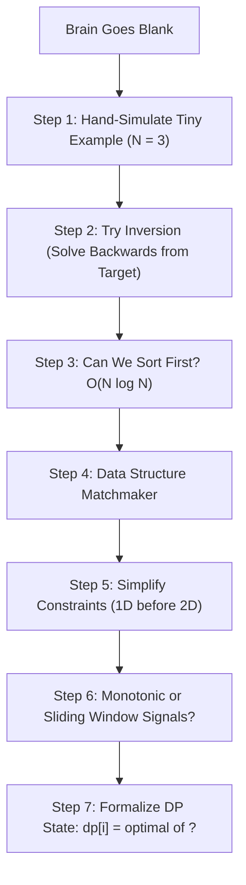

# Chapter 05: The Stuck Engineer's Diagnostic Decision Tree

> **The Blank Brain Phenomenon**
> Every engineer has experienced the nightmare: you read the problem description, your mind goes completely blank, and panic sets in. You have no idea what pattern applies, your heart rate spikes, and every second of silence feels like an eternity.
> 
> When intuition fails, you must switch to an **Algorithmic Diagnostic Tree**. This chapter provides a deterministic, 7-step triage system to unstick your brain and extract the optimal solution methodically.

---

## 1. The 7-Step Unsticking Decision Tree



### Technique 1: Hand-Simulate a Tiny Example ($N = 3$)
When an array has 50 elements, patterns are obscured. Shrink the problem to $N = 3$ or $N = 4$ and manually trace your own subconscious logic on paper:
*   *Ask yourself:* "How did my human brain know that 7 was the answer?"
*   Did you scan left to right? Did you skip certain items? Whatever your human brain did intuitively can be turned into an algorithm!

### Technique 2: Inversion (Solve Backwards)
If finding a path from $Start \rightarrow Target$ has an explosive branching factor of 5 choices per step, reverse the problem:
*   Can you start at $Target$ and work backwards towards $Start$?
*   *Classic Example:* Jump Game. Checking if index 0 can reach index $N-1$ is messy. But starting at $N-1$ and checking if the previous index can reach it collapses the problem to a trivial greedy $O(N)$ sweep!

### Technique 3: The Sorting Trade-Off ($O(N \log N)$)
If the array is unsorted and brute force is $O(N^2)$, ask:
> *"Does the order of elements matter?"*
*   If you are finding pairs, triplets, intervals, or frequencies, **order usually does not matter**.
*   Sorting takes $O(N \log N)$ and immediately unlocks **Binary Search** ($O(\log N)$) or **Two Pointers** ($O(N)$)!

---

## 2. The Data Structure Matchmaker Matrix

When you can't think of an algorithm, match the problem's core requirement to its dedicated data structure:

| If the problem requires... | The Dedicated Data Structure is... | Time Complexity |
| :--- | :--- | :--- |
| Tracking the **Top $K$** largest or smallest elements | **Min-Heap / Max-Heap** (`heapq`) | $O(N \log K)$ |
| Finding the **Next Greater / Smaller Element** | **Monotonic Stack** | $O(N)$ |
| Dynamic **Prefix / Autocomplete Search** | **Trie (Prefix Tree)** | $O(L)$ where $L$ is word length |
| Checking **Connected Components / Cycle Detection** | **Disjoint Set Union (Union-Find)** | $O(\alpha(N)) \approx O(1)$ |
| Finding the **Shortest Path in an Unweighted Graph** | **Breadth-First Search (BFS)** with `deque` | $O(V + E)$ |
| Finding the **Shortest Path in a Weighted Graph** | **Dijkstra's Algorithm** with Priority Queue | $O(E \log V)$ |
| Fast **Range Sum Queries with Updates** | **Binary Indexed Tree (Fenwick) / Segment Tree** | $O(\log N)$ |
| Longest contiguous subarray satisfying a condition | **Sliding Window** (Two Pointers) | $O(N)$ |

---

## 3. Dynamic Programming: The 3-Question Formulation

If a problem asks for **"Maximum"**, **"Minimum"**, **"Total Number of Ways"**, or **"Is it possible to reach..."**, it is almost always Dynamic Programming.

Stop trying to guess the whole code. Answer these 3 specific questions:
1. **What is the State?** What variables uniquely define where we are? 
   * *Example:* `dp(i, remaining_weight)`
2. **What is the Base Case?** What is the simplest possible input that has an obvious answer?
   * *Example:* If `remaining_weight == 0`, return `0`. If `i == len(items)`, return `0`.
3. **What is the Transition Choice?** At state `i`, what are our possible actions?
   * *Choice A:* Skip item `i` $\rightarrow `dp(i + 1, remaining_weight)`
   * *Choice B:* Take item `i` $\rightarrow `value[i] + dp(i + 1, remaining_weight - weight[i])`
   * *The Equation:* Take `max(Choice A, Choice B)`.

---

## 4. The Pre-Flight Edge Case Checklist

Before telling your interviewer your code is ready, run through this mental checklist:

```text
[ ] 1. Empty Input: Does the function crash on [] or "" or None?
[ ] 2. Single Element: Does [1] trigger an IndexError in your pointer arithmetic?
[ ] 3. Two Elements: Does [1, 2] handle odd vs. even length logic?
[ ] 4. All Duplicates: Does [5, 5, 5, 5] cause an infinite loop in while (nums[l] < nums[r])?
[ ] 5. Negative Numbers: Does your math assume positive integers (e.g., modulo or sliding window sums)?
[ ] 6. Large Boundary Extremes: Does target exceed the sum of all elements?
[ ] 7. Cycles / Visited Sets: In graph or tree traversal, did you guard against infinite loops with a visited set?
```

Running through this checklist out loud demonstrates true principal-level engineering rigor.
