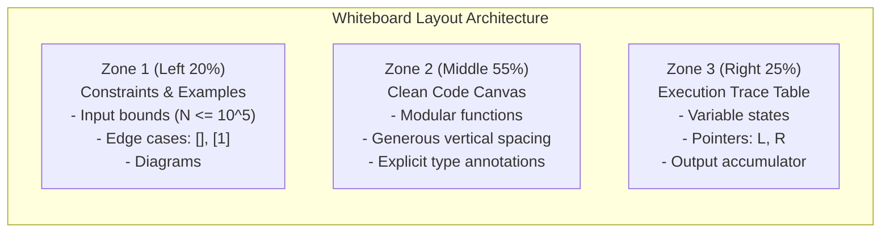

# Chapter 06: Whiteboard & Google Doc Coding Discipline

> **Coding Without a Safety Net**
> Modern IDEs (VS Code, PyCharm) make developers comfortable. Red squiggly lines catch typos, tab-autocomplete completes variable names, and pressing "Run" lets you test code instantly.
> 
> In Google, Meta, and top-tier hedge fund interviews, this safety net vanishes. You are handed a dry-erase marker at a whiteboard, or forced to type in a shared Google Doc without syntax highlighting, autocomplete, or an execution compiler.
> 
> This chapter teaches the discipline of **mental compilation**, whiteboard space management, and manual debugging routines.

---

## 1. The Whiteboard Space Partitioning Law

When coding on a physical whiteboard or a plain text editor, poor organization leads to running out of room, messy arrows, and crossed-out scribbles.

Divide your canvas into 3 strict zones:



### The Rule of Modular Helper Functions
Never write a 60-line monolithic function on a whiteboard. If your solution requires a sub-routine (e.g., verifying if a string is a palindrome, or reversing a linked list):
1. **Stub it out first:** Write `if not self.is_palindrome(s[left:right]):` and assume it works.
2. Implement the core high-level algorithm.
3. If time permits, implement the helper function at the bottom.
4. *Why this works:* It keeps your main logic clean and proves architectural thinking to the interviewer!

---

## 2. The 10 Most Common Bugs IDEs Catch That You Must Catch Manually

In a Google Doc, the compiler will not warn you about these 10 classic traps. Memorize them:

### 1. The 2D Matrix Shallow Copy Trap
```python
# BUG: All rows reference the EXACT same list in memory!
matrix = [[0] * n] * m 
matrix[0][0] = 99 # Mutates index 0 of EVERY row!

# FIX: Independent list comprehension
matrix = [[0] * n for _ in range(m)]
```

### 2. Off-by-One in Binary Search
```python
# BUG: Potential infinite loop when low and high differ by 1
while low < high:
    mid = (low + high) // 2
    if nums[mid] < target:
        low = mid # BUG: If high = low + 1, mid = low, loop never terminates!

# FIX:
while low <= high:
    mid = (low + high) // 2
    if nums[mid] < target:
        low = mid + 1 # Guaranteed progress!
    else:
        high = mid - 1
```

### 3. Modifying a Collection While Iterating
```python
# BUG: Modifying list during iteration skips items!
for item in my_list:
    if item < 0:
        my_list.remove(item)

# FIX: Iterate over a copy or use list comprehension
my_list = [item for item in my_list if item >= 0]
```

### 4. Unhandled `None` Pointer Access in Linked Lists / Trees
```python
# BUG: Crashes with AttributeError if node is None!
while node.val != target:
    node = node.next

# FIX: Guard the pointer existence first!
while node and node.val != target:
    node = node.next
```

### 5. Python Integer Division Truncation
```python
# BUG in Python: -3 // 2 evaluates to -2 (Floors toward negative infinity!)
# If you want truncation toward zero (like in C++/Java):
truncated = int(-3 / 2) # Evaluates correctly to -1
```

### 6. Missing Return Statement in Recursive Branch
```python
# BUG: One branch forgets to propagate the return value, returning None!
def dfs(node):
    if not node:
        return 0
    if node.val == target:
        return 1
    # Forgetting 'return' here returns None!
    dfs(node.left) + dfs(node.right) 

# FIX: Explicit return on all execution paths
return dfs(node.left) + dfs(node.right)
```

### 7. Mutable Default Arguments
```python
# BUG: 'visited' list persists across separate function calls!
def traverse(node, visited=[]):
    visited.append(node)

# FIX:
def traverse(node, visited=None):
    if visited is None:
        visited = set()
```

### 8. Shadowing Built-In Names
Avoid naming variables `list`, `dict`, `min`, `max`, `sum`, `id`, `type`, or `str`. It overwrites the built-in function, causing silent downstream errors when you call `max(a, b)`.

### 9. String Concatenation Inside Loops ($O(N^2)$ Trap)
```python
# BUG: Creates a new string copy on every iteration
s = ""
for char in chars:
    s += char

# FIX: Append to list and join once
s = "".join(chars)
```

### 10. Forgetting to Update Pointers in `while` Loops
```python
# BUG: Infinite loop!
while left < right:
    if nums[left] + nums[right] == target:
        return [left, right]
    # Forgetting to advance left or decrement right!
```

---

## 3. The Mental Dry-Run Execution Protocol

Before you tell the interviewer you have finished, execute this 4-step mental dry-run:

```text
1. Pointer Verification: Check that every 'while' loop has an explicit, guaranteed advancement statement.
2. Variable Scope Check: Verify that variables defined inside an 'if' block are not accessed outside without initialization.
3. Edge Case Dry Run: Mentally run nums = [] and nums = [5] through the first 4 lines of code.
4. Clean Return Check: Verify that every execution branch terminates in a return statement matching the expected return type.
```

Mastering this discipline separates engineers who rely on trial-and-error from masters who write correct, production-grade code on the first attempt.


## Further Reading

- [Python style guide (PEP 8)](https://peps.python.org/pep-0008/)
- [Big-O cheat sheet](https://www.bigocheatsheet.com/)
- [Python data structures](https://docs.python.org/3/tutorial/datastructures.html)


---

## Check Yourself

Answer in your head or on paper first, then open each answer.

<details>
<summary><strong>1.</strong> Why write helper functions with clear names on a whiteboard?</summary>

They keep the main logic readable and reduce bugs.

</details>

<details>
<summary><strong>2.</strong> What do you state about complexity?</summary>

Time and space in terms of input size, including hidden costs like sorting or slicing.

</details>

<details>
<summary><strong>3.</strong> How do you handle an unfamiliar language feature?</summary>

Use a simpler construct you are certain about and say so.

</details>

<details>
<summary><strong>4.</strong> What is a good habit before declaring done?</summary>

Test one normal case and one edge case aloud.

</details>
