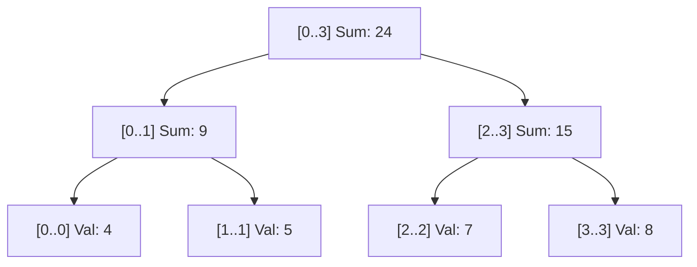

# Chapter 07: Advanced Data Structures: Segment Trees, Fenwick Trees, & Bitmask DP

> **Zero-Prerequisite Intuition: The "Tournament Bracket" Metaphor**
> Why do we need Segment Trees and Fenwick Trees?
> Imagine an array of 1,000,000 numbers. Your manager gives you two operations:
> 1. *"Update index 42,000 to value 99."*
> 2. *"Calculate the sum of all numbers between index 10,000 and 800,000."*
> 
> * **Naive Array:** Operation 1 is instant ($O(1)$), but Operation 2 requires summing 790,000 numbers in a loop ($O(N)$). If you do this 100,000 times, your code times out!
> * **Prefix Sum Array:** Operation 2 is instant ($O(1)$ subtraction: `prefix[800000] - prefix[10000]`), but Operation 1 requires recalculating 960,000 prefix sums ($O(N)$)!
> 
> You are trapped: either queries are slow, or updates are slow.
> 
> **How do we make BOTH Updates and Queries blazing fast in $O(\log N)$ time?**
> Imagine a **Tennis Tournament Bracket**. 
> Two players play in Round 1. The winner moves to Round 2. The winner moves to the Semifinals, and the champion is at the top.
> If one player withdraws and is replaced, you don't replay the entire tournament! You only re-evaluate the **single branch** of matches leading from that player up to the final ($\log_2 N$ matches).
> 
> That is a **Segment Tree**.

---

## 1. Segment Trees: Range Queries & Point Updates in $O(\log N)$

A Segment Tree is a binary tree where every node represents an interval `[L, R]`. Leaf nodes represent single array elements. Parent nodes store the aggregate (Sum, Min, or Max) of their children.



### Complete Segment Tree Implementation in Python

```python
# segment_tree.py
from typing import List

class SegmentTree:
    def __init__(self, data: List[int]):
        self.n = len(data)
        # Tree size: 4 * N is safe upper bound for 1-indexed binary heap
        self.tree = [0] * (4 * self.n)
        if self.n > 0:
            self._build(data, node=1, start=0, end=self.n - 1)

    def _build(self, data: List[int], node: int, start: int, end: int):
        if start == end:
            self.tree[node] = data[start]
            return
        mid = (start + end) // 2
        left_child = 2 * node
        right_child = 2 * node + 1
        
        self._build(data, left_child, start, mid)
        self._build(data, right_child, mid + 1, end)
        self.tree[node] = self.tree[left_child] + self.tree[right_child]

    def update(self, idx: int, value: int, node: int = 1, start: int = 0, end: int = None):
        """Point Update in O(log N)"""
        if end is None: end = self.n - 1
        if start == end:
            self.tree[node] = value
            return
        mid = (start + end) // 2
        left_child = 2 * node
        right_child = 2 * node + 1

        if idx <= mid:
            self.update(idx, value, left_child, start, mid)
        else:
            self.update(idx, value, right_child, mid + 1, end)
        self.tree[node] = self.tree[left_child] + self.tree[right_child]

    def query_range(self, l: int, r: int, node: int = 1, start: int = 0, end: int = None) -> int:
        """Range Sum Query in O(log N)"""
        if end is None: end = self.n - 1
        
        # Case 1: Total Overlap
        if l <= start and end <= r:
            return self.tree[node]
        
        # Case 2: No Overlap
        if end < l or start > r:
            return 0

        # Case 3: Partial Overlap
        mid = (start + end) // 2
        left_sum = self.query_range(l, r, 2 * node, start, mid)
        right_sum = self.query_range(l, r, 2 * node + 1, mid + 1, end)
        return left_sum + right_sum

if __name__ == "__main__":
    nums = [4, 5, 7, 8]
    st = SegmentTree(nums)
    print("Range Sum [1..3] (5 + 7 + 8):", st.query_range(1, 3)) # 20
    
    st.update(idx=2, value=10) # Updates 7 to 10
    print("After update, Range Sum [1..3] (5 + 10 + 8):", st.query_range(1, 3)) # 23
```

---

## 2. Fenwick Tree (Binary Indexed Tree / BIT)

A Fenwick Tree achieves the exact same $O(\log N)$ updates and prefix sum queries as a Segment Tree, but uses **half the memory** and **only 12 lines of code**!

### The Magic of the Lowest Set Bit: `i & (-i)`
In two's-complement binary arithmetic, `i & (-i)` isolates the lowest 1-bit of integer `i`. Each index `i` in a Fenwick tree stores the sum of a range of length `i & (-i)`.

```python
class FenwickTree:
    def __init__(self, size: int):
        self.size = size
        self.tree = [0] * (size + 1) # 1-indexed

    def add(self, i: int, delta: int):
        """Adds delta to index i in O(log N)"""
        while i <= self.size:
            self.tree[i] += delta
            i += i & (-i) # Advance to parent

    def prefix_sum(self, i: int) -> int:
        """Computes sum from 1 to i in O(log N)"""
        total = 0
        while i > 0:
            total += self.tree[i]
            i -= i & (-i) # Jump to next range
        return total

    def range_sum(self, l: int, r: int) -> int:
        return self.prefix_sum(r) - self.prefix_sum(l - 1)
```

---

## 3. Disjoint Set Union (Union-Find) with Rank & Path Compression

DSU tracks a partition of elements into disjoint subsets.
* **Path Compression:** Flattens the tree during `find()`, making all nodes point directly to the root.
* **Union by Rank:** Attaches the shallower tree under the deeper tree to prevent tall degenerated linked lists.

```python
class DisjointSetUnion:
    def __init__(self, n: int):
        self.parent = list(range(n))
        self.rank = [0] * n

    def find(self, i: int) -> int:
        # Path compression: O(α(N)) amortized nearly O(1)
        if self.parent[i] != i:
            self.parent[i] = self.find(self.parent[i])
        return self.parent[i]

    def union(self, i: int, j: int) -> bool:
        root_i = self.find(i)
        root_j = self.find(j)
        if root_i == root_j:
            return False # Already in same connected component (Cycle detected!)

        # Union by Rank
        if self.rank[root_i] < self.rank[root_j]:
            self.parent[root_i] = root_j
        elif self.rank[root_i] > self.rank[root_j]:
            self.parent[root_j] = root_i
        else:
            self.parent[root_j] = root_i
            self.rank[root_i] += 1
        return True
```
* **Time Complexity:** The Inverse Ackermann function $\alpha(N) \le 4$ for any $N \le 10^{80}$ (the number of atoms in the observable universe!). It is **effectively $O(1)$** in practice.

---

## 4. Bitmask Dynamic Programming

When an interview problem involves visiting all subsets of items (like the Traveling Salesperson Problem or assigning $N$ jobs to $N$ workers), a naive permutation takes $O(N!)$ time ($15! \approx 1.3 \times 10^{12}$ operations, which will crash).

**Bitmask DP** represents subsets as integers where the $i$-th bit indicates whether item $i$ is included (`1`) or excluded (`0`).

### The Traveling Salesperson Problem (TSP) in $O(N^2 2^N)$

```python
def tsp_bitmask_dp(distance_matrix: List[List[int]]) -> int:
    n = len(distance_matrix)
    # State: dp(mask, u) = min cost to visit all cities in 'mask' ending at city 'u'
    memo = {}

    def solve(mask: int, u: int) -> int:
        # Base case: All cities visited (All bits are 1)
        if mask == (1 << n) - 1:
            return distance_matrix[u][0] # Return to origin

        state = (mask, u)
        if state in memo:
            return memo[state]

        ans = float("inf")
        for v in range(n):
            # Check if city v has NOT been visited yet: ((mask >> v) & 1) == 0
            if not (mask & (1 << v)):
                new_mask = mask | (1 << v) # Mark city v as visited
                cost = distance_matrix[u][v] + solve(new_mask, v)
                ans = min(ans, cost)

        memo[state] = ans
        return ans

    # Start at City 0 with mask = 1 (bit 0 set)
    return solve(mask=1, u=0)

if __name__ == "__main__":
    # 4 cities distance matrix
    dist = [
        [0, 10, 15, 20],
        [10, 0, 35, 25],
        [15, 35, 0, 30],
        [20, 25, 30, 0]
    ]
    min_tour = tsp_bitmask_dp(dist)
    print("Optimal Traveling Salesperson Tour Cost:", min_tour) # 80
```
This reduces $O(N!)$ time down to $O(N^2 2^N)$, making problems up to $N = 20$ solvable in milliseconds!
