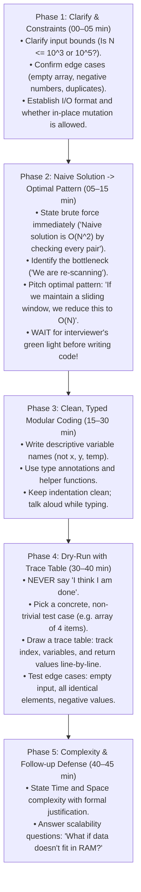
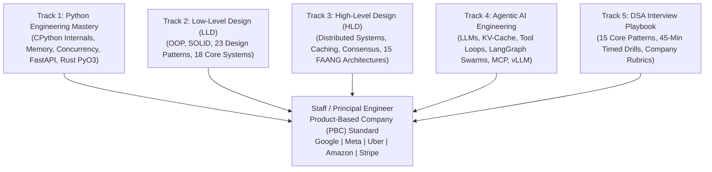

# Chapter 09: Track 5 Recap — The DSA Interview Mastery & Rapid-Recall Playbook

> **Core Learning Objective:** Consolidate everything you have mastered across Track 5 into an interview-day battle card. This chapter provides a rapid-recall synthesis of the 15 master algorithmic patterns, the 45-minute ticking clock execution rhythm, the Stuck Engineer's 7 diagnostic moves, company-specific grading rubrics (Google, Meta, Amazon, Uber), and the ultimate bug-free whiteboard discipline.

---

## 1. The Master 15 Algorithmic Patterns Rapid-Recall Matrix

When an interviewer finishes explaining a problem, look for the trigger clues in this matrix to instantly identify the optimal pattern:

| # | Pattern Name | 30-Second Clue / Trigger Keywords | Core Data Structure | Time & Space Complexity | Canonical Problem |
| :---: | :--- | :--- | :--- | :--- | :--- |
| **1** | **Two Pointers** | Sorted array, finding pairs, palindromes, partitioning in-place. | Two integer index pointers (`l`, `r`) | Time: $O(N)$ Space: $O(1)$ | Trapping Rain Water, 3Sum, Valid Palindrome |
| **2** | **Sliding Window** | Contiguous subarray/substring with a target condition (max/min/sum). | `left` pointer + hash map / frequency array | Time: $O(N)$ Space: $O(K)$ | Longest Substring Without Repeating Characters |
| **3** | **Monotonic Stack / Deque** | Next Greater Element, previous smaller, max/min in a sliding window. | `collections.deque` maintaining monotonic order | Time: $O(N)$ Space: $O(K)$ | Sliding Window Maximum, Daily Temperatures |
| **4** | **Fast & Slow Pointers** | Linked lists or arrays with cycles, finding middle element. | Two pointers moving at $1\times$ and $2\times$ speeds | Time: $O(N)$ Space: $O(1)$ | Linked List Cycle II, Happy Number |
| **5** | **Top K Elements (Heap)** | Find the $K$ largest, smallest, or most frequent items in a stream. | Min-Heap (`heapq`) of fixed size $K$ | Time: $O(N \log K)$ Space: $O(K)$ | Top K Frequent Elements, Kth Largest in Stream |
| **6** | **K-Way Merge** | Merging $K$ sorted lists, streams, or intervals. | Min-Heap storing `(val, list_idx, elem_idx)` | Time: $O(N \log K)$ Space: $O(K)$ | Merge K Sorted Lists, Smallest Range Covering K Lists |
| **7** | **Binary Search on Answer** | Minimize maximum, maximize minimum, contiguous search range. | Predicate function `can_finish(mid) -> bool` | Time: $O(N \log(\text{range}))$ Space: $O(1)$ | Koko Eating Bananas, Capacity To Ship Packages |
| **8** | **Graph BFS (Shortest Path)** | Unweighted shortest path, level-order traversal, virus spread. | `collections.deque` queue + `visited` set | Time: $O(V + E)$ Space: $O(V)$ | Word Ladder, Rotting Oranges, Shortest Path in Binary Matrix |
| **9** | **Topological Sort** | Task scheduling, prerequisite chains, cycle detection in DAGs. | In-degree array + Queue (Kahn's Algorithm) | Time: $O(V + E)$ Space: $O(V)$ | Course Schedule I & II, Alien Dictionary |
| **10**| **Backtracking (Search)** | Find all combinations, permutations, subsets, board states. | Recursive stack + in-place mutation and undo | Time: $O(2^N)$ or $O(N!)$ Space: $O(N)$ | N-Queens, Word Search, Subsets |
| **11**| **Dynamic Programming (1D/2D)**| Overlapping subproblems, optimal substructure, count paths. | 1D/2D memo table or rolling variables | Time: $O(N \times M)$ Space: $O(N)$ or $O(1)$ | Coin Change, Longest Common Subsequence (LCS) |
| **12**| **Trie (Prefix Tree)** | Autocomplete, dictionary prefix lookup, wildcard search (`.`). | Nested hash tables / 26-child node tree | Time: $O(L)$ per op Space: $O(N \times L)$ | Implement Trie, Design Add and Search Words |
| **13**| **Union-Find (DSU)** | Dynamic connectivity, cycle detection in undirected graphs. | `parent` and `rank` arrays with path compression | Time: $O(\alpha(N)) \approx O(1)$ Space: $O(N)$ | Number of Connected Components, Redundant Connection |
| **14**| **Segment / Fenwick Tree** | Dynamic range sum/min/max queries with point updates. | Binary indexed tree (`i & (-i)`) | Time: $O(\log N)$ per query/update Space: $O(N)$ | Range Sum Query - Mutable, Count of Smaller Numbers |
| **15**| **Bitmask DP** | Small $N \le 20$ permutations, Traveling Salesperson, subset state. | Integer bitmask representing visited set | Time: $O(2^N \times N)$ Space: $O(2^N \times N)$ | Shortest Path Visiting All Nodes, TSP |

---

## 2. The 45-Minute Live Interview Execution Timeline

---

## 3. The Stuck Engineer's Emergency Protocol (7 Diagnostic Moves)

If you freeze or your mind goes blank in an interview, do NOT stare at the screen in silence. Execute these 7 diagnostic moves out loud:

1. **Move 1: Manually Solve for $N = 3$:** Draw a tiny concrete example by hand. Watch what your own human brain does step-by-step. Translate your human intuition into code!
2. **Move 2: Invert the Problem:** Instead of finding what *satisfies* the condition, find what *violates* it and subtract from the total!
3. **Move 3: "Can Sorting Help?":** If the problem involves arrays and pairs, ask: *"If I spend $O(N \log N)$ to sort the array first, does that unlock a Two-Pointer or Greedy solution?"*
4. **Move 4: Trade Space for Time (Hash Map / Prefix Sum):** Can storing previous results in a dictionary turn an $O(N^2)$ scan into an $O(N)$ lookup (like Two Sum)?
5. **Move 5: Check for Monotonicity (Binary Search on Answer):** If the problem asks to *"find the minimum maximum"* or *"find the largest value such that..."*, can you write a `can_finish(x) -> bool` function that turns from `False` to `True` monotonically?
6. **Move 6: Next Greater Element $\implies$ Monotonic Stack:** If the problem requires finding the nearest element larger or smaller than the current element, it is **100% a Monotonic Stack**!
7. **Move 7: The DP 3-Question Formulation:**
   - *State:* What does `dp[i]` physically represent?
   - *Transition:* How do I compute `dp[i]` from `dp[i-1]`?
   - *Base Case:* What is `dp[0]`?

---

## 4. Company-Specific Interview Battle Cards

| Company | Core Algorithmic Focus | Interview Evaluation Rubric | Winning Strategy |
| :--- | :--- | :--- | :--- |
| **Google** | Graphs, Trees, Topological Sort, Segment Trees, Bitmask DP | Heavy emphasis on **clean abstractions, mathematical optimality, and follow-up scaling**. Less focused on memorized LeetCode; loves custom twists. | Ask clarifying questions upfront. Always separate logic into clean helper functions. Be ready for *"What if the graph has billions of nodes distributed across 10 machines?"* |
| **Meta** | Two Pointers, Sliding Window, Monotonic Deque, Fast Trees | **Extreme speed and zero-bug threshold**. You are expected to solve **TWO Medium problems in 40 minutes** with production-clean code. | Do not over-complicate. Jump quickly to optimal patterns. Memorize the 15 pattern templates so your fingers type the boilerplate automatically. |
| **Amazon** | Heaps (Top K), BFS / DFS, Arrays, String Matching | Heavy emphasis on **Amazon Leadership Principles (LP) woven into coding**. Interviewer watches for *Customer Obsession*, *Bias for Action*, and *Frugality* (memory efficiency). | State trade-offs explicitly. Defend why a Min-Heap is better than sorting for streaming data. Never argue with the interviewer; embrace constructive feedback. |
| **Uber** | Intervals, Geometry (H3 / Coordinate grids), Concurrency LLD, Deque | Focus on **real-world concurrency edge cases, intervals, and practical engineering trade-offs**. | Structure code with clean object-oriented encapsulation. Mention thread-safety and off-by-one boundary conditions. |

---

## 5. The Junior vs. Senior Antipattern Graveyard

| # | The Junior Antipattern | What Goes Wrong in Interviews | The Senior / Staff Solution |
| :---: | :--- | :--- | :--- |
| **1** | Typing code immediately without clarifying constraints. | The interviewer interrupts 15 minutes later: *"Oh, by the way, the array can contain negative numbers and $N = 10^7$."* Your entire code is useless! | Always ask: *"What are the constraints on $N$? Can numbers be negative? Are there duplicate keys?"* |
| **2** | Coding in total silence for 10 minutes. | The interviewer has no idea what you are thinking. If you head down a dead end, they cannot help you. | **Think out loud continuously**. Explain your trade-offs as you write: *"I am using a deque here so that popleft is $O(1)$ instead of $O(N)$."* |
| **3** | Saying *"I think my code works"* without a dry-run. | The interviewer finds an off-by-one bug in 5 seconds. You lose immediate points for carelessness. | Say: *"Let me manually trace this code with an example to verify edge cases."* Draw the trace table line-by-line! |
| **4** | Off-by-one errors in Binary Search (`while left < right` vs `while left <= right`). | Endless infinite loops on $N = 2$ or failing to examine the boundary element. | Master the standard template: `while left <= right:` with `mid = left + (right - left) // 2`, and update `left = mid + 1` or `right = mid - 1`. |
| **5** | Modifying an array or list while iterating over it (`for x in nums: nums.remove(x)`). | Skips elements silently due to shifting internal index pointers. | Iterate over a copy `for x in nums[:]:` or construct a new filtered list with list comprehensions. |

---

## 6. The Master Graduation Milestone: You Are Ready!

Congratulations! You have completed all five comprehensive engineering tracks of the **PBC 2026 Master Preparation Guide**:

You now possess:
1. **Language & Memory Depth:** Silicon-level understanding of CPython, memory allocators, and concurrency synchronization.
2. **Object-Oriented Craftsmanship:** The ability to architect scalable, modular systems in under 45 minutes using standard design patterns.
3. **Global System Design Prowess:** The intuition to scale distributed platforms to 100M+ users with fault tolerance and cost efficiency.
4. **Frontier AI Engineering:** The capability to build production-grade cognitive agent architectures, vector retrieval pipelines, and reasoning loops.
5. **Algorithmic Confidence:** The muscle memory to rapidly identify patterns, write typed bug-free code, and calmly solve complex problems under live interview pressure.

Walk into your interviews with total confidence. **You are ready.**

## Further Reading

- [CP-Algorithms](https://cp-algorithms.com/)
- [VisuAlgo](https://visualgo.net/en)
- [Big-O cheat sheet](https://www.bigocheatsheet.com/)

---

## Check Yourself

Answer in your head or on paper first, then open each answer.

<strong>1.</strong> Name the top-level decision tree for a new problem.

Identify structure, pick a pattern, state brute force, optimise, code, test.

<strong>2.</strong> Which complexity should you quote for sorting-based solutions?

O(n log n) time dominated by the sort.

<strong>3.</strong> What is the best use of the practice harness?

Attempt the stub, run `--stub`, use hints only after a real attempt, then compare with the walkthrough.

<strong>4.</strong> How do you know a topic is mastered?

You can solve a fresh variant within the time limit and explain the trade-offs.

