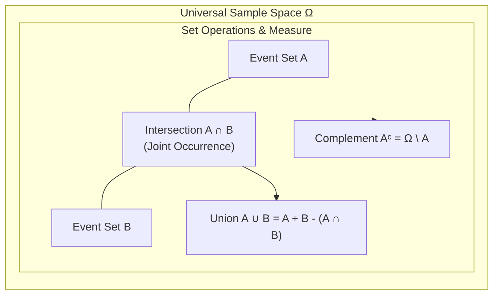

# Module 01: Set Language for Machine Learning

> **ML Math** · 25 lessons

---


## Set Theory & Sample Space Partitioning



## Why this module exists

Every question about *which rows go where* is a question about sets,
and the notation makes those questions precise enough to check mechanically.
This module gives you the vocabulary - membership, subset, partition, function -
and then uses it to build the one thing that silently ruins more models than any
other bug: a train/test split that does not leak.

## What you will be able to do

- [ ] Translate a data question into set notation and back into code.
- [ ] Prove two sets equal by two-directional containment, and disprove with one counterexample.
- [ ] Apply De Morgan's laws to simplify a filter without changing which rows it keeps.
- [ ] Decide whether a split partitions the correct units, and assert it.
- [ ] Explain why exhaustive feature-subset search is infeasible, with a number.
- [ ] Recognise convexity and say what it guarantees about local minima.

---

## Lessons

| # | Lesson | Status |
| :--- | :--- | :---: |
| 01 | [Why Sets Are the Vocabulary of ML](lessons/01_Why_Sets_Are_the_Vocabulary_of_ML.md) | ✅ |
| 02 | [Set Notation, Membership and Equality](lessons/02_Set_Notation_Membership_and_Equality.md) | ✅ |
| 03 | [Subsets, Supersets and the Empty Set](lessons/03_Subsets_Supersets_and_the_Empty_Set.md) | ✅ |
| 04 | [Union, Intersection and Difference](lessons/04_Union_Intersection_and_Difference.md) | ✅ |
| 05 | [Complements and the Universal Set](lessons/05_Complements_and_the_Universal_Set.md) | ✅ |
| 06 | [De Morgan's Laws](lessons/06_De_Morgans_Laws.md) | ✅ |
| 07 | [Power Sets and Counting Subsets](lessons/07_Power_Sets_and_Counting_Subsets.md) | ✅ |
| 08 | [Cartesian Products and Tuples](lessons/08_Cartesian_Products_and_Tuples.md) | ✅ |
| 09 | [Relations as Subsets of a Product](lessons/09_Relations_as_Subsets_of_a_Product.md) | ✅ |
| 10 | [Equivalence Relations and Partitions](lessons/10_Equivalence_Relations_and_Partitions.md) | ✅ |
| 11 | [Functions as Special Relations](lessons/11_Functions_as_Special_Relations.md) | ✅ |
| 12 | [Injective, Surjective and Bijective Maps](lessons/12_Injective_Surjective_and_Bijective_Maps.md) | ✅ |
| 13 | [Composition and Inverse Functions](lessons/13_Composition_and_Inverse_Functions.md) | ✅ |
| 14 | [Images and Preimages](lessons/14_Images_and_Preimages.md) | ✅ |
| 15 | [Indexed Families and Big Unions](lessons/15_Indexed_Families_and_Big_Unions.md) | ✅ |
| 16 | [Countable versus Uncountable Sets](lessons/16_Countable_versus_Uncountable_Sets.md) | ✅ |
| 17 | [Cardinality and Diagonal Arguments](lessons/17_Cardinality_and_Diagonal_Arguments.md) | ✅ |
| 18 | [Intervals and Regions in R^n](lessons/18_Intervals_and_Regions_in_Rn.md) | ✅ |
| 19 | [Open, Closed and Bounded Sets](lessons/19_Open_Closed_and_Bounded_Sets.md) | ✅ |
| 20 | [Convex Sets and Why ML Cares](lessons/20_Convex_Sets_and_Why_ML_Cares.md) | ✅ |
| 21 | [Feature Spaces as Sets](lessons/21_Feature_Spaces_as_Sets.md) | ✅ |
| 22 | [Label Sets and One-Hot Encoding](lessons/22_Label_Sets_and_OneHot_Encoding.md) | ✅ |
| 23 | [Train, Validation and Test as a Partition](lessons/23_Train_Validation_and_Test_as_a_Partition.md) | ✅ |
| 24 | [Set Operations in NumPy and Pandas](lessons/24_Set_Operations_in_NumPy_and_Pandas.md) | ✅ |
| 25 | [Module Project: A Dataset Splitter That Cannot Leak](lessons/25_Module_Project_A_Dataset_Splitter_That_Cannot_Leak.md) | ✅ |

---

## Module project

See [PROJECT_GUIDE.md](PROJECT_GUIDE.md) for the 3-tier build path.

- **Tier 1 — Foundational:** Row-level splitter that proves it dropped and duplicated nothing.
- **Tier 2 — Practitioner:** Group-aware splitter with a chronological mode and loud failures.
- **Tier 3 — Architect:** Stratified group splits, nested cross-validation folds, and transform-leak detection.

## Assessment

- [SELF_ASSESSMENT_AND_CHALLENGES.md](SELF_ASSESSMENT_AND_CHALLENGES.md) — quiz, challenges and diagnostics
- [TROUBLESHOOTING_AND_EDGE_CASES.md](TROUBLESHOOTING_AND_EDGE_CASES.md) — documented failure modes
- `debug_lab/` — planted defects that produce plausible wrong answers

## You have mastered this module when you can…

1. State the unit of independence for a dataset and defend the choice.
2. Write the three assertions that make a split verifiable, from memory.
3. Explain why row-level disjointness always passes and proves nothing.
4. Apply De Morgan correctly and say which half people omit.
5. Compute `|P(A)|` and explain what it implies for feature selection.
6. Distinguish codomain from range, and give the softmax example.
7. Say when a function is invertible and what fails when it is not.
8. Give a case where the image fails to commute with intersection.
9. Test a set for convexity and state what convexity buys in optimisation.
10. Name two leaks that a disjointness assertion cannot catch.

---

## Directory tour

```
Module_01_Set_Language_for_Machine_Learning/
├── README.md                            ← this file
├── PROJECT_GUIDE.md
├── SELF_ASSESSMENT_AND_CHALLENGES.md
├── TROUBLESHOOTING_AND_EDGE_CASES.md
├── lessons/                             ← 25 lessons
├── starter/                             ← stubs; the tests are the spec
├── project_solution/                    ← reference implementation + tests
└── debug_lab/                           ← defects to diagnose
```

## Navigation

- [Module 02 — Logic for Precise Reasoning](../Module_02_Logic_for_Precise_Reasoning/README.md)
- [Course README](../README.md) · [Master Syllabus](../MASTER_SYLLABUS.md) · [Roadmap](../ROADMAP_ML_MATH.md)