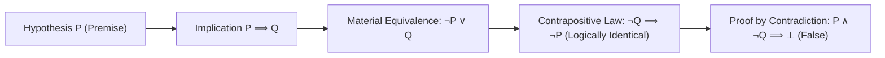

# Module 02: Logic for Precise Reasoning

> **ML Math** · 19 lessons

---

## 🗺️ Recommended Step-by-Step Learning Path

Follow this exact sequence to achieve complete mastery of this module:

| Step | File to Open | What You Will Do |
| :---: | :--- | :--- |
| **1** | **[README.md](README.md)** | Read conceptual overview, architectural foundations, and mental models. |
| **2** | **[02_FOUNDATIONS_PLAYGROUND.md](02_FOUNDATIONS_PLAYGROUND.md)** | Practice beginner spoonfed micro-drills and line-by-line syntax breakdowns. |
| **3** | **[03_try_it_yourself.py](03_try_it_yourself.py)** | Run in terminal (`python 03_try_it_yourself.py`) for an interactive zero-dependency sandbox. |
| **4** | **[01_Propositions_Truth_Values_and_Notation.md](lessons/01_Propositions_Truth_Values_and_Notation.md)** | Complete deep-dive curriculum lesson on 01 Propositions Truth Values And Notation. |
| **5** | **[02_Conjunction_Disjunction_and_Negation.md](lessons/02_Conjunction_Disjunction_and_Negation.md)** | Complete deep-dive curriculum lesson on 02 Conjunction Disjunction And Negation. |
| **6** | **[03_Implication_and_Its_Traps.md](lessons/03_Implication_and_Its_Traps.md)** | Complete deep-dive curriculum lesson on 03 Implication And Its Traps. |
| **7** | **[04_Converse_Inverse_and_Contrapositive.md](lessons/04_Converse_Inverse_and_Contrapositive.md)** | Complete deep-dive curriculum lesson on 04 Converse Inverse And Contrapositive. |
| **8** | **[TROUBLESHOOTING_AND_EDGE_CASES.md](TROUBLESHOOTING_AND_EDGE_CASES.md)** | Study forensic runbooks, edge cases, and real-world failure post-mortems. |
| **9** | **[SELF_ASSESSMENT_AND_CHALLENGES.md](SELF_ASSESSMENT_AND_CHALLENGES.md)** | Test your knowledge with self-assessment quizzes, challenges, and diagnostic scenarios. |
| **10** | **[PROJECT_GUIDE.md](PROJECT_GUIDE.md)** | Follow guided project implementation for `starter/` and `project_solution/`. |
| **11** | **[problems/](problems/)** | Solve hands-on problem bank challenges and verify with `pytest problems/tests`. |
| **12** | **[debug_lab/](debug_lab/)** | Diagnose and fix silent production bugs in the Bug Hunter Drill. |

---


---


## Propositional Logic & Deduction Inference Engine



## Why this module exists

Papers state results as implications with quantifiers, and most
misreadings come from getting the direction or the order wrong. This module gives
you the mechanical procedures - negate a statement, form a contrapositive, decide
what a counterexample must look like - so that reading a theorem is a procedure
rather than an interpretation.

## What you will be able to do

- [ ] State when an implication is false and what a counterexample must satisfy.
- [ ] Negate a nested quantified statement mechanically.
- [ ] Choose between direct, contrapositive, contradiction and cases, with a reason.
- [ ] Write an induction proof with the right number of base cases.
- [ ] Read a theorem statement and identify what is uniform.
- [ ] Report 'no counterexample found' without overstating it.

---

## Lessons

| # | Lesson | Status |
| :--- | :--- | :---: |
| 01 | [Propositions, Truth Values and Notation](lessons/01_Propositions_Truth_Values_and_Notation.md) | ✅ |
| 02 | [Conjunction, Disjunction and Negation](lessons/02_Conjunction_Disjunction_and_Negation.md) | ✅ |
| 03 | [Implication and Its Traps](lessons/03_Implication_and_Its_Traps.md) | ✅ |
| 04 | [Converse, Inverse and Contrapositive](lessons/04_Converse_Inverse_and_Contrapositive.md) | ✅ |
| 05 | [Biconditionals and Logical Equivalence](lessons/05_Biconditionals_and_Logical_Equivalence.md) | ✅ |
| 06 | [Truth Tables and Tautologies](lessons/06_Truth_Tables_and_Tautologies.md) | ✅ |
| 07 | [Universal and Existential Quantifiers](lessons/07_Universal_and_Existential_Quantifiers.md) | ✅ |
| 08 | [Nested Quantifiers and Why Order Matters](lessons/08_Nested_Quantifiers_and_Why_Order_Matters.md) | ✅ |
| 09 | [Negating Quantified Statements](lessons/09_Negating_Quantified_Statements.md) | ✅ |
| 10 | [Direct Proof](lessons/10_Direct_Proof.md) | ✅ |
| 11 | [Proof by Contrapositive](lessons/11_Proof_by_Contrapositive.md) | ✅ |
| 12 | [Proof by Contradiction](lessons/12_Proof_by_Contradiction.md) | ✅ |
| 13 | [Proof by Cases](lessons/13_Proof_by_Cases.md) | ✅ |
| 14 | [Mathematical Induction](lessons/14_Mathematical_Induction.md) | ✅ |
| 15 | [Strong Induction](lessons/15_Strong_Induction.md) | ✅ |
| 16 | [Counterexamples and Disproof](lessons/16_Counterexamples_and_Disproof.md) | ✅ |
| 17 | [Reading a Theorem Statement in a Paper](lessons/17_Reading_a_Theorem_Statement_in_a_Paper.md) | ✅ |
| 18 | [Necessary versus Sufficient Conditions in ML Claims](lessons/18_Necessary_versus_Sufficient_Conditions_in_ML_Claims.md) | ✅ |
| 19 | [Module Project: Verify or Refute Five Published Claims](lessons/19_Module_Project_Verify_or_Refute_Five_Published_Claims.md) | ✅ |

---

## Module project

See [PROJECT_GUIDE.md](PROJECT_GUIDE.md) for the 3-tier build path.

- **Tier 1 — Foundational:** Connectives, quantifiers and truth-table classification.
- **Tier 2 — Practitioner:** The three-verdict claim checker with counterexample extraction.
- **Tier 3 — Architect:** Verdict reports for five real published claims.

## Assessment

- [SELF_ASSESSMENT_AND_CHALLENGES.md](SELF_ASSESSMENT_AND_CHALLENGES.md) — quiz, challenges and diagnostics
- [TROUBLESHOOTING_AND_EDGE_CASES.md](TROUBLESHOOTING_AND_EDGE_CASES.md) — documented failure modes
- `debug_lab/` — planted defects that produce plausible wrong answers

## You have mastered this module when you can…

1. Give the one row on which an implication is false.
2. Negate a nested quantified statement without thinking about it.
3. Explain why the contrapositive is equivalent and the converse is not.
4. Say why the existential-first order is stronger, with an example.
5. Pick a proof technique from the shape of the statement.
6. Say how many base cases an induction needs, from the step.
7. Check that a case analysis is exhaustive.
8. Produce a counterexample that satisfies the hypothesis.
9. Identify the uniform quantifier in a generalisation bound.
10. Distinguish necessary from sufficient in an informal ML claim.

---

## Directory tour

```
Module_02_Logic_for_Precise_Reasoning/
├── README.md                            ← this file
├── PROJECT_GUIDE.md
├── SELF_ASSESSMENT_AND_CHALLENGES.md
├── TROUBLESHOOTING_AND_EDGE_CASES.md
├── lessons/                             ← 19 lessons
├── starter/                             ← stubs; the tests are the spec
├── project_solution/                    ← reference implementation + tests
└── debug_lab/                           ← defects to diagnose
```

## Navigation

- [Module 01 — Set Language for Machine Learning](../Module_01_Set_Language_for_Machine_Learning/README.md)
- [Module 03 — Linear Systems and Geometric Maps](../Module_03_Linear_Systems_and_Geometric_Maps/README.md)
- [Course README](../README.md) · [Master Syllabus](../MASTER_SYLLABUS.md) · [Roadmap](../ROADMAP_ML_MATH.md)