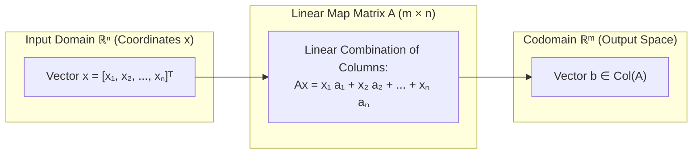

# Module 03: Linear Systems and Geometric Maps

> **ML Math** · 35 lessons
> **Status:** 🔴 Scaffold — structure is in place, lesson content is not written.

---


## Linear Transformation & Column Space Mapping: Ax = b



## Why this module exists

<!-- The one question this module answers that no other module does. Two or
     three sentences, written before any lesson is drafted, because a module
     that cannot state its purpose in three sentences has the wrong scope. -->

TODO

## What you will be able to do

<!-- Module-level capabilities. These become the mastery checklist below. -->

- [ ] TODO
- [ ] TODO
- [ ] TODO

---

## Lessons

| # | Lesson | Status |
| :--- | :--- | :---: |
| 01 | [What a Linear Equation Really Says](lessons/01_What_a_Linear_Equation_Really_Says.md) | 🔴 |
| 02 | [Systems of Linear Equations](lessons/02_Systems_of_Linear_Equations.md) | 🔴 |
| 03 | [Solution Sets: One, None, Infinitely Many](lessons/03_Solution_Sets_One_None_Infinitely_Many.md) | 🔴 |
| 04 | [Matrices as Compact Notation](lessons/04_Matrices_as_Compact_Notation.md) | 🔴 |
| 05 | [Augmented Matrices](lessons/05_Augmented_Matrices.md) | 🔴 |
| 06 | [Elementary Row Operations](lessons/06_Elementary_Row_Operations.md) | 🔴 |
| 07 | [Row Echelon Form](lessons/07_Row_Echelon_Form.md) | 🔴 |
| 08 | [Reduced Row Echelon Form](lessons/08_Reduced_Row_Echelon_Form.md) | 🔴 |
| 09 | [Gaussian Elimination Step by Step](lessons/09_Gaussian_Elimination_Step_by_Step.md) | 🔴 |
| 10 | [Gauss-Jordan Elimination](lessons/10_GaussJordan_Elimination.md) | 🔴 |
| 11 | [Pivots, Free Variables and Parametric Solutions](lessons/11_Pivots_Free_Variables_and_Parametric_Solutions.md) | 🔴 |
| 12 | [Consistency and the Rank Condition](lessons/12_Consistency_and_the_Rank_Condition.md) | 🔴 |
| 13 | [Homogeneous Systems and the Null Space](lessons/13_Homogeneous_Systems_and_the_Null_Space.md) | 🔴 |
| 14 | [Matrix Addition and Scalar Multiplication](lessons/14_Matrix_Addition_and_Scalar_Multiplication.md) | 🔴 |
| 15 | [Matrix Multiplication as Composition](lessons/15_Matrix_Multiplication_as_Composition.md) | 🔴 |
| 16 | [Why Matrix Multiplication Is Not Commutative](lessons/16_Why_Matrix_Multiplication_Is_Not_Commutative.md) | 🔴 |
| 17 | [The Identity Matrix](lessons/17_The_Identity_Matrix.md) | 🔴 |
| 18 | [Transpose and Its Algebraic Rules](lessons/18_Transpose_and_Its_Algebraic_Rules.md) | 🔴 |
| 19 | [Matrix Inverse: Definition and Existence](lessons/19_Matrix_Inverse_Definition_and_Existence.md) | 🔴 |
| 20 | [Computing the Inverse by Elimination](lessons/20_Computing_the_Inverse_by_Elimination.md) | 🔴 |
| 21 | [Determinants of 2x2 and 3x3 Matrices](lessons/21_Determinants_of_2x2_and_3x3_Matrices.md) | 🔴 |
| 22 | [Determinant Properties and Row Operations](lessons/22_Determinant_Properties_and_Row_Operations.md) | 🔴 |
| 23 | [Determinants, Volume and Orientation](lessons/23_Determinants_Volume_and_Orientation.md) | 🔴 |
| 24 | [Cramer's Rule and Why It Is Impractical](lessons/24_Cramers_Rule_and_Why_It_Is_Impractical.md) | 🔴 |
| 25 | [LU Decomposition](lessons/25_LU_Decomposition.md) | 🔴 |
| 26 | [Partial Pivoting and Numerical Stability](lessons/26_Partial_Pivoting_and_Numerical_Stability.md) | 🔴 |
| 27 | [Condition Number and Ill-Conditioned Systems](lessons/27_Condition_Number_and_IllConditioned_Systems.md) | 🔴 |
| 28 | [Linear Maps as Geometric Transformations](lessons/28_Linear_Maps_as_Geometric_Transformations.md) | 🔴 |
| 29 | [Rotations, Reflections, Scalings and Shears](lessons/29_Rotations_Reflections_Scalings_and_Shears.md) | 🔴 |
| 30 | [Composing Transformations](lessons/30_Composing_Transformations.md) | 🔴 |
| 31 | [Affine versus Linear Maps](lessons/31_Affine_versus_Linear_Maps.md) | 🔴 |
| 32 | [Homogeneous Coordinates](lessons/32_Homogeneous_Coordinates.md) | 🔴 |
| 33 | [Least Squares via the Normal Equations](lessons/33_Least_Squares_via_the_Normal_Equations.md) | 🔴 |
| 34 | [Linear Systems in NumPy and SciPy](lessons/34_Linear_Systems_in_NumPy_and_SciPy.md) | 🔴 |
| 35 | [Module Project: A Solver That Reports Its Own Conditioning](lessons/35_Module_Project_A_Solver_That_Reports_Its_Own_Conditioning.md) | 🔴 |

---

## Module project

See [PROJECT_GUIDE.md](PROJECT_GUIDE.md) for the 3-tier build path.

- **Tier 1 — Foundational:** TODO
- **Tier 2 — Practitioner:** TODO
- **Tier 3 — Architect:** TODO

## Assessment

- [SELF_ASSESSMENT_AND_CHALLENGES.md](SELF_ASSESSMENT_AND_CHALLENGES.md) — quiz, challenges and diagnostics
- [TROUBLESHOOTING_AND_EDGE_CASES.md](TROUBLESHOOTING_AND_EDGE_CASES.md) — documented failure modes
- `debug_lab/` — planted defects that produce plausible wrong answers

## You have mastered this module when you can…

<!-- Ten items, each one a thing the learner DOES, not a thing they know. -->

1. TODO

---

## Directory tour

```
Module_03_Linear_Systems_and_Geometric_Maps/
├── README.md                            ← this file
├── PROJECT_GUIDE.md
├── SELF_ASSESSMENT_AND_CHALLENGES.md
├── TROUBLESHOOTING_AND_EDGE_CASES.md
├── lessons/                             ← 35 lessons
├── starter/                             ← stubs; the tests are the spec
├── project_solution/                    ← reference implementation + tests
└── debug_lab/                           ← defects to diagnose
```

## Navigation

- [Module 02 — Logic for Precise Reasoning](../Module_02_Logic_for_Precise_Reasoning/README.md)
- [Module 04 — Vector Spaces, Bases and Rank](../Module_04_Vector_Spaces_Bases_and_Rank/README.md)
- [Course README](../README.md) · [Master Syllabus](../MASTER_SYLLABUS.md) · [Roadmap](../ROADMAP_ML_MATH.md)