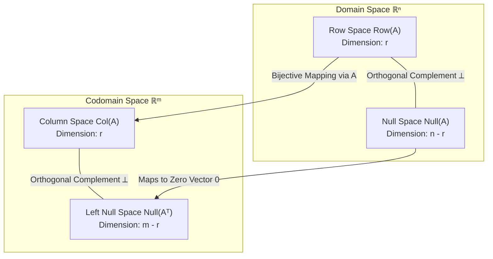

# Module 04: Vector Spaces, Bases and Rank

> **ML Math** · 21 lessons
> **Status:** 🔴 Scaffold — structure is in place, lesson content is not written.

---

## 🗺️ Recommended Step-by-Step Learning Path

Follow this exact sequence to achieve complete mastery of this module:

| Step | File to Open | What You Will Do |
| :---: | :--- | :--- |
| **1** | **[README.md](README.md)** | Read conceptual overview, architectural foundations, and mental models. |
| **2** | **[02_FOUNDATIONS_PLAYGROUND.md](02_FOUNDATIONS_PLAYGROUND.md)** | Practice beginner spoonfed micro-drills and line-by-line syntax breakdowns. |
| **3** | **[03_try_it_yourself.py](03_try_it_yourself.py)** | Run in terminal (`python 03_try_it_yourself.py`) for an interactive zero-dependency sandbox. |
| **4** | **[01_Vectors_as_Arrows_and_as_Lists.md](lessons/01_Vectors_as_Arrows_and_as_Lists.md)** | Complete deep-dive curriculum lesson on 01 Vectors As Arrows And As Lists. |
| **5** | **[02_Vector_Addition_and_Scalar_Multiplication.md](lessons/02_Vector_Addition_and_Scalar_Multiplication.md)** | Complete deep-dive curriculum lesson on 02 Vector Addition And Scalar Multiplication. |
| **6** | **[03_The_Vector_Space_Axioms.md](lessons/03_The_Vector_Space_Axioms.md)** | Complete deep-dive curriculum lesson on 03 The Vector Space Axioms. |
| **7** | **[04_Examples_Rn_Polynomials_and_Function_Spaces.md](lessons/04_Examples_Rn_Polynomials_and_Function_Spaces.md)** | Complete deep-dive curriculum lesson on 04 Examples Rn Polynomials And Function Spaces. |
| **8** | **[TROUBLESHOOTING_AND_EDGE_CASES.md](TROUBLESHOOTING_AND_EDGE_CASES.md)** | Study forensic runbooks, edge cases, and real-world failure post-mortems. |
| **9** | **[SELF_ASSESSMENT_AND_CHALLENGES.md](SELF_ASSESSMENT_AND_CHALLENGES.md)** | Test your knowledge with self-assessment quizzes, challenges, and diagnostic scenarios. |
| **10** | **[PROJECT_GUIDE.md](PROJECT_GUIDE.md)** | Follow guided project implementation for `starter/` and `project_solution/`. |
| **11** | **[problems/](problems/)** | Solve hands-on problem bank challenges and verify with `pytest problems/tests`. |
| **12** | **[debug_lab/](debug_lab/)** | Diagnose and fix silent production bugs in the Bug Hunter Drill. |

---


---


## Fundamental Subspaces & Rank-Nullity Theorem



## Why this module exists

<!-- The one question this module answers that no other module does. Two or
     three sentences, written before any lesson is drafted, because a module
     that cannot state its purpose in three sentences has the wrong scope. -->

TODO

## What you will be able to do

<!-- Module-level capabilities. These become the mastery checklist below. -->

- [ ] TODO
- [ ] TODO
- [ ] TODO

---

## Lessons

| # | Lesson | Status |
| :--- | :--- | :---: |
| 01 | [Vectors as Arrows and as Lists](lessons/01_Vectors_as_Arrows_and_as_Lists.md) | 🔴 |
| 02 | [Vector Addition and Scalar Multiplication](lessons/02_Vector_Addition_and_Scalar_Multiplication.md) | 🔴 |
| 03 | [The Vector Space Axioms](lessons/03_The_Vector_Space_Axioms.md) | 🔴 |
| 04 | [Examples: R^n, Polynomials and Function Spaces](lessons/04_Examples_Rn_Polynomials_and_Function_Spaces.md) | 🔴 |
| 05 | [Subspaces and How to Test for One](lessons/05_Subspaces_and_How_to_Test_for_One.md) | 🔴 |
| 06 | [Span of a Set of Vectors](lessons/06_Span_of_a_Set_of_Vectors.md) | 🔴 |
| 07 | [Linear Independence](lessons/07_Linear_Independence.md) | 🔴 |
| 08 | [Testing Independence by Elimination](lessons/08_Testing_Independence_by_Elimination.md) | 🔴 |
| 09 | [Basis of a Vector Space](lessons/09_Basis_of_a_Vector_Space.md) | 🔴 |
| 10 | [Dimension and Why It Is Well Defined](lessons/10_Dimension_and_Why_It_Is_Well_Defined.md) | 🔴 |
| 11 | [Coordinates Relative to a Basis](lessons/11_Coordinates_Relative_to_a_Basis.md) | 🔴 |
| 12 | [Change of Basis](lessons/12_Change_of_Basis.md) | 🔴 |
| 13 | [Column Space](lessons/13_Column_Space.md) | 🔴 |
| 14 | [Null Space and Nullity](lessons/14_Null_Space_and_Nullity.md) | 🔴 |
| 15 | [Row Space and the Left Null Space](lessons/15_Row_Space_and_the_Left_Null_Space.md) | 🔴 |
| 16 | [Rank of a Matrix](lessons/16_Rank_of_a_Matrix.md) | 🔴 |
| 17 | [The Rank-Nullity Theorem](lessons/17_The_RankNullity_Theorem.md) | 🔴 |
| 18 | [The Four Fundamental Subspaces](lessons/18_The_Four_Fundamental_Subspaces.md) | 🔴 |
| 19 | [What Rank Tells You About a Dataset](lessons/19_What_Rank_Tells_You_About_a_Dataset.md) | 🔴 |
| 20 | [Multicollinearity as Near Rank Deficiency](lessons/20_Multicollinearity_as_Near_Rank_Deficiency.md) | 🔴 |
| 21 | [Module Project: Detect Redundant Features by Rank](lessons/21_Module_Project_Detect_Redundant_Features_by_Rank.md) | 🔴 |

---

## Module project

See [PROJECT_GUIDE.md](PROJECT_GUIDE.md) for the 3-tier build path.

- **Tier 1 — Foundational:** TODO
- **Tier 2 — Practitioner:** TODO
- **Tier 3 — Architect:** TODO

## Assessment

- [SELF_ASSESSMENT_AND_CHALLENGES.md](SELF_ASSESSMENT_AND_CHALLENGES.md) — quiz, challenges and diagnostics
- [TROUBLESHOOTING_AND_EDGE_CASES.md](TROUBLESHOOTING_AND_EDGE_CASES.md) — documented failure modes
- `debug_lab/` — planted defects that produce plausible wrong answers

## You have mastered this module when you can…

<!-- Ten items, each one a thing the learner DOES, not a thing they know. -->

1. TODO

---

## Directory tour

```
Module_04_Vector_Spaces_Bases_and_Rank/
├── README.md                            ← this file
├── PROJECT_GUIDE.md
├── SELF_ASSESSMENT_AND_CHALLENGES.md
├── TROUBLESHOOTING_AND_EDGE_CASES.md
├── lessons/                             ← 21 lessons
├── starter/                             ← stubs; the tests are the spec
├── project_solution/                    ← reference implementation + tests
└── debug_lab/                           ← defects to diagnose
```

## Navigation

- [Module 03 — Linear Systems and Geometric Maps](../Module_03_Linear_Systems_and_Geometric_Maps/README.md)
- [Module 05 — Spectral Thinking and Diagonalization](../Module_05_Spectral_Thinking_and_Diagonalization/README.md)
- [Course README](../README.md) · [Master Syllabus](../MASTER_SYLLABUS.md) · [Roadmap](../ROADMAP_ML_MATH.md)