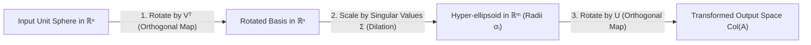

# Module 07: Low-Rank Structure and Quadratic Forms

> **ML Math** · 12 lessons
> **Status:** 🔴 Scaffold — structure is in place, lesson content is not written.

---

## 🗺️ Recommended Step-by-Step Learning Path

Follow this exact sequence to achieve complete mastery of this module:

| Step | File to Open | What You Will Do |
| :---: | :--- | :--- |
| **1** | **[README.md](README.md)** | Read conceptual overview, architectural foundations, and mental models. |
| **2** | **[02_FOUNDATIONS_PLAYGROUND.md](02_FOUNDATIONS_PLAYGROUND.md)** | Practice beginner spoonfed micro-drills and line-by-line syntax breakdowns. |
| **3** | **[03_try_it_yourself.py](03_try_it_yourself.py)** | Run in terminal (`python 03_try_it_yourself.py`) for an interactive zero-dependency sandbox. |
| **4** | **[03_interactive_svd_lora.ipynb](03_interactive_svd_lora.ipynb)** | Open in Jupyter/VS Code to run interactive visual experiments and benchmarks. |
| **5** | **[01_The_Singular_Value_Decomposition_Statement.md](lessons/01_The_Singular_Value_Decomposition_Statement.md)** | Complete deep-dive curriculum lesson on 01 The Singular Value Decomposition Statement. |
| **6** | **[02_Geometry_of_the_SVD.md](lessons/02_Geometry_of_the_SVD.md)** | Complete deep-dive curriculum lesson on 02 Geometry Of The Svd. |
| **7** | **[03_Singular_Values_versus_Eigenvalues.md](lessons/03_Singular_Values_versus_Eigenvalues.md)** | Complete deep-dive curriculum lesson on 03 Singular Values Versus Eigenvalues. |
| **8** | **[TROUBLESHOOTING_AND_EDGE_CASES.md](TROUBLESHOOTING_AND_EDGE_CASES.md)** | Study forensic runbooks, edge cases, and real-world failure post-mortems. |
| **9** | **[SELF_ASSESSMENT_AND_CHALLENGES.md](SELF_ASSESSMENT_AND_CHALLENGES.md)** | Test your knowledge with self-assessment quizzes, challenges, and diagnostic scenarios. |
| **10** | **[PROJECT_GUIDE.md](PROJECT_GUIDE.md)** | Follow guided project implementation for `starter/` and `project_solution/`. |
| **11** | **[problems/](problems/)** | Solve hands-on problem bank challenges and verify with `pytest problems/tests`. |
| **12** | **[debug_lab/](debug_lab/)** | Diagnose and fix silent production bugs in the Bug Hunter Drill. |

---


---


## Singular Value Decomposition (SVD) Geometry: A = U Σ Vᵀ



## Why this module exists

<!-- The one question this module answers that no other module does. Two or
     three sentences, written before any lesson is drafted, because a module
     that cannot state its purpose in three sentences has the wrong scope. -->

TODO

## What you will be able to do

<!-- Module-level capabilities. These become the mastery checklist below. -->

- [ ] TODO
- [ ] TODO
- [ ] TODO

---

## Lessons

| # | Lesson | Status |
| :--- | :--- | :---: |
| 01 | [The Singular Value Decomposition: Statement](lessons/01_The_Singular_Value_Decomposition_Statement.md) | 🔴 |
| 02 | [Geometry of the SVD](lessons/02_Geometry_of_the_SVD.md) | 🔴 |
| 03 | [Singular Values versus Eigenvalues](lessons/03_Singular_Values_versus_Eigenvalues.md) | 🔴 |
| 04 | [Truncated SVD and the Eckart-Young Theorem](lessons/04_Truncated_SVD_and_the_EckartYoung_Theorem.md) | 🔴 |
| 05 | [Low-Rank Approximation in Practice](lessons/05_LowRank_Approximation_in_Practice.md) | 🔴 |
| 06 | [The Moore-Penrose Pseudoinverse](lessons/06_The_MoorePenrose_Pseudoinverse.md) | 🔴 |
| 07 | [Principal Component Analysis via SVD](lessons/07_Principal_Component_Analysis_via_SVD.md) | 🔴 |
| 08 | [PCA versus Autoencoders: What Actually Differs](lessons/08_PCA_versus_Autoencoders_What_Actually_Differs.md) | 🔴 |
| 09 | [Quadratic Forms and Their Matrices](lessons/09_Quadratic_Forms_and_Their_Matrices.md) | 🔴 |
| 10 | [Positive Definiteness and Its Tests](lessons/10_Positive_Definiteness_and_Its_Tests.md) | 🔴 |
| 11 | [Cholesky Decomposition](lessons/11_Cholesky_Decomposition.md) | 🔴 |
| 12 | [Module Project: Image Compression and a Recommender, Both by SVD](lessons/12_Module_Project_Image_Compression_and_a_Recommender_Both_by_SVD.md) | 🔴 |

---

## Module project

See [PROJECT_GUIDE.md](PROJECT_GUIDE.md) for the 3-tier build path.

- **Tier 1 — Foundational:** TODO
- **Tier 2 — Practitioner:** TODO
- **Tier 3 — Architect:** TODO

## Assessment

- [SELF_ASSESSMENT_AND_CHALLENGES.md](SELF_ASSESSMENT_AND_CHALLENGES.md) — quiz, challenges and diagnostics
- [TROUBLESHOOTING_AND_EDGE_CASES.md](TROUBLESHOOTING_AND_EDGE_CASES.md) — documented failure modes
- `debug_lab/` — planted defects that produce plausible wrong answers

## You have mastered this module when you can…

<!-- Ten items, each one a thing the learner DOES, not a thing they know. -->

1. TODO

---

## Directory tour

```
Module_07_LowRank_Structure_and_Quadratic_Forms/
├── README.md                            ← this file
├── PROJECT_GUIDE.md
├── SELF_ASSESSMENT_AND_CHALLENGES.md
├── TROUBLESHOOTING_AND_EDGE_CASES.md
├── lessons/                             ← 12 lessons
├── starter/                             ← stubs; the tests are the spec
├── project_solution/                    ← reference implementation + tests
└── debug_lab/                           ← defects to diagnose
```

## Navigation

- [Module 06 — Orthogonality and Projections](../Module_06_Orthogonality_and_Projections/README.md)
- [Module 08 — Linear Algebra in Models](../Module_08_Linear_Algebra_in_Models/README.md)
- [Course README](../README.md) · [Master Syllabus](../MASTER_SYLLABUS.md) · [Roadmap](../ROADMAP_ML_MATH.md)