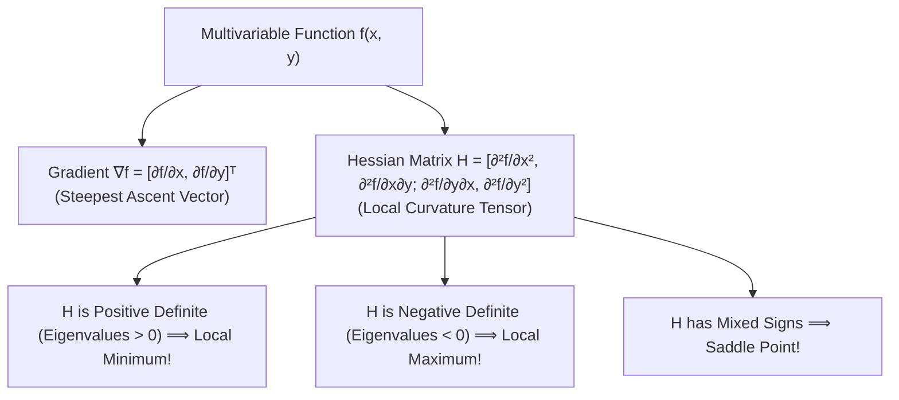

# Module 09: Multivariable Calculus for Learning

> **ML Math** · 57 lessons
> **Status:** 🔴 Scaffold — structure is in place, lesson content is not written.

---


## Multivariable Calculus: Gradient & Hessian Curvature



## Why this module exists

<!-- The one question this module answers that no other module does. Two or
     three sentences, written before any lesson is drafted, because a module
     that cannot state its purpose in three sentences has the wrong scope. -->

TODO

## What you will be able to do

<!-- Module-level capabilities. These become the mastery checklist below. -->

- [ ] TODO
- [ ] TODO
- [ ] TODO

---

## Lessons

| # | Lesson | Status |
| :--- | :--- | :---: |
| 01 | [Functions of Several Variables](lessons/01_Functions_of_Several_Variables.md) | 🔴 |
| 02 | [Level Sets and Contour Plots](lessons/02_Level_Sets_and_Contour_Plots.md) | 🔴 |
| 03 | [Limits in Several Variables](lessons/03_Limits_in_Several_Variables.md) | 🔴 |
| 04 | [Continuity in R^n](lessons/04_Continuity_in_Rn.md) | 🔴 |
| 05 | [Partial Derivatives](lessons/05_Partial_Derivatives.md) | 🔴 |
| 06 | [Higher-Order Partial Derivatives](lessons/06_HigherOrder_Partial_Derivatives.md) | 🔴 |
| 07 | [Clairaut's Theorem on Mixed Partials](lessons/07_Clairauts_Theorem_on_Mixed_Partials.md) | 🔴 |
| 08 | [The Gradient Vector](lessons/08_The_Gradient_Vector.md) | 🔴 |
| 09 | [Why the Gradient Points Uphill](lessons/09_Why_the_Gradient_Points_Uphill.md) | 🔴 |
| 10 | [Directional Derivatives](lessons/10_Directional_Derivatives.md) | 🔴 |
| 11 | [Differentiability versus Existence of Partials](lessons/11_Differentiability_versus_Existence_of_Partials.md) | 🔴 |
| 12 | [The Total Derivative and Linearization](lessons/12_The_Total_Derivative_and_Linearization.md) | 🔴 |
| 13 | [The Jacobian Matrix](lessons/13_The_Jacobian_Matrix.md) | 🔴 |
| 14 | [The Single-Variable Chain Rule, Revisited](lessons/14_The_SingleVariable_Chain_Rule_Revisited.md) | 🔴 |
| 15 | [The Multivariable Chain Rule](lessons/15_The_Multivariable_Chain_Rule.md) | 🔴 |
| 16 | [Computational Graphs](lessons/16_Computational_Graphs.md) | 🔴 |
| 17 | [Forward-Mode Differentiation](lessons/17_ForwardMode_Differentiation.md) | 🔴 |
| 18 | [Reverse-Mode Differentiation](lessons/18_ReverseMode_Differentiation.md) | 🔴 |
| 19 | [Backpropagation Is Reverse-Mode Chain Rule](lessons/19_Backpropagation_Is_ReverseMode_Chain_Rule.md) | 🔴 |
| 20 | [The Hessian Matrix](lessons/20_The_Hessian_Matrix.md) | 🔴 |
| 21 | [Second-Order Taylor Expansion](lessons/21_SecondOrder_Taylor_Expansion.md) | 🔴 |
| 22 | [Critical Points and Their Classification](lessons/22_Critical_Points_and_Their_Classification.md) | 🔴 |
| 23 | [The Second Derivative Test in R^n](lessons/23_The_Second_Derivative_Test_in_Rn.md) | 🔴 |
| 24 | [Saddle Points and Why Deep Networks Have Many](lessons/24_Saddle_Points_and_Why_Deep_Networks_Have_Many.md) | 🔴 |
| 25 | [Convex Functions: Definition](lessons/25_Convex_Functions_Definition.md) | 🔴 |
| 26 | [First- and Second-Order Convexity Tests](lessons/26_First_and_SecondOrder_Convexity_Tests.md) | 🔴 |
| 27 | [Strong Convexity and Smoothness](lessons/27_Strong_Convexity_and_Smoothness.md) | 🔴 |
| 28 | [Jensen's Inequality](lessons/28_Jensens_Inequality.md) | 🔴 |
| 29 | [Gradient Descent: The Update Rule](lessons/29_Gradient_Descent_The_Update_Rule.md) | 🔴 |
| 30 | [Learning Rate and Convergence](lessons/30_Learning_Rate_and_Convergence.md) | 🔴 |
| 31 | [Lipschitz Gradients and the Safe Step Size](lessons/31_Lipschitz_Gradients_and_the_Safe_Step_Size.md) | 🔴 |
| 32 | [Convergence Rate on Convex Objectives](lessons/32_Convergence_Rate_on_Convex_Objectives.md) | 🔴 |
| 33 | [Momentum](lessons/33_Momentum.md) | 🔴 |
| 34 | [Nesterov Acceleration](lessons/34_Nesterov_Acceleration.md) | 🔴 |
| 35 | [AdaGrad](lessons/35_AdaGrad.md) | 🔴 |
| 36 | [RMSProp](lessons/36_RMSProp.md) | 🔴 |
| 37 | [Adam and Its Bias Correction](lessons/37_Adam_and_Its_Bias_Correction.md) | 🔴 |
| 38 | [Why Adam Sometimes Fails to Converge](lessons/38_Why_Adam_Sometimes_Fails_to_Converge.md) | 🔴 |
| 39 | [Stochastic Gradient Descent](lessons/39_Stochastic_Gradient_Descent.md) | 🔴 |
| 40 | [Variance of the Stochastic Gradient](lessons/40_Variance_of_the_Stochastic_Gradient.md) | 🔴 |
| 41 | [Mini-Batch Size and the Gradient Noise Scale](lessons/41_MiniBatch_Size_and_the_Gradient_Noise_Scale.md) | 🔴 |
| 42 | [Learning Rate Schedules](lessons/42_Learning_Rate_Schedules.md) | 🔴 |
| 43 | [Newton's Method](lessons/43_Newtons_Method.md) | 🔴 |
| 44 | [Quasi-Newton Methods and L-BFGS](lessons/44_QuasiNewton_Methods_and_LBFGS.md) | 🔴 |
| 45 | [Constrained Optimization: The Setup](lessons/45_Constrained_Optimization_The_Setup.md) | 🔴 |
| 46 | [Lagrange Multipliers](lessons/46_Lagrange_Multipliers.md) | 🔴 |
| 47 | [The KKT Conditions](lessons/47_The_KKT_Conditions.md) | 🔴 |
| 48 | [Duality and the Dual Problem](lessons/48_Duality_and_the_Dual_Problem.md) | 🔴 |
| 49 | [Projected Gradient Descent](lessons/49_Projected_Gradient_Descent.md) | 🔴 |
| 50 | [L1 versus L2 Regularization, Geometrically](lessons/50_L1_versus_L2_Regularization_Geometrically.md) | 🔴 |
| 51 | [Why L1 Produces Sparsity](lessons/51_Why_L1_Produces_Sparsity.md) | 🔴 |
| 52 | [Vanishing and Exploding Gradients](lessons/52_Vanishing_and_Exploding_Gradients.md) | 🔴 |
| 53 | [Gradient Clipping](lessons/53_Gradient_Clipping.md) | 🔴 |
| 54 | [Numerical Gradient Checking](lessons/54_Numerical_Gradient_Checking.md) | 🔴 |
| 55 | [Automatic Differentiation Pitfalls](lessons/55_Automatic_Differentiation_Pitfalls.md) | 🔴 |
| 56 | [Line Search and Trust Regions](lessons/56_Line_Search_and_Trust_Regions.md) | 🔴 |
| 57 | [Module Project: Optimizers From Scratch, Benchmarked](lessons/57_Module_Project_Optimizers_From_Scratch_Benchmarked.md) | 🔴 |

---

## Module project

See [PROJECT_GUIDE.md](PROJECT_GUIDE.md) for the 3-tier build path.

- **Tier 1 — Foundational:** TODO
- **Tier 2 — Practitioner:** TODO
- **Tier 3 — Architect:** TODO

## Assessment

- [SELF_ASSESSMENT_AND_CHALLENGES.md](SELF_ASSESSMENT_AND_CHALLENGES.md) — quiz, challenges and diagnostics
- [TROUBLESHOOTING_AND_EDGE_CASES.md](TROUBLESHOOTING_AND_EDGE_CASES.md) — documented failure modes
- `debug_lab/` — planted defects that produce plausible wrong answers

## You have mastered this module when you can…

<!-- Ten items, each one a thing the learner DOES, not a thing they know. -->

1. TODO

---

## Directory tour

```
Module_09_Multivariable_Calculus_for_Learning/
├── README.md                            ← this file
├── PROJECT_GUIDE.md
├── SELF_ASSESSMENT_AND_CHALLENGES.md
├── TROUBLESHOOTING_AND_EDGE_CASES.md
├── lessons/                             ← 57 lessons
├── starter/                             ← stubs; the tests are the spec
├── project_solution/                    ← reference implementation + tests
└── debug_lab/                           ← defects to diagnose
```

## Navigation

- [Module 08 — Linear Algebra in Models](../Module_08_Linear_Algebra_in_Models/README.md)
- [Module 10 — Reasoning Under Uncertainty](../Module_10_Reasoning_Under_Uncertainty/README.md)
- [Course README](../README.md) · [Master Syllabus](../MASTER_SYLLABUS.md) · [Roadmap](../ROADMAP_ML_MATH.md)